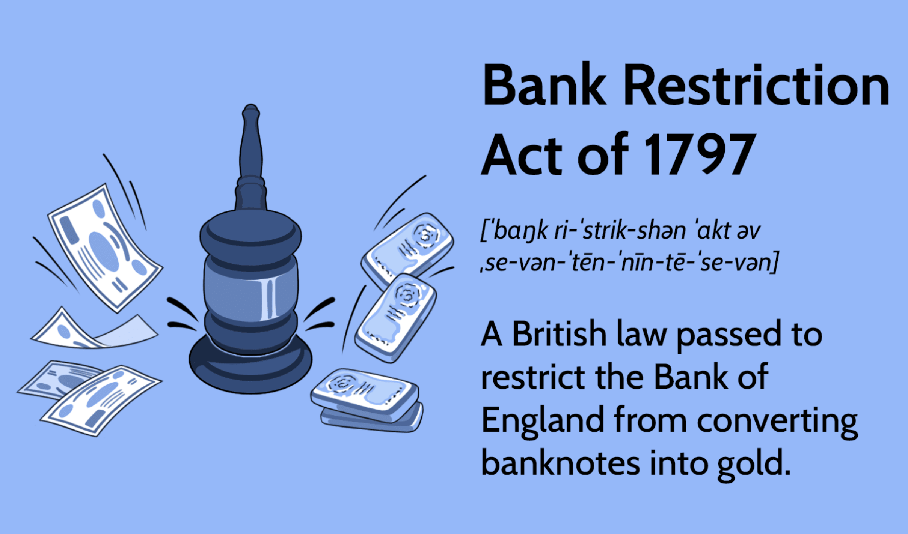

## Table of Contents

## What is the Bank Restriction Act of 1797?

The Bank Restriction Act of 1797 was a law passed in Britain that stopped people from exchanging their banknotes for gold. This happened because there was a big war with France, and people were worried about the economy. They started taking their money out of banks and wanted gold instead. This made the government worried that there wouldn't be enough gold left, so they made this law to keep the gold in the banks.

The Act was meant to be temporary, but it ended up lasting for a long time, until 1821. During this time, people had to use banknotes even if they didn't trust them as much as gold. This law changed how money worked in Britain and showed how the government could control the economy during tough times.

## Why was the Bank Restriction Act of 1797 introduced?

The Bank Restriction Act of 1797 was introduced because Britain was in a big war with France. This war made people worried about their money, so they started going to banks to get their gold back instead of keeping their money in banknotes. This rush to get gold was causing a problem because there might not be enough gold left in the banks. To stop this from happening, the British government decided to pass the Bank Restriction Act. This law said that people could not exchange their banknotes for gold anymore, which helped keep the gold in the banks.

The Act was supposed to be a short-term solution to the problem, but it ended up lasting until 1821. During this time, people had to use banknotes even if they didn't trust them as much as gold. This change showed how the government could control the economy during tough times. The Bank Restriction Act of 1797 was important because it changed the way money worked in Britain and helped the country manage its economy during the war with France.

## What were the immediate effects of the Bank Restriction Act of 1797?

The Bank Restriction Act of 1797 had some big effects right away. People couldn't turn their banknotes into gold anymore, so they had to use the banknotes as money. This made some people worried because they didn't trust the banknotes as much as gold. But it also stopped the rush to get gold from the banks, which helped keep more gold in the country. This was important because it made the banks more stable during the war with France.

Another effect was that the government had more control over the economy. Because people had to use banknotes, the government could decide how much money was in circulation. This helped them manage the economy better during the war. The Act also showed that the government could make big changes to the money system when they needed to. Even though it was supposed to be temporary, it ended up lasting until 1821, which shows how important it was for the time.

## How did the Bank Restriction Act of 1797 affect the British economy?

The Bank Restriction Act of 1797 had a big impact on the British economy. It stopped people from turning their banknotes into gold, which meant they had to use banknotes as money. This made some people worried because they didn't trust banknotes as much as gold. But it also stopped the rush to get gold from the banks, which helped keep more gold in the country. This was important because it made the banks more stable during the war with France. It also meant that the government had more control over the economy because they could decide how much money was in circulation.

The Act also changed how the economy worked in the long run. Because it lasted until 1821, it showed that the government could make big changes to the money system when they needed to. During this time, the government could manage the economy better by controlling the amount of money. This helped Britain deal with the challenges of the war and keep the economy going. Even after the Act ended, it had shown that the government could step in and change how money worked during tough times, which was an important lesson for the future.

## What was the duration of the Bank Restriction Act of 1797?

The Bank Restriction Act of 1797 was supposed to be a short-term solution, but it lasted much longer than people thought. It was introduced in 1797 because Britain was in a big war with France, and people were worried about their money. They started taking their money out of banks and wanted gold instead, which made the government worried that there wouldn't be enough gold left. So, they made this law to stop people from exchanging their banknotes for gold.

The Act ended up lasting until 1821, which was 24 years. During this time, people had to use banknotes even if they didn't trust them as much as gold. This change helped keep the gold in the banks and made them more stable during the war. It also showed that the government could control the economy by deciding how much money was in circulation. Even though it was meant to be temporary, the long duration of the Act showed how important it was for managing the economy during tough times.

## How did the Bank Restriction Act of 1797 influence monetary policy?

The Bank Restriction Act of 1797 changed how the government could control money. Before the Act, people could turn their banknotes into gold whenever they wanted. But when the Act was passed, they couldn't do that anymore. This meant the government could decide how much money was in use, without worrying about people taking all the gold out of the banks. This was important during the war with France because it helped keep the economy stable.

The Act showed that the government could make big changes to the money system when needed. Even though it was supposed to be temporary, it lasted until 1821. This long time showed that the government could keep control over money for a long time. It also taught people that the government could step in during tough times to help the economy. This idea influenced how money was managed in the future, showing that governments could use similar actions to control the economy when needed.

## What were the political motivations behind the Bank Restriction Act of 1797?

The Bank Restriction Act of 1797 was introduced because Britain was fighting a big war with France. The government was worried that if people kept taking their gold out of the banks, there wouldn't be enough gold left. This could make the economy unstable, which would be bad for the country during the war. So, the government decided to pass the Act to stop people from exchanging their banknotes for gold. This would help keep the gold in the banks and make the economy more stable.

Another political motivation was to show that the government could take strong actions to control the economy. By passing the Act, the government wanted to show that they could manage the country's money during tough times. Even though the Act was supposed to be temporary, it ended up lasting until 1821. This long duration showed that the government was willing to keep control over the money system for a long time to help the country through the war and its economic challenges.

## How did the public react to the Bank Restriction Act of 1797?

When the Bank Restriction Act of 1797 was passed, many people were worried. They didn't like that they couldn't turn their banknotes into gold anymore. Some people thought the banknotes were not as good as gold and didn't trust them. This made them feel like the government was taking away their choice and control over their money. There were also people who were scared about what would happen to the economy because of this big change.

But not everyone reacted the same way. Some people understood that the Act was needed to help the country during the war with France. They saw that stopping people from taking gold out of the banks would keep the economy more stable. Over time, as the Act stayed in place and the economy didn't fall apart, more people started to accept it. Even though they still missed being able to use gold, they realized that the government was trying to do what was best for the country during a tough time.

## What were the long-term consequences of the Bank Restriction Act of 1797 on banking regulations?

The Bank Restriction Act of 1797 had big effects on banking rules in the long run. It showed that the government could step in and change how money worked when there were big problems. This idea became important for future banking rules. After the Act, people started to see that the government could control the economy by deciding how much money was in use. This helped shape the rules about how banks should work and how much money they should have.

Even though the Act was supposed to be temporary, it lasted until 1821. This long time showed that the government could keep control over money for a long time if needed. It made people think more about how banks should be regulated to keep the economy stable. The Act also led to more rules about what banks could do with their money and how they should manage it. This helped make the banking system stronger and more able to handle tough times in the future.

## How did the Bank Restriction Act of 1797 compare to similar legislation in other countries at the time?

The Bank Restriction Act of 1797 was a unique law in Britain, but it had some things in common with what other countries were doing at the time. During the late 1700s and early 1800s, many countries were dealing with big wars and money problems. For example, France also had to make changes to its money system during its wars. Like Britain, France had to stop people from turning their money into gold to keep their economy stable. This shows that many countries were trying to find ways to manage their money during tough times.

But the Bank Restriction Act was different because it lasted for a long time, from 1797 to 1821. This long duration was not common in other countries. Most other countries tried to fix their money problems quickly and then go back to normal. Britain's long-term approach showed that they were willing to keep control over their money system for many years to help the country through the war and its economic challenges. This made the Bank Restriction Act a big deal in the history of banking and money rules.

## What were the key criticisms of the Bank Restriction Act of 1797?

People had a lot of criticisms about the Bank Restriction Act of 1797. One big problem was that they couldn't turn their banknotes into gold anymore. This made them feel like the government was taking away their choice and control over their money. People didn't trust the banknotes as much as gold, so they were worried about what would happen to their savings. They also thought that the Act was too strong and that it gave the government too much power over the economy.

Another criticism was that the Act was supposed to be temporary, but it ended up lasting until 1821. This long time made people feel like the government was not listening to them and was keeping control over the money system for too long. Some people thought this could lead to more problems in the future because it changed how money worked in Britain. Even though the Act helped keep the economy stable during the war with France, many people still had concerns about its long-term effects on their money and the country's economy.

## How did the Bank Restriction Act of 1797 pave the way for future financial reforms?

The Bank Restriction Act of 1797 showed that the government could step in and change how money worked when there were big problems. This idea became important for future financial reforms. After the Act, people started to see that the government could control the economy by deciding how much money was in use. This helped shape the rules about how banks should work and how much money they should have. The Act also led to more rules about what banks could do with their money and how they should manage it. This helped make the banking system stronger and more able to handle tough times in the future.

Even though the Act was supposed to be temporary, it lasted until 1821. This long time showed that the government could keep control over money for a long time if needed. It made people think more about how banks should be regulated to keep the economy stable. The long duration of the Act taught people that the government could make big changes to the money system during tough times, which was an important lesson for future financial reforms. This idea influenced how money was managed later on, showing that governments could use similar actions to control the economy when needed.

## References & Further Reading

[1]: ["The Bank Restriction Act, 1797-1821"](https://en.wikipedia.org/wiki/Bank_Restriction_Act_1797) by Clapham, J. H. The Economic History Review, Vol. 2, No. 1, 1929.

[2]: ["The Bank Restriction of 1797, the Bullion Report, and the Construction of the Early Classical Theory of Money"](https://en.wikipedia.org/wiki/Bank_Restriction_Act_1797) by Humphrey, Thomas M. and Keleher, Robert E. History of Political Economy, Vol. 14, No. 2, 1982.

[3]: ["The Early Progress of the theory of money: The Bank Restriction Period"](https://www.cambridge.org/core/books/theory-and-practice-of-central-banking-17971913/monetary-theory-of-the-bank-restriction-period/6453DB3CCF763686CA8B37DA0DEA9BEB) by Ashton, T. S. Scottish Journal of Political Economy, Vol. 7, No. 2, 1960.

[4]: ["Paper Money and the 'Bank Restriction Note,' 1797-1821"](https://en.wikipedia.org/wiki/Bank_Restriction_Act_1797) by Dyer, Gwynne. An article exploring the impact of paper money during the Bank Restriction period, published in History Today, Vol. 49, No. 6, 1999.

[5]: ["Advances in Financial Machine Learning"](https://www.amazon.com/Advances-Financial-Machine-Learning-Marcos/dp/1119482089) by Marcos Lopez de Prado

[6]: ["Quantitative Trading: How to Build Your Own Algorithmic Trading Business"](https://www.amazon.com/Quantitative-Trading-Build-Algorithmic-Business/dp/1119800064) by Ernest P. Chan