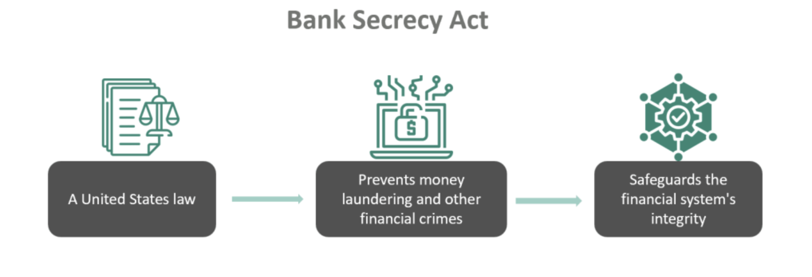

## Table of Contents

## What is the Bank Secrecy Act (BSA)?

The Bank Secrecy Act (BSA) is a U.S. law that helps fight money laundering and other financial crimes. It was passed in 1970 and requires banks and other financial institutions to keep records of certain transactions and report any suspicious activities to the government. This helps the government track money that might be used for illegal activities like drug trafficking or terrorism.

The BSA makes it important for banks to know their customers well. They do this by verifying identities and keeping records of big transactions, like those over $10,000. If a bank sees something unusual or suspicious, they have to report it to a special government office called the Financial Crimes Enforcement Network (FinCEN). This way, the government can investigate and stop illegal activities before they get worse.

## When was the Bank Secrecy Act enacted?

The Bank Secrecy Act was enacted in 1970. It's a law in the United States that helps stop money laundering and other financial crimes. The main goal is to make sure banks and other financial places keep track of certain transactions and report anything that looks suspicious to the government.

This law helps the government keep an eye on money that might be used for illegal things, like drug trafficking or terrorism. Banks have to know their customers well, check their identities, and keep records of big transactions, especially those over $10,000. If something seems off or suspicious, banks need to tell the Financial Crimes Enforcement Network (FinCEN), a special government office. This way, the government can look into it and stop any illegal activities before they become a bigger problem.

## What are the main goals of the Bank Secrecy Act?

The main goal of the Bank Secrecy Act is to stop money laundering and other financial crimes. It wants to make sure that banks and other financial places keep track of certain transactions and report anything that looks suspicious to the government. This helps the government find and stop money that might be used for illegal things like drug trafficking or terrorism.

Another goal is to make banks know their customers well. Banks have to check the identities of their customers and keep records of big transactions, especially those over $10,000. If something seems unusual or suspicious, banks need to tell the Financial Crimes Enforcement Network (FinCEN), a special government office. This way, the government can look into it and stop any illegal activities before they become a bigger problem.

## How does the Bank Secrecy Act help in preventing money laundering?

The Bank Secrecy Act helps prevent money laundering by making banks and other financial institutions keep track of certain transactions and report anything suspicious to the government. When someone tries to launder money, they often move large amounts of cash to hide where it came from. The BSA requires banks to keep records of big transactions, especially those over $10,000. This way, if someone tries to move a lot of money quickly, the bank will notice and report it.

Another way the BSA helps is by making banks know their customers well. Banks have to verify the identities of their customers and keep detailed records. This makes it harder for criminals to use fake identities or shell companies to launder money. If a bank sees something unusual or suspicious, they must report it to the Financial Crimes Enforcement Network (FinCEN). By doing this, the government can investigate and stop illegal activities before they get worse.

## What types of financial institutions are covered under the Bank Secrecy Act?

The Bank Secrecy Act covers many different types of financial institutions, not just banks. This includes credit unions, savings and loan associations, and even businesses that sell money orders or cash checks. It also applies to broker-dealers, which are companies that help people buy and sell stocks and bonds, and to casinos, which often deal with large amounts of cash.

Other financial institutions covered by the BSA are insurance companies, especially those that offer certain types of life insurance or annuities. Also included are dealers in precious metals, stones, or jewels, and even some types of travel agencies and car dealers if they handle big cash transactions. By including all these different types of businesses, the BSA helps the government keep a close eye on money movements to prevent illegal activities like money laundering.

## What are the reporting requirements for financial institutions under the BSA?

The Bank Secrecy Act (BSA) has specific reporting requirements for financial institutions to help stop money laundering and other financial crimes. One main requirement is that banks and other covered businesses must file a Currency Transaction Report (CTR) for any cash transaction over $10,000. This helps the government keep track of large cash movements that might be used for illegal activities. If a customer tries to avoid this by breaking up their cash deposits into smaller amounts, the bank must also report this as a Suspicious Activity Report (SAR).

Another requirement is that financial institutions must file a Suspicious Activity Report (SAR) if they see any transaction that looks unusual or might be linked to illegal activities. This includes things like money laundering, fraud, or even funding terrorism. The SAR gives the government important information to investigate and stop these crimes. Banks also need to keep detailed records of their customers' identities and transactions, making it harder for criminals to use fake identities or shell companies to hide their illegal money movements.

## How does the BSA impact individual customers and their privacy?

The Bank Secrecy Act (BSA) can impact individual customers and their privacy by requiring banks to collect and keep detailed information about their transactions and identities. When you do things like open a bank account or make a large cash transaction, the bank has to verify who you are and keep records of what you're doing with your money. This means that the government can see a lot of your financial information if they need to, which might make some people feel like their privacy is being invaded.

On the other hand, the BSA is meant to protect everyone by stopping illegal activities like money laundering and terrorism financing. By making banks keep track of big transactions and report anything suspicious, the law helps catch criminals and keep the financial system safe. While it does mean giving up some privacy, it's part of a bigger effort to make sure that money is being used legally and not for harmful purposes.

## What are the penalties for non-compliance with the Bank Secrecy Act?

If banks or other financial institutions don't follow the rules of the Bank Secrecy Act, they can get into big trouble. They might have to pay a lot of money as fines, which can be really expensive. The government can also take away their license to operate, which means they can't do business anymore. Sometimes, the people who work at these places can get in trouble too. They might have to pay fines or even go to jail if they did something really wrong on purpose.

The government takes breaking the Bank Secrecy Act very seriously because it helps stop illegal activities like money laundering and terrorism financing. If a bank doesn't report a big transaction or a suspicious activity, they're not helping the government keep an eye on money that might be used for bad things. That's why the penalties are so strict. They want to make sure everyone follows the rules to keep the financial system safe and honest.

## How has the Bank Secrecy Act evolved since its inception?

Since it started in 1970, the Bank Secrecy Act has changed a lot to keep up with new ways people try to do illegal things with money. One big change came in 1986 with the Money Laundering Control Act, which made it a crime to launder money and added more rules for banks to follow. Another important update happened in 2001 after the September 11 attacks. The USA PATRIOT Act added even more rules to stop terrorists from using banks to move money around. These changes made banks keep better records and report more things to the government.

Over the years, the rules have also gotten stricter about how banks need to know their customers. This is called "Know Your Customer" (KYC) rules. Banks have to check who their customers are and keep an eye on their transactions to make sure nothing looks fishy. The Financial Crimes Enforcement Network (FinCEN) also started working more closely with banks to help them follow these rules better. All these changes have made the Bank Secrecy Act a lot stronger in fighting money laundering and other financial crimes.

## What is the role of the Financial Crimes Enforcement Network (FinCEN) in enforcing the BSA?

The Financial Crimes Enforcement Network, or FinCEN, plays a big role in making sure the Bank Secrecy Act is followed. FinCEN is a part of the U.S. Treasury Department, and its main job is to collect and look at the reports that banks and other financial places send in. These reports include things like Currency Transaction Reports (CTR) for big cash transactions and Suspicious Activity Reports (SAR) for anything that looks fishy. By looking at these reports, FinCEN can spot patterns and signs of illegal activities like money laundering or funding terrorism.

FinCEN also helps banks and other businesses follow the rules of the Bank Secrecy Act. They do this by giving out guidelines and advice on what to do and how to report things correctly. If a bank or business doesn't follow the rules, FinCEN can take action. They can give out fines or even take away a bank's license to operate. This way, FinCEN makes sure that everyone is doing their part to stop illegal money movements and keep the financial system safe.

## How does the Bank Secrecy Act interact with international anti-money laundering efforts?

The Bank Secrecy Act works with other countries to stop money laundering by sharing information and working together. The U.S. government, through the Financial Crimes Enforcement Network (FinCEN), talks with other countries' financial watchdogs to make sure everyone is following the rules. This helps catch criminals who try to move dirty money across borders. For example, if a bank in the U.S. sees a suspicious transaction that might be linked to money laundering in another country, they can report it to FinCEN, who then works with that country's authorities to investigate.

The BSA also follows rules set by international groups like the Financial Action Task Force (FATF), which makes global standards to fight money laundering and terrorism financing. By following these standards, the U.S. helps make sure that its laws are strong enough to stop criminals from using the financial system to do bad things. This teamwork makes it harder for criminals to hide their money and helps keep the world's financial systems safe and honest.

## What are some criticisms and challenges faced by the Bank Secrecy Act?

Some people think the Bank Secrecy Act goes too far and hurts people's privacy. They say that when banks have to keep track of everything and report a lot of things to the government, it feels like the government is watching too closely. This can make people feel like their private money matters are not so private anymore. Also, some worry that the rules can be too hard for small businesses to follow, which might make it tough for them to keep up with all the paperwork and reporting.

Another challenge is that even with all these rules, criminals still find ways to move money around illegally. They use new technology and tricks to hide what they're doing, which can make it hard for banks and the government to catch them. This means the Bank Secrecy Act has to keep changing and getting better to stay ahead of the bad guys. It's a big job to make sure the rules are strong enough to stop illegal activities but not so strict that they make life harder for honest people and businesses.

## References & Further Reading

[1]: ["The Bank Secrecy Act: An Overview"](https://www.fincen.gov/resources/statutes-and-regulations/bank-secrecy-act) by Financial Crimes Enforcement Network (FinCEN)

[2]: ["Advances in Financial Machine Learning"](https://www.amazon.com/Advances-Financial-Machine-Learning-Marcos/dp/1119482089) by Marcos Lopez de Prado

[3]: ["Algorithmic Trading: Winning Strategies and Their Rationale"](https://play.google.com/store/books/details/Algorithmic_Trading_Winning_Strategies_and_Their_R?id=CIwCTVqEj4oC&hl=en-US) by Ernest P. Chan

[4]: ["Bank Secrecy Act/Anti-Money Laundering Examination Manual"](https://bsaaml.ffiec.gov/manual) by the Federal Financial Institutions Examination Council

[5]: ["Machine Learning for Algorithmic Trading"](https://github.com/stefan-jansen/machine-learning-for-trading) by Stefan Jansen