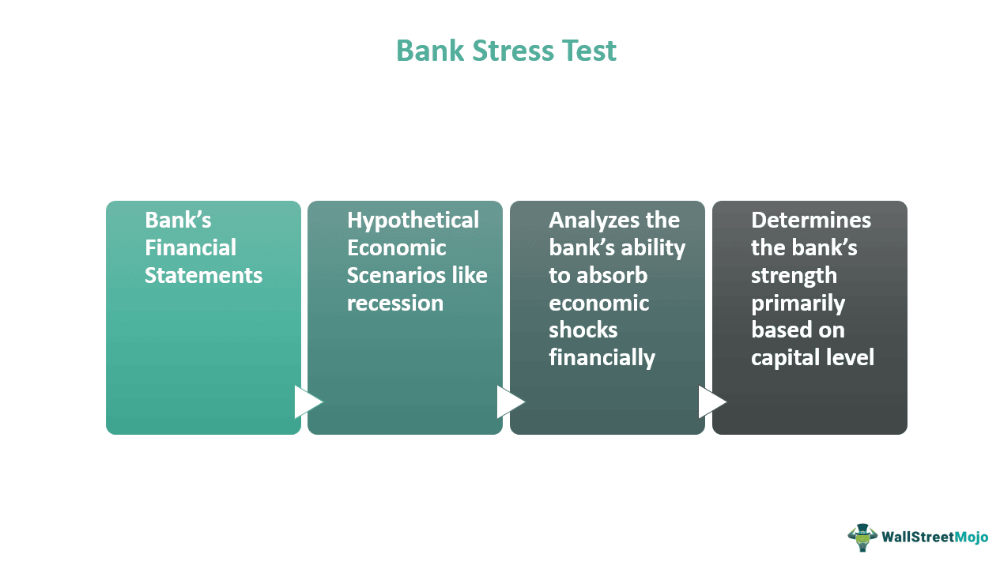

## Table of Contents

## What is a bank stress test?

A bank stress test is a way to check if banks can handle tough times. It's like a practice run to see if a bank can keep going even if the economy gets bad. People who watch over banks, like government agencies, do these tests. They make up hard situations, like a big drop in the stock market or lots of people losing their jobs, and then see how the bank would do.

The main point of a stress test is to make sure banks have enough money saved up to deal with problems. If a bank does well in the test, it means it's strong and can keep lending money to people and businesses. If it doesn't do well, the bank might need to get more money or change how it does things to be safer. This helps keep the whole economy stable because strong banks are important for everyone.

## Why are bank stress tests conducted?

Bank stress tests are done to make sure banks can handle tough times. They help check if a bank has enough money saved up to keep going even if things like a big drop in the stock market or lots of people losing their jobs happen. By running these tests, the people who watch over banks can see which banks are strong and which ones might need help.

These tests are important because they help keep the whole economy safe. If banks are strong, they can keep lending money to people and businesses, which is good for everyone. If a bank doesn't do well in a stress test, it might need to get more money or change how it does things to be safer. This way, stress tests help stop big problems from happening and keep the financial system stable.

## Who conducts bank stress tests?

Bank stress tests are usually done by government agencies that watch over banks. In the United States, the Federal Reserve, the Office of the Comptroller of the Currency, and the Federal Deposit Insurance Corporation are the main ones that do these tests. They make sure banks are strong enough to handle tough times.

These agencies come up with hard situations, like a big drop in the stock market or lots of people losing their jobs, and then see how the banks would do. This helps them figure out if banks have enough money saved up to keep going even when things get bad. By doing these tests, they can make sure the whole economy stays safe and stable.

## How often are bank stress tests performed?

In the United States, big banks have to go through stress tests every year. The Federal Reserve does these tests to make sure the banks are strong enough to handle tough times. They look at how the banks would do if bad things happened, like a big drop in the stock market or lots of people losing their jobs.

Sometimes, the government might decide to do extra stress tests if they think the economy might be in trouble. These extra tests help them check on the banks more often to make sure they are ready for anything. By doing these tests regularly, the government can keep an eye on the banks and help keep the whole economy safe and stable.

## What are the key components of a bank stress test?

A bank stress test has a few main parts that help check if a bank is strong enough to handle tough times. First, there's the scenario part. This is where the people who watch over banks, like the Federal Reserve, make up hard situations, like a big drop in the stock market or lots of people losing their jobs. They use these pretend situations to see how the bank would do if they really happened. This helps them figure out if the bank has enough money saved up to keep going even when things get bad.

The second part is checking the bank's money. The test looks at the bank's money to see if it has enough to cover losses if the pretend bad situations happen. This includes looking at things like loans the bank has given out and how much money the bank has saved up. If the bank doesn't have enough money to handle the pretend bad times, it might need to get more money or change how it does things to be safer. By doing these tests, the people who watch over banks can make sure the banks are ready for anything and help keep the whole economy safe and stable.

## Can you explain the process of conducting a bank stress test?

The process of conducting a bank stress test starts with the people who watch over banks, like the Federal Reserve, making up hard situations. These pretend situations could be things like a big drop in the stock market or lots of people losing their jobs. They use these pretend bad times to see how the bank would do if they really happened. The bank then has to use its own numbers and guesses to figure out how it would handle these tough times. This means looking at things like how much money the bank has lent out and how much money it has saved up.

Next, the bank's numbers are checked to see if it has enough money to cover losses if the pretend bad situations happen. This part of the test looks at the bank's money to make sure it can keep going even when things get hard. If the bank doesn't have enough money to handle the pretend bad times, it might need to get more money or change how it does things to be safer. After the test, the people who watch over banks look at the results and decide if the bank is strong enough. If it's not, they might tell the bank to fix things to make sure it can handle real tough times and help keep the whole economy safe and stable.

## What are the advantages of bank stress tests for the economy?

Bank stress tests help keep the economy safe and strong. When banks are tested to see if they can handle tough times, it makes sure they have enough money saved up. This means that even if something bad happens, like a big drop in the stock market or lots of people losing their jobs, the banks can still keep lending money to people and businesses. This is really important because when banks keep lending, it helps the economy keep going and growing.

Also, stress tests help stop big problems before they start. If a bank does badly in a test, the people who watch over banks can see it early and tell the bank to fix things. This can stop a small problem from turning into a big one that could hurt the whole economy. By making sure banks are strong and ready for anything, stress tests help keep everyone's money safe and the economy stable.

## How do bank stress tests benefit individual banks?

Bank stress tests help individual banks by showing them where they might be weak. When a bank goes through a stress test, it gets to see how it would do if bad things happened, like a big drop in the stock market or lots of people losing their jobs. This helps the bank figure out if it has enough money saved up to keep going even when things get hard. If the test shows the bank might not have enough money, it can get more money or change how it does things to be safer. This way, the bank can fix problems before they get too big.

Also, doing well in a stress test can make people trust the bank more. When a bank passes a stress test, it shows everyone that it's strong and ready for tough times. This can make more people want to keep their money in the bank or borrow from it. When people trust the bank, it can grow and do better in the future. So, stress tests help individual banks stay strong and keep their customers happy.

## What are some common criticisms of bank stress tests?

Some people think bank stress tests don't always show the real problems banks might have. They say the pretend bad situations used in the tests might not be tough enough or might not cover all the things that could go wrong. This means the tests might make banks look stronger than they really are. Also, some people worry that banks might try to make their numbers look better just for the test, which could hide real problems.

Another criticism is that stress tests can be too hard on some banks. If a bank doesn't do well in a test, it might have to get more money or change how it does things, which can be hard and expensive. This could make it tougher for smaller banks to compete with bigger ones. Some people also think that stress tests focus too much on big banks and might not catch problems at smaller banks that could still cause trouble for the economy.

## How do bank stress tests influence bank regulation and policy?

Bank stress tests help shape bank rules and policies by showing how strong or weak banks are. When a bank does well in a stress test, it means it's ready for tough times, and the people who watch over banks might not need to make new rules for that bank. But if a bank doesn't do well, the people in charge might make new rules to make sure the bank gets stronger. For example, they might tell the bank to keep more money saved up or change how it lends money to be safer. This helps make sure all banks are strong enough to keep the economy safe.

Stress tests also help the people who make bank rules see if their old rules are working. If lots of banks are doing badly in the tests, it might mean the rules need to change. They might make the rules stricter or come up with new ones to make banks stronger. By using stress tests to check on banks, the people who watch over them can keep updating the rules to make sure banks are always ready for anything. This helps keep the whole economy stable and safe.

## What are the limitations of current bank stress test methodologies?

One big problem with how bank stress tests are done now is that they might not be tough enough. The pretend bad situations used in the tests might not be as bad as what could really happen. This means the tests might not show all the problems a bank could have. Also, banks might try to make their numbers look better just for the test, which can hide real issues. This makes it hard to know if a bank is really as strong as it seems.

Another problem is that stress tests can be too hard on some banks, especially smaller ones. If a bank does badly in a test, it might have to get more money or change how it does things, which can be tough and expensive. This can make it harder for smaller banks to compete with bigger ones. Also, stress tests might focus too much on big banks and miss problems at smaller banks that could still cause trouble for the economy.

## How have bank stress tests evolved since their inception, and what future developments are anticipated?

Bank stress tests started after the big financial crisis in 2008. At first, they were simple and just looked at how banks would do if the economy got bad. Over time, they got better and now they use more detailed pretend bad situations to see how banks would handle all kinds of problems. They also look at more parts of a bank's money, like how much it has lent out and how much it has saved up. This helps make sure banks are ready for anything that might happen.

In the future, bank stress tests are expected to keep getting better. They might use new computer tools to make the pretend bad situations even more real. They could also look at more things, like how banks use new technology or deal with risks from around the world. By keeping up with these changes, stress tests can help make sure banks stay strong and keep the economy safe, even as the world changes.

## What is the Role of Stress Tests in Ensuring Financial Stability?

Bank stress tests are crucial tools for evaluating the financial stability of banking institutions. They quantify a bank's capital adequacy, which reflects its ability to absorb losses and continue operations during adverse economic conditions. 

### Assessing Capital Adequacy

Stress tests simulate various economic scenarios to determine if a bank holds sufficient capital to withstand potential financial strains. These scenarios typically include extreme yet plausible events such as significant market downturns, substantial defaults on loans, or adverse changes in interest rates. The primary metric analyzed during stress tests is the bank's Common Equity Tier 1 (CET1) ratio. This ratio, calculated as:

$$
\text{CET1 Ratio} = \frac{\text{Common Equity Tier 1 Capital}}{\text{Risk-Weighted Assets}}
$$

is a measure of a bank's core equity capital compared to its total risk-weighted assets, indicating its resilience to financial shocks.

### Impact on Operational and Strategic Decisions

The results of stress tests can critically impact banks' operational and strategic decisions. Banks that demonstrate robust capital adequacy may gain increased confidence from investors and regulators, potentially leading to favorable conditions for expansion or investment. Conversely, banks that exhibit weaknesses are often required to take remedial actions, such as increasing their capital reserves, reducing dividends, or curtailing risk-intensive activities. These adjustments can reshape a bank's balance sheet and influence long-term strategic planning.

### Examples of Banks that Failed Stress Tests

Historically, several banks have faced significant repercussions after failing stress tests. For instance, in 2014, the European Central Bank conducted a comprehensive assessment in which 25 banks did not meet the required capital thresholds [1]. The immediate consequence was that these institutions had to raise additional capital to bolster their financial standings. Similarly, in the United States, the Federal Reserve's stress tests in 2018 led to the German bank Deutsche Bank being prevented from advancing with capital distributions due to certain risk management deficiencies identified [2]. These failures highlight how stress tests serve as a regulatory checkpoint, ensuring banks maintain adequate buffer levels to mitigate potential economic disruptions. 

In conclusion, stress tests play an integral role in ensuring the financial stability of banking institutions by assessing capital adequacy and influencing both operational and strategic directions. Their implementation following the 2008 financial crisis underscores their importance in contemporary financial oversight.

### References

[1] ECB Banking Supervision, "Comprehensive Assessment — Aggregate Report," European Central Bank, 2014.  
[2] Federal Reserve, "Comprehensive Capital Analysis and Review 2018: Assessment Framework and Results," Board of Governors of the Federal Reserve System, June 2018.

## References & Further Reading

[1]: European Central Bank. (2014). ["Comprehensive Assessment — Aggregate Report."](https://www.ecb.europa.eu/pub/pdf/other/aggregatereportonthecomprehensiveassessment201410.en.pdf) ECB Banking Supervision.

[2]: Board of Governors of the Federal Reserve System. (2018). ["Comprehensive Capital Analysis and Review 2018: Assessment Framework and Results."](https://www.federalreserve.gov/publications/2018-ar-content.htm)

[3]: Tarullo, D. K. (2010). ["Equipping Financial Regulators with the Tools Necessary to Monitor Systemic Risk."](https://www.govinfo.gov/content/pkg/CHRG-111shrg57923/pdf/CHRG-111shrg57923.pdf) Board of Governors of the Federal Reserve System.

[4]: Lopez de Prado, M. (2018). ["Advances in Financial Machine Learning."](https://www.amazon.com/Advances-Financial-Machine-Learning-Marcos/dp/1119482089) Wiley.

[5]: Hendershott, T., Jones, C. M., & Menkveld, A. J. (2011). ["Does Algorithmic Trading Improve Liquidity?"](https://onlinelibrary.wiley.com/doi/full/10.1111/j.1540-6261.2010.01624.x) The Review of Financial Studies, 24(3), 767-807.

[6]: Basel Committee on Banking Supervision. (2017). ["Sound Practices: Implications of Fintech Developments for Banks and Bank Supervisors."](https://www.bis.org/bcbs/publ/d431.htm) Bank for International Settlements.