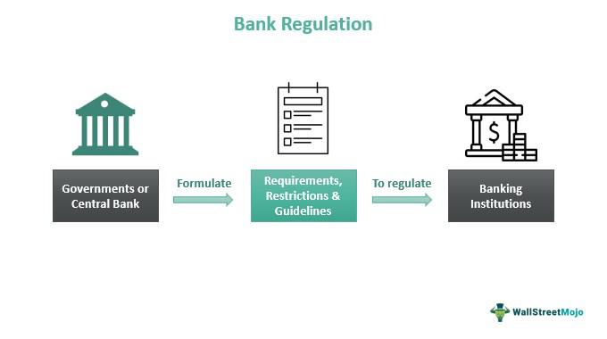

The global financial sector has witnessed remarkable transformations in recent years, driven largely by technological advancements. A focal point of this evolution is algorithmic trading, often referred to as 'algo trading', which leverages computer programs to execute trades based on pre-established criteria. This technological shift has significantly impacted financial markets by enhancing speed, efficiency, and precision in trade execution.

Parallel to these technological advancements, nations like India have fortified their financial infrastructure through comprehensive banking laws and regulations. These regulatory frameworks are designed to foster stability and inclusivity, ensuring that the financial ecosystem remains robust while catering to a diverse population. India's financial regulations act as a backbone for maintaining economic equilibrium, especially in times of market volatility and global financial shifts.

Examining India's approach to financial regulation and algo trading reveals an intricate interaction between traditional banking stability measures and cutting-edge technological practices. The Reserve Bank of India (RBI) and the Securities and Exchange Board of India (SEBI) play pivotal roles in shaping these regulations, influencing how financial institutions and investors navigate the Indian market.

For investors, traders, and financial institutions operating within India, understanding these regulatory frameworks is vital. They not only dictate how business is conducted but also impact broader strategic decisions. In an era where technology intertwines deeply with financial operations, grasping the nuances of these regulations becomes increasingly critical for successfully participating in India's dynamic market landscape.

## Table of Contents

## Banking Regulations in India

India's banking system is primarily governed by the Reserve Bank of India (RBI) under the framework established by the Banking Regulation Act, 1949. This framework ensures the financial stability and integrity of the banking sector and aims to protect depositors and investors.

One fundamental regulation imposed by the RBI is the restriction on exposure limits. Banks are restricted in their lending capacities, with single borrower limits set at 20% and group borrower limits at 25% of a bank's capital funds. This policy is crucial in mitigating the risks associated with high exposure to individual borrowers or related entities, thereby protecting the bank from potential losses arising from borrower defaults.

Additionally, the RBI mandates the maintenance of key financial stability ratios, namely the Cash Reserve Ratio (CRR) and the Statutory Liquidity Ratio (SLR). The CRR requires banks to hold a specified percentage of their net demand and time liabilities in reserve with the RBI. This reserve acts as a precautionary buffer to ensure [liquidity](/wiki/liquidity-risk-premium) in times of need. Similarly, the SLR obligates banks to maintain a certain percentage of their deposits in the form of safe and liquid assets like government securities. Both these measures are designed to ensure that banks have sufficient liquidity to meet depositor demands and uphold financial stability.

Moreover, to address the issue of non-performing assets (NPAs), the RBI requires banks to engage in mandatory provisioning. Different categories of NPAs demand varying levels of financial provisions, ensuring that banks allocate funds to cover potential losses, thereby safeguarding the interests of depositors and maintaining their financial health.

A distinctive feature of India's banking regulations is the focus on priority sector lending. Banks are mandated to allocate a specific portion of their credit to vital sectors such as agriculture and micro-enterprises. This initiative promotes economic growth and financial inclusion by directing financial resources to sectors that are critical yet often underserved by traditional financial institutions.

These regulatory measures reflect the RBI's comprehensive approach to ensure a stable, resilient, and inclusive banking environment in India. They balance risk management, financial inclusiveness, and economic growth, laying a robust foundation for the banking sector.

## Algorithmic Trading in India

Algorithmic trading, commonly referred to as algo trading, utilizes computer programs to execute trades according to predefined criteria. This approach offers a significant advantage by enabling faster and more efficient trade execution compared to human trading methods. In India, the Securities and Exchange Board of India (SEBI) introduced algo trading regulations in 2008, primarily targeting institutional investors. The objective was to facilitate a streamlined trading process that could handle larger volumes of transactions with greater precision and speed.

SEBI's regulations are designed to maintain fair and transparent trading practices. One key aspect involves managing the order-to-trade ratio, a metric that helps regulate the [volume](/wiki/volume-trading-strategy) of orders an entity places relative to successful trades. By controlling this ratio, SEBI aims to prevent market manipulation and ensure stability. Additionally, robust risk management systems are mandated for entities engaging in [algorithmic trading](/wiki/algorithmic-trading) to mitigate potential risks associated with rapid, automated transactions.

While algorithmic trading is well-regulated for institutional players, the regulatory landscape for retail traders remains less stringent. This discrepancy poses potential risks as retail participants increasingly enter the algo trading space. The introduction of rapid technological advancements and the availability of Application Programming Interfaces (APIs) have made it more feasible for retail traders to engage in algorithmic trading. APIs allow for seamless integration and execution of trading strategies, broadening access beyond traditional institutional boundaries.

However, the minimal regulatory oversight for retail algo traders raises concerns about market stability and individual investor protection. With the growing popularity of algorithmic strategies among retail investors, there is a pressing need for frameworks that offer a similar level of oversight as those applied to large institutions, ensuring a balanced and equitable trading environment for all market participants.

## SEBI's Regulations and Guidelines

The Securities and Exchange Board of India (SEBI) serves as the primary regulatory authority for algorithmic trading within the Indian financial market. SEBI's regulations are designed to ensure that the benefits of algorithmic trading are realized without compromising market stability or investor protection. To achieve this, SEBI requires platforms offering automated trading strategies to obtain mandatory approvals. This regulatory step ensures that these platforms adhere to set standards, which mitigate potential risks associated with algorithmic trading.

Additionally, SEBI mandates regular audits for algorithmic trading firms. These audits scrutinize the trading systems these firms utilize, ensuring compliance with established regulations. By doing so, SEBI aims to prevent systemic risks that could arise from faulty algorithms or technical glitches, thereby safeguarding the broader market environment.

To address the potential market disruptions caused by excessive order submissions, SEBI enforces penalty mechanisms for order-to-trade ratio violations. This policy is particularly important in preventing the adverse effects of bulk ordering, which can lead to market instability and inequitable trading conditions. By imposing penalties, SEBI promotes responsible trading practices among market participants.

SEBI has also initiated consultation papers seeking feedback on the current regulatory framework, particularly concerning retail algorithmic traders. This initiative underscores SEBI's commitment to transparency and inclusiveness in regulatory processes. It reflects the board's proactive approach in adapting regulations to the evolving needs of the market and its participants.

Overall, SEBI's regulations are crafted to protect investors and sustain the integrity of India's financial markets. These measures are indicative of a regulation system that prioritizes both innovation and stability. By maintaining this balance, SEBI plays a crucial role in ensuring that algorithmic trading contributes positively to the Indian economy.

## Challenges and Opportunities

The landscape of algorithmic trading in India is marked by a complex regulatory environment that poses challenges in keeping pace with the rapid technological advancements inherent to this sector. As the Securities and Exchange Board of India (SEBI) enacts regulations to ensure fair and secure trading practices, the challenge remains in nurturing innovation without compromising market stability or investor protection. This delicate balancing act is pivotal for the sustainable growth of algorithmic trading.

With the regulatory framework in a constant state of evolution, companies that can quickly adapt to changes will find themselves at a distinct advantage. These firms have the opportunity to implement cutting-edge trading solutions that are fully compliant with existing regulations. This adaptability not only facilitates a smoother operational flow but also positions these firms as leaders in a competitive market space.

For retail traders and smaller firms, staying informed about the latest regulatory updates is essential. This awareness allows these players to leverage algorithmic trading technologies effectively while avoiding potential legal pitfalls. As SEBI continues to issue guidelines and consultation papers, retail traders must be diligent in aligning their strategies with these directives to harness the full potential of algo trading.

The future of algorithmic trading in India holds significant promise for expansion and innovation. Nevertheless, this growth is contingent upon a careful navigation of the regulatory landscape. Market participants who can thoroughly understand and integrate the evolving regulations will be best positioned to capitalize on future opportunities, thereby contributing to the broader objective of a stable and transparent financial market.

## Conclusion

India's regulatory frameworks for banking and algorithmic trading emphasize the nation's steadfast commitment to financial stability and the integrity of its markets. As technological advancements continue to redefine financial systems, a thorough comprehension of these regulations becomes indispensable for participants in the market. The regulations governing both sectors are designed to promote inclusiveness and transparency, aligning with India's broader economic objectives.

The country's banking regulations, characterized by measures such as the Cash Reserve Ratio (CRR) and Statutory Liquidity Ratio (SLR), are fundamental to maintaining financial stability. These mechanisms are pivotal for ensuring that banks retain sufficient reserves, thereby mitigating risks associated with liquidity. Simultaneously, algorithmic trading regulations set by the Securities and Exchange Board of India (SEBI) focus on ensuring fair play and transparency in the fast-paced trading environment, underscoring investor protection and market trust.

As regulations continue to evolve, they reflect a financial market that harmonizes tradition with modernity. Being informed and adaptable to these regulatory changes offers investors and financial entities extensive opportunities for growth and innovation. The dynamic nature of these frameworks ensures that India's financial system remains resilient and inclusive, welcoming informed players who are poised to navigate the complexities of this developing landscape effectively.

## References & Further Reading

[1]: Reserve Bank of India. (1949). ["The Banking Regulation Act, 1949."](https://www.indiacode.nic.in/bitstream/123456789/1885/1/A194910.pdf)

[2]: Securities and Exchange Board of India. (2008). ["Regulations on Algorithmic Trading."](https://www.sebi.gov.in/legal/regulations/aug-2021/securities-and-exchange-board-of-india-intermediaries-regulations-2008-last-amended-on-november-17-2021-_38453.html)

[3]: Reserve Bank of India. ["Master Circular - Prudential Norms for Classification, Valuation, and Operation of Investment Portfolio by Banks."](https://rbi.org.in/commonman/Upload/English/Notification/PDFs/20MACII010709_FULL.pdf)

[4]: Securities and Exchange Board of India. ["Discussion Paper on Algorithmic Trading."](https://www.sebi.gov.in/cms/sebi_data/attachdocs/1470393485587.pdf)

[5]: Dunaev, A., & Mishra, P.S. (2019). ["Bank Asset Liabilities Management with Focus on CRR & SLR Component in Indian Context."](https://www.researchgate.net/publication/361609601_ASSET_-LIABILTY_MANAGEMENT_IN_INDIAN_BANKING_INDUSTRY) IOP Conference Series: Earth and Environmental Science.

[6]: Narayanan, H. (2020). ["Indian Financial Markets and Institutions."](https://link.springer.com/chapter/10.1007/978-3-658-43014-6_7) Springer, Singapore.

[7]: Ehlers, R., & Gore, Y. (2021). ["Assessing the Impact of Algorithmic Trading on Securities Markets."](https://www.semanticscholar.org/paper/Assessing-the-Impact-of-Algorithmic-Trading-on-A-Gsell/820fa261b451f5b57decf4f8ccf526247fcbc2ff) Bank for International Settlements.