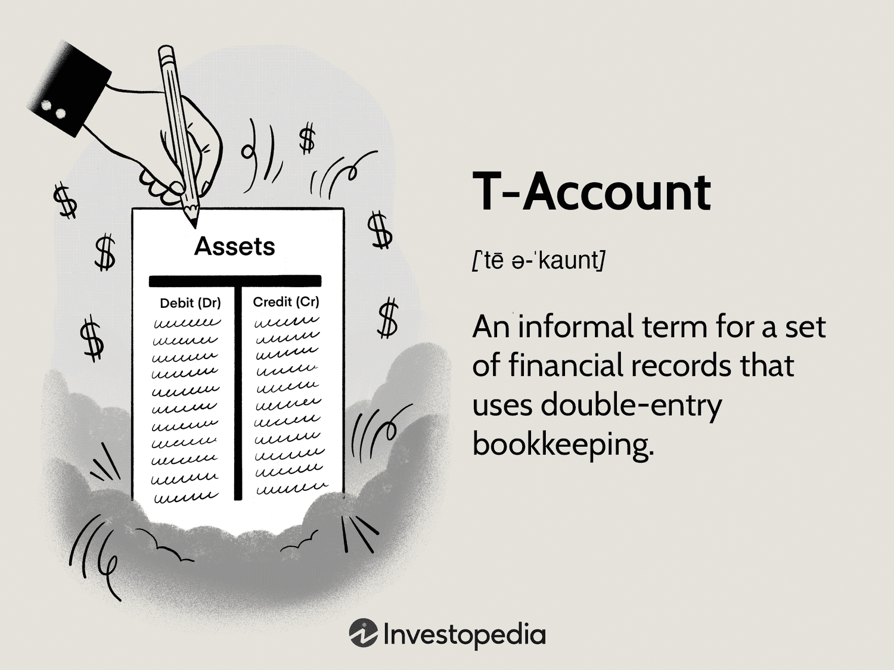

In the ever-evolving landscape of financial technology, the integration of Banknet and networking into algorithmic trading represents a significant advancement. Algorithmic trading, also known simply as 'algo trading,' utilizes powerful computer algorithms to execute trades at incredible speeds and accuracies. This form of trading relies on quantitative models and advanced computing techniques to determine the optimal timing, price, and quantity of securities to buy or sell. Compared to traditional methods, algorithmic trading can process large volumes of data and execute orders with precision, thereby reducing transaction costs and increasing profit potential.

Banknet is Mastercard's proprietary global payment network that connects merchants and data processing centers worldwide. Its robust network infrastructure facilitates the quick authorization of credit and debit card transactions, making it highly efficient and reliable. The synergy between Banknet's global payment network capabilities and the efficiency of algorithmic trading opens a new frontier where speed and accuracy are paramount.



As financial markets become more complex, leveraging these technologies can provide a competitive advantage for traders and financial institutions. The integration of Banknet into algorithmic trading networks can enhance transaction speeds and reliability, crucial factors for capitalizing on fleeting market opportunities. Moreover, artificial intelligence and machine learning could further refine trading strategies, offering more sophisticated decision-making tools for investors. By understanding and utilizing these advanced systems, financial stakeholders can strategically position themselves in an increasingly competitive environment, paving the way for a transformative future in financial markets.

## Table of Contents

## Understanding Banknet

Banknet is a crucial component of Mastercard's global infrastructure, designed to connect merchants and data processing centers across the world. Launched in 1997, it has become an essential system for facilitating credit and debit card transactions with remarkable speed and reliability. The network operates over 1,000 nodes, enabling it to process transaction authorizations in approximately 200 milliseconds, which underscores its efficiency and low-latency capabilities crucial for real-time financial operations.

The underlying architecture of Banknet is built on a robust virtual private network (VPN) infrastructure. This architecture is instrumental in supporting high-speed data transfer, reliability, and security, all essential traits for modern financial networks. The demands of algorithmic trading, which rely heavily on speed and precise execution, parallel these technological requirements. Algorithmic trading networks require an infrastructure capable of handling vast amounts of data swiftly and with minimal delay to ensure timely trade execution. Thus, Banknet's design, which emphasizes expedited data exchange and robust connectivity, mirrors these needs, highlighting its potential relevance and applicability in the domain of algorithmic trading.

By supporting swift and secure data transactions, Banknet offers a paradigm for building efficient financial transaction networks. Its established reliability and speed provide a foundational blueprint for enhancing financial data exchanges and supporting complex trading strategies that depend on instantaneous data flows and secure transactions. The parallel between Banknet's capabilities and the technical needs of algorithmic trading networks suggests that the integration of such payment infrastructures could bring significant improvements to trading operations, improving both efficiency and speed in trade execution.

## Algorithmic Trading: An Overview

Algorithmic trading, commonly known as 'algo trading,' is a sophisticated trading strategy that leverages computer programs to automate trading processes. These algorithms are designed to execute trades based on precisely defined criteria, significantly increasing the speed and accuracy of trading transactions, which exceeds what human traders can achieve manually.

One of the principal advantages of [algorithmic trading](/wiki/algorithmic-trading) is its speed. Computers can process market data and execute orders in milliseconds, allowing traders to capitalize on short-lived opportunities. This technological advantage not only enhances the execution efficiency but also leads to reduced transaction costs. Moreover, by automating the trading process, algo trading helps eliminate emotional biases that often cloud human judgment and lead to inconsistent trading results. 

Algorithmic trading relies on various strategies to maximize returns. Among these, [trend following](/wiki/trend-following) is a straightforward strategy where trades are executed based on market trends, ignoring short-term market fluctuations. Mean reversion is another popular strategy that assumes prices will return to their historical average, enabling traders to profit from short-term anomalies. Arbitrage seeks to exploit price discrepancies between different markets or instruments, ensuring risk-free profits. Pairs trading, meanwhile, involves the simultaneous purchase and sale of two similar securities when their price relationship deviates from the norm, anticipating that prices will revert to their typical correlation.

These strategies are implemented using complex mathematical models and statistical analysis to enhance the decision-making process in financial markets. For instance, a basic python example of a mean reversion strategy might look like this:

```python
import numpy as np
import pandas as pd

# Assuming 'price_series' is a pandas Series of asset prices
def mean_reversion_strategy(price_series, window=20):
    rolling_mean = price_series.rolling(window=window).mean()
    rolling_std = price_series.rolling(window=window).std()

    # Current price
    current_price = price_series.iloc[-1]

    # Calculate z-score
    z_score = (current_price - rolling_mean.iloc[-1]) / rolling_std.iloc[-1]

    # If z-score > threshold, sell signal; if z-score < -threshold, buy signal
    if z_score > 1:
        return 'Sell'
    elif z_score < -1:
        return 'Buy'
    else:
        return 'Hold'

# Example usage:
# signal = mean_reversion_strategy(price_series)
```

These algorithmic strategies and the elimination of emotional decision-making biases make algo trading a valuable tool for modern-day financial markets, offering execution precision and the ability to handle large volumes of trades efficiently.

## The Role of Networking in Algo Trading

Networking solutions are vital components in algorithmic trading, forming the backbone of secure, fast, and reliable data exchange between trading platforms and market exchanges. The performance of these networking systems directly influences trade execution and profitability, particularly due to the importance of speed and accuracy in the financial markets. 

Latency, the delay between the initiation of a trade order and its execution, is a critical [factor](/wiki/factor-investing) in trading performance. In algorithmic trading, delays measured in milliseconds can significantly impact the outcome of trades, especially in high-frequency trading where large volumes of transactions occur within extremely short periods. Reducing latency involves optimizing both hardware and software components, as well as leveraging advanced networking technologies.

High-frequency trading ([HFT](/wiki/high-frequency-trading-strategies)), a subset of algorithmic trading, exemplifies the necessity for low-latency networking. It requires infrastructure capable of processing thousands of transactions per second with minimum delay. Networking hardware, such as low-latency switches and routers, plays a pivotal role in this ecosystem. Market data feeds must be processed in real-time, necessitating bandwidth that can accommodate large data volumes alongside optimized routing to minimize delays.

Integrating with networks like Banknet enhances the capabilities of trading networks by providing high-bandwidth and reliable connectivity on a global scale. Banknet, with its established infrastructure designed for speed and efficiency, could potentially serve as an ideal backbone for algorithmic trading networks. By leveraging Banknet’s capabilities, traders can achieve superior connectivity, allowing for faster and more secure transaction processing.

Overall, the role of networking in algorithmic trading is underscored by the need for technological solutions that ensure data is transmitted quickly and securely across complex financial landscapes, thereby enabling traders to execute strategies effectively and efficiently.

## Benefits and Challenges of Integrating Banknet with Algo Trading

Integrating Banknet with algorithmic trading could significantly enhance transaction speed and reliability, presenting a substantial benefit for traders aiming to capitalize on transient market conditions. Banknet's robust infrastructure provides high-speed data transmission capabilities, with latency as low as 200 milliseconds, which can be pivotal for executing trades efficiently and effectively. This speed and reliability enable algorithmic trading systems to process orders quickly, reducing the risk of slippage and improving the likelihood of achieving optimal execution prices.

However, numerous challenges must be addressed for successful integration. One major challenge is ensuring compatibility between Banknet's network architecture and existing algorithmic trading systems. Compatibility issues may arise from differences in data formats, network protocols, and system interfaces. To overcome these challenges, financial institutions must adopt standardization protocols and potentially redesign certain architectural components to ensure seamless connectivity.

Security is another critical concern given the high sensitivity of financial data transmitted across networks. Integrating Banknet into algo trading environments necessitates robust security measures to protect transaction integrity and prevent unauthorized access. Financial institutions may need to implement advanced encryption techniques, multi-factor authentication, and real-time monitoring systems to safeguard data and ensure compliance with regulatory standards.

Moreover, technical constraints pose additional hurdles. These include managing the increased data load resulting from high-frequency trading activities and ensuring system scalability to accommodate growing trading volumes. To address these constraints, institutions can leverage cloud-based solutions and distributed computing frameworks that offer flexibility and scalability.

Ultimately, while the integration of Banknet with algorithmic trading presents a significant opportunity for enhanced trading capabilities, it requires careful planning and execution. Addressing compatibility issues, ensuring robust security, and overcoming technical constraints are crucial for realizing the full potential of this integration in the fast-paced world of financial markets.

## The Future of Financial Technology with Banknet and Algo Trading

As financial technologies continue to evolve, the combined use of Banknet’s networking assets and algorithmic trading heralds the dawn of a transformative period within financial markets. Banknet, with its established global payment network, provides a foundation capable of supporting high-frequency trading systems. These systems rely on swift execution and data analysis, making such an integration notably beneficial.

Future advancements are likely to emphasize the integration of [artificial intelligence](/wiki/ai-artificial-intelligence) (AI) and [machine learning](/wiki/machine-learning) (ML) into algorithmic trading. These technologies can enhance trading strategies by developing more sophisticated predictive models and automating decision-making processes. AI algorithms, particularly those based on [deep learning](/wiki/deep-learning), could identify complex patterns within massive datasets faster and more accurately than traditional methods. For traders, this means potentially predicting market movements with greater precision, leading to better execution strategies. For instance, [reinforcement learning](/wiki/reinforcement-learning), a type of ML where algorithms learn optimal actions through trial and error, can be used to refine trading strategies dynamically in response to real-time market data.

The formulaic expressions inevitably simplify into algorithmic efficiencies when using AI:

$$
\text{Profitability} = f(\text{Speed}, \text{Accuracy}, \text{Market Conditions})
$$

Here, both speed and accuracy can be dramatically improved via AI-driven systems embedded within Banknet's high-speed infrastructure, adapting to evolving market conditions.

In parallel, regulatory developments will significantly shape the contours of these technological advancements. Regulatory bodies worldwide are increasingly scrutinizing algorithmic trading’s impact on market stability, fairness, and transparency. As these technologies combine, regulatory frameworks must adapt to accommodate innovations while ensuring a stable market environment. Balancing advancement with regulation will require dialogue between financial institutions, technology developers, and regulators to establish guidelines that protect market integrity without stifling innovation.

Ultimately, in understanding these complexities and interactions, stakeholders can leverage these advancements, using AI and ML within the Banknet infrastructure to create a more efficient trading environment, thus maintaining a lucrative edge in the competitive landscape of financial markets.

## Conclusion

The integration of Banknet's capabilities into algorithmic trading highlights a significant shift in financial technology's role within modern markets. Banknet, Mastercard's proprietary payment network, with its vast infrastructure and rapid transaction speeds, offers unique advantages that can enhance the efficacy and efficiency of algorithmic trading. This integration presents not only opportunities to optimize trading strategies and execution methodologies but also poses challenges that require innovative solutions.

One of the prominent opportunities in this integration is the ability to capitalize on fleeting market opportunities through enhanced transaction speeds and reliability. By leveraging Banknet's global network, algorithmic trading systems can potentially achieve near-instantaneous execution, thereby reducing latency—a critical factor in trading performance. This improved execution speed can be particularly advantageous in high-frequency trading, where even milliseconds can significantly impact profitability.

However, the integration also presents substantial challenges, notably in ensuring the compatibility and security of these interconnected systems. With the sensitivity of financial data, maintaining rigorous security protocols is imperative to safeguard transaction integrity and prevent unauthorized access. Additionally, aligning Banknet's existing infrastructure with the specialized needs of algorithmic trading systems requires addressing technical constraints and developing sophisticated network solutions.

Despite these challenges, the ongoing evolution of financial technologies holds considerable promise for redefining trading methodologies. As the integration of Banknet with algorithmic trading progresses, continuous advancements in computing power, networking solutions, and data analytics will further shape its development. Stakeholders who understand and leverage these innovations can strategically position themselves in an increasingly competitive financial environment, utilizing cutting-edge tools to enhance their market presence.

The transformative potential of combining Banknet's capabilities with algorithmic trading not only opens new possibilities for financial institutions but also encourages a broader application of technological advancements within the finance sector. This ongoing integration underscores the necessity for adaptability and forward-thinking strategies to harness the full potential of emerging financial technologies.

## References & Further Reading

[1]: Bergstra, J., Bardenet, R., Bengio, Y., & Kégl, B. (2011). ["Algorithms for Hyper-Parameter Optimization."](https://dl.acm.org/doi/10.5555/2986459.2986743) Advances in Neural Information Processing Systems 24.

[2]: ["Advances in Financial Machine Learning"](https://www.amazon.com/Advances-Financial-Machine-Learning-Marcos/dp/1119482089) by Marcos Lopez de Prado

[3]: ["Evidence-Based Technical Analysis: Applying the Scientific Method and Statistical Inference to Trading Signals"](https://www.amazon.com/Evidence-Based-Technical-Analysis-Scientific-Statistical/dp/0470008741) by David Aronson

[4]: ["Machine Learning for Algorithmic Trading"](https://github.com/stefan-jansen/machine-learning-for-trading) by Stefan Jansen

[5]: ["Quantitative Trading: How to Build Your Own Algorithmic Trading Business"](https://www.amazon.com/Quantitative-Trading-Build-Algorithmic-Business/dp/1119800064) by Ernest P. Chan