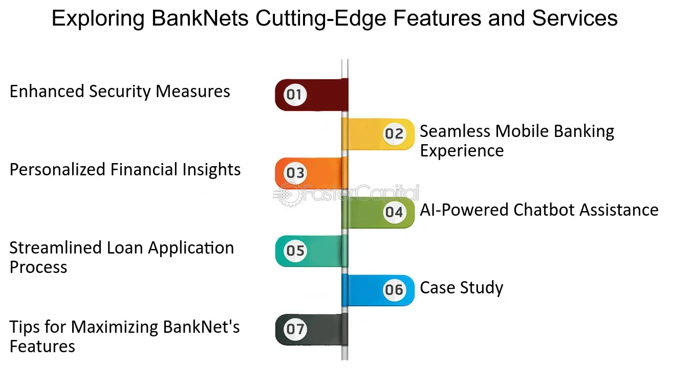

## Table of Contents

## What is Banknet?

Banknet is a communication network used by banks to send messages and information to each other securely. It helps banks to do things like transfer money between accounts in different banks, check if a check is real, and share other important financial information. Banknet makes these processes faster and safer because it uses special codes and security measures to protect the information being sent.

The network is used by many banks around the world, which means it helps with international banking too. When a bank wants to send money to another country, it can use Banknet to make sure the money gets to the right place quickly and safely. This is important for businesses and people who need to move money across borders for work or personal reasons.

## How does Banknet facilitate interbank transactions?

Banknet helps banks talk to each other easily and safely. When a bank needs to send money to another bank, it uses Banknet to send a special message. This message has all the details about the money, like how much to send and where to send it. Banknet makes sure this message gets to the right bank quickly and without anyone else seeing it. This is important because it keeps the money safe and makes sure it goes to the right place.

Banknet also helps with other things, like checking if a check is real or sharing information about accounts. If a bank gets a check, it can use Banknet to ask the bank that made the check if it's real. This helps stop people from using fake checks. Banknet is used by banks all over the world, so it helps with sending money to different countries too. This is really helpful for businesses and people who need to move money around the world.

## What are the key functionalities of Banknet?

Banknet helps banks talk to each other safely and quickly. It's like a special messenger that banks use to send information about money. When a bank needs to move money to another bank, it uses Banknet to send a message with all the details. This message tells the other bank how much money to move and where to send it. Banknet makes sure this message gets to the right place without anyone else seeing it, which keeps the money safe.

Banknet also helps banks check if things like checks are real. If a bank gets a check, it can use Banknet to ask the bank that made the check if it's good. This helps stop people from using fake checks. Banknet is used by banks all over the world, so it's really helpful for sending money to different countries. This is important for businesses and people who need to move money around the world for work or personal reasons.

## How does Banknet ensure the security of transactions?

Banknet keeps transactions safe by using special codes and security measures. When a bank sends a message through Banknet, it uses these codes to make sure no one else can read the message. This is important because it stops people who shouldn't see the message from getting the information about the money being moved.

Banknet also checks to make sure the messages are coming from real banks. It does this by using special ways to prove who is sending the message. This helps stop people from pretending to be a bank and sending fake messages. By doing these things, Banknet makes sure that the money and information being sent between banks stays safe and only goes to the right place.

## What role does Banknet play in the financial system?

Banknet is like a special messenger for banks. It helps them talk to each other quickly and safely about money. When a bank needs to send money to another bank, it uses Banknet to send a message with all the details. This message tells the other bank how much money to move and where to send it. Banknet makes sure this message gets to the right place without anyone else seeing it, which keeps the money safe.

Banknet also helps banks check if things like checks are real. If a bank gets a check, it can use Banknet to ask the bank that made the check if it's good. This helps stop people from using fake checks. Banknet is used by banks all over the world, so it's really helpful for sending money to different countries. This is important for businesses and people who need to move money around the world for work or personal reasons.

## Can you explain the architecture of Banknet?

Banknet is like a special road that banks use to send messages to each other. It's made up of computers and special lines that connect banks all over the world. When a bank wants to send a message, it goes through these lines to reach the other bank. The messages are sent using special codes that keep them safe and private. This is important because it stops people who shouldn't see the messages from getting the information about the money being moved.

The system also has special rules and checks to make sure only real banks can send messages. It uses something called authentication to prove that the messages are coming from real banks. This helps stop people from pretending to be a bank and sending fake messages. By using these computers, lines, codes, and rules, Banknet makes sure that the money and information being sent between banks stays safe and only goes to the right place.

## How does Banknet integrate with other financial systems?

Banknet works together with other financial systems to make sure money can move smoothly and safely. It connects with systems like SWIFT, which is another way banks send messages to each other, especially for international transfers. When a bank uses Banknet to send money to another country, it can also use SWIFT to make sure the message gets to the right place. This teamwork helps banks handle big and small money moves all over the world.

Banknet also works with systems inside banks, like their own computers and software. When a bank gets a message from Banknet, it can use its own systems to check the details and make sure everything is correct before moving the money. This connection helps banks keep their records straight and make sure the money goes where it's supposed to go. By working with other systems, Banknet helps make the whole process of moving money easier and safer for everyone.

## What are the benefits of using Banknet for banks and financial institutions?

Banknet helps banks and financial institutions talk to each other quickly and safely. When a bank needs to send money to another bank, Banknet makes sure the message gets to the right place without anyone else seeing it. This keeps the money safe and makes sure it goes where it's supposed to go. Banknet also helps banks check if things like checks are real, which stops people from using fake checks. This is really important because it helps banks trust each other and work together smoothly.

Banknet is used by banks all over the world, so it's really helpful for sending money to different countries. This is important for businesses and people who need to move money around the world for work or personal reasons. By using Banknet, banks can handle big and small money moves easily and safely. This makes the whole process of moving money easier and helps banks and their customers save time and money.

## How does Banknet handle real-time gross settlement (RTGS)?

Banknet helps banks move money between them in real-time using a system called Real-Time Gross Settlement (RTGS). When a bank wants to send money to another bank, it uses Banknet to send a special message with all the details. This message tells the other bank how much money to move and where to send it. Banknet makes sure this message gets to the right place quickly and safely. This is important because it means the money is moved right away, without waiting for other transactions to happen first.

RTGS through Banknet is used for big money moves, like when a business needs to pay for something important right away. Because the money is moved in real-time, the bank that is sending the money knows right away that the money has been moved safely. This helps businesses and banks trust each other and work together smoothly. Banknet's RTGS system makes sure that big money moves happen quickly and safely, which is really important for keeping the financial system running smoothly.

## What are the challenges faced by Banknet in maintaining system efficiency?

Banknet faces some challenges in keeping its system running smoothly. One big challenge is making sure the system can handle a lot of messages at the same time. When many banks are sending messages through Banknet, it can get busy and slow down. This is a problem because banks need the system to work quickly so they can move money fast. Another challenge is keeping the system safe from people who might try to break in and steal information. Banknet has to use strong security measures to stop these bad people, but it can be hard to keep up with new ways they might try to attack.

Another challenge is making sure Banknet works well with other systems that banks use. Banks use many different systems to handle their money, and Banknet needs to connect with all of them. If there are problems with how Banknet talks to these other systems, it can cause delays and mistakes. This is important because banks need everything to work together smoothly to keep their customers happy. By working hard to solve these challenges, Banknet can keep helping banks move money quickly and safely.

## How does Banknet comply with international financial regulations?

Banknet follows the rules set by different countries and international groups to make sure it helps banks move money safely and correctly. These rules are important because they help stop bad things like money laundering and fraud. Banknet uses special codes and checks to make sure all the messages it sends follow these rules. For example, it makes sure that banks can prove who they are before sending money, which is a rule to stop people from pretending to be someone they're not.

Banknet also works with other systems like SWIFT, which has its own rules to follow. By working together, Banknet and SWIFT make sure that money can move across borders while still following all the important rules. This helps banks trust each other and work together smoothly, no matter where they are in the world. By following these rules, Banknet helps keep the financial system safe and fair for everyone.

## What future developments are expected for Banknet to enhance its capabilities?

Banknet is always looking to get better and help banks move money even faster and safer. One big thing they might do is use new technology like blockchain. Blockchain is like a special book that keeps track of money moves in a way that's hard to cheat. If Banknet uses blockchain, it could make the system even safer and help banks trust each other more. They might also use artificial intelligence (AI) to make the system smarter. AI could help find and stop bad people trying to use the system the wrong way, making it safer for everyone.

Another thing Banknet might do is make it easier to connect with other systems. Right now, Banknet works with systems like SWIFT, but they might make it even easier to talk to other systems. This could help banks move money even quicker and with fewer mistakes. By working on these new ideas, Banknet can keep helping banks around the world move money smoothly and safely.

## What is the Future of Financial Technology with Banknet and Algo Trading?

As financial technologies continue to evolve, the combined use of Banknet’s networking assets and [algorithmic trading](/wiki/algorithmic-trading) heralds the dawn of a transformative period within financial markets. Banknet, with its established global payment network, provides a foundation capable of supporting high-frequency trading systems. These systems rely on swift execution and data analysis, making such an integration notably beneficial.

Future advancements are likely to emphasize the integration of [artificial intelligence](/wiki/ai-artificial-intelligence) (AI) and [machine learning](/wiki/machine-learning) (ML) into algorithmic trading. These technologies can enhance trading strategies by developing more sophisticated predictive models and automating decision-making processes. AI algorithms, particularly those based on [deep learning](/wiki/deep-learning), could identify complex patterns within massive datasets faster and more accurately than traditional methods. For traders, this means potentially predicting market movements with greater precision, leading to better execution strategies. For instance, [reinforcement learning](/wiki/reinforcement-learning), a type of ML where algorithms learn optimal actions through trial and error, can be used to refine trading strategies dynamically in response to real-time market data.

The formulaic expressions inevitably simplify into algorithmic efficiencies when using AI:

$$
\text{Profitability} = f(\text{Speed}, \text{Accuracy}, \text{Market Conditions})
$$

Here, both speed and accuracy can be dramatically improved via AI-driven systems embedded within Banknet's high-speed infrastructure, adapting to evolving market conditions.

In parallel, regulatory developments will significantly shape the contours of these technological advancements. Regulatory bodies worldwide are increasingly scrutinizing algorithmic trading’s impact on market stability, fairness, and transparency. As these technologies combine, regulatory frameworks must adapt to accommodate innovations while ensuring a stable market environment. Balancing advancement with regulation will require dialogue between financial institutions, technology developers, and regulators to establish guidelines that protect market integrity without stifling innovation.

Ultimately, in understanding these complexities and interactions, stakeholders can leverage these advancements, using AI and ML within the Banknet infrastructure to create a more efficient trading environment, thus maintaining a lucrative edge in the competitive landscape of financial markets.

## References & Further Reading

[1]: Bergstra, J., Bardenet, R., Bengio, Y., & Kégl, B. (2011). ["Algorithms for Hyper-Parameter Optimization."](https://dl.acm.org/doi/10.5555/2986459.2986743) Advances in Neural Information Processing Systems 24.

[2]: ["Advances in Financial Machine Learning"](https://www.amazon.com/Advances-Financial-Machine-Learning-Marcos/dp/1119482089) by Marcos Lopez de Prado

[3]: ["Evidence-Based Technical Analysis: Applying the Scientific Method and Statistical Inference to Trading Signals"](https://www.amazon.com/Evidence-Based-Technical-Analysis-Scientific-Statistical/dp/0470008741) by David Aronson

[4]: ["Machine Learning for Algorithmic Trading"](https://github.com/stefan-jansen/machine-learning-for-trading) by Stefan Jansen

[5]: ["Quantitative Trading: How to Build Your Own Algorithmic Trading Business"](https://www.amazon.com/Quantitative-Trading-Build-Algorithmic-Business/dp/1119800064) by Ernest P. Chan