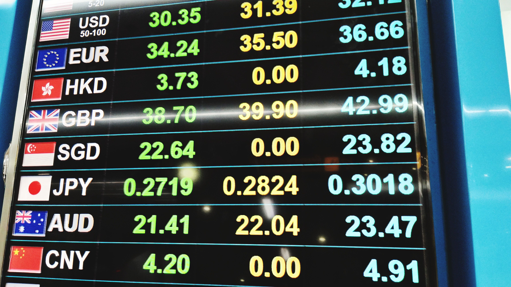

## Table of Contents

## What is the Bankrate Monitor Index?

The Bankrate Monitor Index is a tool that helps people understand how banks are doing with their interest rates. It looks at the rates that banks offer for different things like savings accounts, CDs, and loans. By checking these rates, the index can tell if banks are offering good deals or if they are charging too much.

This index is useful for people who want to make smart choices about where to put their money or where to get a loan. It gives a clear picture of what is happening in the banking world. If the index shows that rates are going up, it might be a good time to save money. If rates are going down, it might be better to borrow money.

## Who created the Bankrate Monitor Index?

The Bankrate Monitor Index was created by Bankrate, Inc. Bankrate is a company that helps people make good choices about money. They started the index to give people a clear way to see what banks are doing with their interest rates.

Bankrate uses the index to look at rates for savings accounts, CDs, and loans. This helps people decide if they should save their money or borrow money. The index is a helpful tool because it shows what is happening in the banking world in a simple way.

## How is the Bankrate Monitor Index calculated?

The Bankrate Monitor Index is calculated by looking at the interest rates from a bunch of different banks. They check rates for things like savings accounts, CDs, and loans. They take these rates and average them out to see what the overall trend is. If the average rate goes up, it means banks are offering more for savings or charging more for loans. If it goes down, it means the opposite.

This index is updated regularly to keep up with changes in the banking world. Bankrate looks at data from many banks across the country to make sure the index is accurate. By doing this, they can give people a good idea of whether it's a good time to save money or borrow money based on the current interest rates.

## What types of financial products does the Bankrate Monitor Index cover?

The Bankrate Monitor Index covers different types of financial products that people use every day. It looks at the interest rates for savings accounts, which is where people keep their money to earn a little extra. It also checks the rates for certificates of deposit, or CDs, which are like savings accounts but you can't take your money out for a set time.

The index also covers loan products. This means it looks at the interest rates for things like mortgages, which are loans for buying a house, and auto loans, which are for buying a car. By keeping an eye on these rates, the index helps people see if it's a good time to borrow money or if they should wait for better rates.

## How often is the Bankrate Monitor Index updated?

The Bankrate Monitor Index gets updated every week. This means every seven days, Bankrate looks at the newest interest rates from different banks and changes the index to match these new numbers.

By updating the index weekly, people can see the latest trends in banking. This helps them make smart choices about saving or borrowing money based on the most current information.

## What is the significance of the Bankrate Monitor Index for consumers?

The Bankrate Monitor Index is important for consumers because it helps them understand what is happening with interest rates at banks. When people know the current rates for savings accounts, CDs, and loans, they can make better choices about their money. For example, if the index shows that savings rates are high, it might be a good time to put money into a savings account to earn more interest. On the other hand, if loan rates are low, it could be a good time to borrow money for a house or a car.

This index is updated every week, so it always shows the latest information. This is helpful because interest rates can change quickly. By checking the Bankrate Monitor Index, consumers can stay up-to-date and make timely decisions. Whether they are saving for the future or planning to take out a loan, the index gives them the information they need to act smartly with their money.

## How does the Bankrate Monitor Index compare to other financial indices?

The Bankrate Monitor Index is different from other financial indices because it focuses only on interest rates from banks. Other indices, like the S&P 500, look at how stocks are doing, or the Consumer Price Index (CPI), which tracks changes in prices for things people buy. The Bankrate Monitor Index helps people see if it's a good time to save or borrow money by showing the average rates for savings accounts, CDs, and loans. This makes it a useful tool for everyday banking decisions.

Other financial indices might give a broader view of the economy. For example, the Dow Jones Industrial Average shows how big companies are doing, and the GDP (Gross Domestic Product) tells us about the total value of goods and services produced in a country. The Bankrate Monitor Index, on the other hand, is more specific to personal finance. It's updated weekly, so it's always showing the latest trends in banking, which can help people make quick decisions about their money.

## What historical trends can be observed in the Bankrate Monitor Index?

Over the years, the Bankrate Monitor Index has shown some clear trends. One big trend is that savings rates and loan rates often move together. When the economy is doing well, banks might offer higher rates for savings accounts and CDs to attract more money from people. At the same time, they might also charge more for loans because they can. When the economy is not doing so well, banks might lower these rates to encourage people to save or borrow money.

Another trend we can see is that the index can change a lot from year to year. For example, during times of big economic changes, like a recession or when the government changes interest rates, the Bankrate Monitor Index can go up or down quickly. This shows how sensitive banks are to what's happening in the economy. By looking at these trends, people can understand better when it might be a good time to save or borrow money.

## How can the Bankrate Monitor Index be used for financial planning?

The Bankrate Monitor Index can help people plan their money better by showing them the current interest rates for savings accounts, CDs, and loans. If the index shows that savings rates are high, it might be a good time to put money into a savings account or a CD to earn more interest. This can help people grow their savings faster. On the other hand, if the index shows that loan rates are low, it could be a good time to borrow money for things like buying a house or a car. By using the index, people can make smart choices about when to save and when to borrow.

The index is updated every week, so it always shows the latest trends in banking. This is helpful because interest rates can change quickly. By checking the Bankrate Monitor Index regularly, people can stay up-to-date and make timely decisions about their money. Whether they are saving for the future or planning to take out a loan, the index gives them the information they need to plan their finances better. This can help them reach their financial goals more effectively.

## What are the limitations of the Bankrate Monitor Index?

The Bankrate Monitor Index is a helpful tool, but it has some limits. It only looks at interest rates from banks and doesn't tell you about other parts of the economy, like how stocks are doing or how much things cost. This means if you're trying to understand the whole picture of your money, you'll need to look at other things too. Also, the index is just an average of rates from many banks, so it might not show the best rates you could find if you shop around.

Another thing to keep in mind is that the Bankrate Monitor Index changes every week. This can be good because it keeps you up-to-date, but it can also make it hard to plan for the long term. If you're saving for something big, like a house, the rates might go up or down before you're ready to use your money. So, while the index can help you make quick decisions, it might not be the best for planning far into the future.

## How has the methodology of the Bankrate Monitor Index evolved over time?

The Bankrate Monitor Index has changed its way of working over the years to stay useful. At first, it looked at rates from a smaller group of banks. As time went on, Bankrate started to include more banks to make the index more accurate. They also began to use more types of financial products, not just savings accounts and loans, but also things like money market accounts. This helped the index give a better picture of what was happening in the banking world.

Another change was how often the index gets updated. It used to be updated less often, but now it's updated every week. This makes the index more helpful for people who need to make quick decisions about their money. Bankrate also started using better technology to collect and analyze the data, making the index more reliable and up-to-date. These changes have made the Bankrate Monitor Index a better tool for people to use when planning their finances.

## What advanced analytics can be applied to the Bankrate Monitor Index data?

Advanced analytics can help us learn more from the Bankrate Monitor Index data. One way is by using time series analysis. This means looking at how the rates change over time to spot patterns or predict what might happen next. For example, we could use this to guess if savings rates will go up or down in the next few months. Another way is by using [machine learning](/wiki/machine-learning). This can help us find hidden patterns in the data that we might not see just by looking at it. Machine learning can show us how different things, like the economy or government rules, affect the rates.

We can also use something called regression analysis. This helps us understand how different things affect the rates. For example, we can see how much the unemployment rate or inflation changes the interest rates. By doing this, we can make better guesses about what might happen to the rates in the future. Another useful tool is cluster analysis, which groups banks together based on how their rates change. This can help us see if some banks always offer better rates than others. All these advanced analytics can make the Bankrate Monitor Index even more useful for people trying to make smart choices about their money.

## References & Further Reading

[1]: Bergstra, J., Bardenet, R., Bengio, Y., & Kégl, B. (2011). ["Algorithms for Hyper-Parameter Optimization."](https://dl.acm.org/doi/10.5555/2986459.2986743) Advances in Neural Information Processing Systems 24.

[2]: ["Advances in Financial Machine Learning"](https://www.amazon.com/Advances-Financial-Machine-Learning-Marcos/dp/1119482089) by Marcos Lopez de Prado

[3]: ["Evidence-Based Technical Analysis: Applying the Scientific Method and Statistical Inference to Trading Signals"](https://www.amazon.com/Evidence-Based-Technical-Analysis-Scientific-Statistical/dp/0470008741) by David Aronson

[4]: ["Machine Learning for Algorithmic Trading"](https://github.com/stefan-jansen/machine-learning-for-trading) by Stefan Jansen

[5]: ["Quantitative Trading: How to Build Your Own Algorithmic Trading Business"](https://www.amazon.com/Quantitative-Trading-Build-Algorithmic-Business/dp/1119800064) by Ernest P. Chan

[6]: "Garn-St Germain Depository Institutions Act of 1982," available at the Library of Congress [link](https://www.congress.gov/bill/97th-congress/house-bill/6267/text)

[7]: ["Algorithmic Trading and DMA: An introduction to direct access trading strategies"](https://archive.org/details/algorithmictradi0000john) by Barry Johnson