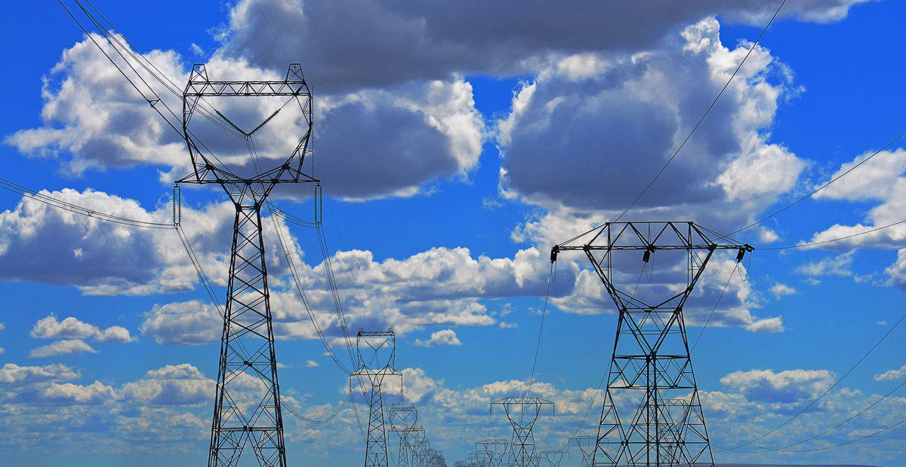

The intersection of bankruptcy, utility companies, and algorithmic trading presents a multifaceted challenge in today's financial landscape. Utility companies are vital components of modern society, providing essential services such as electricity, water, and gas. However, the financial pressures they face, compounded by external factors such as regulatory changes and climate-induced disasters, can propel them toward bankruptcy. Understanding the bankruptcy process for these companies offers valuable insights for investors, policymakers, and other stakeholders concerned with maintaining service continuity and financial stability.

This article explores the critical aspects of utility bankruptcy, addressing both its direct and indirect impacts on service provision. We examine how the bankruptcy process affects rate adjustments and stakeholder confidence while also considering the repercussions for pending lawsuits and financial penalties. In scenarios where utilities face bankruptcy, algorithmic trading emerges as a powerful tool for managing financial risks. By leveraging automated systems to predict market movements and manage liquidity, investors can navigate the uncertainties that accompany bankruptcy announcements and regulatory actions.



The implications of utility bankruptcies extend beyond financial markets, affecting consumers and regulators as well. The continuity of essential services remains a paramount concern, necessitating a balance between legal mandates and economic realities. Finally, we will spotlight potential solutions and emerging trends, including policy reforms and infrastructure investments, aimed at mitigating the challenges of utility bankruptcy. By emphasizing sustainability and resilience, future strategies can help secure reliable utility services amidst evolving circumstances.

## Table of Contents

## Understanding Utility Bankruptcy

Utility companies hold a crucial role as providers of essential services such as electricity, water, and natural gas. Despite their importance, they are not immune to financial distress and can encounter significant challenges that lead to bankruptcy. Unlike many other types of businesses, utility companies operate under a complex web of regulations. These regulations can result in conflicts between bankruptcy courts, which are tasked with reorganizing or liquidating companies in financial distress, and state regulators, who are focused on ensuring the continuous provision of essential services to the public.

The Bankruptcy Reform Act of 1978 is a pivotal piece of legislation that outlines the process for managing bankruptcies in the United States, including those of utility companies. This Act provides the framework for how bankruptcy cases are handled, encompassing the reorganization of financially troubled utility companies while balancing the need to maintain uninterrupted service to consumers. The framework established by this Act seeks to harmonize the often-competing interests of stakeholders, including creditors and service recipients.

Various factors can contribute to the financial instability of utility companies. Economic conditions, such as recessions or fluctuations in fuel prices, can negatively affect their financial health. Additionally, natural disasters, which are becoming more frequent and severe due to climate change, pose a significant threat to utility infrastructure. These disasters can result in massive liabilities due to damages and the consequent repair and compensation costs.

A prominent example of a utility bankruptcy driven by liabilities related to climate-induced events is the 2019 bankruptcy of Pacific Gas & Electric (PG&E). PG&E, a major utility company in California, faced overwhelming financial burdens from legal claims linked to devastating wildfires allegedly caused by its equipment. These events highlighted the vulnerability of utility companies to the increasing impacts of climate change, necessitating a reevaluation of risk management and operational strategies. 

In summary, understanding utility bankruptcy involves recognizing the unique regulatory environment in which these companies operate and the diverse factors contributing to their financial challenges. As the impacts of climate change continue to intensify, utility companies face mounting pressures to adapt their business models to maintain financial and operational sustainability.

## Impact of Bankruptcy on Utility Services

When a utility company files for bankruptcy, it raises concerns about the uninterrupted delivery of essential services such as electricity, gas, and water to consumers. Despite the financial distress, U.S. laws, specifically under the Bankruptcy Code, mandate that utilities must continue providing these vital services. This requirement ensures that consumers remain unaffected in terms of service availability, but it introduces complexities around rate adjustments and future investments.

During bankruptcy proceedings, rate adjustments become a contentious issue. Utilities typically rely on regulatory approval to adjust rates, which might include increasing charges to cover additional operating costs or to fund necessary infrastructure improvements. The bankruptcy process can stall these adjustments as it involves navigating between the obligations to creditors and the need for regulatory compliance. Consequently, regulators often face pressure to balance consumer protections and the financial viability of the utility, potentially leading to delayed or denied rate increases.

The financial instability of a utility in bankruptcy can also undermine stakeholder confidence, affecting both investors and customers. This loss of confidence may manifest as increased borrowing costs due to a higher perceived risk, which, in turn, can lead to higher utility rates for consumers as the company attempts to cover elevated financial overheads. Moreover, potential service disruptions, while less common, can occur if financial constraints hinder the utility's ability to maintain or replace critical infrastructure.

Litigation and financial penalties represent additional challenges in utility bankruptcies. In cases like the 2019 bankruptcy of Pacific Gas & Electric (PG&E), the utility was faced with substantial liabilities due to lawsuits from wildfire damages, which were exacerbated by climate change effects. Such liabilities complicate the reorganization process in bankruptcy and may require substantial settlements or financial penalties. These costs can further strain the utility's financial health and its capacity to invest in necessary infrastructure or service improvements, thereby impacting long-term service reliability and affordability for consumers.

## Role of Algorithmic Trading in Managing Financial Risks

Algorithmic trading has become an essential tool in the financial management landscape, particularly when dealing with the complexities associated with utility bankruptcies. These automated trading systems leverage advanced algorithms and computational power to rapidly process vast amounts of market data, enabling investors to adapt their strategies based on real-time financial and regulatory information.

One primary benefit of [algorithmic trading](/wiki/algorithmic-trading) in this context is its ability to manage financial risks inherent in utility bankruptcies. When a utility company declares bankruptcy, it typically results in market [volatility](/wiki/volatility-trading-strategies) and uncertainty. Automated systems can quickly evaluate these risk factors by analyzing historical data patterns, market trends, and external events, allowing investors to make informed decisions on how to adjust their portfolios.

Algorithms may incorporate various technical indicators and [machine learning](/wiki/machine-learning) models to anticipate market movements surrounding bankruptcy filings and related announcements. For instance, they can parse news releases and regulatory updates to detect sentiment or predict how such news might affect stock prices and market dynamics. Here's an example of how sentiment analysis might be implemented using Python libraries like `TextBlob`:

```python
from textblob import TextBlob

def analyze_sentiment(text):
    analysis = TextBlob(text)
    return analysis.sentiment.polarity

market_news = "The utility company's bankruptcy filing may lead to disruptions in services."
sentiment_score = analyze_sentiment(market_news)

if sentiment_score < 0:
    print("Negative sentiment detected, consider risk-averse strategies.")
```

Additionally, algorithmic systems play a crucial role in maintaining market [liquidity](/wiki/liquidity-risk-premium) and stability. During periods of financial uncertainty, such as those following a bankruptcy announcement, these systems can execute trades with precision and speed that human traders cannot match. By ensuring continuous buying and selling, they help to stabilize utility stock prices, preventing extreme fluctuations that could otherwise cause panic among investors.

The adaptability of these algorithms is also notable. As new data emerges, whether from evolving market conditions or subsequent regulatory actions, algorithmic trading platforms can recalibrate to optimize investment strategies. Their ability to perform [backtesting](/wiki/backtesting) allows investors to simulate different scenarios and potential outcomes based on historical data, offering a strategic advantage in preparing for future events.

In conclusion, algorithmic trading systems provide a significant advantage in managing the financial risks associated with utility bankruptcies. Through the rapid analysis of risk factors and market conditions, these systems enhance decision-making capabilities, improve market liquidity, and contribute to overall financial stability in uncertain times. As technology continues to evolve, the efficiency and accuracy of algorithmic trading are likely to improve, further solidifying its role in financial risk management within the utility sector.

## Proposed Solutions and Future Directions

Solutions to the challenges posed by utility bankruptcies incorporate a comprehensive blend of policy reforms, financial mechanisms, and technological innovations aimed at safeguarding both consumers and the financial health of utility companies.

One effective strategy in mitigating financial risks is the establishment of specialized funds. The California Wildfire Fund stands as a pertinent example. This fund was created to address the severe financial liabilities that utilities face due to climate-induced wildfires, especially in regions where such natural disasters are prevalent. Its purpose is to provide a financial cushion for utility companies, thus helping to stabilize their operations and protect consumer interests by ensuring the continued delivery of essential services.

On a broader scale, federal infrastructure bills play a critical role in enhancing the resilience of utility companies. By channeling investments into clean and renewable energy, such legislation not only aims to reduce the environmental impacts that exacerbate utility liabilities but also supports the transition to a more sustainable energy model. This proactive approach aids in decreasing dependency on older, more vulnerable energy infrastructure, thereby reducing the risk of future bankruptcies stemming from climate-related damage.

Technological advancements, particularly in algorithm-driven strategies, offer additional avenues for optimizing utility operations. By leveraging algorithms, utility companies can enhance predictive maintenance, optimize load distribution, and minimize operational risks. These strategies contribute to improved financial health by reducing unexpected outages and maintenance costs. The use of algorithms can also facilitate better risk assessment and decision-making, allowing utilities to adopt more dynamic pricing models and improve overall efficiency in energy distribution.

Further innovations in climate resilience and digital technology are poised to reshape the financial stability of utility companies. Continued research and development in areas such as advanced grid systems, decentralized energy resources, and smart metering technologies could provide utilities with the tools needed to adapt to changing environmental conditions and consumption patterns. Adopting such technologies can lead to more robust and adaptable utility networks capable of withstanding economic and environmental challenges.

In conclusion, addressing the complexities of utility bankruptcies requires a multifaceted approach that integrates policy reforms, financial safeguards, and advanced technologies. By focusing on these areas, stakeholders can help ensure the long-term sustainability and reliability of utility services in the face of ongoing environmental and financial pressures.

## Conclusion

Utility bankruptcies pose significant challenges, but they also open doors for innovation in financial management and policy-making. The intersection of climate change, financial instability, and regulatory dynamics necessitates a nuanced approach that taps into diverse strategies to maintain and enhance utility services. Leveraging algorithmic trading alongside strategic investments will play a crucial role in navigating future bankruptcies. Algorithmic trading can assist investors and utility managers in rapidly assessing risks and optimizing investment strategies by analyzing real-time data and market conditions. For example, the use of predictive algorithms can help identify potential liabilities and market shifts following significant regulatory or environmental changes.

As climate change continues to create unpredictable impacts on the utility sector, a multifaceted approach involving regulation, technology, and finance becomes essential. Regulatory frameworks must adapt to support sustainable practices while ensuring financial stability. Technology, particularly advances in big data analytics and machine learning, can provide the tools needed to predict and mitigate risks associated with climate-induced disruptions.

Long-term solutions must prioritize sustainability and resilience, focusing on innovations that ensure reliable utility services. For instance, investments in clean energy infrastructure and climate-resilient technologies can reduce the susceptibility of utilities to climate-related bankruptcies. These investments, in conjunction with adaptive regulatory measures and financial strategies, will be pivotal in addressing the dual challenges of financial viability and environmental sustainability.

Future trends are likely to lean towards more integrated systems for predictive risk management in the utility sector. By fostering collaboration between technological advancements, regulatory frameworks, and financial practices, the utility industry can enhance its capacity for resilience and sustainability. The adoption of integrated, predictive systems offers the potential for a more proactive approach to managing risks, ultimately contributing to the stability and reliability of essential services amid evolving challenges.

## References & Further Reading

[1]: Boritz, J. E., & Kennedy, D. B. (1995). ["Effectiveness of Neural Network Types for Prediction of Business Failure."](https://www.sciencedirect.com/science/article/pii/0957417495000208) Expert Systems with Applications.

[2]: Twomey, P., & Cadman, R. (2002). ["Energy Utilities and Financial Markets: The Major Trading and Risk Management Issues."](https://faculty.sites.iastate.edu/tesfatsi/archive/tesfatsi/ACERetailCustomerModeling.pdf) Utilities Policy.

[3]: Loomis, C. J. (2019). ["How PG&E Ignored Risks – and Sought a Bailout."](https://agupubs.onlinelibrary.wiley.com/doi/full/10.1029/2019GL082929) Fortune.

[4]: Fox, C. A., & Villar, E. (2019). ["The Bankruptcy Evolution and the Way Forward."](https://onlinelibrary.wiley.com/doi/full/10.1002/ece3.4898) BankruptcyData.

[5]: Kothari, V., & Firoozi, F. (2020). ["Algorithmic Trading: The Playbook for Utility Bankruptcy Risk Management."](https://scholar.google.com/citations?user=3PEw3okAAAAJ&hl=en) Securities.io.