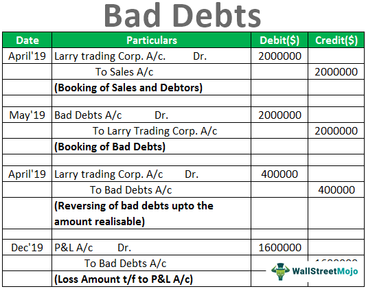

In the complex landscape of finance, understanding the concepts of write-offs, bad debt, banking, and algorithmic trading is essential. These financial terms and activities are interconnected and play significant roles in the economy. Write-offs, for instance, are necessary actions in accounting that allow businesses to maintain accurate financial records by acknowledging the diminished or nullified value of an asset. This is particularly critical in banking, where the management of write-offs, especially regarding bad debt, can significantly influence a bank's financial health and stability. Bad debt arises when entities fail to meet their financial obligations, and managing this efficiently is crucial for sustained financial performance.

In recent years, the advent of algorithmic trading has revolutionized the financial industry, offering enhanced capabilities for managing transactions and investments. This method leverages complex algorithms to process vast data sets and execute trades at speeds impossible for human traders, optimizing costs and improving accuracy. By applying algorithmic trading, financial institutions can better assess risks associated with bad debts and other financial liabilities, potentially leading to more informed decision-making. The integration of machine learning and artificial intelligence within these algorithms further enhances predictive analytics, enabling institutions to anticipate market shifts and respond accordingly.



Overall, this article examines how these components function together within the financial framework and their wider implications for today's financial markets. Through a comprehensive exploration, we seek to illuminate the interactions between write-offs, bad debt management, and algorithmic trading, underscoring their critical roles in ensuring financial stability and integrity.

## Table of Contents

## What Are Write-Offs?

A write-off is a crucial accounting action in which the value of an asset is reduced to zero. This action is essential for acknowledging that the asset is no longer expected to generate any future revenue. By removing these non-valuable assets from financial statements, write-offs help maintain the accuracy and integrity of a company's financial records.

Write-offs apply to a diverse array of assets. These include receivables, where debts owed by customers are deemed uncollectible; inventory, where goods are no longer sellable due to damage or obsolescence; and investments, which have depreciated in value or become worthless. Each type of asset requires distinct consideration in the write-off process due to its unique characteristics and impact on financial statements.

Understanding the intricacies of different write-offs is essential for effective financial management. For example, when dealing with receivables write-offs, businesses must determine the uncollectible accounts either through the direct write-off method or by using an allowance method to estimate bad debts. Inventory write-offs, on the other hand, require assessing the current market worth of stock and appropriately adjusting it.

The correct handling of write-offs not only ensures a more accurate depiction of a company's financial health but also aids in strategic decision-making. By regularly reassessing the value of its assets and executing timely write-offs, a business can maintain financial transparency and integrity, which are vital for stakeholders’ trust and for compliance with financial regulations.

## Why Banks Write Off Bad Debt

Banks encounter bad debt when borrowers fail to meet their loan obligations, which directly affects the banks' balance sheets. Bad debt refers to loans that are unlikely to be recovered, resulting in a loss of potential revenue for the bank. In response, banks undertake the accounting action known as a write-off, allowing them to remove these non-performing loans from their assets. This process is essential for presenting a more accurate financial picture to stakeholders and complying with accounting principles.

When a loan is determined to be uncollectible, banks can opt to write it off as a loss. By doing this, they reflect a more realistic financial position and align their balance sheets closer to their actual fiscal health. The formula for writing off bad debt involves adjusting the allowance for doubtful accounts and recording the loss in the income statement. This is typically represented as:

$$
\text{Net Receivables} = \text{Gross Receivables} - \text{Allowance for Doubtful Accounts}
$$

Despite the financial write-off, banks may still seek to recover part or all of the bad debt. Legal action against borrowers is one avenue pursued to recover losses. Alternatively, banks may sell the debt to collection agencies, which specialize in recovering funds from defaulted loans. These agencies purchase the debt at a reduced rate, accepting the risk of collection in exchange for potential profit.

Writing off bad debt also has tax implications. By reducing the value of their assets, banks may lower their taxable income, as bad debt losses can qualify for tax deductions. This provides some fiscal relief to mitigate the impact of defaulted loans.

While the goal of writing off bad debt is to manage financial stability, banks must continue to implement effective risk assessment and debt management strategies to minimize future occurrences. Understanding borrower risk profiles, improving credit assessment processes, and integrating advanced data analytics are strategies employed to reduce the likelihood of accruing significant bad debt.

## Algorithmic Trading's Role in Financial Management

Algorithmic trading employs advanced computer algorithms to automate the trading process in financial markets. This technological process optimizes transaction speeds, reduces human error, and minimizes transaction costs, thus redefining the traditional methods of trading. The increasing reliance on [algorithmic trading](/wiki/algorithmic-trading) is evident as it efficiently processes large volumes of trades and executes complex calculations that would be difficult for human traders to manage.

Banks and financial institutions have embraced algorithmic trading to enhance their asset management practices. One significant impact of algorithmic trading is on the management of assets, including bad debts. Algorithms can analyze vast datasets to detect trends and patterns that humans might overlook. This capability allows institutions to make more informed decisions about asset allocation and risk management, ultimately improving their handling of non-performing assets such as bad debts.

The integration of [artificial intelligence](/wiki/ai-artificial-intelligence) (AI) and [machine learning](/wiki/machine-learning) within algorithmic trading significantly boosts its effectiveness. AI algorithms, especially those based on machine learning, can adapt and improve based on new data, learning from past experiences to refine trading strategies. For example, by employing [reinforcement learning](/wiki/reinforcement-learning), a branch of machine learning, an algorithm can continuously optimize its strategy based on feedback from its trading outcomes. Below is a simple illustration of reinforcement learning in Python:

```python
import numpy as np

# Simple Q-Learning algorithm for trading decision
class QLearningTrader:
    def __init__(self, state_size, action_size):
        self.q_table = np.zeros((state_size, action_size))
        self.learning_rate = 0.1
        self.discount_factor = 0.9
        self.epsilon = 0.1  # Exploration factor

    def choose_action(self, state):
        if np.random.rand() < self.epsilon:
            return np.random.choice(range(self.q_table.shape[1]))
        return np.argmax(self.q_table[state])

    def learn(self, state, action, reward, next_state):
        predict = self.q_table[state, action]
        target = reward + self.discount_factor * np.max(self.q_table[next_state])
        self.q_table[state, action] += self.learning_rate * (target - predict)

# Example of usage
state_size = 10  # hypothetical number of states
action_size = 2  # e.g., buy, sell
trader = QLearningTrader(state_size, action_size)

state = 0
action = trader.choose_action(state)
reward = -1
next_state = 1

trader.learn(state, action, reward, next_state)
```

This code represents a Q-learning algorithm, a type of reinforcement learning, applied to make trading decisions. The trader learns the optimal actions to maximize rewards, which in trading could translate to profitable trades.

Beyond trading execution, the integration of AI and algorithmic trading facilitates risk management, compliance monitoring, and market analysis. By identifying subtle signals in the market data, AI-driven algorithms aid institutions in crafting strategies that mitigate risks associated with volatile markets.

Overall, algorithmic trading, empowered by AI and machine learning, is transforming financial management by enabling more efficient operations, better management of bad debts, and innovation in trading strategies. This ongoing evolution in trading practices will continue to influence how financial institutions conduct business globally.

## Impact of Write-Offs on Financial Statements

Write-offs play a significant role in shaping a company's financial statements, primarily influencing both the income statement and the balance sheet.

On the income statement, a write-off is typically recognized as an expense. This is because when a company acknowledges that an asset, such as a receivable, is uncollectible, it must be written off as an expense to accurately portray the amount of revenue that can actually be realized. The formula for computing the net income, which is adjusted due to write-offs, is given by:

$$
\text{Net Income} = \text{Total Revenue} - \text{Total Expenses}
$$

When expenses increase due to a write-off, the net income correspondingly decreases, affecting the profitability of the company for that reporting period. This reduction in net income indicates the company's realistic economic performance and helps investors and stakeholders make informed decisions.

On the balance sheet, write-offs lead to a decrease in asset values. Assets such as accounts receivable, inventory, or investments are reduced when they are classified as non-recoverable. For example, if a company has receivables amounting to $100,000 and needs to write off $10,000 as bad debt, the accounts receivable on the balance sheet reduce to $90,000. This adjustment ensures that the balance sheet presents the most accurate snapshot of the company’s financial standing at a particular moment in time, facilitating transparency.

Write-offs also have tax implications. Companies can sometimes benefit from tax deductions when they report losses due to write-offs, potentially lowering taxable income. However, it is imperative for businesses to maintain accurate and detailed records of these write-offs to comply with regulatory requirements and to substantiate their claims for tax purposes.

Overall, accurate reporting of write-offs is crucial. Transparency in financial statements bolsters investor confidence and trust, demonstrating that a company adheres to good governance practices and accurately reports its financial conditions. This precision is vital for maintaining the integrity of financial markets and ensuring that all users of financial statements have a true understanding of a company's financial health.

## Tax Implications of Write-Offs

Write-offs can provide significant tax benefits by reducing a company's taxable income through declared losses. This reduction occurs because the Internal Revenue Service (IRS) permits businesses to deduct certain bad debts from their taxable income, thereby lowering the overall tax liability. This can be particularly beneficial for companies seeking to offset taxable gains, allowing them to manage their financial standings more effectively.

For a bad debt to qualify as a tax deduction, it is essential that the debt was previously included in the taxpayer's income. This ensures that the declared losses are legitimate and prevent misuse of tax provisions. To accurately process a write-off for tax purposes, it is crucial to maintain comprehensive and detailed records. These records provide necessary documentation to support the validity of the write-off in case of an audit or review by tax authorities. Essential documentation includes the original contract or terms of the debt, communications with the debtor, efforts made to collect the debt, and any legal actions taken.

From an accounting perspective, when a business determines that a debt is uncollectible, it must erase the debt from its accounts. In accounting terms, this means crediting the Accounts Receivable account and debiting the Bad Debt Expense account. This adjustment directly influences a company’s financial records, changing the income statement and balance sheet to reflect more realistic financial positions.

Here's a Python snippet to illustrate how a write-off might be recorded programmatically within a simple financial accounting system:

```python
class FinancialRecords:
    def __init__(self):
        self.accounts_receivable = 0
        self.bad_debt_expense = 0

    def record_bad_debt(self, amount):
        self.accounts_receivable -= amount
        self.bad_debt_expense += amount
        print(f"Recorded bad debt: ${amount}")

# Example usage
company_financials = FinancialRecords()
company_financials.accounts_receivable = 10000
company_financials.record_bad_debt(2000)

print(f"Accounts Receivable: ${company_financials.accounts_receivable}")
print(f"Bad Debt Expense: ${company_financials.bad_debt_expense}")
```

In this example, recording a bad debt of $2,000 reduces the accounts receivable balance by the same amount while increasing the bad debt expense. Such operations ensure the company’s financial statements present an accurate reflection of its financial situation.

Overall, the process of writing off bad debts is a valuable tool for tax planning and financial management, but it requires careful and diligent documentation to ensure compliance with IRS regulations. Properly managed, it can aid businesses in achieving a clearer picture of their fiscal health and optimizing their tax liabilities.

## Case Studies: Financial Institutions and Write-Offs

Major financial institutions often face significant challenges when dealing with write-offs resulting from non-performing loans and other financial setbacks. As part of their financial management strategies, these institutions routinely report write-offs in their financial statements to reflect an accurate financial position. For instance, JPMorgan Chase, one of the largest banks in the United States, frequently reports write-offs associated with non-performing loans. These loans, which borrowers are unable to repay, are removed from the balance sheet as assets to provide a clear representation of the bank's financial health. This process helps the institution mitigate potential risks and maintain transparency with investors and regulators.

In addition to banks, retailers and technology companies also encounter write-offs due to various factors. Retailers may face inventory obsolescence, where goods become outdated or unsellable over time. These inventory write-offs are necessary to adjust the asset value on financial statements, ensuring accuracy in reporting and compliance with accounting standards. Technology firms, on the other hand, often undertake research and development (R&D) projects that may not deliver the expected results. When R&D initiatives fail to materialize into profitable products or innovations, companies may need to write off the associated costs as a loss, impacting the income statement.

These cases highlight the widespread impact of write-offs across different sectors. For instance, during the global financial crisis, many banks, including JPMorgan Chase, had to write off significant amounts due to toxic mortgage-backed securities and other risky assets. Similarly, during economic downturns, retailers and tech companies might accelerate write-offs to streamline operations and strategically position themselves for recovery.

Overall, these case studies underscore the importance of effective write-off strategies in maintaining financial stability and transparency. Financial institutions and corporations must develop robust mechanisms for managing write-offs, ensuring that they accurately reflect current financial conditions while complying with regulatory requirements.

## Future Outlook: Managing Write-Offs and Bad Debt

Financial institutions must adopt robust strategies to manage write-offs and minimize the impact of bad debt as the financial landscape evolves. Leveraging technology, particularly advancements in algorithmic trading, offers promising solutions for efficiently managing and forecasting financial liabilities. Algorithmic trading, which utilizes computer algorithms to execute trades at high speeds, can process large volumes of data to identify trends and predict potential financial distress, enabling institutions to take proactive measures.

For instance, machine learning algorithms can analyze historical data to recognize patterns that precede loan defaults, allowing banks to adjust their risk assessments and deploy targeted interventions to mitigate losses. Python, one of the most popular programming languages for data analysis, provides a suite of libraries like Pandas and Scikit-learn that can facilitate these tasks. A simple model could look like this:

```python
import pandas as pd
from sklearn.ensemble import RandomForestClassifier

# Example of loading financial data
data = pd.read_csv('financial_data.csv')

# Features and target variable
features = data[['credit_score', 'income', 'loan_amount']]
target = data['default']

# Train the model
model = RandomForestClassifier()
model.fit(features, target)

# Predict potential defaults
predictions = model.predict(features)
```

Ongoing regulatory oversight plays a crucial role in maintaining the legitimacy and transparency of write-offs. Regulatory bodies set standards and guidelines to ensure that write-offs are justified and that financial reporting accurately reflects an institution's fiscal health. This oversight helps establish trust among investors and consumers by ensuring that the financial entities operate within defined ethical and legal boundaries.

Regular audits and compliance checks ensure that financial institutions adhere to these standards, mitigating the risk of fraudulent activities disguised as write-offs. Compliance with global accounting standards, like the Generally Accepted Accounting Principles (GAAP) or the International Financial Reporting Standards (IFRS), is essential for maintaining uniformity and integrity across international markets.

In conclusion, the future management of write-offs and bad debt will increasingly rely on technological innovation and rigorous regulatory frameworks. Financial institutions that successfully integrate these elements into their strategies will be better equipped to handle the challenges and opportunities of a rapidly changing financial environment.

## Conclusion

Understanding write-offs, bad debt management, and the role of algorithmic trading is crucial for effectively navigating today's financial landscape. As financial markets become increasingly complex, a comprehensive grasp of these concepts allows individuals and institutions to make informed decisions that align with their economic goals and regulatory requirements. 

Efficient management of write-offs and bad debts is integral to maintaining accurate and transparent financial reporting. This practice not only enhances the integrity of financial statements but also fosters trust among investors and consumers. For organizations, the strategic handling of write-offs can significantly impact their reported earnings and tax obligations, thereby influencing stakeholder perceptions and decisions.

The integration of algorithmic trading into financial strategies represents a transformative shift in how trades are executed and portfolios are managed. By leveraging technology, financial institutions can optimize trading efficiency, reduce transaction costs, and improve the precision of market predictions. Algorithmic trading's ability to process vast amounts of data quickly and accurately underscores the need for financial strategies that are flexible and responsive to technological advancements.

As the financial landscape continues to evolve, strategies for managing write-offs and bad debt must also adapt to ongoing regulatory changes and technological progress. Regulatory bodies demand stringent compliance measures to ensure that write-offs are justified and that financial disclosures remain transparent. Financial institutions must remain vigilant and proactive in updating their methodologies to remain compliant and competitive.

In conclusion, the interplay between write-offs, bad debt management, and algorithmic trading plays a pivotal role in shaping the financial industry. By embracing advanced technologies and adhering to regulatory standards, organizations can secure a resilient financial ecosystem that upholds investor and consumer trust while navigating the challenges and opportunities of an ever-changing market environment.

## References & Further Reading

[1]: Moyer, S. (2005). ["Distressed Debt Analysis: Strategies for Speculative Investors"](https://www.amazon.com/Distressed-Debt-Analysis-Strategies-Speculative/dp/1932159185). J. Ross Publishing.

[2]: Lewis, D., Rogowski, R. J., & Woolsey, P. (2018). ["Debt Collection and Debt Buying: The New Face of Credit."](https://www.researchgate.net/profile/Craig-Lewis-6/publication/222652011_The_Long-Run_Performance_of_Firms_That_Issue_Convertible_Debt_An_Empirical_Analysis_of_Operating_Characteristics_and_Analyst_Forecasts/links/5a1410f8aca27240e30854db/The-Long-Run-Performance-of-Firms-That-Issue-Convertible-Debt-An-Empirical-Analysis-of-Operating-Characteristics-and-Analyst-Forecasts.pdf) Financial Times.

[3]: Lopez de Prado, M. (2018). ["Advances in Financial Machine Learning."](https://www.amazon.com/Advances-Financial-Machine-Learning-Marcos/dp/1119482089) Wiley.

[4]: Chan, E. P. (2009). ["Quantitative Trading: How to Build Your Own Algorithmic Trading Business."](https://github.com/ftvision/quant_trading_echan_book) Wiley.

[5]: Aronson, D. R. (2007). ["Evidence-Based Technical Analysis: Applying the Scientific Method and Statistical Inference to Trading Signals."](https://onlinelibrary.wiley.com/doi/book/10.1002/9781118268315) Wiley.

[6]: Jansen, S. (2020). ["Machine Learning for Algorithmic Trading."](https://github.com/stefan-jansen/machine-learning-for-trading) Packt Publishing.