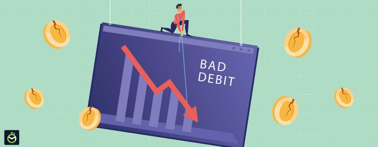

## Table of Contents

## What is a bank?

A bank is a place where people can keep their money safe. Instead of keeping money at home, people can put it in a bank account. The bank keeps the money secure and can help people manage it. When someone wants to use their money, they can take it out of the bank or use a card to spend it.

Banks also offer other services. They can help people borrow money if they need it, like for buying a house or a car. This is called a loan. Banks also help people save money for the future. They might pay people a little bit of money, called interest, for keeping their money in the bank. This encourages people to save more.

## What is bad debt?

Bad debt is money that you owe, but it's not helping you in a good way. It's like borrowing money to buy things that don't last long or don't help you earn more money. For example, if you use a credit card to buy a lot of clothes or eat out at restaurants, and you can't pay it back quickly, that's bad debt. These things don't keep their value and don't help you in the long run.

On the other hand, good debt is when you borrow money for something that can help you in the future. Like if you take a loan to go to school or to buy a house, that can be good debt. These things might cost a lot now, but they can help you earn more money or have a better life later. It's important to know the difference so you can make smart choices about borrowing money.

## Why do banks write off bad debts?

Banks write off bad debts because they don't think they will get the money back. When someone borrows money from a bank and can't pay it back, it becomes a bad debt. After trying to get the money for a long time, the bank might decide it's not worth trying anymore. Writing off the debt means the bank stops expecting to get that money. It's like saying, "We give up on this money."

Even though the bank writes off the debt, it doesn't mean the person who borrowed the money doesn't have to pay anymore. The bank can still try to get the money in other ways, like selling the debt to someone else. But for the bank's records, the debt is gone. This helps the bank to show a more accurate picture of how much money they really have. It's important for banks to do this so they can keep their [books](/wiki/algo-trading-books) clean and focus on other loans that might be paid back.

## How does a bank determine if a debt is bad?

A bank decides a debt is bad when it looks like the person who borrowed the money won't be able to pay it back. They look at things like how long it's been since the person made a payment. If it's been a long time, like many months, the bank might think the debt is bad. They also check if the person is having money problems, like losing a job or having other big bills to pay. If the person can't pay back the loan, the bank might start to think the debt is bad.

The bank also uses special ways to guess if a debt will be bad. They use numbers and rules to see how likely it is that someone will pay back their loan. If these numbers show a high chance that the person won't pay, the bank might call the debt bad. Once they decide a debt is bad, they might try to get the money back in other ways, but they also write it off on their books to show they don't expect to get that money anymore.

## What is the process of writing off bad debt?

When a bank decides a debt is bad, it starts the process of writing it off. This means the bank stops expecting to get that money back. They look at how long it's been since the person made a payment and if the person is having money problems. If it seems like the person won't be able to pay, the bank uses special numbers and rules to make sure. Once they are sure, they write off the debt on their books. This helps the bank show a true picture of how much money they really have.

Even after writing off the debt, the bank can still try to get the money back. They might sell the debt to someone else who will try to collect it. Or they might keep trying themselves. But for the bank's records, the debt is gone. This is important because it helps the bank focus on other loans that might be paid back. Writing off bad debt keeps the bank's books clean and helps them manage their money better.

## What are the financial implications for a bank when it writes off bad debt?

When a bank writes off bad debt, it means they are removing that debt from their books because they don't think they will get the money back. This makes their financial records more accurate. It shows how much money the bank really has. Writing off bad debt can make the bank's profits look smaller because they are losing money they thought they would get. This can affect how much money the bank can lend to other people or how much they can pay to their owners.

But writing off bad debt is not all bad for the bank. It helps them focus on loans that are more likely to be paid back. By getting rid of bad debts, the bank can use its resources better. They can spend more time and money helping people who can pay back their loans. Also, writing off bad debt can help the bank look better to people who might want to invest in it. If the bank's books are clean and show a true picture of their money, more people might trust them and want to do business with them.

## How does bad debt write-off affect a bank's financial statements?

When a bank writes off bad debt, it changes their financial statements. Writing off bad debt means the bank removes the debt from their books because they don't think they will get the money back. This makes the bank's financial records more accurate. On the income statement, writing off bad debt can make the bank's profits look smaller. This is because the bank is losing money they thought they would get. On the balance sheet, writing off bad debt reduces the bank's assets. This is because the loan they thought was an asset is now gone.

Even though writing off bad debt can make the bank's profits look smaller, it has some good effects too. It helps the bank focus on loans that are more likely to be paid back. By getting rid of bad debts, the bank can use its resources better. They can spend more time and money helping people who can pay back their loans. Also, writing off bad debt can make the bank look better to people who might want to invest in it. If the bank's books are clean and show a true picture of their money, more people might trust them and want to do business with them.

## What are the tax implications of bad debt write-offs for banks?

When a bank writes off bad debt, it can help them save money on taxes. Writing off bad debt means the bank can take the amount of the debt off their income. This makes their income look smaller, so they have to pay less in taxes. This is because the government lets businesses take off losses from their income when they calculate how much tax they owe. So, if a bank writes off a lot of bad debt, it can lower their tax bill.

But there are rules about when and how a bank can write off bad debt for taxes. The bank has to show that they really tried to get the money back and that it's clear the person who borrowed the money can't pay it back. They need to follow the tax laws carefully. If they don't, they might have to pay more taxes later or get in trouble with the tax office. So, even though writing off bad debt can help with taxes, banks need to make sure they do it the right way.

## How do regulatory bodies view bad debt write-offs?

Regulatory bodies, like government agencies that watch over banks, pay close attention to how banks handle bad debt write-offs. They want to make sure banks are being honest and following the rules when they write off debts. If banks write off too much bad debt or do it in a way that doesn't follow the rules, regulatory bodies might get worried. They could think the bank is trying to hide problems or make their financial statements look better than they really are.

To keep banks honest, regulatory bodies have rules about when and how banks can write off bad debt. They check the banks' records to see if they are following these rules. If a bank isn't doing things right, the regulatory body might make them fix it or even punish them. This helps make sure banks are managing their money well and not taking too many risks that could hurt their customers or the economy.

## What strategies can banks use to minimize bad debt?

Banks can use several strategies to minimize bad debt. One way is by being careful about who they lend money to. Before giving out a loan, banks check if the person can pay it back. They look at things like the person's job, how much money they make, and if they have paid back loans before. If it looks like the person might have trouble paying, the bank might not give them the loan or might give them a smaller amount. This helps keep bad debt low.

Another strategy is to help people pay back their loans. Banks can set up plans that make it easier for people to pay. For example, they might let people pay a little bit each month instead of a big amount all at once. Banks can also talk to people who are having trouble paying and try to find a way to help them. By working with their customers, banks can get more of their money back and have less bad debt.

## How do bad debt write-offs impact the economy?

When banks write off bad debt, it can affect the economy in different ways. If a lot of banks write off a lot of bad debt, it can make them more careful about giving out new loans. They might think it's too risky to lend money, so they lend less. When banks lend less, it can slow down the economy because businesses and people can't borrow money to buy things or start new projects. This can make the economy grow slower.

But writing off bad debt can also have some good effects on the economy. When banks write off bad debt, it makes their financial records more accurate. This helps them know how much money they really have and can lend. If banks are honest about their bad debts, it can make people trust them more. When people trust banks, they are more likely to save and borrow money, which can help the economy grow. So, while bad debt write-offs can slow things down, they can also help keep the economy healthy in the long run.

## What are the international accounting standards for bad debt write-offs?

International accounting standards for bad debt write-offs are set by the International Financial Reporting Standards (IFRS). These standards say that banks should write off bad debt when they don't think they will get the money back. Banks need to look at things like how long it's been since the person paid and if the person can really pay back the loan. If it's clear the money won't come back, the bank should take the debt off their books. This makes their financial records show a true picture of how much money they really have.

The IFRS also has rules about how banks should guess if a debt will be bad before they write it off. They use special numbers and rules to see how likely it is that someone will pay back their loan. If these numbers show a high chance the person won't pay, the bank can start to plan for the debt being bad. This helps the bank be ready and keep their books clean. Following these standards helps make sure banks all over the world are honest about their bad debts and manage their money well.

## Why do banks write off bad debt?

Banks encounter bad debt when borrowers fail to meet their loan obligations, which directly affects the banks' balance sheets. Bad debt refers to loans that are unlikely to be recovered, resulting in a loss of potential revenue for the bank. In response, banks undertake the accounting action known as a write-off, allowing them to remove these non-performing loans from their assets. This process is essential for presenting a more accurate financial picture to stakeholders and complying with accounting principles.

When a loan is determined to be uncollectible, banks can opt to write it off as a loss. By doing this, they reflect a more realistic financial position and align their balance sheets closer to their actual fiscal health. The formula for writing off bad debt involves adjusting the allowance for doubtful accounts and recording the loss in the income statement. This is typically represented as:

$$
\text{Net Receivables} = \text{Gross Receivables} - \text{Allowance for Doubtful Accounts}
$$

Despite the financial write-off, banks may still seek to recover part or all of the bad debt. Legal action against borrowers is one avenue pursued to recover losses. Alternatively, banks may sell the debt to collection agencies, which specialize in recovering funds from defaulted loans. These agencies purchase the debt at a reduced rate, accepting the risk of collection in exchange for potential profit.

Writing off bad debt also has tax implications. By reducing the value of their assets, banks may lower their taxable income, as bad debt losses can qualify for tax deductions. This provides some fiscal relief to mitigate the impact of defaulted loans.

While the goal of writing off bad debt is to manage financial stability, banks must continue to implement effective risk assessment and debt management strategies to minimize future occurrences. Understanding borrower risk profiles, improving credit assessment processes, and integrating advanced data analytics are strategies employed to reduce the likelihood of accruing significant bad debt.

## What is the impact of write-offs on financial statements?

Write-offs play a significant role in shaping a company's financial statements, primarily influencing both the income statement and the balance sheet.

On the income statement, a write-off is typically recognized as an expense. This is because when a company acknowledges that an asset, such as a receivable, is uncollectible, it must be written off as an expense to accurately portray the amount of revenue that can actually be realized. The formula for computing the net income, which is adjusted due to write-offs, is given by:

$$
\text{Net Income} = \text{Total Revenue} - \text{Total Expenses}
$$

When expenses increase due to a write-off, the net income correspondingly decreases, affecting the profitability of the company for that reporting period. This reduction in net income indicates the company's realistic economic performance and helps investors and stakeholders make informed decisions.

On the balance sheet, write-offs lead to a decrease in asset values. Assets such as accounts receivable, inventory, or investments are reduced when they are classified as non-recoverable. For example, if a company has receivables amounting to $100,000 and needs to write off $10,000 as bad debt, the accounts receivable on the balance sheet reduce to $90,000. This adjustment ensures that the balance sheet presents the most accurate snapshot of the company’s financial standing at a particular moment in time, facilitating transparency.

Write-offs also have tax implications. Companies can sometimes benefit from tax deductions when they report losses due to write-offs, potentially lowering taxable income. However, it is imperative for businesses to maintain accurate and detailed records of these write-offs to comply with regulatory requirements and to substantiate their claims for tax purposes.

Overall, accurate reporting of write-offs is crucial. Transparency in financial statements bolsters investor confidence and trust, demonstrating that a company adheres to good governance practices and accurately reports its financial conditions. This precision is vital for maintaining the integrity of financial markets and ensuring that all users of financial statements have a true understanding of a company's financial health.

## References & Further Reading

[1]: Moyer, S. (2005). ["Distressed Debt Analysis: Strategies for Speculative Investors"](https://www.amazon.com/Distressed-Debt-Analysis-Strategies-Speculative/dp/1932159185). J. Ross Publishing.

[2]: Lewis, D., Rogowski, R. J., & Woolsey, P. (2018). ["Debt Collection and Debt Buying: The New Face of Credit."](https://www.researchgate.net/profile/Craig-Lewis-6/publication/222652011_The_Long-Run_Performance_of_Firms_That_Issue_Convertible_Debt_An_Empirical_Analysis_of_Operating_Characteristics_and_Analyst_Forecasts/links/5a1410f8aca27240e30854db/The-Long-Run-Performance-of-Firms-That-Issue-Convertible-Debt-An-Empirical-Analysis-of-Operating-Characteristics-and-Analyst-Forecasts.pdf) Financial Times.

[3]: Lopez de Prado, M. (2018). ["Advances in Financial Machine Learning."](https://www.amazon.com/Advances-Financial-Machine-Learning-Marcos/dp/1119482089) Wiley.

[4]: Chan, E. P. (2009). ["Quantitative Trading: How to Build Your Own Algorithmic Trading Business."](https://github.com/ftvision/quant_trading_echan_book) Wiley.

[5]: Aronson, D. R. (2007). ["Evidence-Based Technical Analysis: Applying the Scientific Method and Statistical Inference to Trading Signals."](https://onlinelibrary.wiley.com/doi/book/10.1002/9781118268315) Wiley.

[6]: Jansen, S. (2020). ["Machine Learning for Algorithmic Trading."](https://github.com/stefan-jansen/machine-learning-for-trading) Packt Publishing.