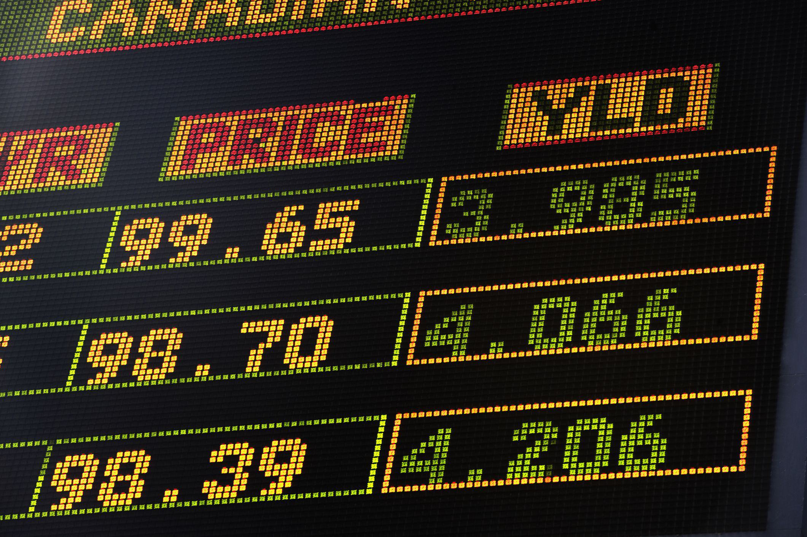

## Table of Contents

## What is the BanxQuote Money Markets Index?

The BanxQuote Money Markets Index is a tool that helps people understand how much interest they can earn from money market accounts. Money market accounts are special types of savings accounts that usually offer higher interest rates than regular savings accounts. The index looks at the interest rates from many different banks and then calculates an average rate. This average rate is useful for people who want to compare different money market accounts and find the best one for their savings.

The BanxQuote Money Markets Index is updated regularly to make sure it reflects the current interest rates. This is important because interest rates can change over time due to economic conditions. By keeping the index up to date, it helps people make informed decisions about where to put their money. The index is widely used by financial advisors and individual savers who want to keep track of the best rates available in the market.

## How is the BanxQuote Money Markets Index calculated?

The BanxQuote Money Markets Index is calculated by looking at the interest rates offered by many different banks on their money market accounts. First, they collect the interest rates from a large number of banks across the country. Then, they take all these rates and find an average. This average rate becomes the BanxQuote Money Markets Index. The index is designed to give a good picture of what interest rates are like for money market accounts at that time.

The calculation is done regularly to make sure the index stays current. Interest rates can go up or down because of changes in the economy, so the index needs to be updated often. By keeping the index fresh, it helps people see the latest trends in money market account rates. This way, savers can make better choices about where to keep their money to earn the best possible interest.

## What types of financial instruments are included in the BanxQuote Money Markets Index?

The BanxQuote Money Markets Index focuses on money market accounts. These are special savings accounts that usually offer better interest rates than regular savings accounts. The index looks at the interest rates that many different banks offer for their money market accounts. By doing this, it helps people see what kind of interest they can earn on their savings.

The index does not include other types of financial instruments like stocks, bonds, or mutual funds. It is all about money market accounts. This helps people who want to compare different money market accounts and find the best one for their savings. The index is updated regularly to make sure it shows the most current interest rates available.

## Who uses the BanxQuote Money Markets Index and for what purposes?

The BanxQuote Money Markets Index is used by people who want to save money and earn interest. It helps them compare different money market accounts from various banks. By looking at the index, savers can see what the average interest rate is and decide where to put their money to get the best return. This is useful for anyone who wants to make their savings grow a bit faster than in a regular savings account.

Financial advisors also use the BanxQuote Money Markets Index. They help their clients find the best places to save money. By keeping an eye on the index, advisors can give good advice about which money market accounts are offering the best rates at any given time. This helps their clients make smart choices about where to keep their savings to earn more interest.

## How often is the BanxQuote Money Markets Index updated?

The BanxQuote Money Markets Index is updated every week. This means that once a week, they look at all the interest rates from different banks and calculate the new average rate.

By updating the index weekly, it helps people see the most recent changes in money market account rates. This is important because interest rates can change often, and people want to know the latest rates to make the best choices for their savings.

## What is the historical performance of the BanxQuote Money Markets Index?

The BanxQuote Money Markets Index has shown ups and downs over the years. It follows the general trends of interest rates in the economy. When the economy is doing well, interest rates might go up, and so does the index. But when the economy is not doing so well, interest rates can go down, and the index goes down too. For example, during times of low interest rates, like in the years after the 2008 financial crisis, the index was lower because banks were offering less interest on money market accounts.

Over the long term, the BanxQuote Money Markets Index has been a good way to see how money market account rates are changing. It helps people understand what kind of interest they can expect to earn on their savings. By looking at the historical data, you can see that the index moves with economic cycles. When the economy grows, the index tends to be higher, and when there are economic downturns, the index tends to be lower. This makes it a useful tool for anyone trying to make smart decisions about where to save their money.

## How does the BanxQuote Money Markets Index compare to other money market indices?

The BanxQuote Money Markets Index is one of several indices that track money market account rates. It is similar to other indices like the Crane Money Fund Average, which looks at the average yield of money market mutual funds, and the Federal Reserve's H.6 Money Stock Measures, which includes data on money market deposit accounts. The BanxQuote Index focuses specifically on money market accounts from banks and updates weekly, which makes it very timely for savers looking to compare rates.

Compared to other indices, the BanxQuote Money Markets Index is unique because it only looks at money market accounts and not other types of financial instruments. This makes it a specialized tool for people who want to understand the interest rates on these specific accounts. Other indices might give a broader view of the money market or include different types of savings vehicles, but the BanxQuote Index provides a focused snapshot of money market account rates, which can be very helpful for individual savers and financial advisors.

## What are the key factors that influence changes in the BanxQuote Money Markets Index?

The BanxQuote Money Markets Index changes mainly because of the overall economy and what the Federal Reserve does. When the economy is doing well, banks might offer higher interest rates to attract more savings, which makes the index go up. But if the economy is not doing so well, banks might lower their rates, and the index goes down. The Federal Reserve also plays a big role because they set the basic interest rate that banks use. If the Fed raises this rate, banks usually raise their money market account rates too, and the index goes up. If the Fed lowers their rate, banks follow suit, and the index goes down.

Another thing that can affect the BanxQuote Money Markets Index is how much competition there is between banks. When banks are trying hard to get more customers, they might offer higher interest rates on their money market accounts. This competition can push the index up. On the other hand, if banks are not competing as much, they might not feel the need to offer high rates, and the index could stay the same or go down. So, the index is influenced by a mix of economic conditions, actions by the Federal Reserve, and how banks compete with each other.

## Can the BanxQuote Money Markets Index be used as a benchmark for investment performance?

The BanxQuote Money Markets Index can be used as a benchmark for investment performance, but it is best for comparing money market accounts. It shows the average interest rate that banks offer for these accounts. So, if you want to see how well your money market account is doing compared to others, this index is a good tool. It helps you understand if you are getting a good interest rate or if you should look for a better one.

However, the BanxQuote Money Markets Index is not a good benchmark for other types of investments like stocks, bonds, or mutual funds. Those investments can have much higher or lower returns and are affected by different factors. The index only looks at money market accounts, so it is not useful for comparing the performance of other investments. If you are looking at a broader range of investments, you would need a different benchmark that includes those types of financial instruments.

## What are the limitations or criticisms of the BanxQuote Money Markets Index?

The BanxQuote Money Markets Index has some limitations. One big one is that it only looks at money market accounts from banks. This means it doesn't tell you anything about other types of savings or investments like stocks or bonds. So, if you want to compare your money market account to other kinds of investments, this index won't help you. Also, the index is just an average of interest rates, so it might not show you the best or worst rates out there. If you are looking for the highest interest rate, you might need to check other sources too.

Another criticism is that the BanxQuote Money Markets Index updates every week. While this is good for staying current, some people might want even more up-to-date information. Interest rates can change quickly, and a week might be too long for some savers who need to make fast decisions. Also, the index does not tell you about the fees or other terms that come with money market accounts. So, while it gives you a good idea of interest rates, it does not give you the full picture of what it's like to have a money market account at different banks.

## How can investors access data on the BanxQuote Money Markets Index?

Investors can access data on the BanxQuote Money Markets Index through various financial websites and platforms that track money market account rates. Some popular financial news websites and investment analysis tools might have sections where they display the latest updates on the BanxQuote Index. Additionally, financial advisors often have access to this data and can share it with their clients.

Another way to get the BanxQuote Money Markets Index data is by subscribing to financial data services that provide regular updates on money market indices. These services might offer detailed reports and charts that show how the index has changed over time. By using these resources, investors can stay informed about the current interest rates on money market accounts and make better decisions about where to save their money.

## What advanced analytical techniques can be applied to forecast movements in the BanxQuote Money Markets Index?

To forecast movements in the BanxQuote Money Markets Index, one useful technique is time series analysis. This method looks at past data to find patterns and trends. By studying how the index has moved over time, analysts can make predictions about where it might go next. They use things like moving averages and seasonal adjustments to see if there are regular ups and downs. This helps them guess if the index will go up or down in the future. Another part of time series analysis is looking at how the index reacts to economic events, like changes in the Federal Reserve's interest rates.

Another technique is regression analysis. This involves looking at how different factors, like the overall economy or the Federal Reserve's actions, affect the index. By building a model that includes these factors, analysts can predict how changes in these factors might move the index. For example, if the Federal Reserve raises interest rates, the model can show how much the BanxQuote Money Markets Index might go up. This helps investors and savers understand what might happen to their money market accounts and plan accordingly.

## References & Further Reading

[1]: Bergstra, J., Bardenet, R., Bengio, Y., & Kégl, B. (2011). ["Algorithms for Hyper-Parameter Optimization."](https://papers.nips.cc/paper/4443-algorithms-for-hyper-parameter-optimization) Advances in Neural Information Processing Systems 24.

[2]: ["Advances in Financial Machine Learning"](https://www.amazon.com/Advances-Financial-Machine-Learning-Marcos/dp/1119482089) by Marcos Lopez de Prado

[3]: ["Evidence-Based Technical Analysis: Applying the Scientific Method and Statistical Inference to Trading Signals"](https://www.amazon.com/Evidence-Based-Technical-Analysis-Scientific-Statistical/dp/0470008741) by David Aronson

[4]: ["Machine Learning for Algorithmic Trading"](https://github.com/stefan-jansen/machine-learning-for-trading) by Stefan Jansen

[5]: ["Quantitative Trading: How to Build Your Own Algorithmic Trading Business"](https://www.amazon.com/Quantitative-Trading-Build-Algorithmic-Business/dp/1119800064) by Ernest P. Chan