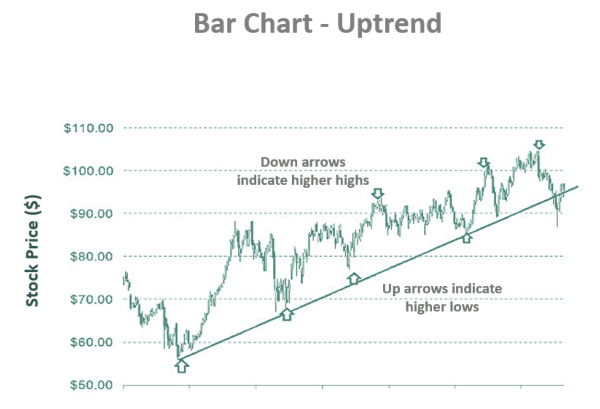

## Table of Contents

## What is a bar chart and what is its primary purpose?

A bar chart is a type of graph that uses rectangular bars to show data. The length or height of each bar represents the value of the data it shows. Bar charts can be drawn either vertically or horizontally. They are very useful for comparing different groups of data or showing changes over time.

The primary purpose of a bar chart is to make it easy to see and understand data at a glance. By using bars of different lengths, people can quickly compare the sizes of different data sets. For example, a bar chart can show how many students got different grades in a class, making it easy to see which grade was the most common. This helps people make decisions based on the data they see.

## How do you create a basic bar chart using a spreadsheet program like Excel?

To create a basic bar chart in Excel, start by entering your data into the spreadsheet. For example, if you want to compare the sales of different products, you can list the product names in one column and their sales numbers in another. Once your data is ready, select the cells that contain the data you want to chart. Then, go to the 'Insert' tab on the toolbar at the top of the screen. In the 'Charts' section, click on the 'Bar' or 'Column' chart icon, depending on whether you want a horizontal or vertical bar chart. Choose the basic bar chart style from the options that appear.

After you click on the chart style, Excel will automatically create a bar chart using your selected data. The chart will appear on your spreadsheet. You can click on the chart to customize it further. For example, you can change the chart title by clicking on it and typing a new one. You can also adjust the colors of the bars or add labels to make the chart easier to understand. If you need to change the data in the chart, you can right-click on the chart and select 'Select Data' to modify what is shown.

## What are the different types of bar charts and when should each be used?

There are several types of bar charts, including vertical bar charts, horizontal bar charts, grouped bar charts, and stacked bar charts. Vertical bar charts, also called column charts, show data using vertical bars. They are good for showing changes over time, like monthly sales. Horizontal bar charts use horizontal bars and are useful when you have long category names or when you want to compare many categories, like the population of different countries. Grouped bar charts show more than one set of data for each category, making it easy to compare different groups within each category, like sales of different products in different regions. Stacked bar charts also show more than one set of data, but the bars are divided into segments to show the parts of the whole, like the total sales of a product broken down by different types of customers.

Choosing the right type of bar chart depends on what you want to show with your data. If you want to show how something changes over time or compare a few categories, a vertical bar chart is a good choice. If you have long labels or many categories to compare, a horizontal bar chart works better. When you need to compare different groups within each category, like comparing sales of different products in different regions, a grouped bar chart is the best option. If you want to show how different parts make up a whole, like showing the different types of customers that make up total sales, a stacked bar chart is the way to go.

## How can you effectively choose the right scale and axis labels for a bar chart?

Choosing the right scale and axis labels for a bar chart is important to make sure your chart is easy to read and understand. The scale on the axis should start at zero and go up in equal steps. This helps people see the differences between the bars clearly. If the numbers you are showing are very big or very small, you might need to use a different scale, like thousands or millions, to make the chart easier to read. Make sure the steps on the scale are not too big or too small, so the chart looks balanced and the differences between the bars are clear.

The labels on the axis should be clear and easy to read. The labels on the bottom axis, or x-axis, should describe what each bar represents, like the names of products or months. The labels on the left axis, or y-axis, should show the numbers or values that the bars represent. Make sure the labels are not too long or too short, and they should be easy to understand. If you have a lot of bars, you might need to rotate the labels or make them smaller so they fit on the chart. Using clear and simple labels helps people understand your chart quickly and easily.

## What are common mistakes to avoid when designing a bar chart?

When designing a bar chart, it's important to avoid common mistakes that can make the chart hard to read or misleading. One big mistake is not starting the y-axis at zero. If the y-axis doesn't start at zero, the bars can look longer or shorter than they really are, which can make the data look different from what it really is. Another mistake is using too many colors or patterns. Too many different colors or patterns can make the chart confusing and hard to understand. It's better to use a few simple colors that are easy to tell apart.

Another common mistake is making the bars too thin or too close together. If the bars are too thin or too close, it can be hard to see the differences between them. It's better to make the bars a bit wider and leave some space between them so people can see the differences clearly. Also, avoid using 3D effects or other fancy designs that can make the chart hard to read. Stick to simple designs that show the data clearly. By avoiding these mistakes, you can make a bar chart that is easy to understand and shows the data accurately.

## How do you interpret the data presented in a bar chart?

Interpreting data in a bar chart is easy once you know what to look for. Each bar in the chart represents a different category or group, and the length or height of the bar shows the value of that category. For example, if you have a bar chart showing the number of students who got different grades, each bar would represent a different grade, like A, B, C, and so on. The taller the bar, the more students got that grade. By looking at the bars, you can quickly see which categories have the highest or lowest values.

You can also compare the bars to see how different categories relate to each other. If one bar is much taller than the others, it means that category has a much higher value. If the bars are about the same height, it means the values are similar. For example, if you're looking at a bar chart of monthly sales, you can see which months had the highest or lowest sales by comparing the heights of the bars. This helps you understand trends or patterns in the data, like if sales go up in certain months or if one product sells better than others.

## Can you explain how to use bar charts for comparing multiple data sets?

Bar charts are great for comparing multiple data sets. You can use a grouped bar chart to show different sets of data for each category. For example, if you want to compare the sales of different products in different regions, you can have one group of bars for each product. Each bar in the group would show the sales in a different region. This way, you can easily see how the sales of each product compare across regions. The different colors or patterns on the bars help you tell the regions apart.

Another way to compare multiple data sets is with a stacked bar chart. This type of chart is good for showing how different parts make up a whole. For example, if you want to show the total sales of a product and how much of those sales come from different types of customers, you can use a stacked bar chart. Each bar would represent the total sales of the product, and the bar would be divided into segments showing the sales to different customer types. This helps you see not just the total sales, but also how the sales are split among different groups of customers.

## What advanced features can be added to bar charts to enhance data visualization?

Adding advanced features to bar charts can make them more interesting and easier to understand. One cool feature is adding data labels directly on the bars. This means you can see the exact number each bar represents without looking at the axis. Another useful feature is adding a trend line, which is a line that shows the general direction of the data. This can help you see if the data is going up, down, or staying the same over time. You can also add error bars to show how accurate the data is. These bars show the range of possible values, which can be helpful if the data is based on estimates or samples.

Another way to enhance bar charts is by using interactive features. For example, if you make your bar chart on a computer or online, you can add buttons or sliders that let people change what they see. They can click on a button to see data for different years or move a slider to see how the data changes over time. This makes the chart more fun to use and helps people explore the data in different ways. Also, you can add tooltips, which are little boxes that pop up when you hover over a bar. These tooltips can show more information about the data, like the exact value or a brief explanation, making the chart more informative.

## How do you ensure your bar chart is accessible to all audiences, including those with visual impairments?

Making your bar chart accessible to everyone, including people with visual impairments, is important. One way to do this is by adding text descriptions, called alt text, to your chart. Alt text is a short explanation of what the chart shows, and it can be read out loud by special computer programs that help people who can't see well. You can also use clear and simple labels on your chart. Make sure the labels are big enough and easy to read. Using different colors or patterns can help, but make sure to also add a key or legend that explains what each color or pattern means.

Another way to make your bar chart more accessible is by using high contrast colors. This means choosing colors that are very different from each other, like black and white, so they are easier to see. You can also add interactive features, like tooltips, that show more information when someone hovers over a bar. This can help people who need more details to understand the data. By thinking about these things, you can make sure your bar chart is easy for everyone to use and understand.

## What are some real-world examples where bar charts have been effectively used in data analysis?

Bar charts are often used in business to show sales data. For example, a company might use a bar chart to compare the sales of different products over a year. Each bar would show the sales for one month, and different colors could represent different products. This helps the company see which products sell the best in different months and plan their business strategies. By looking at the chart, they can decide to focus on the products that are doing well or find ways to boost sales of the ones that aren't.

In education, bar charts can help show how students are doing. A school might use a bar chart to show the number of students who got different grades on a test. Each bar would represent a different grade, like A, B, C, and so on. This makes it easy for teachers and parents to see which grades are most common and if students are doing well overall. It can also help the school see if they need to change how they teach certain subjects to help students improve.

## How can statistical tools be integrated with bar charts to provide deeper insights?

Statistical tools can make bar charts even more useful by adding more information and helping to find patterns in the data. For example, you can use statistical measures like averages and standard deviations to show more details on the chart. If you have a bar chart showing the sales of different products, you can add the average sales as a line on the chart. This helps you see if a product's sales are above or below average. You can also add error bars to show the range of possible values, which can help you understand how sure you can be about the data.

Another way to use statistical tools with bar charts is by doing tests to see if the differences between the bars are real or just by chance. For example, if you want to know if one product sells better than another, you can use a t-test to check if the difference in sales is big enough to be sure it's not just random. Adding this kind of statistical analysis to your bar chart can help you make better decisions based on the data. It's like having a detective tool that helps you find the real story behind the numbers.

## What are the latest trends in bar chart usage and design in data visualization?

Bar charts are still very popular in data visualization, but people are finding new ways to use them and make them look better. One big trend is making bar charts interactive. This means you can click on the bars or use sliders to see more details or different parts of the data. For example, you might click on a bar to see more information about that category, or move a slider to watch how the data changes over time. This makes the charts more fun to use and helps people understand the data better. Another trend is using storytelling with bar charts. This means making the chart part of a story, with titles and labels that explain what the data means and why it's important. This helps people connect with the data and remember the main points.

Design-wise, people are focusing on making bar charts look clean and easy to read. One way they do this is by using simple colors and clear labels. Instead of using many different colors, they might use shades of one color or just black and white. This makes the chart look neat and helps people focus on the data. Another design trend is adding more information to the chart without making it too busy. For example, they might add small lines or dots to show averages or trends, or use tooltips that pop up with more details when you hover over a bar. By keeping the design simple but adding these extra bits of information, bar charts can show more data in a way that's still easy to understand.

## References & Further Reading

[1]: Bergstra, J., Bardenet, R., Bengio, Y., & Kégl, B. (2011). ["Algorithms for Hyper-Parameter Optimization."](https://papers.nips.cc/paper/4443-algorithms-for-hyper-parameter-optimization) Advances in Neural Information Processing Systems 24.

[2]: ["Advances in Financial Machine Learning"](https://www.amazon.com/Advances-Financial-Machine-Learning-Marcos/dp/1119482089) by Marcos Lopez de Prado

[3]: ["Evidence-Based Technical Analysis: Applying the Scientific Method and Statistical Inference to Trading Signals"](https://www.amazon.com/Evidence-Based-Technical-Analysis-Scientific-Statistical/dp/0470008741) by David Aronson

[4]: ["Machine Learning for Algorithmic Trading"](https://github.com/stefan-jansen/machine-learning-for-trading) by Stefan Jansen

[5]: ["Quantitative Trading: How to Build Your Own Algorithmic Trading Business"](https://www.amazon.com/Quantitative-Trading-Build-Algorithmic-Business/dp/1119800064) by Ernest P. Chan