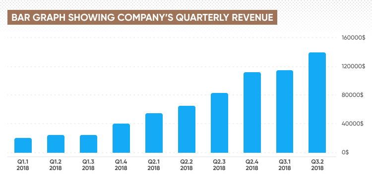

In today's fast-paced financial markets, data visualization is paramount in deciphering and leveraging market trends. Algorithmic trading, often referred to as algo trading, greatly depends on data-driven insights for the automatic execution of trades. Within this context, bar graph charts emerge as a vital tool, offering a clear and concise method to represent complex datasets. These visualizations are instrumental in distilling massive amounts of financial data into understandable formats, making them accessible to traders and algorithms alike.

Bar graphs play a significant role in transforming intricate datasets into straightforward visual representations, facilitating the recognition of patterns and trends. This capability is crucial for algorithmic trading, where rapid data analysis and decision-making are essential. The effectiveness of bar graphs lies in their simplicity, enabling traders and algorithms to quickly interpret data such as trading volumes, price movements, and historical performance metrics.



The synergy between data visualization and algorithmic trading extends beyond mere representation. Bar graphs aid in identifying critical market signals that can be embedded within trading algorithms. By applying these insights, algorithmic trading strategies can be refined and optimized, enhancing their predictive capabilities. As technology continues to advance, the importance of tools like bar graph charts in algo trading will only intensify, promising richer insights and greater precision for traders and their strategies.

## Table of Contents

## Understanding Bar Graphs in Data Visualization

A bar graph is a commonly used tool in data visualization that represents data with rectangular bars. These bars can have varying lengths or heights, making it easy to compare different values at a glance. Typically, each bar corresponds to a category, and the length or height of the bar represents the magnitude of the data item. 

Bar graphs can be oriented either vertically or horizontally, depending on the presentation needs of the data. Vertical bar graphs, also known as column charts, are generally used when there are more categories than data points within each category, whereas horizontal bar graphs are often preferred when the category names are long or when the emphasis is on comparison of magnitudes rather than individual data points. The orientation choice helps enhance readability and can aid in highlighting specific aspects of the data.

These graphs are excellent tools for comparing different datasets and identifying trends over time, an essential capability for traders who need to interpret market data efficiently. By plotting different datasets side by side, bar graphs can reveal changes in data values, allowing traders to spot trends quickly. Whether it involves analyzing price movements of stocks, volumes of trade across different assets, or historical performance over time, bar graphs provide a straightforward visual comparison.

Key features of bar graphs include the axes, where the x-axis typically represents the categories, and the y-axis represents the value scale. Data labels can be included to provide exact values for each bar, enhancing the graph's informational value. Bar grouping is another useful feature for comparative analysis; by clustering bars together, one can easily compare different datasets side by side.

The simplicity and clarity of bar graphs make them particularly popular in financial data analysis and presentation. Their clear structure allows for quick assimilation of complex information, helping analysts and traders make informed decisions based on visual evidence. The ability to display a wide range of data succinctly and understandably contributes to the enduring popularity of bar graphs in various domains, including finance, business analytics, and beyond.

## Bar Graphs in Algorithmic Trading

Algorithmic trading relies heavily on the robust analysis and visualization of data to efficiently execute trades. Bar graphs play a vital role in this process by providing a clear and accessible representation of key trading metrics. These visual tools are particularly useful for presenting trading volumes, price movements, and historical performance within [algorithmic trading](/wiki/algorithmic-trading) systems.

Bar graphs are instrumental in helping traders identify patterns and signals which can then be programmed into algorithms. For example, an algorithm might be set to buy or sell based on certain [volume](/wiki/volume-trading-strategy) thresholds which are easily visualized through bar graphs. These patterns underpin vital algorithmic strategies where real-time data processing is critical for success.

In addition to basic data visualization, bar graphs are effective in depicting technical indicators such as moving averages or the Moving Average Convergence Divergence (MACD). These indicators aid in decision-making by simplifying complex datasets into digestible visual information, allowing traders to quickly interpret market conditions. For instance, a moving average can be represented as a smooth curve overlaid on a bar graph, giving immediate context to price actions against previous trends.

The visual simplicity provided by bar graphs ensures that algorithmic strategies can be developed and tested efficiently. Complex data sets are broken down into clear, interpretable visuals, supporting the rapid development and iteration of trading algorithms. This graphical approach helps filter out noise and focuses on significant data points, thus enhancing the trader's ability to make informed, data-driven decisions. 

Programming environments such as Python’s libraries like Matplotlib or libraries in R can automatically generate bar graphs, thus optimizing the iterative process in developing and refining trading algorithms. For example, a Python snippet using Matplotlib for a bar graph might look like this:

```python
import matplotlib.pyplot as plt

# Sample data
dates = ['2021-10-01', '2021-10-02', '2021-10-03']
volumes = [1500, 3000, 2500]

# Plotting
plt.bar(dates, volumes)
plt.xlabel('Date')
plt.ylabel('Trading Volume')
plt.title('Daily Trading Volumes')
plt.show()
```

This kind of efficient data visualization tool is crucial for algorithmic traders who need to rapidly adapt to evolving market conditions and validate their strategies in a streamlined manner.

## Best Practices for Using Bar Graphs in Trading

When utilizing bar graphs in trading, selecting the right type is crucial based on the data you aim to represent. Vertical bar graphs are ideal for displaying categories that are time-related, while horizontal bar graphs better suit categorical data where space on the vertical axis is limited. Grouped bar graphs enable comparison across multiple datasets, and stacked bar graphs can highlight constituent parts of a whole, illustrating the composition of data over a period.

Maintaining consistent scales and intervals is essential for accurate data interpretation and comparison. Inconsistent scales can skew perceptions and lead to erroneous conclusions, particularly when comparing datasets over time. For instance, ensure that the interval between data points in a time series remains uniform or is clearly indicated if it changes. This consistency guarantees that the visualization precisely reflects the underlying data, aiding in more reliable analysis and decision-making.

Using colors effectively is another best practice. Colors should be used to differentiate between data categories or highlight key insights but avoid excessive color usage that can clutter the visual. A well-thought-out color palette can emphasize important data points and trends, such as employing shades to represent different levels of trading volume or price change intensities. Tools like colorbrewer2.org can provide effective color schemes suitable for data visualization.

The integration of bar graphs with other visual tools and indicators can significantly enhance trading strategy formulation. For example, bar graphs can serve as the foundational layer onto which other technical indicators, such as moving averages or Bollinger Bands, are superimposed. This multi-layered approach allows traders to gain deeper insights by observing multiple data dimensions concurrently, thus fostering comprehensive strategy development.

Regularly updating your graphical data ensures that your analysis reflects real-time market conditions, an essential practice in maintaining trading agility. Market conditions can shift rapidly; hence, using software or scripts to automate the refresh of data visualizations can keep the graphic information current. For instance, in Python, the `matplotlib` library can be used to update bar charts dynamically as new data becomes available, ensuring traders are consistently working with the most recent data inputs:

```python
import matplotlib.pyplot as plt
import numpy as np

# Example data
categories = ['Stock A', 'Stock B', 'Stock C']
values = [100, 200, 150]

# Create bar chart
fig, ax = plt.subplots()
bars = ax.bar(categories, values)

def update_data(new_values):
    for bar, new_value in zip(bars, new_values):
        bar.set_height(new_value)
    plt.draw()

# Update bar chart with new data
update_data([110, 220, 130])
plt.show()
```

By following these practices, traders can optimize their use of bar graphs to enhance their analytical capabilities and develop more robust trading strategies.

## Challenges and Considerations

While bar graphs offer significant visualization benefits in algorithmic trading, they can simultaneously pose challenges if not crafted with accuracy. A primary concern is the potential for misleading representations that could precipitate erroneous trading decisions. Ensuring that the design of bar graphs accurately reflects the underlying data is crucial. This involves careful consideration of axis scaling, proportionality, and the choice between different types of bar graphs like vertical, horizontal, stacked, or grouped.

Traders must remain vigilant about preserving the context of the data. Visual transitions can sometimes oversimplify complex datasets, stripping away nuances that might be critical for making informed decisions. It's vital that bar graphs are coupled with explanatory annotations or complementary datasets to maintain a comprehensive view of the data landscape.

Another consideration is the presence of market manipulation or anomalies, which can skew the patterns typically represented by bar graphs. Such distortions can lead algorithmic traders to make incorrect assumptions about market trends. Therefore, analysts should integrate robust statistical assessments to identify and mitigate the impact of any irregularities.

The integration of bar graphs with [artificial intelligence](/wiki/ai-artificial-intelligence) (AI) and [machine learning](/wiki/machine-learning) (ML) can enhance pattern recognition capabilities. By employing algorithms that analyze graph data, traders may discover hidden patterns or signals. Here is a simple Python code snippet illustrating how ML might be used to identify anomalies in bar graph data:

```python
import numpy as np
from sklearn.ensemble import IsolationForest

# Sample data representing trading volumes
data = np.array([[5], [7], [14], [10], [12], [6], [5], [100]])  # Note the outlier

# Train Isolation Forest
clf = IsolationForest(contamination=0.1)
anomalies = clf.fit_predict(data)

print("Anomalies detected at indices: ", np.where(anomalies == -1)[0])
```

The commitment to continuous learning and adaptation is indispensable due to the dynamic nature of financial markets and the rapid evolution of visualization technologies. Traders should be proactive in embracing new tools and methodologies that improve data interpretation and decision-making processes. Participating in educational opportunities, workshops, and professional forums can ensure that traders remain at the forefront of technological advancements in data visualization. This adaptability not only enhances current trading strategies but also prepares traders for future shifts in trading technology and practices.

## Conclusion

Bar graph charts serve as an indispensable tool for algorithmic traders by providing clarity in the often overwhelming landscape of financial data. These visual aids simplify complex datasets, allowing traders to make informed, data-driven decisions with greater confidence and precision. By effectively utilizing bar graphs, traders can enhance the efficiency and success of their algorithmic trading strategies. Bar graphs play a key role in analyzing trading volumes, price movements, and other critical metrics, presenting them in a way that is both accessible and informative.

As technological advancements continue to evolve, the application of data visualization in trading is expected to expand further. This progress promises to yield richer insights and more precise analysis, enabling traders to refine their strategies continuously. The integration of artificial intelligence and machine learning with traditional visualization techniques could further augment the capabilities of bar graphs, offering advanced pattern recognition and deeper market analysis.

In conclusion, traders should fully embrace bar graphs as a central component of their data analysis and strategy development processes. By doing so, they can capitalize on the multitude of insights these tools offer, driving more effective and strategic trading decisions. As the trading landscape evolves, the role of bar graphs in simplifying and visualizing data will undoubtedly grow, providing traders with invaluable resources for navigating market complexities.

## References & Further Reading

[1]: Bergstra, J., Bardenet, R., Bengio, Y., & Kégl, B. (2011). ["Algorithms for Hyper-Parameter Optimization."](https://papers.nips.cc/paper/4443-algorithms-for-hyper-parameter-optimization) Advances in Neural Information Processing Systems 24.

[2]: ["Advances in Financial Machine Learning"](https://www.amazon.com/Advances-Financial-Machine-Learning-Marcos/dp/1119482089) by Marcos Lopez de Prado

[3]: ["Evidence-Based Technical Analysis: Applying the Scientific Method and Statistical Inference to Trading Signals"](https://www.amazon.com/Evidence-Based-Technical-Analysis-Scientific-Statistical/dp/0470008741) by David Aronson

[4]: ["Machine Learning for Algorithmic Trading"](https://github.com/stefan-jansen/machine-learning-for-trading) by Stefan Jansen

[5]: ["Quantitative Trading: How to Build Your Own Algorithmic Trading Business"](https://www.amazon.com/Quantitative-Trading-Build-Algorithmic-Business/dp/1119800064) by Ernest P. Chan