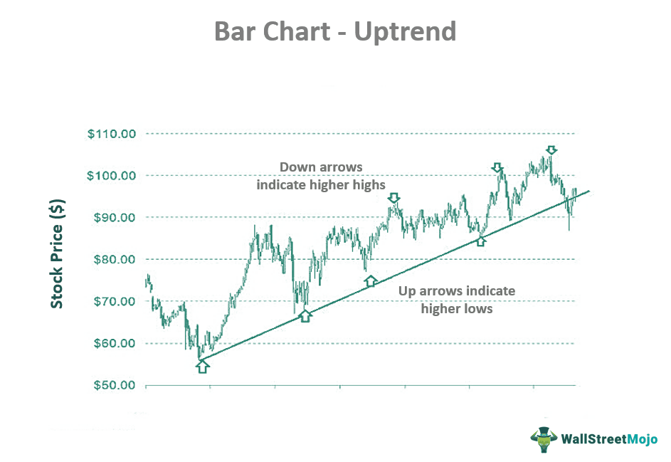

## Table of Contents

## What is a bar in trading?

A bar in trading is a way to show what happens to a stock or other thing you can trade over a certain time. It's like a picture that tells you the highest price, the lowest price, the price at the start, and the price at the end of that time. This time could be a minute, an hour, a day, or even longer.

People use these bars to understand how the price is moving. If you see a lot of bars going up, it might mean the price is getting higher over time. If the bars are going down, the price might be getting lower. Traders look at these bars to decide when to buy or sell.

## What are the basic types of bars used in trading?

In trading, there are a few basic types of bars that people use to look at price movements. The first one is called a candlestick. A candlestick bar shows you four important pieces of information: the opening price, the closing price, the highest price, and the lowest price during a certain time. If the closing price is higher than the opening price, the candlestick usually looks like a filled-in rectangle, which traders call a "bullish" candlestick. If the closing price is lower than the opening price, the rectangle is often empty or a different color, and this is called a "bearish" candlestick.

Another common type of bar is the OHLC (Open, High, Low, Close) bar. This bar also shows the same four pieces of information as a candlestick but in a different way. It looks like a vertical line with two small horizontal lines sticking out on the sides. The vertical line shows the range from the highest price to the lowest price. The small line on the left side shows the opening price, and the small line on the right side shows the closing price. Traders use OHLC bars to quickly see how prices have changed over time.

There's also a simpler type of bar called a line chart. A line chart doesn't show as much detail as candlesticks or OHLC bars. It just connects the closing prices of each time period with a line. This type of chart is easier to read and can help traders see overall trends without getting into the details of each bar. While line charts are not as detailed, they are useful for getting a quick look at how prices are moving over time.

## How does a candlestick bar differ from a standard bar?

A candlestick bar and a standard bar, often called an OHLC (Open, High, Low, Close) bar, both show the same four pieces of information: the opening price, the highest price, the lowest price, and the closing price during a certain time. The main difference is in how they show this information. A candlestick bar uses a thick body to show the difference between the opening and closing prices. If the closing price is higher than the opening price, the body is usually filled in or a different color, showing a bullish trend. If the closing price is lower than the opening price, the body is often empty or another color, indicating a bearish trend. Thin lines, called wicks or shadows, extend from the top and bottom of the body to show the highest and lowest prices.

On the other hand, a standard OHLC bar uses a vertical line to show the range from the highest to the lowest price. Small horizontal lines, called ticks, stick out from the left and right sides of this vertical line. The tick on the left shows the opening price, and the tick on the right shows the closing price. Unlike candlestick bars, OHLC bars do not use color or shading to indicate whether the price went up or down; they simply use the position of the ticks to show this. Both types of bars help traders understand price movements, but candlestick bars are often easier to read at a glance because of their visual cues.

## What information does a bar provide to traders?

A bar in trading shows important information about how the price of something, like a stock, changed over a certain time. It tells traders the highest price, the lowest price, the price at the start, and the price at the end of that time. This time could be as short as a minute or as long as a day. By looking at these bars, traders can see if the price went up or down, and by how much. This helps them decide if it might be a good time to buy or sell.

Traders use these bars to spot patterns and trends. For example, if they see many bars going up, it might mean the price is getting higher over time. If the bars are going down, the price might be getting lower. These patterns can help traders guess what might happen next with the price. By understanding these bars, traders can make better choices about when to trade and how to manage their money.

## How can beginners use bar types to analyze market trends?

Beginners can use bar types like candlesticks and OHLC bars to see how prices move over time. These bars show the highest price, the lowest price, the opening price, and the closing price during a certain time. By looking at these bars, beginners can see if the price is going up or down. For example, if a candlestick has a filled-in body, it means the price went up from the start to the end of that time. If it's empty or a different color, the price went down. This helps beginners understand if the market is going up (bullish) or down (bearish).

To analyze market trends, beginners should look at a series of bars over time. If they see many bars going up, it could mean the market is in an uptrend. If many bars are going down, it might be in a downtrend. Beginners can also watch for patterns, like when bars make higher highs and higher lows, showing the price is getting stronger. Or, if the bars make lower highs and lower lows, it might mean the price is getting weaker. By paying attention to these simple patterns, beginners can start to predict what might happen next in the market and make better trading decisions.

## What are the advantages of using Heikin-Ashi bars over traditional bars?

Heikin-Ashi bars can make it easier for beginners to see trends in the market. They smooth out the price changes, so the chart looks less jumpy than traditional bars. This means it's easier to spot if the market is going up or down. With Heikin-Ashi bars, a series of empty or white bars means the market is in an uptrend, and a series of filled or red bars shows a downtrend. This can help beginners make better guesses about what might happen next with the price.

Another advantage of Heikin-Ashi bars is that they help reduce false signals. Traditional bars can sometimes trick traders into thinking the market is changing direction when it's not. Heikin-Ashi bars are less likely to do this because they use average prices to create the bars. This makes them more reliable for spotting real changes in the market. By using Heikin-Ashi bars, beginners can feel more confident about their trading decisions and avoid getting confused by short-term price changes that don't really matter.

## How do range bars help in trading, and how are they constructed?

Range bars help traders by showing price movements in a way that focuses on how much the price changes, not on time. Each range bar is made when the price moves by a certain amount that the trader decides on. This means that range bars can help traders see clear trends and patterns without the noise of small price changes that happen over time. By using range bars, traders can get a better idea of when the market might be going up or down and make decisions based on how the price is moving, not just when it's moving.

Range bars are constructed based on price movement, not time. To make a new range bar, the price has to move up or down by a set amount that the trader picks. For example, if a trader sets the range to $1, a new bar will start when the price moves $1 in either direction from the last bar's closing price. If the price keeps moving in the same direction, the bar keeps getting longer until the price changes direction by the set amount. This way, range bars help traders see the market's direction more clearly and can be useful for spotting good times to buy or sell.

## What are Renko bars, and how do they assist in smoothing price action?

Renko bars are a type of chart that helps traders see price movements more clearly. They are made when the price moves by a certain amount that the trader decides on. If the price goes up by that amount, a new brick is added above the last one. If the price goes down by that amount, a new brick is added below the last one. This means that Renko charts don't show every little price change, but only the bigger moves.

Renko bars help smooth out price action by getting rid of small, unimportant price changes. This makes it easier for traders to see the overall trend of the market. If you see a lot of bricks going up, it means the price is going up over time. If you see a lot of bricks going down, the price is going down. By using Renko bars, traders can focus on the big picture and make better decisions about when to buy or sell.

## How can volume bars enhance trading strategies?

Volume bars help traders see how many people are buying and selling at different times. They show the amount of trading that happens during a certain time, like a day or an hour. If a [volume](/wiki/volume-trading-strategy) bar is tall, it means a lot of trading happened, which can tell traders that something important might be happening with the price. For example, if the price goes up and the volume bar is tall, it might mean more people want to buy, which could push the price even higher.

Traders can use volume bars to make better trading decisions. They can look for times when the volume is high to find good times to buy or sell. For instance, if the price is going up and the volume is also going up, it might be a good time to buy because many people are interested. On the other hand, if the price is going down with high volume, it might be a good time to sell because a lot of people are selling. By watching volume bars, traders can get a better idea of what other people are doing and make smarter choices about their own trades.

## What advanced techniques can be applied using Point and Figure bars?

Point and Figure bars help traders see big changes in prices without getting distracted by small ups and downs. They are made by marking an 'X' when the price goes up by a certain amount, and an 'O' when the price goes down by that amount. This way, traders can see clear patterns and trends. One advanced technique is to use these charts to find support and resistance levels. These are prices where the market often stops going up or down. By looking at where the 'X' and 'O' columns change direction, traders can guess where these levels might be and use them to decide when to buy or sell.

Another technique is to use Point and Figure charts to find price targets. Traders can do this by counting the number of 'X' or 'O' in a column and then using that number to predict how far the price might go in the future. For example, if a column of 'X' has 10 boxes, traders might think the price could go up by the same amount again. This helps traders set goals for their trades and manage their money better. By using these techniques, traders can make more informed decisions and improve their chances of making good trades.

## How do different bar types impact trading decisions during high volatility?

During high [volatility](/wiki/volatility-trading-strategies), when prices are moving a lot, different bar types can help traders see what's happening in the market in different ways. Candlestick bars can show traders if the price is going up or down quickly because they use colors to show if the price ended higher or lower than it started. This can help traders decide if it's a good time to buy or sell. For example, if they see a lot of green or filled-in candlesticks, it might mean the price is going up fast, and they might want to buy. If they see a lot of red or empty candlesticks, the price might be going down fast, and they might want to sell.

Range bars and Renko bars can be really helpful during high volatility because they focus on big price moves and ignore small ones. This means traders can see the main direction the price is going without getting confused by all the ups and downs. If the price is moving a lot, range bars will show new bars only when the price moves by a big amount, helping traders see if the price is going up or down overall. Renko bars do the same thing by adding new bricks only when the price moves by a set amount, making it easier to spot trends and make decisions about buying or selling during wild market times.

## What are the best practices for combining multiple bar types for expert-level analysis?

Combining multiple bar types can help traders see the market in different ways and make better trading decisions. For example, using candlestick bars together with range bars can give traders a clear picture of both short-term price movements and longer-term trends. Candlestick bars show the opening, high, low, and closing prices in a way that's easy to read, while range bars focus on bigger price moves and ignore small changes. By looking at both types of bars, traders can see if the price is going up or down in the short term and also spot bigger trends that might last longer. This can help traders decide when to buy or sell based on both quick changes and overall market direction.

Another good practice is to use volume bars along with other bar types like Renko or Point and Figure bars. Volume bars show how many people are trading at different times, which can tell traders if a price move is important or not. If a big price move happens with a tall volume bar, it might mean more people are interested, and the move could keep going. Renko bars and Point and Figure bars help traders see the main direction of the price without getting distracted by small ups and downs. By combining these with volume bars, traders can understand both the trend and the strength of the market, helping them make smarter choices about when to trade.

## References & Further Reading

[1]: Bergstra, J., Bardenet, R., Bengio, Y., & Kégl, B. (2011). ["Algorithms for Hyper-Parameter Optimization."](https://dl.acm.org/doi/10.5555/2986459.2986743) Advances in Neural Information Processing Systems 24.

[2]: ["Advances in Financial Machine Learning"](https://www.amazon.com/Advances-Financial-Machine-Learning-Marcos/dp/1119482089) by Marcos Lopez de Prado

[3]: ["Evidence-Based Technical Analysis: Applying the Scientific Method and Statistical Inference to Trading Signals"](https://www.amazon.com/Evidence-Based-Technical-Analysis-Scientific-Statistical/dp/0470008741) by David Aronson

[4]: ["Machine Learning for Algorithmic Trading"](https://github.com/stefan-jansen/machine-learning-for-trading) by Stefan Jansen

[5]: ["Quantitative Trading: How to Build Your Own Algorithmic Trading Business"](https://books.google.com/books/about/Quantitative_Trading.html?id=j70yEAAAQBAJ) by Ernest P. Chan