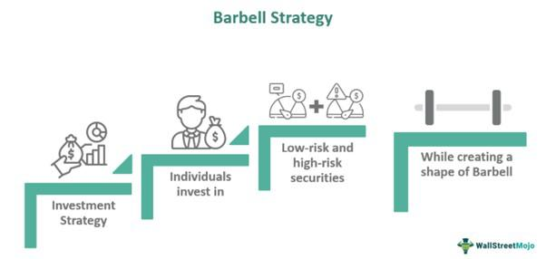

Understanding investment strategies is essential for investors aiming to optimize their portfolios and achieve their financial objectives. Among such strategies, the Barbell Strategy stands out as a distinctive approach that harmonizes the potential for high returns with the mitigation of risk. This method involves a calculated distribution of investments that eschews middle-risk assets in favor of both high-risk and low-risk securities, thereby establishing a balanced portfolio with diversified risk exposure.

By dedicating investment capital towards both extremes of the risk spectrum, investors aim to capture the potential for significant gains from high-risk assets while maintaining stability through low-risk assets. This dual-focused allocation strategy is visually reminiscent of a weightlifting barbell, with heavy weights placed at each end and lightness at the center, engendering its moniker, the Barbell Strategy.



Potential applications of the Barbell Strategy are diverse and can be particularly advantageous in navigating volatile markets. This article investigates into the structure and implementation of the Barbell Strategy across various asset classes, from fixed-income securities to equities, and examines its effectiveness within algorithmic trading. By evaluating the benefits and limitations inherent in this strategic approach, the article aims to equip investors with the insights necessary to judge its suitability for their individual risk tolerance and investment goals.

## Table of Contents

## What is the Barbell Strategy?

The Barbell Strategy is an investment approach that involves allocating assets at two extremes of the risk spectrum: high-risk and low-risk securities, while avoiding medium-risk investments. This strategy aims to balance potential returns and risk mitigation by emphasizing investments with divergent risk profiles. By doing so, it seeks to capitalize on high-return opportunities while maintaining the safety and stability of low-risk assets.

The name "Barbell" is derived from the visual analogy of a weightlifting barbell, where the ends of the barbell are the high and low-risk investments, and the middle, representing medium-risk investments, is largely avoided. This structural distribution reflects an intentional choice to exploit potential gains from volatile assets, such as growth stocks or high-yield bonds, while simultaneously holding stable assets, such as government bonds or cash equivalents, to cushion against market volatility.

The fundamental idea of the Barbell Strategy rests on two main principles:

1. **Risk Dispersion**: By avoiding medium-risk investments, which typically offer neither the safety of low-risk investments nor the high potential returns of high-risk investments, investors can allocate resources more efficiently. The strategy relies on the concept that medium-risk investments might not sufficiently compensate for the risk they carry, thus focusing on the extremes could yield a more optimal risk/return profile.

2. **Dynamic Allocation**: The Barbell Strategy allows investors to adjust their weightings between high-risk and low-risk assets in response to market conditions. For instance, in a bullish market, the proportion of high-risk investment might be increased, whereas, in a bearish market, low-risk investments could be favored to preserve capital.

Employing a Barbell Strategy involves a clear understanding of the assets held at each end of the risk spectrum. This strategic allocation requires active management to ensure that the portfolio aligns with current market conditions and the investor’s risk tolerance. The contrast between the two investment types is meant to create a diversified portfolio capable of achieving significant returns while maintaining a degree of safety through the less volatile portion of the investments.

## Applications in Fixed Income

The Barbell Strategy, when applied to fixed income investments, involves a strategic allocation between short-term and long-term bonds, deliberately bypassing medium-term securities. This distinctive configuration supports investors in navigating [interest rate](/wiki/interest-rate-trading-strategies) fluctuations effectively.

Short-term bonds are an essential component of this strategy due to their [liquidity](/wiki/liquidity-risk-premium) and flexibility. Typically, these bonds mature in one to three years, enabling investors to frequently reassess and adjust their portfolios without committing capital for extensive periods. This feature allows for rapid responses to changing market conditions and provides a financial buffer for unforeseen liquidity needs.

In contrast, long-term bonds, which generally mature in ten to thirty years, offer higher yields. The appeal of these bonds lies in their ability to provide stable and predictable cash flows, making them appealing during periods of low interest rates when yields are compressed. Additionally, locking in attractive yields can prove beneficial during declining interest rate environments.

The barbell structure capitalizes on interest rate cycles. In environments characterized by rising interest rates, the short-term holdings within the strategy can be rolled over at higher yields. Conversely, during periods of declining rates, the long-term bonds locked in at higher rates protect the portfolio from income erosion.

The implementation of a barbell strategy can be illustrated using basic financial principles. Assume an investor allocates $100,000 with $50,000 in short-term bonds at an annual yield of 2% and $50,000 in long-term bonds at an annual yield of 5%. The expected annual interest can be calculated as follows:

$$
\text{Annual Interest} = (50,000 \times 0.02) + (50,000 \times 0.05) = 1,000 + 2,500 = 3,500
$$

By allocating funds at the polar ends of the maturity spectrum, investors balance the immediacy of liquidity (short-term bonds) with the income stability from long-term bonds. This synergy enhances the portfolio's adaptability to interest rate movements while aiming to optimize overall returns.

## Equity Barbell Strategy

The Barbell Strategy, while traditionally associated with fixed income investments, finds application in equities by strategically balancing defensive and high-[growth stocks](/wiki/growth-stocks) within an investment portfolio. This methodology seeks to achieve a harmony between stability and growth, thereby allowing investors to enjoy the potential gains from high-risk investments while maintaining a core of safety through defensive holdings.

In an Equity Barbell Strategy, an investor typically allocates a segment of their portfolio to blue-chip stocks. Blue-chip companies are large, well-established firms with a history of reliable performance, known for their stability and ability to withstand economic downturns. Examples include corporations like Johnson & Johnson, Procter & Gamble, and Microsoft. These investments typically provide consistent dividends and exhibit lower [volatility](/wiki/volatility-trading-strategies), serving as the 'defensive' component in the strategy.

On the other end of the barbell, the investor allocates a portion of their funds to high-growth sectors. Such sectors may include technology, biotechnology, or any area experiencing rapid innovation and expansion. Stocks in these sectors can be more volatile, reflecting higher risk, but they also offer significant upside potential. Companies like Tesla, Netflix, or emerging tech startups might be included at this end of the strategy.

This bifurcation allows investors to benefit from the high returns associated with rapidly growing companies while mitigating risk through more conservative, stable investments. The success of this strategy hinges on the investor's ability to dynamically balance the portfolio and respond to market fluctuations.

During periods of market instability, the defensive stocks help preserve capital and provide a steady income stream, reducing the portfolio's overall volatility. Contrarily, during bullish market conditions, the high-growth stocks can significantly enhance returns.

The key to the Equity Barbell Strategy is maintaining the discipline to regularly review and adjust the portfolio according to market conditions and personal risk tolerance. By consistently rebalancing the allocations, an investor can ensure that the portfolio remains aligned with their strategic objectives, leveraging both stability and growth for optimal financial outcomes.

## The Role of Algorithmic Trading

Algorithmic trading significantly enhances the implementation efficiency of the Barbell Strategy, which inherently requires a dynamic balance between high-risk and low-risk investments. By leveraging automated systems, traders can effectively manage these extremes, ensuring that the intended proportions of risk and return are consistently maintained over time without manual intervention.

Trading algorithms can be meticulously programmed to monitor market conditions and execute trades that align with the Barbell Strategy's principles. For instance, algorithms can be set to automatically adjust the weightings of high-risk and low-risk assets in response to market volatility or predefined financial metrics. Here is a simple Python example using a basic asset allocation algorithm:

```python
class BarbellPortfolio:
    def __init__(self, high_risk_assets, low_risk_assets):
        self.high_risk_assets = high_risk_assets
        self.low_risk_assets = low_risk_assets
        self.portfolio = {'high_risk': [], 'low_risk': []}

    def allocate_assets(self, allocation_ratio):
        high_risk_amount = allocation_ratio * len(self.high_risk_assets)
        low_risk_amount = (1 - allocation_ratio) * len(self.low_risk_assets)

        self.portfolio['high_risk'] = self.high_risk_assets[:int(high_risk_amount)]
        self.portfolio['low_risk'] = self.low_risk_assets[:int(low_risk_amount)]

    def balance_portfolio(self, market_data):
        for asset in self.portfolio['high_risk']:
            if market_data[asset]['risk_level'] > threshold:
                # Shift to low-risk or rebalance
                self.portfolio['high_risk'].remove(asset)
                self.portfolio['low_risk'].append(asset)

# Example usage
high_risk_assets = ['stock_A', 'stock_B', 'stock_C']
low_risk_assets = ['bond_X', 'bond_Y', 'bond_Z']
market_data = {'stock_A': {'risk_level': 0.8}, 'stock_B': {'risk_level': 0.5},
               'stock_C': {'risk_level': 0.9}, 'bond_X': {'risk_level': 0.1},
               'bond_Y': {'risk_level': 0.2}, 'bond_Z': {'risk_level': 0.1}}
threshold = 0.7

portfolio = BarbellPortfolio(high_risk_assets, low_risk_assets)
portfolio.allocate_assets(allocation_ratio=0.5)
portfolio.balance_portfolio(market_data)
```

This example illustrates a rudimentary framework for managing a barbell portfolio through an algorithm, with adjustments based on predetermined risk levels.

Moreover, [algorithmic trading](/wiki/algorithmic-trading) provides several additional advantages, such as the ability to execute trades at speeds unattainable by human traders. This speed and automation allow investors to swiftly capitalize on short-lived market opportunities, thereby optimizing returns. The algorithms can be enhanced with [machine learning](/wiki/machine-learning) techniques to improve decision-making processes and adapt to emerging market patterns, further refining the Barbell Strategy's execution.

The primary advantage of integrating algorithmic trading with the Barbell Strategy lies in real-time portfolio optimization. This capability ensures that the dual objectives of capturing high returns and maintaining portfolio stability are efficiently achieved in continuously evolving markets. As a result, investors can remain confident that their portfolios are consistently aligned with their risk tolerance and financial objectives without the need for constant manual adjustments.

## Benefits and Drawbacks

The Barbell Strategy offers various benefits by reducing interest rate risk and providing diversification across an investment portfolio. By investing in both low-risk and high-risk securities, the strategy allows for a comprehensive risk management approach that can be tailored to align with the investor's preferences and the prevailing market conditions. The presence of low-risk investments, such as short-term bonds or blue-chip stocks, provides stability and reduces the volatility inherent in high-risk assets. This bifurcation enables investors to potentially benefit from asymmetric risk-return profiles, where the upside of high-risk investments is pursued without exposing the entire portfolio to excessive uncertainty.

However, the Barbell Strategy is not without its drawbacks. Its implementation requires active management to continuously evaluate and rebalance the portfolio, ensuring that the risk distribution aligns with the strategy’s objectives over time. This ongoing oversight demands resources, such as time and analytical tools, which can be a constraint for some investors. Additionally, by focusing primarily on the extremes—low-risk and high-risk investments—the strategy might overlook opportunities presented by medium-risk investments. These middle-ground assets could potentially offer favorable risk-adjusted returns, thus presenting an opportunity cost for investors who may not fully capitalize on this segment of the market.

In summary, while the Barbell Strategy offers robust mechanisms for managing risk and enhancing diversification, it is essential for investors to be cognizant of its associated demands and limitations. Careful consideration must be given to whether the strategy's biases align with one's investment philosophy and ability to manage it effectively.

## Real-World Examples

Numerous asset managers and hedge funds integrate the Barbell Strategy into their investment frameworks to manage and benefit from market volatility. This strategy is particularly favored for its robustness in times of uncertainty, as it combines low-risk and high-risk investments, thereby providing a unique balance of stability and growth opportunities.

A prominent advocate of the Barbell Strategy is Nassim Nicholas Taleb, a statistician and former trader renowned for his work on risk and unpredictability. Taleb emphasizes preparing for "black swan" events, which are extreme and unpredictable market occurrences. He recommends allocating a substantial portion of an investment portfolio to extremely safe assets, such as Treasury bills, and a smaller portion to highly speculative bets. The rationale behind this allocation is to protect the significant bulk of one's holdings from major losses while still having exposure to potentially massive gains from high-risk investments. Taleb's approach underscores the importance of having a safety net while remaining open to high-reward opportunities that may arise unexpectedly.

Moreover, the Barbell Strategy's flexibility allows it to incorporate alternative investments, such as commodities. By including assets like gold and oil, investors can further diversify their portfolios, reducing overall risk while aiming for high returns in market segments with considerable growth potential. Commodities often serve as hedges against inflation and currency fluctuations, adding an extra layer of security to the barbell framework.

Hedge funds frequently employ algorithmic trading to automate and optimize the Barbell Strategy. By leveraging advanced algorithms, these funds can quickly adjust their asset allocations in response to market changes, maintaining the desired balance between safety and risk-taking. This real-time adjustment is crucial in volatile markets, where the speed of decision-making significantly impacts returns.

In essence, the Barbell Strategy is a versatile tool used by savvy investors to navigate complex and uncertain financial environments. Its adaptability to include various asset classes and the capability to withstand market shocks make it a preferred choice for those looking to optimize their investment outcomes amidst unpredictability.

## Conclusion

The Barbell Strategy offers investors a robust framework to balance risks and rewards effectively through its unique focus on both high-risk and low-risk investments. By maintaining investments at the opposite ends of the risk spectrum, investors can address the dual objectives of capital preservation and capital growth. This distinct approach facilitates diversification and potentially enhances returns by adapting to varying market conditions.

However, successful implementation of the Barbell Strategy necessitates a comprehensive understanding of its mechanics and a well-considered plan tailored to specific investment goals. Investors need to perform careful analysis and diligence to ensure the chosen high-risk and low-risk assets align with their overall financial objectives. The strategy's effectiveness relies heavily on the investor's ability to actively manage the portfolio, rebalancing as necessary to maintain the intended risk distribution.

It's important for investors to assess their own risk tolerance and financial aspirations before embracing the Barbell Strategy. Individual factors such as time horizon, liquidity needs, and exposure to market volatility should inform the strategy's customization. The Barbell Strategy provides a means to manage investment risks dynamically, but it requires a disciplined approach to ensure an optimal balance is maintained. As with any investment strategy, continuous evaluation and adjustment in response to market changes are crucial for achieving desired outcomes.

## References & Further Reading

[1]: Taleb, Nassim Nicholas. ["Antifragile: Things That Gain from Disorder."](https://en.wikipedia.org/wiki/Antifragile_(book)) Random House, 2014.

[2]: ["Dynamic Asset Allocation and Management: An Ability-Based Measure Approach"](https://www.sciencedirect.com/science/article/pii/S1057521924007051) by Mr. Stephen Satchell and Ayesha Khanna

[3]: ["The Intelligent Investor: The Definitive Book on Value Investing. A Book of Practical Counsel."](https://www.amazon.com/Intelligent-Investor-Definitive-Investing-Essentials/dp/0060555661) by Benjamin Graham

[4]: Taleb, Nassim Nicholas. ["The Black Swan: The Impact of the Highly Improbable."](https://en.wikipedia.org/wiki/The_Black_Swan:_The_Impact_of_the_Highly_Improbable) Random House, 2007.

[5]: ["Fixed Income Securities: Tools for Today's Markets"](https://www.amazon.com/Fixed-Income-Securities-Markets-Finance/dp/1119835550) by Bruce Tuckman and Angel Serrat