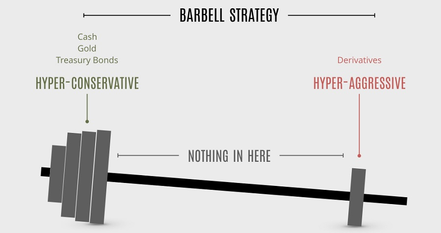

## Table of Contents

## What is the Barbell Strategy in investment terms?

The Barbell Strategy is an investment approach where you put your money into two very different types of investments. Imagine a barbell with weights on both ends but nothing in the middle. On one side, you invest in very safe assets, like government bonds or savings accounts. These are low risk and give you steady, but small, returns. On the other side, you put money into high-risk investments, like stocks or cryptocurrencies. These have the potential for big gains but also big losses.

The idea behind the Barbell Strategy is to balance safety with the chance for big profits. By having safe investments, you protect your money from big losses. At the same time, the high-risk investments give you a shot at making a lot of money. This strategy can be good for people who want to be careful but still want to try for big wins. It's like having the best of both worlds in your investment plan.

## How does the Barbell Strategy differ from other investment strategies?

The Barbell Strategy is different from other investment strategies because it focuses on having two extremes in your portfolio: very safe investments and very risky ones. Many other strategies, like the 60/40 portfolio, mix different types of investments more evenly. For example, a 60/40 portfolio might have 60% in stocks and 40% in bonds, trying to balance risk and reward without going to the extremes. The Barbell Strategy, on the other hand, avoids the middle ground, putting all your money into either very safe or very risky assets, hoping to get the best of both worlds.

Another way the Barbell Strategy differs is its approach to risk management. Strategies like dollar-cost averaging or value investing focus on spreading out investments over time or [picking](/wiki/asset-class-picking) stocks based on their value. The Barbell Strategy, however, doesn't worry about timing the market or picking specific stocks. Instead, it aims to protect your money with safe investments while also giving you a chance at big gains from risky ones. This makes it a unique way to balance safety and growth, unlike strategies that might focus more on one aspect or the other.

## What are the key components of a Barbell Strategy?

The first key component of a Barbell Strategy is investing in very safe assets. These are things like government bonds, savings accounts, or other low-risk investments. They don't give you big returns, but they're very safe. They protect your money from big losses, so you can feel secure knowing part of your money is safe no matter what happens in the market.

The second key component is investing in very risky assets. These can be stocks, cryptocurrencies, or other high-risk investments. They have the chance to make you a lot of money, but they can also lose a lot. The idea is to try for big wins with this part of your money, while the safe part keeps you from losing everything. By balancing these two extremes, the Barbell Strategy aims to give you the best of both worlds: safety and the potential for big gains.

## Why might someone choose to use a Barbell Strategy for their stock and bond investments?

Someone might choose to use a Barbell Strategy because it helps them balance safety and the chance for big profits. With this strategy, they put some of their money into very safe investments like government bonds or savings accounts. These safe investments protect their money from big losses, so they can feel secure knowing part of their money is safe no matter what happens in the market. This is important for people who want to make sure they don't lose everything, even if the market goes down.

On the other side, they put some of their money into very risky investments like stocks or cryptocurrencies. These risky investments have the potential to make a lot of money, but they can also lose a lot. By using the Barbell Strategy, someone can try for big wins with this part of their money, while the safe part keeps them from losing everything. This balance of safety and risk is why someone might choose this strategy—it gives them a chance at big gains while still protecting their money.

## What are the risks associated with implementing a Barbell Strategy?

One risk of using a Barbell Strategy is that the high-risk part of your investments could lose a lot of money. Since you're putting a big part of your money into things like stocks or cryptocurrencies, if these investments do badly, you could lose a lot. Even though the safe part of your money is protected, the risky part might go down so much that it hurts your overall savings. This can be scary for people who can't handle big losses.

Another risk is that the safe part of your investments might not grow enough. While these investments like government bonds or savings accounts are very safe, they usually don't make much money. If the returns from these safe investments are too low, they might not make up for the losses from the risky part. This means your money might not grow as much as you hoped, even if you avoid big losses.

Also, the Barbell Strategy can be hard to manage. You need to keep an eye on both the safe and risky parts of your investments, which can take a lot of time and knowledge. If you don't balance them right, you might end up with too much risk or not enough growth. This makes the strategy more complicated than just putting all your money into one type of investment.

## How can a beginner start applying the Barbell Strategy to their portfolio?

A beginner can start applying the Barbell Strategy by first deciding how much of their money they want to keep safe and how much they want to take risks with. A good starting point might be to put half of their money into very safe investments like government bonds or a savings account. These are easy to get and they don't change much in value, so they're a good way to keep your money safe. You can open a savings account at a bank or buy government bonds through a broker or online platform.

Next, the beginner should put the other half of their money into high-risk investments like stocks or cryptocurrencies. To do this, they can open an account with a stockbroker or a [cryptocurrency](/wiki/cryptocurrency) exchange. It's important to do some research or talk to someone who knows about these investments to pick ones that might grow a lot. Remember, these investments can go up or down a lot, so it's a good idea to only invest money you can afford to lose. By balancing these two types of investments, a beginner can try to protect their money while also having a chance to make big gains.

## What types of stocks and bonds are typically included in a Barbell Strategy?

In a Barbell Strategy, the safe part of your investments usually includes government bonds and savings accounts. Government bonds are loans you give to the government, and they pay you back with interest over time. They're very safe because the government is less likely to go broke than a company. Savings accounts are also safe because they're with banks, which are protected by the government up to a certain amount. These safe investments don't make a lot of money, but they keep your money secure.

The risky part of your investments in a Barbell Strategy often includes stocks and cryptocurrencies. Stocks are pieces of a company that you can buy, and if the company does well, the value of the stock can go up a lot. But if the company does badly, the value can go down a lot too. Cryptocurrencies like Bitcoin are even riskier because their value can change a lot in a short time. These risky investments can make you a lot of money, but they can also lose a lot, so you need to be ready for that.

## How should one balance the allocation between the two ends of the 'barbell'?

Deciding how much money to put into the safe and risky parts of your Barbell Strategy depends on how much risk you're okay with and what you want your money to do. A good starting point might be to split your money evenly, with half going into safe investments like government bonds or savings accounts, and the other half into risky investments like stocks or cryptocurrencies. But if you want to be safer, you might put more money into the safe side, like 60% or 70%. If you're okay with more risk and want a bigger chance at making a lot of money, you might put more into the risky side, like 60% or 70%.

Once you decide on the split, it's important to keep an eye on your investments and make changes if you need to. If the risky part of your investments loses a lot of money, you might want to move some money from the safe side to the risky side to keep the balance you want. Or if you find a new risky investment you like, you might take some money from the safe side to try it out. The key is to keep checking your investments and making sure the balance between safe and risky feels right for you.

## What are some real-world examples of successful Barbell Strategy implementations?

One real-world example of a successful Barbell Strategy is Warren Buffett's investment approach. Buffett is famous for his safe investments in companies like Coca-Cola and American Express, which provide steady income and are considered low risk. However, he also takes big risks with investments in companies like Apple and his own company, Berkshire Hathaway, which have the potential for huge gains. By balancing these safe and risky investments, Buffett has built a massive fortune while protecting his money from big losses.

Another example is Ray Dalio's All Weather Portfolio, which uses a similar idea to the Barbell Strategy. Dalio's portfolio includes safe investments like government bonds and inflation-protected securities, which help keep the portfolio stable during tough times. At the same time, he invests in stocks and commodities, which can grow a lot during good times. This mix of safe and risky investments has helped Dalio's clients make money no matter what the market does, showing how the Barbell Strategy can work in real life.

## How can the Barbell Strategy be adjusted in response to changing market conditions?

You can change your Barbell Strategy when the market changes by moving money between your safe and risky investments. If the market is doing well and you think it might keep going up, you might want to put more money into the risky side, like stocks or cryptocurrencies. This way, you can try to make more money while the market is good. But if the market starts to go down or you think it might get worse, you can move some of your money from the risky side to the safe side, like government bonds or savings accounts. This helps protect your money from big losses when things get tough.

It's also important to keep an eye on how your investments are doing and make changes if needed. If the risky part of your investments loses a lot of money, you might want to sell some of your safe investments to buy more risky ones and keep the balance you want. Or if you find a new risky investment you like, you might take some money from the safe side to try it out. The key is to always check your investments and make sure the balance between safe and risky feels right for you, no matter what the market is doing.

## What advanced techniques can experts use to optimize a Barbell Strategy?

Experts can use something called "dynamic rebalancing" to make their Barbell Strategy work better. This means they keep a close eye on their investments and change them often based on what's happening in the market. If the risky part of their investments starts doing really well, they might sell some of those to buy more safe investments, so they don't lose all their gains if the market goes down. On the other hand, if the safe part isn't making much money and the market looks good, they might move some money from the safe side to the risky side to try to make more money. By doing this, experts can keep the balance they want and make the most of both the safe and risky parts of their investments.

Another way experts can optimize their Barbell Strategy is by using "options" to protect their risky investments. Options are like insurance for your investments. They can buy options that let them sell their risky investments at a certain price, even if the market goes down a lot. This way, they can still try to make big money with the risky part of their investments, but they have a safety net to stop big losses. By using options smartly, experts can keep trying for big wins while also keeping their money safer than if they just held onto the risky investments without any protection.

## How does the Barbell Strategy perform compared to traditional portfolio strategies over the long term?

Over the long term, the Barbell Strategy can do better than traditional portfolio strategies because it mixes very safe investments with very risky ones. Traditional strategies, like the [60/40 portfolio](/wiki/60-40-portfolio-vs-SP-500), spread money more evenly between stocks and bonds. But the Barbell Strategy puts all the money into either very safe or very risky investments, hoping to get the best of both worlds. The safe part, like government bonds or savings accounts, protects your money from big losses. The risky part, like stocks or cryptocurrencies, gives you a chance at big gains. If the risky investments do well over time, the Barbell Strategy can make a lot more money than a traditional portfolio.

However, the Barbell Strategy can also be riskier than traditional strategies. If the risky part of your investments loses a lot of money, it can hurt your overall savings more than if you had a more balanced portfolio. Traditional portfolios spread out the risk more evenly, so they might not lose as much if the market goes down. Also, the safe part of the Barbell Strategy might not grow as much as bonds in a traditional portfolio, which can make it harder to keep up with inflation. So, while the Barbell Strategy can lead to bigger gains over the long term, it also comes with bigger risks and needs more careful watching and changing to do well.

## References & Further Reading

[1]: Taleb, N. N. (2010). ["The Black Swan: The Impact of the Highly Improbable."](https://www.amazon.com/Black-Swan-Improbable-Robustness-Fragility/dp/081297381X) Random House.

[2]: Mauboussin, M. J. (2012). ["The Success Equation: Untangling Skill and Luck in Business, Sports, and Investing."](https://hbsp.harvard.edu/product/10957-PDF-ENG) Harvard Business Review Press.

[3]: Chan, E. P. (2013). ["Algorithmic Trading: Winning Strategies and Their Rationale."](https://github.com/ftvision/quant_trading_echan_book) Wiley Trading.

[4]: Fabozzi, F. J. (2005). ["The Handbook of Fixed Income Securities."](https://www.amazon.com/Handbook-Fixed-Income-Securities-Ninth/dp/1260473899) McGraw-Hill.

[5]: Taleb, N. N. (2012). ["Antifragile: Things That Gain from Disorder."](https://en.wikipedia.org/wiki/Antifragile_(book)) Random House.