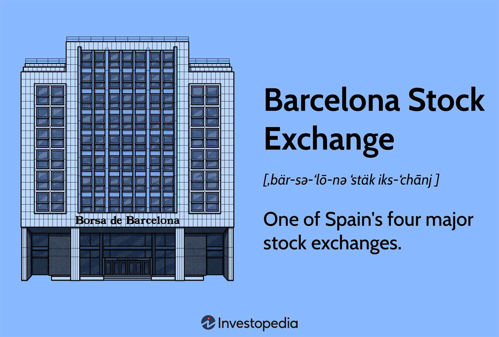

The Barcelona Stock Exchange (BCN), established in 1915, is a cornerstone of Spain's financial landscape. Located in the bustling city of Barcelona, BCN provides a critical platform for the trading of a diverse array of financial products, including equities, derivatives, and fixed income instruments. By offering these varied financial services, BCN plays a key role in facilitating capital flow and liquidity within the Spanish market.

As one of Spain's primary stock exchanges, BCN is integral to the nation’s economic framework, enabling businesses to raise capital efficiently. This, in turn, supports business expansion and fosters economic growth. Moreover, BCN is a part of the larger Spanish Stock Market system, which encompasses exchanges in Madrid, Bilbao, and Valencia, unified under Bolsas y Mercados Españoles (BME). This integration enhances the exchange's operability and connectivity within the broader financial system.

In this article, we will examine how BCN functions as a critical financial hub, contributing significantly to the Spanish economy. We will highlight how algorithmic trading has revolutionized market dynamics by enhancing trading speed, accuracy, and efficiency. Additionally, technological advancements have been pivotal in reshaping BCN’s trading activities, creating new opportunities for investors and improving overall market efficiency.

The article will also discuss the myriad challenges and opportunities faced by BCN as it navigates an increasingly interconnected global financial network. With technology continually evolving, BCN must adapt to maintain its competitive edge and address cybersecurity and regulatory demands. These advancements present both opportunities for growth and challenges that the exchange must strategically manage to continue supporting Spain’s economic development as well as its standing in the global market.

## Table of Contents

## Understanding the Barcelona Stock Exchange

The Barcelona Stock Exchange, known locally as the Bolsa de Barcelona, serves as a significant financial hub within Spain and is integral to its broader economic framework. The exchange facilitates the trading of a diverse range of financial products, including domestic and international stocks, warrants, exchange-traded funds (ETFs), and Latin American securities. These offerings provide investors with multiple avenues to diversify their portfolios and manage risk.

As part of Spain's coordinated stock market system, the Barcelona Stock Exchange operates under the comprehensive management of Bolsas y Mercados Españoles (BME). This system also encompasses exchanges located in Madrid, Bilbao, and Valencia. Under the unifying operations of BME, these exchanges are driven by a shared goal of enhancing efficiency, ensuring robust governance, and maintaining a high standard of market operations across Spain.

The Barcelona Stock Exchange employs advanced electronic trading systems that are crucial in facilitating smooth, efficient transactions while ensuring high levels of [liquidity](/wiki/liquidity-risk-premium) and transparency. These systems use state-of-the-art technologies to enable rapid order execution and real-time data dissemination. The efficiency of electronic trading systems helps in shortening transaction times, lowering costs, and offering tight bid-ask spreads, which in turn attracts a larger pool of investors to the market.

In the context of the Spanish economy, BCN plays an indispensable role by providing companies with the platform to raise capital required for their growth and expansion. By listing on the exchange, companies can gain visibility and credibility, assisting them in accessing both domestic and international capital markets. Investors are similarly empowered, gaining vital access to a diverse spectrum of investment opportunities.

Furthermore, the exchange’s comprehensive communication networks and sophisticated trading systems ensure timely access to domestic and global market data, thus empowering investors to make informed decisions based on reliable information. This effective market connectivity aids in aligning the Barcelona Stock Exchange with international financial markets, fostering a conducive environment for cross-border trading and investment activities.

Overall, the Barcelona Stock Exchange functions not only as a trading venue but as a key player in the broader Spanish and European financial systems. Its commitment to adopting technological advancements and maintaining systemic transparency ensures its ongoing relevance in a rapidly evolving financial landscape.

## The Evolution of Algorithmic Trading

Algorithmic trading involves the utilization of sophisticated mathematical algorithms and computational techniques to automate trading processes, thereby executing orders at speeds unattainable by human traders. This advanced trading strategy has gained considerable traction at the Barcelona Stock Exchange (BCN) in recent years, largely driven by technological advancements and the pursuit of more efficient trading frameworks.

The core advantage of [algorithmic trading](/wiki/algorithmic-trading) stems from its ability to quickly analyze extensive datasets, identify profitable trading opportunities, and execute transactions across various markets within milliseconds. Algorithms employ quantitative models and statistical analysis to forecast market trends and make real-time trading decisions. This approach minimizes human intervention, thereby enhancing the precision and speed of trade execution.

For example, a basic algorithmic trading strategy might involve monitoring price movements relative to specific stock indices and executing buy or sell orders when certain conditions, such as crossing moving averages, are met. This can be represented mathematically as:

$$
\text{If } P_t \times M_t^{-1} > 1: \, \text{execute buy order}; \, \text{Else: execute sell order}
$$

where $P_t$ represents the current price, and $M_t^{-1}$ represents a lagging moving average.

In the context of BCN, the integration of algorithmic trading has bolstered market liquidity, as automated systems are capable of processing large volumes of transactions with reduced transaction costs. This heightened liquidity facilitates smoother trading and enables the rapid adjustment of market prices, making the exchange more resilient to shocks.

However, the shift towards algorithmic trading is not without challenges. The inherent speed and automation can contribute to heightened market [volatility](/wiki/volatility-trading-strategies), occasionally resulting in situations where rapid sell-offs are amplified. Moreover, the clandestine nature of complex algorithms necessitates stringent regulatory oversight to ensure transparency and prevent market manipulation. Regulatory bodies are therefore tasked with balancing innovation with the need for fair and orderly markets.

Overall, while algorithmic trading offers significant efficiencies in speed and accuracy, BCN must continue to adapt its regulatory frameworks to mitigate associated risks and safeguard the integrity of the market. This will be crucial to harnessing the full potential of algorithmic trading while maintaining a stable and trustworthy trading environment.

## Impact on the Spanish Economy

The Barcelona Stock Exchange (BCN) significantly impacts Spain's economic landscape by facilitating capital formation and providing businesses with essential funding opportunities for growth and expansion. As a vital component of Spain's financial system, the BCN serves as a crucial platform for both local and international businesses, offering a gateway to one of Europe's most dynamic economies. By enabling companies to raise capital, the exchange plays a pivotal role in job creation, allowing businesses to innovate and expand their global competitiveness.

BCN's connection with global markets has been instrumental in attracting foreign direct investment (FDI) to Spain. This link fosters development across various sectors, contributing to the economy's diversification and resilience. In particular, by aligning with international financial systems and networks, the BCN enhances Spain's attractiveness as a destination for investment, which in turn supports economic growth and job creation within the country.

The efficiency and transparency inherent in BCN's operations instill investor confidence, which is crucial for ensuring active participation in the Spanish market. High levels of transparency ensure that market participants are well-informed, which helps to stabilize markets and mitigate the risks associated with investing. This transparency also facilitates more equitable access to financial markets, encouraging wider investor participation, including that of retail investors. 

By maintaining robust regulatory standards and leveraging advanced technology, the BCN enhances its capacity to provide a reliable trading environment. This reliability is fundamental to fostering an investment culture that supports long-term economic growth and sustainability. Ultimately, the Barcelona Stock Exchange stands as a cornerstone in Spain's financial architecture, promoting innovation, investment, and economic development through its integral roles in capital formation and investor engagement.

## Challenges and Opportunities for the Future

The Barcelona Stock Exchange (BCN) operates in an increasingly competitive environment with numerous challenges as well as opportunities for future development. One of the primary challenges is the intense competition posed by other global exchanges. Financial markets such as the New York Stock Exchange (NYSE) and the London Stock Exchange (LSE) have significant resources and technological advancements that can attract international companies and investors away from the BCN.

Adapting to rapid technological changes is another critical challenge. The pace at which trading technologies evolve necessitates continuous upgrades and innovations within the BCN's infrastructure to maintain competitive parity. This includes adopting cutting-edge technologies such as distributed ledger technology (DLT) and [artificial intelligence](/wiki/ai-artificial-intelligence) (AI) for enhanced trading solutions.

Maintaining regulatory standards in an era of digital trading also presents potential hurdles. As more trades are conducted electronically, BCN must ensure robust cybersecurity measures to protect against breaches that can compromise market integrity. Compliance with regulations set forth by entities such as the European Securities and Markets Authority (ESMA) is essential to preserving investor confidence and safeguarding the financial ecosystem.

Despite these challenges, the BCN has numerous opportunities for growth and innovation. Enhancing strategic alliances with other exchanges and financial institutions can expand market reach and offer new investment products. Additionally, modernizing infrastructure to support high-frequency and algorithmic trading can attract a new generation of traders seeking speed and efficiency.

Leveraging its rich history and strategic location is vital for BCN to strengthen its role in Europe and global capital markets. Barcelona’s position as an economic hub in the Mediterranean affords the exchange a unique advantage to attract international investors seeking to access European markets.

One of the most promising opportunities is diversifying financial products to include more green investments and sustainable finance options. As global markets increasingly prioritize environmental, social, and governance ([ESG](/wiki/esg-investing)) criteria, BCN can lead the transition by offering products that align with these values. This strategy not only addresses global environmental concerns but also attracts investors interested in sustainable investment portfolios.

In summary, while the Barcelona Stock Exchange must navigate a complex landscape characterized by technological advancements and regulatory demands, it also has the potential to capitalize on opportunities through strategic innovation and alignment with global market trends. By embracing these opportunities, BCN can continue to be an integral part of Spain's economic fabric and a dynamic player in the global capital markets.

## Conclusion

The Barcelona Stock Exchange (BCN) stands as a central component in Spain's economic framework, playing a pivotal role in facilitating financial growth and development. Recognized for its strategic emphasis on technological advancement and targeted growth strategies, BCN is well-positioned to effectively manage and thrive within the dynamic and interconnected global financial environment. The integration of algorithmic trading into its operations has markedly increased trading speed and precision, fostering an environment of enhanced market liquidity. Nonetheless, this evolution necessitates diligent oversight to mitigate associated challenges, such as potential market volatility and the need for robust regulatory frameworks.

As BCN continually adapts to embrace future challenges and seizes emerging opportunities, its influence on the economic trajectory of Spain remains significant. The exchange's commitment to maintaining a balance between innovation and regulation ensures its sustained relevance in the financial sector. For investors and corporations, the Barcelona Stock Exchange presents itself as a dependable and progressive platform for engaging with capital markets, underscoring its role as a catalyst for economic vitality in Spain.

## References & Further Reading

[1]: Bolsas y Mercados Españoles. ["BME: The Market of Markets."](https://www.bolsasymercados.es/esp/Home) 

[2]: Lopez, Rafael M. (2019). ["Algorithmic Trading: Strategies for Optimizing Execution Costs."](https://wjaets.com/sites/default/files/WJAETS-2024-0136.pdf) Journal of Financial Markets.

[3]: Marcos Lopez de Prado. (2018). ["Advances in Financial Machine Learning."](https://www.amazon.com/Advances-Financial-Machine-Learning-Marcos/dp/1119482089) Wiley.

[4]: Aronson, David R. (2007). ["Evidence-Based Technical Analysis: Applying the Scientific Method and Statistical Inference to Trading Signals"](https://www.amazon.com/Evidence-Based-Technical-Analysis-Scientific-Statistical/dp/0470008741) Wiley Trading.

[5]: Chan, Ernest P. (2009). ["Quantitative Trading: How to Build Your Own Algorithmic Trading Business."](https://github.com/ftvision/quant_trading_echan_book) Wiley.