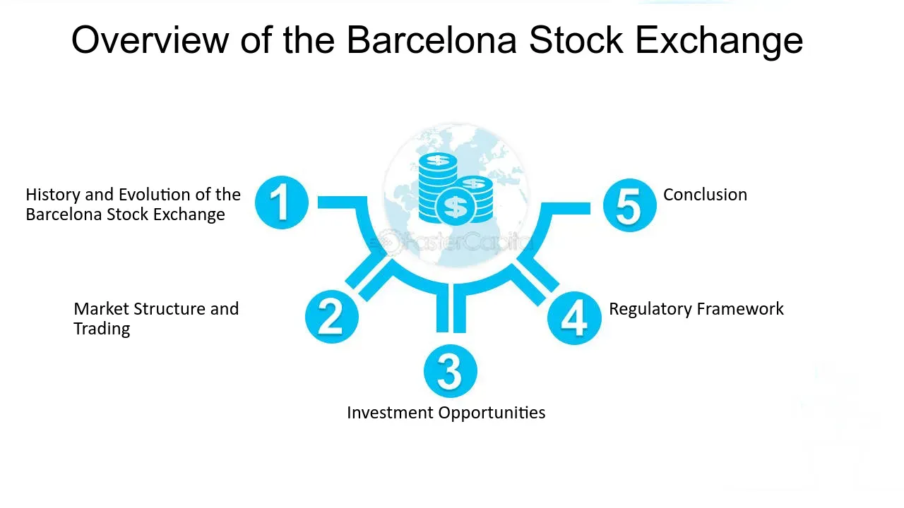

## Table of Contents

## What is the Barcelona Stock Exchange?

The Barcelona Stock Exchange, also known as Borsa de Barcelona, is a stock market located in Barcelona, Spain. It is one of the four stock exchanges in Spain, along with Madrid, Bilbao, and Valencia. The Barcelona Stock Exchange was established in 1915 and plays a key role in the Spanish financial market by allowing companies to raise capital through the trading of stocks and bonds.

The exchange is part of a larger group called BME (Bolsas y Mercados Españoles), which manages all four Spanish stock exchanges. This group helps to regulate and oversee the trading activities to ensure fairness and transparency. The Barcelona Stock Exchange not only serves local and national companies but also attracts international investors looking to invest in Spanish businesses.

## When was the Barcelona Stock Exchange founded?

The Barcelona Stock Exchange was founded in 1915. It is one of the four stock exchanges in Spain, along with Madrid, Bilbao, and Valencia. The exchange is located in Barcelona and helps companies get money by trading stocks and bonds.

The Barcelona Stock Exchange is part of a bigger group called BME, which manages all the stock exchanges in Spain. This group makes sure that trading is fair and clear. The exchange is important for local and national companies, and it also attracts people from other countries who want to invest in Spanish businesses.

## What types of securities are traded on the Barcelona Stock Exchange?

The Barcelona Stock Exchange trades different types of securities. The main ones are stocks and bonds. Stocks are pieces of ownership in a company. When you buy a stock, you own a little bit of that company. Bonds are like loans that you give to a company or the government. They promise to pay you back with interest over time.

Besides stocks and bonds, the exchange also trades other financial products. These include exchange-traded funds (ETFs), which are baskets of stocks that you can buy and sell like a single stock. There are also derivatives, which are contracts that get their value from something else, like the price of a stock or a commodity. All these securities help investors make money in different ways and help companies raise funds to grow.

## How does the Barcelona Stock Exchange contribute to the Spanish economy?

The Barcelona Stock Exchange helps the Spanish economy by letting companies get money easily. When companies sell stocks or bonds on the exchange, they can use that money to grow their business. This growth can lead to more jobs and more products or services, which is good for the whole country. The exchange also makes it easier for people to invest their money. When people buy stocks or bonds, they are putting their money into the economy, which helps it grow.

The exchange also brings in money from other countries. People from around the world can buy stocks or bonds from Spanish companies on the Barcelona Stock Exchange. This foreign money can help the Spanish economy get stronger. Plus, the exchange helps keep the financial system stable and fair. It follows rules to make sure trading is honest, which makes people trust the market more. This trust can lead to more trading and more growth for the economy.

## What are the trading hours of the Barcelona Stock Exchange?

The Barcelona Stock Exchange is open for trading from Monday to Friday. The trading hours start at 9:00 AM and end at 5:30 PM, local time in Spain. This means that people can buy and sell stocks and other securities during these hours.

During these trading hours, the exchange is very busy. Many people, including traders and investors, are working to make deals happen. The exchange follows these hours to match the main trading times in Europe, making it easier for people in different countries to trade with each other.

## How can someone invest in the Barcelona Stock Exchange?

To invest in the Barcelona Stock Exchange, you first need to open an account with a brokerage firm that has access to the Spanish market. You can do this online or by visiting a local branch. Once your account is set up, you'll need to deposit money into it. This money will be used to buy stocks, bonds, or other securities listed on the exchange. Make sure to choose a reputable broker who can guide you through the process and help you understand the fees involved.

After setting up your account, you can start buying and selling securities. You can do this through the broker's trading platform, either on their website or through a mobile app. It's important to research the companies you're interested in and understand the risks involved. You might want to start with a small investment and learn as you go. Remember, investing in the stock market can be rewarding, but it also comes with risks, so it's wise to be cautious and informed.

## What are the main indices associated with the Barcelona Stock Exchange?

The main index associated with the Barcelona Stock Exchange is the IBEX 35. This index tracks the performance of the 35 most liquid stocks traded on the Spanish stock exchanges, including the Barcelona Stock Exchange. The IBEX 35 is a good way to see how the biggest and most active companies in Spain are doing. It's like a report card for the Spanish stock market.

Another important index is the IBEX Medium Cap, which focuses on medium-sized companies. This index helps investors see how these companies are performing. It's useful for people who want to invest in companies that are not as big as those in the IBEX 35 but still have good growth potential. Both indices give a clear picture of the Spanish market and help investors make smart choices.

## What regulatory bodies oversee the operations of the Barcelona Stock Exchange?

The main regulatory body that oversees the operations of the Barcelona Stock Exchange is the National Securities Market Commission, or CNMV (Comisión Nacional del Mercado de Valores). The CNMV is like a watchdog for the Spanish stock market. It makes sure that everyone follows the rules and that trading is fair and honest. The CNMV checks that companies tell the truth about their finances and that brokers and traders do not cheat.

Another important body is BME (Bolsas y Mercados Españoles), which manages all four Spanish stock exchanges, including Barcelona. BME helps set the rules for trading and makes sure that the technology used for trading works well. BME and the CNMV work together to keep the stock market running smoothly and safely. This helps people trust the market and feel confident when they invest their money.

## How does the Barcelona Stock Exchange integrate with other European stock exchanges?

The Barcelona Stock Exchange is part of a bigger group called BME, which helps it connect with other stock exchanges in Europe. BME works with other big European stock exchange groups like Euronext, which runs exchanges in places like Paris and Amsterdam. This connection lets people buy and sell stocks easily between different countries. For example, if someone in France wants to buy stocks from a Spanish company, they can do it through the systems that link the Barcelona Stock Exchange with Euronext.

This integration helps the Barcelona Stock Exchange be part of the bigger European financial market. It makes trading smoother and faster across borders. The exchange follows rules set by European Union laws, which helps keep trading fair and safe everywhere. By being connected to other European exchanges, the Barcelona Stock Exchange can attract more investors from around Europe, which is good for Spanish companies and the whole Spanish economy.

## What technological systems does the Barcelona Stock Exchange use for trading?

The Barcelona Stock Exchange uses a trading system called SIBE (Sistema de Interconexión Bursátil Español) to handle the buying and selling of stocks. SIBE is like a big computer network that connects all four Spanish stock exchanges, including Barcelona. It makes sure that trades happen quickly and fairly. When someone wants to buy or sell a stock, they send their order through SIBE, and the system matches buyers with sellers to complete the trade.

Another important technology used by the Barcelona Stock Exchange is the FIX protocol. FIX stands for Financial Information eXchange, and it's a way for different computer systems to talk to each other. This helps the exchange connect with other financial systems around the world. Using FIX, the Barcelona Stock Exchange can send and receive trade information smoothly, which makes it easier for investors from other countries to trade on the exchange. Both SIBE and FIX help keep the trading process efficient and reliable.

## What are the recent trends in trading volumes at the Barcelona Stock Exchange?

In recent years, the trading volumes at the Barcelona Stock Exchange have shown some interesting changes. One trend is that more people are trading online. This is because technology has made it easier for people to buy and sell stocks from their computers or phones. As a result, the overall trading [volume](/wiki/volume-trading-strategy) has gone up. Another trend is that there has been more interest in certain types of stocks, like technology companies. This has led to higher trading volumes for those specific stocks.

However, the trading volumes can also go down sometimes. For example, during times of economic uncertainty, like a big financial crisis or a global health emergency, people might be more cautious about investing. This can lead to lower trading volumes. Also, competition from other stock exchanges in Europe can affect the volumes at the Barcelona Stock Exchange. If other exchanges offer better deals or easier access, some investors might choose to trade there instead. Overall, the trading volumes at the Barcelona Stock Exchange are influenced by many factors, including technology, economic conditions, and competition.

## How does the Barcelona Stock Exchange handle market volatility and ensure stability?

The Barcelona Stock Exchange uses several ways to handle market volatility and keep things stable. One way is by setting rules and limits on how much prices can change in a short time. This helps prevent big, sudden drops or jumps in stock prices that could scare investors. The exchange also watches trading closely to stop any bad behavior, like people trying to cheat or manipulate the market. By keeping a close eye on things, the exchange can act quickly if something seems wrong, which helps keep the market calm and fair.

Another important way the Barcelona Stock Exchange handles volatility is through its technology and systems. The SIBE trading system helps make sure that trades happen smoothly and fairly, even when the market is moving a lot. The exchange also uses tools to give investors clear and up-to-date information about what's happening in the market. This helps investors make smart choices, which can help keep the market stable. By using technology and good rules, the Barcelona Stock Exchange works hard to manage volatility and keep the market running smoothly.

## What is the Evolution of Algorithmic Trading?

Algorithmic trading involves the utilization of sophisticated mathematical algorithms and computational techniques to automate trading processes, thereby executing orders at speeds unattainable by human traders. This advanced trading strategy has gained considerable traction at the Barcelona Stock Exchange (BCN) in recent years, largely driven by technological advancements and the pursuit of more efficient trading frameworks.

The core advantage of [algorithmic trading](/wiki/algorithmic-trading) stems from its ability to quickly analyze extensive datasets, identify profitable trading opportunities, and execute transactions across various markets within milliseconds. Algorithms employ quantitative models and statistical analysis to forecast market trends and make real-time trading decisions. This approach minimizes human intervention, thereby enhancing the precision and speed of trade execution.

For example, a basic algorithmic trading strategy might involve monitoring price movements relative to specific stock indices and executing buy or sell orders when certain conditions, such as crossing moving averages, are met. This can be represented mathematically as:

$$
\text{If } P_t \times M_t^{-1} > 1: \, \text{execute buy order}; \, \text{Else: execute sell order}
$$

where $P_t$ represents the current price, and $M_t^{-1}$ represents a lagging moving average.

In the context of BCN, the integration of algorithmic trading has bolstered market [liquidity](/wiki/liquidity-risk-premium), as automated systems are capable of processing large volumes of transactions with reduced transaction costs. This heightened liquidity facilitates smoother trading and enables the rapid adjustment of market prices, making the exchange more resilient to shocks.

However, the shift towards algorithmic trading is not without challenges. The inherent speed and automation can contribute to heightened market [volatility](/wiki/volatility-trading-strategies), occasionally resulting in situations where rapid sell-offs are amplified. Moreover, the clandestine nature of complex algorithms necessitates stringent regulatory oversight to ensure transparency and prevent market manipulation. Regulatory bodies are therefore tasked with balancing innovation with the need for fair and orderly markets.

Overall, while algorithmic trading offers significant efficiencies in speed and accuracy, BCN must continue to adapt its regulatory frameworks to mitigate associated risks and safeguard the integrity of the market. This will be crucial to harnessing the full potential of algorithmic trading while maintaining a stable and trustworthy trading environment.

## References & Further Reading

[1]: Bolsas y Mercados Españoles. ["BME: The Market of Markets."](https://www.bolsasymercados.es/esp/Home) 

[2]: Lopez, Rafael M. (2019). ["Algorithmic Trading: Strategies for Optimizing Execution Costs."](https://wjaets.com/sites/default/files/WJAETS-2024-0136.pdf) Journal of Financial Markets.

[3]: Marcos Lopez de Prado. (2018). ["Advances in Financial Machine Learning."](https://www.amazon.com/Advances-Financial-Machine-Learning-Marcos/dp/1119482089) Wiley.

[4]: Aronson, David R. (2007). ["Evidence-Based Technical Analysis: Applying the Scientific Method and Statistical Inference to Trading Signals"](https://www.amazon.com/Evidence-Based-Technical-Analysis-Scientific-Statistical/dp/0470008741) Wiley Trading.

[5]: Chan, Ernest P. (2009). ["Quantitative Trading: How to Build Your Own Algorithmic Trading Business."](https://github.com/ftvision/quant_trading_echan_book) Wiley.