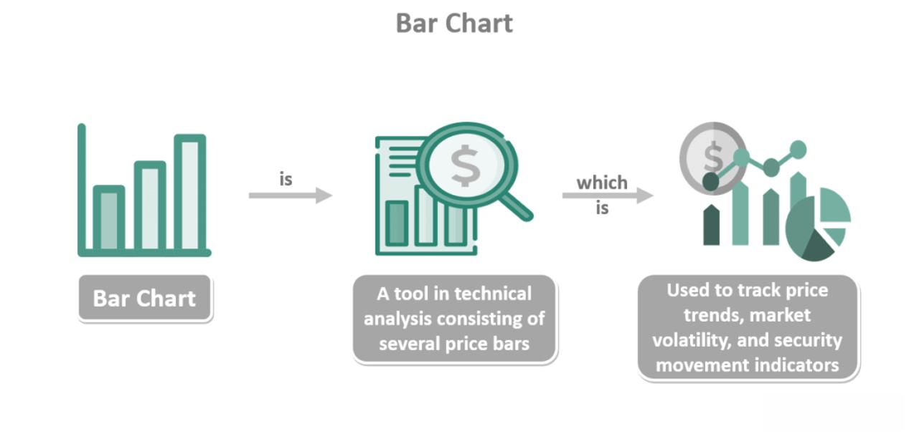

## Table of Contents

## What is Barchart.com Inc. and what services does it provide?

Barchart.com Inc. is a company that gives information and tools for people who trade and invest in financial markets. They started in 1995 and have grown to be a big name in the industry. Their main focus is on giving data and tools that help people make smart choices about buying and selling things like stocks, futures, options, and commodities.

They offer a lot of different services. One big part of what they do is giving real-time market data and news. This helps traders stay up-to-date with what's happening in the markets. They also have tools like charts and technical analysis that help people study market trends. Another thing they do is provide a platform for trading, where people can actually buy and sell financial products. Plus, they have services for data licensing, where other companies can use their data in their own products.

## When was Barchart.com Inc. founded and who are its founders?

Barchart.com Inc. was founded in 1995. The company was started by Eero Pikat and John Stuenkel. They wanted to help people who trade and invest by giving them good information and tools.

Eero Pikat and John Stuenkel saw that there was a need for better data and tools in the financial markets. So, they created Barchart.com to fill that need. Since then, the company has grown a lot and now helps many people around the world with their trading and investing.

## How does Barchart.com Inc. generate revenue?

Barchart.com Inc. makes money in a few different ways. One big way they earn money is by selling data and tools to other companies. These companies might use Barchart's data in their own products or services. For example, a financial website might pay Barchart to use their stock prices and charts. This is called data licensing, and it's a big part of how Barchart makes money.

Another way Barchart generates revenue is through their trading platform. People who use this platform can buy and sell things like stocks and futures. Barchart makes money from the fees they charge for these trades. They also offer different subscription plans for their tools and data. People who want more advanced features might pay for a premium subscription, which brings in more money for the company.

## What are the main features of Barchart's platform for individual investors?

Barchart's platform for individual investors has a lot of useful features. One main feature is real-time market data. This means you can see the latest prices for stocks, futures, and other things you might want to trade. They also have news updates that help you stay informed about what's happening in the markets. Another important feature is their charts and technical analysis tools. These help you look at past price movements to make better decisions about buying and selling.

Another key part of Barchart's platform is their trading tools. You can use the platform to actually buy and sell stocks, futures, and other financial products. They make it easy to place trades and manage your investments. Barchart also offers different subscription plans. If you want more advanced features, you can pay for a premium subscription. This gives you access to even more data and tools to help you trade better.

Overall, Barchart's platform is designed to help individual investors make smart choices. It combines real-time data, news, charts, and trading tools all in one place. This makes it easier for you to keep track of the markets and manage your investments effectively.

## How does Barchart.com Inc. ensure the accuracy and timeliness of its data?

Barchart.com Inc. works hard to make sure their data is both accurate and up-to-date. They get their information from many different places, like stock exchanges and other trusted sources. By using multiple sources, they can check their data and make sure it's correct. They also use special computer programs to keep an eye on the data all the time. If they see something that doesn't look right, they fix it quickly.

To make sure the data is timely, Barchart has systems that update the information as soon as it changes. This means you see the latest prices and news almost right away. They also have people who work around the clock to watch the data and make sure it's always current. This helps traders and investors trust that the information they're using is both accurate and up-to-date.

## What types of data and analytics does Barchart.com Inc. offer to its professional clients?

Barchart.com Inc. offers a lot of different data and analytics to its professional clients. They give real-time market data, which means professionals can see the latest prices for stocks, futures, and other financial products right away. They also have historical data, which helps professionals look at how prices have changed over time. Barchart provides news feeds too, so professionals can stay updated on what's happening in the markets. They also have special tools for technical analysis, which help professionals study market trends and patterns to make better trading decisions.

Another important part of Barchart's offerings is their data licensing service. Professional clients can use Barchart's data in their own products or services. This can be very helpful for financial companies that need accurate and timely data to offer to their customers. Barchart also gives access to advanced analytics and research tools. These tools help professionals do deep analysis and make smart investment choices. Overall, Barchart helps professionals by giving them a lot of useful data and tools all in one place.

## Can you explain Barchart's API services and how they can be integrated into other platforms?

Barchart's API services let other companies use their data and tools in their own products. An API, or Application Programming Interface, is like a way for different computer programs to talk to each other. With Barchart's API, a company can get real-time market data, historical data, and even use their charts and analysis tools. This makes it easier for other businesses to give their customers up-to-date information without having to collect it themselves.

To use Barchart's API, a company needs to sign up for an API key. This key is like a special password that lets them connect to Barchart's data. Once they have the key, they can write code that asks Barchart's servers for the information they need. This data can then be shown on their own website or app. It's a simple way to make their product better by adding Barchart's trusted data and tools.

## What are some of the key partnerships and collaborations of Barchart.com Inc.?

Barchart.com Inc. works with many other companies to make their services even better. One big partnership they have is with the Chicago Mercantile Exchange (CME Group). This helps Barchart give real-time data on futures and options to their users. They also work with other big exchanges like the New York Stock Exchange (NYSE) and NASDAQ. These partnerships help Barchart provide accurate and timely data on stocks and other financial products.

Another important collaboration is with financial news providers like Dow Jones and Reuters. This lets Barchart include up-to-date news in their platform, helping traders and investors stay informed. Barchart also partners with software companies to integrate their data and tools into other products. For example, they work with trading platforms like TradeStation and NinjaTrader. These partnerships help Barchart reach more people and offer more ways for users to use their data and tools.

## How does Barchart.com Inc. comply with financial regulations and data privacy laws?

Barchart.com Inc. works hard to follow all the rules and laws about finance and keeping data private. They know that their users trust them with important information, so they make sure to protect it. Barchart follows laws like the Securities and Exchange Commission (SEC) rules in the U.S. and other rules around the world. They also have a team that keeps an eye on these rules and makes sure Barchart is always doing what they're supposed to do.

To keep data private, Barchart follows laws like the General Data Protection Regulation (GDPR) in Europe and other privacy laws. They use strong security measures to keep user data safe. This includes things like encryption, which is like putting a secret code on data so only the right people can read it. Barchart also has clear rules about how they collect, use, and share data, and they tell their users about these rules so everyone knows what's happening with their information.

## What are the technological innovations introduced by Barchart.com Inc. in the field of financial data?

Barchart.com Inc. has introduced many new technologies to make financial data better for users. One big change they made was creating tools for real-time data. This means people can see the latest prices and news almost right away. They also made special software that can handle a lot of data quickly. This helps traders and investors get the information they need without waiting.

Another important innovation is their work on making data easier to use. Barchart created easy-to-understand charts and graphs that help people see market trends clearly. They also developed tools for technical analysis, which help people study past prices to make better guesses about the future. These tools are all part of Barchart's platform, which makes it simpler for everyone to use financial data and make smart choices.

## How does Barchart.com Inc. use machine learning and AI to enhance its services?

Barchart.com Inc. uses [machine learning](/wiki/machine-learning) and AI to make their services better for users. They use these technologies to look at a lot of data and find patterns that people might miss. For example, they can predict how prices might change in the future by studying past data. This helps traders and investors make smarter choices. Barchart also uses AI to make their data more accurate. They have systems that check data all the time and fix any mistakes quickly, so users always have the best information.

Another way Barchart uses machine learning is to help users find what they need faster. They use AI to understand what users are looking for and show them the most helpful information first. This makes it easier for people to find the data and tools they need without wasting time. Overall, Barchart's use of machine learning and AI helps make their platform more useful and easier to use for everyone.

## What are the future plans and strategic directions of Barchart.com Inc.?

Barchart.com Inc. wants to keep growing and helping more people with their financial data. They plan to make their platform even better by adding new tools and features. They are thinking about using more advanced technology, like machine learning and AI, to give users even better predictions and analysis. Barchart also wants to reach more people around the world, so they might start offering their services in more languages and in more countries.

Another big goal for Barchart is to make their data even more accurate and timely. They are working on new ways to check their data and make sure it's always up-to-date. They also want to make it easier for other companies to use their data through their API services. By doing this, Barchart hopes to help more businesses and make their services even more useful.

## What are Stock Analysis Techniques?

Stock analysis is a crucial component in crafting effective investment strategies by evaluating historical data, market trends, and financial statements. Two primary methods of stock analysis are technical analysis and [fundamental analysis](/wiki/fundamental-analysis).

Technical analysis focuses on the statistical analysis of market activity, including price movement and [volume](/wiki/volume-trading-strategy). It operates on the principle that past trading activity and price changes can be valuable indicators of future price movement. Technical analysts use various tools to aid their analysis, including:

- **Chart Patterns**: These are specific formations created by the movement of stock prices on a chart. Common patterns include Head and Shoulders, Flags, and Pennants. These patterns signal potential reversals or continuations in trends.

- **Indicators**: Indicators are mathematical calculations based on historical price and volume data. Some of the most widely used technical indicators include Moving Averages, Relative Strength Index (RSI), and Moving Average Convergence Divergence (MACD).

For example, a simple Python code to calculate a Moving Average might look like this:

```python
def moving_average(data, period):
    return [sum(data[i:i+period])/period for i in range(len(data)-period+1)]
```

Fundamental analysis, on the other hand, involves examining a company's financial health. This evaluation includes scrutinizing financial statements, understanding management quality, assessing competitive advantages, and considering the company's position in the market. Key aspects of fundamental analysis include:

- **Revenue and Earnings**: Analysts look at a company’s revenue growth over time and its earnings per share (EPS) to determine profitability trends.

- **Valuation Ratios**: Ratios like the Price-to-Earnings (P/E) ratio, Return on Equity (ROE), and Debt-to-Equity (D/E) ratio provide insight into a company’s value and financial health relative to its peers.

For instance, the P/E ratio is calculated as follows:

$$
\text{P/E Ratio} = \frac{\text{Market Value per Share}}{\text{Earnings per Share (EPS)}}
$$

Both technical and fundamental analyses provide insights that can guide investment decisions. While technical analysis is often used for short-term trading strategies, fundamental analysis is more typically employed for long-term investment decisions. A well-rounded investor might apply both approaches to benefit from a holistic view of the market and specific securities.

## References & Further Reading

[1]: Bergstra, J., Bardenet, R., Bengio, Y., & Kégl, B. (2011). ["Algorithms for Hyper-Parameter Optimization."](https://dl.acm.org/doi/10.5555/2986459.2986743) Advances in Neural Information Processing Systems 24.

[2]: ["Advances in Financial Machine Learning"](https://www.amazon.com/Advances-Financial-Machine-Learning-Marcos/dp/1119482089) by Marcos Lopez de Prado

[3]: ["Evidence-Based Technical Analysis: Applying the Scientific Method and Statistical Inference to Trading Signals"](https://www.amazon.com/Evidence-Based-Technical-Analysis-Scientific-Statistical/dp/0470008741) by David Aronson

[4]: ["Machine Learning for Algorithmic Trading"](https://github.com/stefan-jansen/machine-learning-for-trading) by Stefan Jansen

[5]: ["Quantitative Trading: How to Build Your Own Algorithmic Trading Business"](https://www.amazon.com/Quantitative-Trading-Build-Algorithmic-Business/dp/1119800064) by Ernest P. Chan