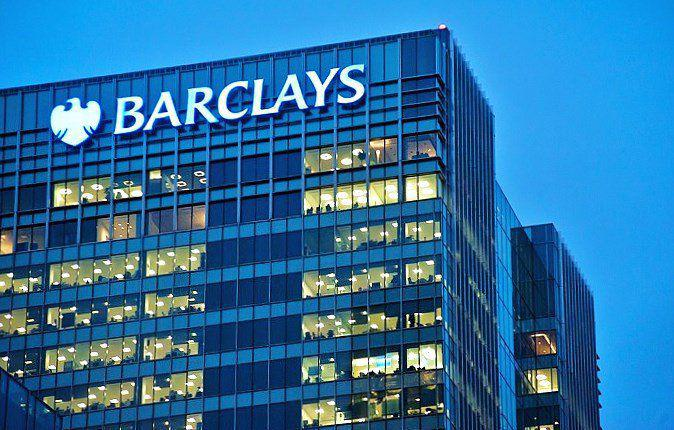

## Table of Contents

## What is Barclays Bank PLC?

Barclays Bank PLC is a big bank from the United Kingdom. It started a long time ago in 1690 and has grown a lot since then. They have many branches and offices all over the world, not just in the UK. People and businesses use Barclays for things like saving money, borrowing money, and other financial services.

The bank does many different things to help its customers. They offer services like credit cards, loans, and helping people invest their money. Barclays also works with big companies, helping them with their money needs too. They are known for being one of the biggest banks in the world and are always trying to find new ways to serve their customers better.

## When was Barclays Bank PLC founded?

Barclays Bank PLC was founded a long time ago in 1690. It started in London, England. Back then, it was just a small bank, but it has grown a lot since then.

Today, Barclays is one of the biggest banks in the world. It has many branches and offices in different countries. People and businesses use Barclays for saving money, borrowing money, and other financial services.

## What are the main services offered by Barclays Bank PLC?

Barclays Bank PLC offers many services to help people and businesses with their money. They have things like savings accounts where people can keep their money safe and earn a little bit of interest. They also offer checking accounts, which are good for everyday spending and paying bills. If someone needs to borrow money, Barclays provides loans and credit cards. These can help people buy things they need now and pay for them over time.

Barclays also helps people invest their money. They offer investment services where customers can put their money into stocks, bonds, and other things that might grow in value over time. This can be a good way to save for the future, like for retirement. For businesses, Barclays offers special services like business loans, ways to manage cash flow, and help with international trade. They work hard to meet the needs of all their customers, big and small.

## Where is Barclays Bank PLC headquartered?

Barclays Bank PLC is headquartered in London, England. This is where the main office of the bank is located, and it's where many important decisions are made.

London is a big city and a major financial center, which makes it a good place for a big bank like Barclays to be based. From London, Barclays can reach out to customers all over the world and provide them with the services they need.

## How does Barclays Bank PLC operate globally?

Barclays Bank PLC operates globally by having branches and offices in many different countries. They are not just in the UK, but also in places like the United States, Europe, Asia, Africa, and the Middle East. This helps them reach customers all over the world and provide them with the financial services they need. Whether it's someone in New York needing a loan or a business in Singapore looking to invest, Barclays can help.

To make sure they can serve customers everywhere, Barclays has different teams that focus on different parts of the world. They understand that each place has its own rules and needs, so they tailor their services to fit. For example, they might offer special services for businesses that want to trade between countries. By doing this, Barclays can be a big help to people and companies no matter where they are.

## What is the current market position of Barclays Bank PLC in the banking industry?

Barclays Bank PLC is one of the biggest banks in the world and has a strong position in the banking industry. It is known for being a leader in the UK, where it started, but it also has a big presence in many other countries. People and businesses trust Barclays because it offers a lot of different services and has been around for a long time. This trust and its wide range of services help Barclays stay competitive in the global market.

In recent years, Barclays has been working hard to keep up with changes in the banking industry. They have been focusing on digital banking, making it easier for customers to do their banking online or through their phones. This is important because more and more people want to do their banking this way. Barclays also continues to offer traditional banking services, so they can meet the needs of all their customers. By doing these things, Barclays keeps a strong position in the banking industry and stays ahead of the competition.

## What are the recent financial performance highlights of Barclays Bank PLC?

Barclays Bank PLC has been doing well in recent years. In their latest financial reports, they showed that they made a good amount of profit. This is important because it means the bank is healthy and can keep helping its customers. They also said that their income from things like loans, credit cards, and helping businesses with their money went up. This is a good sign because it shows more people and businesses are using Barclays' services.

Another important thing is that Barclays has been working on making their costs lower. When a bank can do this, it means they can make more money without having to charge their customers more. They've been focusing on digital banking, which helps them save money because it's cheaper than running a lot of physical branches. Overall, Barclays is doing well and is in a strong position in the banking industry.

## What are the key corporate social responsibility initiatives of Barclays Bank PLC?

Barclays Bank PLC focuses a lot on helping the world and the communities where it works. They have many programs to support education, especially for young people. They help schools and give money to programs that teach kids about money and how to use it wisely. Barclays also cares about the environment. They try to use less energy and make less waste. They also help businesses that are good for the planet, like those that use clean energy.

Another big part of what Barclays does is helping people have equal chances. They work hard to make sure everyone, no matter their background, can get good jobs at the bank. They also support programs that help women and people from different cultures start their own businesses. Barclays believes in making the world a better place and tries to do this through all their work.

## How has Barclays Bank PLC adapted to digital banking trends?

Barclays Bank PLC has done a lot to keep up with the way people want to do their banking now. They have made it easy for customers to use their phones or computers to check their money, pay bills, and even get loans. Barclays has an app that lets people do all their banking without going to a branch. They also use new technology to make sure their services are safe and easy to use. This helps them reach more customers and keep them happy.

To make sure they are always up to date, Barclays keeps adding new features to their digital services. They listen to what customers want and try to make banking easier and faster. For example, they have added ways for people to pay others quickly using just their phone numbers. They also use things like [artificial intelligence](/wiki/ai-artificial-intelligence) to help customers get the right services for them. By doing these things, Barclays stays ahead in the world of digital banking.

## What are the major regulatory challenges faced by Barclays Bank PLC?

Barclays Bank PLC faces a lot of rules and laws that they have to follow. These rules come from different places, like the governments where they work and special groups that watch over banks. One big challenge is making sure they follow all the rules about money laundering. This means they have to check carefully where money comes from and where it goes to stop bad people from using the bank to hide illegal money. Another challenge is keeping up with new rules about how much money they need to have on hand. These rules are there to make sure the bank can pay back people if something goes wrong.

Another big issue for Barclays is dealing with rules about how they treat customers. They have to make sure they are fair and clear about what they charge and how they handle people's money. This can be hard because the rules can change and they need to keep up. Also, because Barclays works in many countries, they have to follow different rules in each place. This can be tricky because what is okay in one country might not be okay in another. Keeping up with all these rules takes a lot of work, but it's important to make sure they are doing things the right way.

## What strategic acquisitions has Barclays Bank PLC made in the last decade?

Over the last decade, Barclays Bank PLC has made some important acquisitions to grow and improve its services. One big move was buying Lehman Brothers' North American investment banking and capital markets businesses in 2008. This helped Barclays become stronger in the United States and gave them more ways to help big companies with their money needs. Another important acquisition was in 2016 when Barclays bought a company called Woolwich, which is known for mortgages. This helped Barclays offer more home loans to people in the UK.

Barclays also made a smart move in 2015 by buying a company called Vocalink. Vocalink helps with payments and makes sure money moves quickly and safely between banks. By owning Vocalink, Barclays got better at handling payments and could offer new services to customers. These acquisitions show how Barclays keeps looking for ways to grow and be better at what they do.

## What are the future growth strategies planned by Barclays Bank PLC?

Barclays Bank PLC is always thinking about how to grow and be better. One of their big plans is to focus more on digital banking. They want to make their app and online services even easier and faster to use. This will help them reach more people who like to do their banking on their phones or computers. They also plan to use new technology like artificial intelligence to help customers get the right services for them. By doing this, Barclays hopes to keep up with what people want and stay ahead of other banks.

Another important part of Barclays' growth plan is to keep helping big businesses around the world. They want to grow their services for companies, especially in places like the United States and Asia. This means offering more ways to help businesses with their money, like loans and ways to invest. Barclays also wants to work with more companies that are good for the environment. By focusing on these areas, Barclays thinks they can keep growing and be a big help to businesses everywhere.

## References & Further Reading

[1]: ["Advances in Financial Machine Learning"](https://www.amazon.com/Advances-Financial-Machine-Learning-Marcos/dp/1119482089) by Marcos Lopez de Prado

[2]: ["Machine Learning for Algorithmic Trading"](https://www.amazon.com/Machine-Learning-Algorithmic-Trading-alternative/dp/1839217715) by Stefan Jansen

[3]: ["Quantitative Trading: How to Build Your Own Algorithmic Trading Business"](https://github.com/LucindaYa/quant-resources/blob/master/Quantitative%20Trading%20How%20to%20Build%20Your%20Own%20Algorithmic%20Trading%20Business.pdf) by Ernest P. Chan

[4]: ["Evidence-Based Technical Analysis: Applying the Scientific Method and Statistical Inference to Trading Signals"](https://books.google.com/books/about/Evidence_Based_Technical_Analysis.html?id=MeoJAQAAMAAJ) by David Aronson

[5]: Savage, S. (1994). ["Decoding transparency in financial markets: a tool for trade visibility"](https://fastercapital.com/content/True-Nature-of-Transactions--Decoding-True-Nature--How-Substance-Over-Form-Clarifies-Transactions.html) Journal of Economic Literature, 32(3), 905-940.

[6]: Tsang, M., & Lee, C. (2018). ["The Role of Data Analytics in Algorithmic Trading."](https://www.researchgate.net/publication/379041244_REVIEWING_THE_ROLE_OF_BIG_DATA_ANALYTICS_IN_FINANCIAL_FRAUD_DETECTION) Computational Economics, 52(2), 247-273.