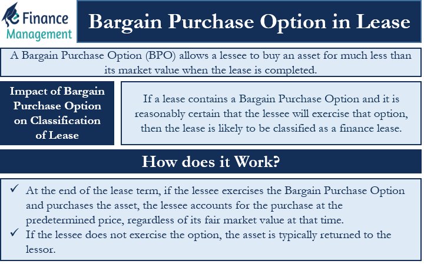

## Table of Contents

## What is a bargain purchase option?

A bargain purchase option is a part of some lease agreements where the person leasing something, like a car or equipment, can buy it at the end of the lease for a lower price than what it's worth. This price is called the bargain purchase option price. It makes the lease attractive because the person knows they can buy the item cheaply if they want to keep it.

This option is often used in business leases because it can help companies plan their finances better. They know they can buy the equipment at a low price if they need to, which can be useful for budgeting. It also gives them the chance to own the equipment outright at the end of the lease, which can be good for long-term use.

## How does a bargain purchase option work in a lease agreement?

A bargain purchase option in a lease agreement lets the person renting something, like a car or a piece of equipment, buy it at the end of the lease for a price that's much lower than what it's worth. This low price is called the bargain purchase option price. When someone signs a lease with this option, they know from the start that they can buy the item at a good deal if they decide they want to keep it.

This option is helpful because it gives the person renting a clear choice at the end of the lease. They can either return the item or buy it at a lower price. This can be really useful for businesses because it helps them plan their money better. They can budget for the possibility of buying the equipment at a low cost, which can be good for their long-term plans.

## What are the benefits of including a bargain purchase option in a lease?

Including a bargain purchase option in a lease gives the person renting something a clear choice at the end of the lease. They can either return the item or buy it at a price that's much lower than what it's worth. This can be a big advantage because it helps the person plan better. They know from the start that they can buy the item at a good deal if they decide they want to keep it.

For businesses, this option can be really helpful for budgeting. They can plan their money knowing they might buy the equipment at a low cost at the end of the lease. This can be good for their long-term plans because they can own the equipment outright if it makes sense for them. It gives them flexibility and helps them manage their finances more effectively.

## What are the potential drawbacks of a bargain purchase option for the lessee?

One potential drawback for the lessee is that they might feel locked into buying the item at the end of the lease. Even if they don't need it anymore, the low price might make them feel like they should buy it anyway. This could lead to spending money on something they don't really need, just because it's a good deal.

Another issue is that the lessee might miss out on better opportunities. If new technology or equipment comes out that's better than what they're leasing, they might still choose to buy the old item because of the low price. This could mean they're not using the best tools for their needs, which could affect their work or business.

Lastly, the lessee might have to deal with the costs of maintaining and insuring the item after they buy it. These costs can add up over time, and the lessee might not have planned for them. This could make the bargain purchase option less of a bargain in the long run.

## How is a bargain purchase option different from a regular purchase option?

A bargain purchase option and a regular purchase option both let you buy something at the end of a lease, but they work a bit differently. A bargain purchase option lets you buy the item for a lot less than what it's worth. This low price is the main difference. It's called a "bargain" because it's a really good deal. With a regular purchase option, you can buy the item too, but the price is usually closer to what the item is actually worth. It's not as big of a discount as with a bargain purchase option.

The bargain purchase option can be really attractive because it gives you a chance to own the item at a great price. But it might also make you feel like you have to buy it, even if you don't need it anymore. A regular purchase option gives you the choice to buy, but it doesn't push you as much because the price is more normal. So, the bargain purchase option is a bigger incentive to buy, but it might make your decision harder if you're not sure you want to keep the item.

## Can you explain the accounting treatment of a bargain purchase option under current standards?

Under current accounting standards, a lease with a bargain purchase option is usually treated as a finance lease. This means the person leasing the item has to show the item on their balance sheet as if they own it, even though they're still making lease payments. They also have to record a liability for the lease payments they still owe. This is because the bargain purchase option makes it very likely that they will buy the item at the end of the lease, so it's treated like they're buying it already.

The accounting for a finance lease with a bargain purchase option means the lessee records the item at the present value of the lease payments, including the bargain purchase price. Over time, they will depreciate the item on their financial statements, just like they would if they had bought it outright. This helps show a more accurate picture of their financial situation, because it takes into account the future cost of buying the item at the end of the lease.

## What criteria must be met for an option to be considered a bargain purchase option?

For an option to be considered a bargain purchase option, the price to buy the item at the end of the lease must be much lower than what the item is worth. This means the price is so good that it's almost sure the person leasing will want to buy it. The key is that the price is a real bargain, making it very attractive to buy the item.

Accounting rules say that if the price to buy the item is less than the item's fair market value at the end of the lease, and it's low enough to make buying it a sure thing, then it's a bargain purchase option. This low price makes the lease different from other leases because it's almost like the person leasing is buying the item right from the start.

## How does the presence of a bargain purchase option affect the classification of a lease?

When a lease has a bargain purchase option, it changes how the lease is treated in accounting. The lease is usually seen as a finance lease, not an operating lease. A finance lease means the person renting the item treats it like they own it on their financial records, even though they are still making lease payments. They also have to show a debt for the lease payments they still need to make. This happens because the bargain purchase option makes it very likely that they will buy the item at the end of the lease, so it's treated like they're buying it already.

The reason for this classification is that the bargain purchase option makes the lease look more like a purchase than a rental. The price to buy the item at the end of the lease is so low that it's almost certain the person leasing will want to buy it. This low price is what makes it a bargain purchase option. Because of this, the accounting rules say the lease should be treated as if the person leasing is buying the item right from the start, which affects how they show it on their financial statements.

## What are the tax implications of exercising a bargain purchase option?

When you decide to use a bargain purchase option, it can change how much tax you have to pay. If you buy the item at the end of the lease for a low price, you might have to pay sales tax on that price. This is because you're buying the item, so you have to pay tax on what you paid for it. But, because the price is low, the tax you pay might be less than if you had bought the item at its full price.

Also, how you handle the item on your taxes can change after you buy it. Before you bought it, you could probably take the lease payments as a business expense on your taxes. But after you buy it, you might have to start depreciating the item instead. This means you spread out the cost of the item over time on your taxes, which can affect how much tax you pay each year. It's a good idea to talk to a tax expert to make sure you're doing everything right and getting the best tax benefits.

## How should a lessee evaluate whether to exercise a bargain purchase option?

When a lessee is thinking about using a bargain purchase option, they need to think about a few things. First, they should see if they still need the item at the end of the lease. If they don't need it anymore, buying it just because it's a good deal might not be the best choice. They should also think about if there are newer or better items available. If there are, buying the old item, even at a low price, might not be the best decision.

Another thing to consider is the cost of owning the item after buying it. The lessee will need to pay for things like maintenance and insurance, which can add up over time. They should compare these costs to the cost of leasing a new item or buying something else. If the total cost of owning the item after buying it is too high, the bargain purchase option might not be as good of a deal as it seems. It's important for the lessee to weigh all these factors to make the best decision.

## What are the legal considerations when including a bargain purchase option in a contract?

When putting a bargain purchase option in a contract, it's important to make sure the terms are clear and easy to understand. The contract should say what the bargain purchase price is, when the lessee can buy the item, and any other rules that come with the option. This helps avoid confusion and disagreements later on. It's also a good idea to check the laws in your area, because some places have rules about how leases and purchase options should be written.

Another thing to think about is how the bargain purchase option might affect the rights and duties of both the person leasing and the person owning the item. The contract should say what happens if the lessee decides not to buy the item at the end of the lease. It should also cover what happens if the item gets damaged or if the lessee doesn't pay the lease on time. Making sure these things are clear in the contract can help protect both sides and make sure everyone knows what to expect.

## How have recent changes in lease accounting standards impacted the use of bargain purchase options?

Recent changes in lease accounting standards, like the ones in the new rules called ASC 842 and IFRS 16, have changed how companies deal with bargain purchase options. These new rules say that if a lease has a bargain purchase option, it's usually seen as a finance lease. This means the company leasing the item has to show it on their financial statements as if they own it, even though they're still paying for it. They also have to show a debt for the lease payments they still owe. This is different from before, when some leases with bargain purchase options could be treated as operating leases, which didn't show up on the balance sheet in the same way.

Because of these changes, companies now have to think more carefully about using bargain purchase options. The new rules make it harder for companies to hide lease costs off their balance sheets, so they need to plan their finances better. They have to think about whether the benefits of a bargain purchase option are worth the extra accounting work and the impact on their financial statements. This might make some companies less likely to use bargain purchase options, or they might use them in different ways to fit the new rules.

## References & Further Reading

[1]: ["Accounting for Leases: Past, Present and Future Research"](https://ijebmr.com/uploads/pdf/archivepdf/2020/ART_01_16.pdf) by Ma, R. (2020). Abacus, 56(3), 273-307.

[2]: ["International Financial Reporting Standards (IFRS) and Bargain Purchase Options"](https://accountinginsights.org/bargain-purchases-financial-reporting-tax-implications-and-due-diligence/) International Financial Reporting Standards.

[3]: ["Algorithmic Trading and DMA: An Introduction to Direct Access Trading Strategies"](https://www.amazon.com/Algorithmic-Trading-DMA-introduction-strategies/dp/0956399207) by Barry Johnson

[4]: ["Advances in Financial Machine Learning"](https://www.amazon.com/Advances-Financial-Machine-Learning-Marcos/dp/1119482089) by Marcos Lopez de Prado

[5]: ["Guidelines for Implementing FASB ASC 842"](https://finquery.com/blog/asc-842-summary-new-lease-accounting-standards/) Financial Accounting Standards Board

[6]: ["Essentials of Financial Risk Management"](https://onlinelibrary.wiley.com/doi/book/10.1002/9781118386392) by Karen A. Horcher

[7]: ["Lease Accounting Under Financial Reporting Standards"](https://rsmus.com/insights/financial-reporting/a-guide-to-lessee-accounting-under-asc-842.html) by Warren Ruppel

[8]: ["The Mathematics of Financial Derivatives: A Student Introduction"](https://archive.org/details/mathematicsoffin00wilm) by Paul Wilmott

[9]: ["A Guide to Algorithmic Trading"](https://www.quantifiedstrategies.com/algorithmic-trading/) by Rajib Mall 

[10]: ["Auditing with a Bargain Purchase Option"](https://accountinginsights.org/bargain-purchases-financial-reporting-tax-implications-and-due-diligence/) by Jonathan L. Rogers, et al. (2019). The Accounting Review, 94(3), 189-212.