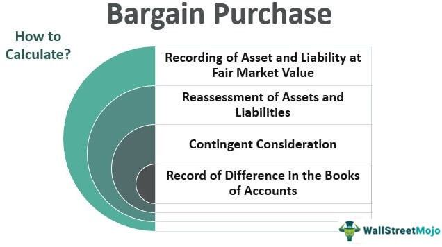

In the ever-evolving financial landscape, understanding key concepts like financial contracts and lease agreements is crucial. This article explores the intricate world of financial contracts, focusing on bargain purchase options within lease agreements and their connection with algorithmic trading.

Bargain purchase options allow lessees to acquire leased assets at a price lower than the market value, a component that is significant in capital lease accounting. These options provide a strategic advantage, enabling lessees to eventually own assets under favorable conditions. This facet of lease agreements plays a pivotal role in how leases are classified and reported in financial statements, influencing decisions and strategies for both lessees and lessors.

Algorithmic trading, a transformative force in modern finance, optimizes trading execution using complex algorithms, improving efficiency and precision. Its integration with financial contracts and lease accounting can enhance compliance, streamline operations, and provide deeper insights through advanced data analysis. By applying algorithms to lease management and financial contracts, companies can make more informed decisions, optimize asset management, and improve overall financial outcomes.

This article aims to provide a comprehensive overview of how these financial mechanisms interact and influence one another, highlighting their combined impact on modern finance. Join us as we examine the complex interactions between financial contracts, lease agreements, and algorithmic trading, shedding light on their roles in shaping contemporary financial strategies.

## Table of Contents

## Understanding Financial Contracts and Lease Agreements

A financial contract is a legally binding agreement between parties established to manage financial transactions. These contracts serve as foundational elements in the financial systems, underpinning various types of agreements including lease agreements, derivatives, bonds, and more. Financial contracts are critical for allocating risk, managing resources, and providing an avenue for parties to fulfill economic objectives.

Lease agreements, a prevalent form of financial contract, focus on the provision and use of assets over a specified period. These leases can be categorized into two primary types: operating leases and capital leases. Understanding the distinctions between these two forms is essential for effective financial and strategic decision-making.

Operating leases typically do not transfer ownership rights of the asset to the lessee. Instead, they allow for the temporary use of an asset, making them beneficial for lessees who do not wish to assume the risks associated with asset ownership. In financial statements, operating leases are generally treated as rental expenses, and the leased asset does not appear on the balance sheet of the lessee. This treatment can affect various financial ratios and metrics, such as return on assets and debt-to-equity ratios.

Conversely, capital leases (also known as finance leases) are structured such that a substantial portion of the economic value of the ownership of the leased asset is transferred to the lessee. This type of lease is characterized by one or more of the following criteria: a lease term that covers a major portion of the asset's useful life, a present value of lease payments that significantly approximates the asset's fair market value, or the existence of a bargain purchase option. Capital leases are recorded on the lessee’s balance sheet as both an asset and a liability, which significantly impacts financial reporting and transparency.

A bargain purchase option within a lease agreement permits the lessee to acquire the leased asset at a price that is substantially lower than its expected fair market value at the end of the lease term. Such options incentivize lessees to eventually purchase the asset, aligning their long-term usage plans with ownership. Understanding whether a lease contains a bargain purchase option is crucial for appropriate classification and accounting treatment.

The differentiation between operating and capital leases carries significant implications for financial statements, affecting balance sheets, income statements, and cash flow statements. For instance, capital leases, with their on-balance sheet recognition, may influence a company’s leverage ratios and asset utilization metrics, while operating leases, though not capitalized, affect profit margins through lease expense recognition.

In summary, lease agreements as a segment of financial contracts play a vital role in asset management and financial strategy. By discerning the differences between operating and capital leases and recognizing the implications of bargain purchase options, companies can better manage their assets, comply with accounting standards, and enhance their financial reporting. The intricate rules governing these contracts necessitate careful consideration and, often, professional guidance to ensure accuracy and compliance in financial documentation.

## Bargain Purchase Options in Lease Agreements

A bargain purchase option in lease agreements provides a strategic advantage for lessees by allowing them to acquire the leased asset at a price below its expected market value at the end of the lease term. This feature is particularly advantageous if market conditions remain favorable, enabling lessees to benefit from ownership while incurring lower costs. From a financial and strategic perspective, bargain purchase options can significantly influence a lessee's decision-making process regarding asset acquisition.

Under the Financial Accounting Standards Board (FASB) guidelines, leases equipped with bargain purchase options are predominantly classified as capital leases (now referred to as finance leases under ASC 842). This classification is rooted in the substantial transfer of ownership benefits to the lessee. The presence of a bargain purchase option indicates a shift in the risks and rewards associated with ownership, thereby justifying the capital lease categorization.

The criteria for identifying a bargain purchase option include the option's price being significantly lower than the projected fair market value of the asset at the end of the lease. Additionally, the option must be exercisable at a time when the lessee can reasonably predict the economic benefits of ownership. This ensures that the lessee makes an informed choice based on the likely economic outcome.

Financially, bargain purchase options provide several benefits. They offer the potential for cost savings, as the lessee pays less than the market value to obtain ownership. Strategically, these options enable lessees to secure essential assets for business operations at favorable terms, allowing for better financial planning and resource allocation.

The exercise of a bargain purchase option has implications for financial reporting and asset management. Upon exercising the option, the lessee typically records the asset as a fixed asset on the balance sheet and recognizes depreciation over its useful life. This transition from lease to ownership affects key financial ratios and performance metrics, thus influencing stakeholders' perceptions and decision-making processes regarding the company's financial health.

In conclusion, bargain purchase options within lease agreements present a valuable opportunity for lessees to optimize their financial strategies, provided they understand the accounting requirements and potential benefits. As businesses continue to navigate complex financial landscapes, these options serve as a crucial element in structuring leases that align with long-term operational goals.

## Interplay with Algorithmic Trading

Algorithmic trading, known for its transformative impact on financial markets, facilitates rapid and precise execution of trades by utilizing sophisticated mathematical models. This efficiency can be extended to enhance lease accounting processes, primarily through improved accuracy in lease classification and documentation. Integration of [algorithmic trading](/wiki/algorithmic-trading) principles into lease management can streamline operations, reduce human error, and ensure compliance with financial regulations.

One application of algorithmic trading in lease management is the automated assessment of bargain purchase options. Algorithms can evaluate various market conditions and lease terms, providing real-time insights into whether exercising a bargain purchase option aligns with a company's financial strategy. By analyzing historical data and forecast models, these algorithms help in making informed decisions, which can maximize financial benefits.

The automation of lease processes through algorithms can lead to significant advancements in financial contracting. For instance, algorithms can continuously monitor lease payments and obligations, flagging discrepancies and potential financial exposures promptly. This proactive approach allows companies to manage their lease portfolios effectively, improving asset management and financial planning.

Furthermore, the technology underpinning algorithmic trading, such as [machine learning](/wiki/machine-learning) and [artificial intelligence](/wiki/ai-artificial-intelligence), can catalyze innovations in financial contracts. These technologies can be employed to develop predictive models that assess market trends and economic indicators, thereby influencing the strategic planning of lease agreements.

In summary, embedding algorithmic trading techniques within lease accounting can enhance operational efficiency, strategic decision-making, and financial oversight. This technological synergy promises a forward-looking approach to managing financial transactions and contracts, ensuring alignment with advanced financial strategies.

## Tax and Accounting Implications

Capital leases, especially those featuring bargain purchase options, hold substantial tax and accounting implications that warrant careful consideration. As per accounting standards, these leases need to be recorded on a company's balance sheet, affecting various financial metrics, such as asset and liability positions. This is primarily because capital leases, unlike operating leases, signify a transfer of ownership akin to asset purchase, thereby influencing both the depreciation and interest expenses reported in financial statements.

**Tax Implications**

Under capital lease arrangements, the lessee essentially treats the lease as a purchase of the property. Accordingly, the asset acquired through a capital lease is subject to depreciation over its useful life. This allows businesses to deduct depreciation expenses from taxable income, potentially reducing tax liability. Additionally, lease payments are split between interest expense and principal repayment, with the former being tax-deductible. 

Given the presence of a bargain purchase option, the expected behavior regarding tax could change significantly. This option frequently positions the lessee as the eventual owner of the asset, permitting further strategic planning regarding depreciation. The Internal Revenue Service (IRS) meticulously investigates the fair value assessments of such options to prevent misreporting and potential tax avoidance.

**Accounting Standards**

Accounting for capital leases is governed by standards such as the Financial Accounting Standards Board (FASB) ASC 842. This standard requires that leases be recognized on the balance sheet as right-of-use assets with an accompanying lease liability representing the present value of future lease payments. For capital leases with bargain purchase options, the present value calculations should reflect the bargain purchase price as part of the minimum lease payments.

Additionally, if a lease involves a bargain purchase option, it is frequently classified as a capital lease from inception due to the substantial rights conveyed. The criteria under ASC 842 necessitate that the business determines whether this option is 'reasonably certain' to be exercised, which influences lease classification and subsequent reporting.

**Financial Disclosures and Transparency**

The inclusion of capital leases and their implications in financial disclosures plays a crucial role in enhancing a company's financial transparency. Investors and stakeholders rely heavily on these disclosures to understand the commitments and potential future cash outflows of a company.

For leases containing bargain purchase options, transparency in financial notes is essential. Companies must provide details on the terms and conditions of such options, along with insight into assumptions used for duration and interest rates applied in calculations. This improves clarity and helps in assessing the risk and financial strategy of the entity.

Ultimately, the proper treatment of bargain purchase options in capital leases is a fundamental component of financial reporting and tax management strategies. It necessitates diligent evaluation of applicable standards and principles, ensuring that financial statements accurately reflect a company's economic obligations and potential tax outcomes.

## Case Studies and Practical Applications

Examining real-world scenarios where companies have implemented bargain purchase options within lease agreements reveals both the strategic advantages and potential challenges of such financial instruments. By analyzing these case studies, businesses can better navigate their financial contracts to optimize outcomes.

### Case Study 1: Industrial Equipment Leasing

A manufacturing firm, primarily engaged in heavy machinery production, negotiated a lease agreement for new industrial equipment. The lease included a bargain purchase option, allowing the firm to acquire the machinery at significantly below market value upon lease termination. Throughout the lease term, the company's strategic goal was to assess the future utility of the equipment against technological advancements and market conditions.

The firm leveraged algorithmic trading models to forecast market trends and equipment demand. Using Python, the algorithm processed historical usage data and market price indices to determine the optimal timing for exercising the bargain purchase option. This approach minimized risk by ensuring the acquisition aligned with favorable market conditions, ultimately leading to a 15% reduction in production costs over five years as the machinery was acquired at a lower-than-market rate.

### Case Study 2: Retail Space Optimization

A prominent retail chain utilized bargain purchase options in its lease agreements to expand store locations rapidly. The management aimed to secure prime retail spaces while retaining the flexibility to purchase these properties upon lease maturity if strategic locations proved successful.

To support their decision-making process, the chain implemented a machine learning model to analyze customer foot traffic and sales data. The algorithm, developed in Python, identified trends that correlated property locations with heightened profitability, assisting in making informed purchase decisions. This data-driven approach resulted in a 20% increase in store profitability in locations where the bargain purchase option was exercised.

### Best Practices for Structuring Financial Contracts

#### 1. Detailed Market Analysis

Conduct a comprehensive market analysis to ascertain the potential future value of leased assets. By integrating algorithmic trading techniques, companies can project market conditions more accurately and make informed decisions regarding the exercise of bargain purchase options.

#### 2. Flexible Lease Terms

Incorporate flexibility in the lease agreements to adjust terms based on evolving business strategies and market conditions. A well-structured contract includes clauses that allow renegotiation or early exercise of purchase options.

#### 3. Advanced Predictive Models

Utilize predictive modeling and data analysis tools to process market and asset data, enabling better positioning and strategic decision-making regarding asset acquisition.

#### 4. Rigorous Risk Assessment

Implement risk assessment frameworks to evaluate the financial implications of exercising purchase options under varying market scenarios. This includes assessing depreciation, interest rates, and potential tax implications.

By embracing these practices and learning from empirical case studies, companies can craft financial contracts that not only meet immediate operational needs but also offer strategic benefits in the long term, enhancing overall financial performance.

## Conclusion

Financial contracts, bargain purchase options, and algorithmic trading are integral to modern finance, each playing a unique role in shaping financial strategies and outcomes. Financial contracts, by establishing clear terms and obligations between parties, provide the framework for structured financial transactions. Bargain purchase options in lease agreements offer strategic opportunities for lessees to acquire assets below market value, influencing decisions on capital investments and asset management. Meanwhile, algorithmic trading leverages sophisticated algorithms to enhance the efficiency and precision of trading activities, allowing for optimized execution and increased compliance in financial markets.

Leveraging these tools effectively can significantly boost a company's financial strategy and performance. By understanding the nuances of bargain purchase options, businesses can make informed decisions that align with long-term financial goals. Similarly, the integration of algorithmic trading into financial contract management can streamline processes and improve accuracy.

This article has explored the essentials of bargain purchase options within lease agreements and their interaction with technology-driven trading solutions. As the financial landscape continues to change, staying abreast of these concepts and their application will be critical for achieving and maintaining success. Continuous learning and adaptation of these financial mechanisms can provide companies with a competitive edge in an ever-evolving market.

## References & Further Reading

[1]: ["Accounting for Leases: Past, Present and Future Research"](https://ijebmr.com/uploads/pdf/archivepdf/2020/ART_01_16.pdf) by Ma, R. (2020). Abacus, 56(3), 273-307.

[2]: ["International Financial Reporting Standards (IFRS) and Bargain Purchase Options"](https://accountinginsights.org/bargain-purchases-financial-reporting-tax-implications-and-due-diligence/) International Financial Reporting Standards.

[3]: ["Algorithmic Trading and DMA: An Introduction to Direct Access Trading Strategies"](https://www.amazon.com/Algorithmic-Trading-DMA-introduction-strategies/dp/0956399207) by Barry Johnson

[4]: ["Advances in Financial Machine Learning"](https://www.amazon.com/Advances-Financial-Machine-Learning-Marcos/dp/1119482089) by Marcos Lopez de Prado

[5]: ["Guidelines for Implementing FASB ASC 842"](https://finquery.com/blog/asc-842-summary-new-lease-accounting-standards/) Financial Accounting Standards Board

[6]: ["Essentials of Financial Risk Management"](https://onlinelibrary.wiley.com/doi/book/10.1002/9781118386392) by Karen A. Horcher

[7]: ["Lease Accounting Under Financial Reporting Standards"](https://rsmus.com/insights/financial-reporting/a-guide-to-lessee-accounting-under-asc-842.html) by Warren Ruppel

[8]: ["The Mathematics of Financial Derivatives: A Student Introduction"](https://archive.org/details/mathematicsoffin00wilm) by Paul Wilmott

[9]: ["A Guide to Algorithmic Trading"](https://www.quantifiedstrategies.com/algorithmic-trading/) by Rajib Mall 

[10]: ["Auditing with a Bargain Purchase Option"](https://accountinginsights.org/bargain-purchases-financial-reporting-tax-implications-and-due-diligence/) by Jonathan L. Rogers, et al. (2019). The Accounting Review, 94(3), 189-212.