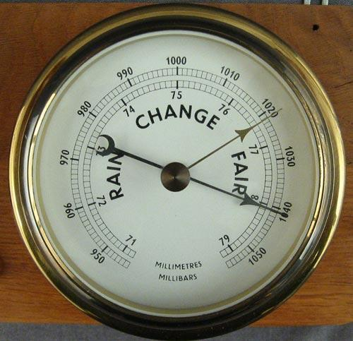

## Table of Contents

## What is a barometer?

A barometer is a tool that measures air pressure. It helps us know if the weather is going to change. When the air pressure goes up, it usually means the weather will be nice. When the air pressure goes down, it might mean a storm is coming.

There are different kinds of barometers. One kind is called an aneroid barometer. It uses a small metal box that changes shape when the air pressure changes. Another kind is called a mercury barometer. It uses a tube filled with mercury. The level of mercury in the tube goes up or down depending on the air pressure.

## How does a barometer measure atmospheric pressure?

A barometer measures atmospheric pressure by using different methods depending on its type. An aneroid barometer uses a small, sealed metal box called an aneroid capsule. Inside this capsule, there is a partial vacuum. When the atmospheric pressure changes, it makes the capsule expand or contract. This movement is then turned into a reading on a dial or a digital display, showing the pressure.

A mercury barometer works differently. It has a glass tube filled with mercury that is closed at one end and open at the other. The open end is placed in a dish of mercury. As the atmospheric pressure changes, it pushes on the mercury in the dish, making the level of mercury in the tube go up or down. The height of the mercury column in the tube tells us the atmospheric pressure.

Both types of barometers help us understand the weather by showing changes in air pressure. When the pressure goes up, it often means good weather is coming. When it goes down, it might mean a storm is on the way.

## What are the main types of barometers?

There are two main types of barometers: aneroid barometers and mercury barometers. Aneroid barometers are the most common type used today. They work with a small metal box called an aneroid capsule. Inside this capsule, there is less air than outside, so when the air pressure changes, the capsule moves. This movement is shown on a dial or a digital screen, telling us the pressure.

Mercury barometers are another type, but they are not used as much anymore because mercury can be dangerous. A mercury barometer has a glass tube filled with mercury. One end of the tube is closed, and the other end sits in a dish of mercury. When the air pressure changes, it pushes on the mercury in the dish, making the level in the tube go up or down. The height of the mercury in the tube shows us the air pressure.

Both types of barometers help us know about the weather. When the pressure goes up, it usually means the weather will be good. When it goes down, it might mean a storm is coming.

## What is an aneroid barometer and how does it work?

An aneroid barometer is a device that measures air pressure without using any liquid, like mercury. It is called "aneroid" because it uses a small, sealed metal box called an aneroid capsule. Inside this capsule, there is a bit of a vacuum, which means there is less air than outside. When the air pressure outside changes, it makes the capsule move. This movement is connected to a needle or a dial, or shown on a digital screen, so we can see the pressure.

The way it works is pretty cool. When the air pressure goes up, it pushes on the capsule and makes it shrink a bit. When the air pressure goes down, the capsule expands because there is less pressure pushing on it. These tiny movements are made bigger by a system of levers and springs, which move the needle or change the numbers on the display. This helps us know if the weather is going to change, because high pressure usually means good weather, and low pressure can mean a storm is coming.

## What is a mercury barometer and how does it work?

A mercury barometer is a device that measures air pressure using a liquid called mercury. It has a glass tube that's closed at one end and open at the other. The open end of the tube sits in a dish filled with mercury. When the air pressure outside changes, it pushes on the mercury in the dish, making the level of mercury inside the tube go up or down.

The height of the mercury in the tube shows us the air pressure. If the air pressure is high, it pushes harder on the mercury in the dish, making the level in the tube go up. If the air pressure is low, there's less push, so the level in the tube goes down. By looking at how high the mercury is in the tube, we can tell if the weather might change. High pressure usually means good weather, while low pressure might mean a storm is coming.

## How can a barometer be used to predict weather changes?

A barometer helps us predict weather changes by measuring the air pressure. When the air pressure goes up, it usually means the weather will be nice. This is because high pressure often brings clear skies and calm weather. So, if you see the barometer reading going up, you can expect good weather to come.

On the other hand, when the air pressure goes down, it might mean a storm is coming. Low pressure can bring clouds, rain, and sometimes even storms. If you notice the barometer reading going down, it's a good idea to get ready for some bad weather. By keeping an eye on the barometer, you can get a heads-up on what the weather might do next.

## What are the advantages and disadvantages of using an aneroid barometer over a mercury barometer?

Aneroid barometers have several advantages over mercury barometers. They are safer because they don't use mercury, which can be harmful if it spills. Aneroid barometers are also easier to carry around because they are smaller and lighter. They can be made into digital versions, which are easy to read and can show more information like graphs of pressure changes over time. Plus, aneroid barometers are less expensive to make and buy, so more people can use them.

However, aneroid barometers also have some disadvantages. They need to be checked and adjusted sometimes to make sure they are giving the right readings. This is because the aneroid capsule can wear out over time. Also, aneroid barometers might not be as accurate as mercury barometers, especially in places with big changes in air pressure. Mercury barometers are very good at giving exact readings, but they are not used as much anymore because of the dangers of mercury.

In summary, aneroid barometers are safer, easier to use, and more affordable, but they might need more maintenance and can be less accurate than mercury barometers. Mercury barometers are very accurate but come with the risk of mercury exposure, making them less common today.

## How accurate are barometers in measuring atmospheric pressure?

Barometers are pretty good at measuring air pressure, but how accurate they are can depend on the type of barometer. Mercury barometers are very accurate. They use mercury in a tube to show the pressure, and this method gives very exact readings. If you need to know the air pressure down to the smallest detail, a mercury barometer is a great choice. But, they are not used as much anymore because mercury can be dangerous if it spills.

Aneroid barometers are also accurate, but they might not be as exact as mercury barometers. They use a small metal box that moves when the air pressure changes. This movement is shown on a dial or a digital screen. Aneroid barometers are good enough for most people who want to know about the weather, but they can sometimes need to be checked and adjusted to make sure they are giving the right readings. They are safer and easier to use than mercury barometers, so they are more common today.

## What are some common applications of barometers in daily life and professional fields?

In daily life, people use barometers to keep an eye on the weather. If you like to go outside a lot, like hiking or sailing, a barometer can tell you if a storm is coming or if it's going to be a nice day. You can have a barometer at home or even on your phone as an app. It's really handy because it gives you a heads-up on what to expect, so you can plan your day better and stay safe.

In professional fields, barometers are used in many ways. Weather forecasters use them to help predict the weather for TV and radio reports. Pilots and sailors use barometers to make sure it's safe to fly or sail. Scientists also use barometers in research to study how air pressure changes over time and how it affects the environment. These professionals need accurate readings to do their jobs well, so they often use high-quality barometers.

## How has the technology of barometers evolved over time?

The technology of barometers has changed a lot since they were first made. The first barometer was made by an Italian scientist named Evangelista Torricelli in the 1600s. He used a glass tube filled with mercury to measure air pressure. This was called a mercury barometer. Over time, people found ways to make these barometers better, like making them smaller and easier to read. But mercury is dangerous, so scientists started looking for safer ways to measure air pressure.

In the 1800s, the aneroid barometer was invented. It doesn't use any liquid, which makes it safer and easier to carry around. It uses a small metal box that moves when the air pressure changes. This was a big step forward because it meant more people could use barometers without worrying about mercury. Today, aneroid barometers are even more advanced. They can be digital, showing numbers on a screen, and they can keep track of air pressure over time. This helps people predict the weather better and use barometers in more ways, like in phones and watches.

## What are the calibration standards for barometers?

Barometers need to be checked and adjusted sometimes to make sure they are giving the right readings. This is called calibration. The standard way to calibrate a barometer is to compare it with a special barometer that we know is very accurate. This special barometer is usually kept in a lab and is checked very often. When we calibrate a barometer, we adjust it so that it shows the same reading as the special barometer. This helps make sure that the barometer is giving correct information about the air pressure.

Different places might have their own rules for how often barometers should be calibrated. For example, weather stations might need to check their barometers every year, while a barometer used at home might not need to be checked as often. The important thing is to follow the rules for the kind of barometer you have and where you are using it. This way, you can trust that your barometer is giving you good information about the weather.

## What advanced techniques are used in modern barometric research and development?

In modern barometric research and development, scientists use advanced computer models to study how air pressure changes and what it means for the weather. These models help them understand big weather patterns and make better predictions. They also use special sensors that can measure air pressure very accurately. These sensors can be put on weather balloons, airplanes, or even satellites to collect data from all over the world. This helps scientists see how air pressure changes in different places and how it affects the weather.

Another important technique is using digital aneroid barometers. These are very good at giving quick and accurate readings of air pressure. They can be connected to computers and other devices, so the data they collect can be used right away. Scientists also work on making these barometers smaller and more portable. This means they can be used in more places, like on drones or in remote areas, to gather more information about the air pressure. All these techniques help scientists learn more about the weather and make better predictions.

## What is the role of a Barometer in Algorithmic Trading?

Algorithmic trading has revolutionized financial markets, providing traders with the tools to execute trades with high speed and precision by utilizing various indicators and data sources. In this context, barometers play a crucial role in optimizing trading strategies. They enable traders to conduct technical analysis and integrate [artificial intelligence](/wiki/ai-artificial-intelligence) (AI) into their trading systems, thereby enhancing both predictive accuracy and trading efficiency.

One of the primary uses of barometers in [algorithmic trading](/wiki/algorithmic-trading) is through technical analysis. Traders employ technical indicators like moving averages and the Relative Strength Index (RSI) to make informed trading decisions. Moving averages are utilized to identify trends by smoothing out price data over a specified period. The simple moving average (SMA) is calculated by taking the arithmetic mean of a given set of prices over a defined number of periods. For example, a 10-day SMA would be expressed mathematically as:

$$
SMA = \frac{P_1 + P_2 + \ldots + P_{10}}{10}
$$

where $P_1, P_2, \ldots, P_{10}$ are the closing prices for each of the 10 days. This tool helps traders ascertain the market direction and detect potential reversals.

The Relative Strength Index (RSI), developed by J. Welles Wilder, Jr., is another widely used barometric indicator. It measures the magnitude of recent price changes to evaluate overbought or oversold conditions in the market, with values ranging from 0 to 100. Traders typically interpret an RSI above 70 as overbought and below 30 as oversold, which could prompt trading actions such as buying a potentially undervalued asset or selling an overvalued one.

Moreover, barometers are increasingly integrated with AI to enhance the predictive analytics component of algorithmic trading. AI algorithms can process and analyze vast datasets, thereby identifying patterns that may not be visible to human traders. This capability allows for the development of complex trading algorithms that incorporate machine learning models to predict future market moves with greater accuracy.

Machine learning models, such as neural networks or support vector machines (SVM), benefit from barometric data by training on historical data to forecast future trends. A simple illustrative Python snippet to create a machine learning model for financial forecasting might look like this:

```python
from sklearn.model_selection import train_test_split
from sklearn.svm import SVR
import numpy as np

# Hypothetical example where X is the feature set; Y is the target variable
X = np.array([...])  # Barometric data inputs
Y = np.array([...])  # Corresponding market trend outputs

# Splitting data into training and testing sets
X_train, X_test, Y_train, Y_test = train_test_split(X, Y, test_size=0.2, random_state=42)

# Creating and training the Support Vector Regression model
model = SVR(kernel='rbf')
model.fit(X_train, Y_train)

# Making predictions
predictions = model.predict(X_test)
```

By leveraging both technical analysis tools and AI's capacity to handle extensive datasets, traders can construct robust algorithmic trading strategies. These strategies not only facilitate timely and precise execution but also allow traders to anticipate and respond to market conditions more effectively, optimizing their decision-making process. As technology continues to advance, the role of barometers as part of algorithmic trading frameworks is expected to grow, offering even greater potential for innovation in financial markets.

## References & Further Reading

[1]: Reinhart, C. M., & Rogoff, K. S. (2009). ["The Aftermath of Financial Crises,"](https://www.nber.org/papers/w14656) American Economic Review.

[2]: ["The January Barometer,"](https://www.investopedia.com/terms/j/januarybarometer.asp) Investopedia.

[3]: Bergstra, J., Bardenet, R., Bengio, Y., & Kégl, B. (2011). ["Algorithms for Hyper-Parameter Optimization."](https://dl.acm.org/doi/10.5555/2986459.2986743) Advances in Neural Information Processing Systems 24.

[4]: ["Advances in Financial Machine Learning"](https://www.amazon.com/Advances-Financial-Machine-Learning-Marcos/dp/1119482089) by Marcos Lopez de Prado.

[5]: ["Evidence-Based Technical Analysis: Applying the Scientific Method and Statistical Inference to Trading Signals"](https://www.amazon.com/Evidence-Based-Technical-Analysis-Scientific-Statistical/dp/0470008741) by David Aronson.