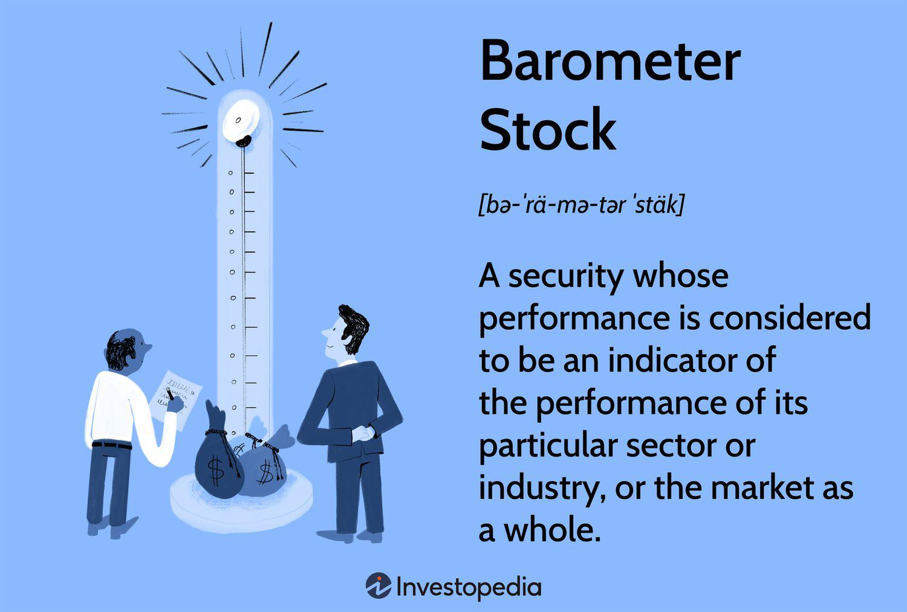

## Table of Contents

## What is a barometer stock?

A barometer stock is a type of stock that people watch closely to understand how the whole stock market is doing. It's like a weather barometer that tells you if it's going to be sunny or rainy. These stocks are usually from big, well-known companies that are important in their industry. When these stocks go up or down, it often means the whole market might be going in that direction too.

For example, if a barometer stock like Apple or Microsoft goes up a lot, it might mean that investors are feeling good about the market and are buying more stocks. On the other hand, if these stocks go down, it could be a sign that investors are worried and might start selling their stocks. By watching these barometer stocks, people can get a quick idea of what's happening in the market without looking at every single stock.

## Why are barometer stocks important for investors?

Barometer stocks are important for investors because they give a quick and easy way to see how the whole stock market is doing. These stocks are from big, well-known companies that a lot of people pay attention to. When these stocks go up or down, it can tell investors if the market is feeling good or worried. This helps investors make decisions about buying or selling their own stocks without having to look at every single stock in the market.

For example, if a barometer stock like Apple goes up a lot, it might mean that other stocks could go up too. Investors might see this as a good time to buy more stocks. On the other hand, if a barometer stock like Microsoft goes down, it could be a sign that the market is not doing well. This might make investors think about selling some of their stocks to avoid losing money. By keeping an eye on barometer stocks, investors can get a sense of the market's direction and adjust their strategies accordingly.

## Can you name some common examples of barometer stocks?

Barometer stocks are usually from big companies that a lot of people know about. Some common examples are Apple, Microsoft, and Amazon. These companies are important in the technology industry and when their stocks go up or down, it can tell us a lot about what's happening in the whole stock market.

Another example of a barometer stock is the Dow Jones Industrial Average. It's not a single stock but a group of 30 big companies like Boeing, Coca-Cola, and Walmart. When the Dow Jones goes up or down, it's a sign of how the market is doing overall. People watch it closely to see if the market is feeling good or worried.

Other examples include companies like Google's parent company Alphabet, and financial giants like JPMorgan Chase. These stocks are watched by investors because they can show if the market is going up or down, helping people decide if it's a good time to buy or sell their own stocks.

## How do barometer stocks reflect the overall market sentiment?

Barometer stocks reflect the overall market sentiment because they are from big, well-known companies that people pay attention to. When these stocks go up, it often means that investors are feeling good about the market. They think the economy is doing well and they want to buy more stocks. This positive feeling can spread to other stocks, making the whole market go up. For example, if Apple's stock price goes up a lot, it might make people think that other tech stocks will go up too, so they start buying those stocks as well.

On the other hand, when barometer stocks go down, it can be a sign that investors are worried. They might think the economy is not doing well and they want to sell their stocks to avoid losing money. This negative feeling can spread to other stocks, making the whole market go down. For instance, if Microsoft's stock price drops a lot, it might make people think that other big companies will have problems too, so they start selling their stocks. By watching barometer stocks, investors can get a quick idea of how the market is feeling and make their decisions based on that.

## What sectors typically include barometer stocks?

Barometer stocks are often from the technology sector. Companies like Apple, Microsoft, and Amazon are big names in tech, and when their stocks go up or down, it can tell us a lot about how the whole market is feeling. These companies are important because they make products and services that a lot of people use every day. When people feel good about the economy, they might buy more tech products, which can make the stocks of these companies go up.

Another sector that often has barometer stocks is finance. Big banks like JPMorgan Chase and investment companies like Goldman Sachs are watched closely by investors. When their stocks go up, it might mean that people think the economy is doing well and they want to invest more money. If these stocks go down, it could be a sign that people are worried about the economy and might start taking their money out of the market.

Sometimes, barometer stocks can also come from other important sectors like consumer goods or healthcare. For example, companies like Procter & Gamble in consumer goods or Johnson & Johnson in healthcare can be barometer stocks. When their stocks move, it can show how people are feeling about spending money on everyday items or healthcare products, which can tell us about the overall market sentiment.

## How can one identify a barometer stock?

To identify a barometer stock, look for big, well-known companies that a lot of people pay attention to. These companies are usually leaders in their industries, like Apple in technology or JPMorgan Chase in finance. When their stocks go up or down, it can show how the whole market is feeling. People watch these stocks because they can tell us if investors are feeling good or worried about the economy.

Another way to spot a barometer stock is to see if it's part of a major stock index like the Dow Jones Industrial Average or the S&P 500. These indexes include big companies from different sectors, and when their stocks move, it can affect the whole index. If a stock is in one of these indexes, it's likely a barometer stock because people use the index to understand the market's direction. By keeping an eye on these stocks, investors can get a quick idea of how the market is doing without looking at every single stock.

## What are the risks associated with investing in barometer stocks?

Investing in barometer stocks can be risky because these stocks can go up and down a lot. Since people watch them closely, any news about the company or the economy can make the stock price change quickly. If a lot of people start selling the stock because they're worried, the price can drop fast. This means you could lose money if you bought the stock when it was high and then it goes down.

Another risk is that barometer stocks might not always be a good sign of the whole market. Sometimes, the stock might go up or down because of things that only affect that company, not the whole market. For example, if Apple has a problem with one of its products, its stock might go down even if the rest of the market is doing well. This can make it hard to know if the stock is showing the right picture of the market. So, it's important to look at other things too, not just the barometer stock, before making decisions about your investments.

## How do barometer stocks perform during economic cycles?

Barometer stocks often go up and down with the economy. When the economy is doing well, people feel good about spending money and investing. This can make barometer stocks like Apple or Microsoft go up because more people want to buy their products and invest in their stocks. During good times, these stocks can be a sign that the whole market is feeling happy and growing.

On the other hand, when the economy is not doing well, people might be worried about losing their jobs or not having enough money. This can make them sell their stocks, including barometer stocks, which can cause the prices to go down. During bad times, these stocks can show that the market is feeling scared and shrinking. So, barometer stocks can help us see if the economy is in a good cycle or a bad one.

## What technical indicators are useful for analyzing barometer stocks?

When looking at barometer stocks, one useful technical indicator is the moving average. This helps you see the average price of the stock over a certain time, like 50 days or 200 days. If the stock price is above the moving average, it might mean the stock is doing well and could keep going up. If it's below the moving average, it might mean the stock is not doing so well and could keep going down. This can help you decide if it's a good time to buy or sell the stock.

Another helpful indicator is the Relative Strength Index (RSI). The RSI tells you if a stock is being bought a lot or sold a lot. If the RSI is over 70, it means the stock might be bought too much and could go down soon. If it's under 30, it means the stock might be sold too much and could go up soon. By watching the RSI, you can see if a barometer stock is getting too expensive or too cheap, which can help you make better choices about when to buy or sell.

## How do global economic events influence barometer stocks?

Global economic events can have a big impact on barometer stocks. When something big happens around the world, like a financial crisis or a trade war, it can make investors feel worried or excited. If there's good news, like a country's economy growing fast, people might want to buy more stocks, including barometer stocks. This can make the prices of these stocks go up. For example, if China and the U.S. agree on a new trade deal, it might make investors feel good about the future, and they might buy more stocks like Apple or Microsoft, making their prices go up.

On the other hand, if there's bad news, like a war or a big company going bankrupt, it can make investors feel scared. They might start selling their stocks, including barometer stocks, which can make the prices go down. For instance, if there's a big problem in the oil industry, it might make people worried about the economy, and they might sell stocks like ExxonMobil, causing its price to drop. By watching how barometer stocks react to global events, investors can get a quick idea of how the whole market is feeling and make their decisions based on that.

## What strategies can investors use to leverage barometer stocks for portfolio management?

Investors can use barometer stocks to help them manage their portfolios by watching how these stocks move. Barometer stocks are from big companies that a lot of people pay attention to, like Apple or Microsoft. When these stocks go up, it might mean the whole market is doing well, so investors might want to buy more stocks. If the barometer stocks go down, it could be a sign that the market is not doing so well, and investors might think about selling some of their stocks to avoid losing money. By keeping an eye on barometer stocks, investors can get a quick idea of what's happening in the market and adjust their portfolios accordingly.

Another strategy is to use barometer stocks as a way to see if it's a good time to invest more money or take some money out of the market. For example, if barometer stocks like Amazon or JPMorgan Chase are going up a lot, it might be a good time to put more money into the market because other stocks might go up too. On the other hand, if these stocks are going down a lot, it might be a good time to take some money out of the market to avoid big losses. By using barometer stocks as a guide, investors can make smarter decisions about when to buy or sell their stocks and manage their portfolios better.

## How have historical trends of barometer stocks predicted market shifts?

Barometer stocks have often helped people see what's coming in the market. For example, before the big crash in 2008, stocks like Lehman Brothers and Bear Stearns started going down a lot. People who were watching these stocks saw that something was wrong and started selling their own stocks before the crash got really bad. This shows how barometer stocks can give early warnings about big changes in the market.

Another time barometer stocks helped was during the dot-com bubble in the late 1990s. Stocks like Cisco and Microsoft were going up and up, making people think the market would keep growing forever. But then, when these stocks started to fall, it was a sign that the bubble was about to burst. People who paid attention to these barometer stocks could get out of the market before losing too much money. So, by watching how barometer stocks move, investors can get a good idea of what might happen next in the market.

## How can indicators be integrated in algo trading?

Technical indicators are a cornerstone of [algorithmic trading](/wiki/algorithmic-trading) setups, offering quantitative metrics that guide decision-making. Indicators such as the Moving Average Convergence Divergence (MACD), Relative Strength Index (RSI), and moving averages are widely utilized due to their ability to analyze price trends and market [momentum](/wiki/momentum).

1. **Technical Indicators in Algo Trading**: 
   - **MACD** is used to identify changes in the strength, direction, momentum, and duration of a trend in a stock's price. It is calculated using the formula:  
$$
     \text{MACD} = \text{EMA}_{\text{short}} - \text{EMA}_{\text{long}}

$$
     where $\text{EMA}_{\text{short}}$ and $\text{EMA}_{\text{long}}$ are exponential moving averages for short and long periods, respectively.

   - **RSI** assesses the magnitude of recent price changes to evaluate overbought or oversold conditions. It is calculated as follows:  
$$
     \text{RSI} = 100 - \left(\frac{100}{1 + \frac{\text{Average Gain}}{\text{Average Loss}}}\right)

$$

   - **Moving Averages** smooth out price data to identify the direction of the trend by eliminating short-term fluctuations. They are crucial for trend-following algo strategies.

2. **Agility through Economic and Technical Indicators**: 
   By continuously monitoring both technical and economic indicators, algorithms gain the capability to swiftly react to market fluctuations. Economic indicators, such as GDP growth rates and inflation figures, also play a significant role in these strategies. Algorithms can incorporate real-time data to adjust and execute trades that align closely with the existing market conditions.

3. **Competitive Edge**:
   The integration of these indicators in algorithmic trading provides a competitive advantage by ensuring that trading strategies remain adaptive to market [volatility](/wiki/volatility-trading-strategies). This adaptability not only enhances the precision of trade execution but also aligns trades with prevailing economic trends, thereby maximizing potential gains. For instance, when an upward trend is detected through technical indicators, an algorithm can swiftly initiate buy orders, capitalizing on anticipated price increases.

4. **Python Code Implementation**:
   Below is a simple Python example demonstrating the calculation of a moving average using the `pandas` library:

   ```python
   import pandas as pd

   # Sample price data
   data = {'Price': [100, 102, 101, 104, 107, 105]}
   df = pd.DataFrame(data)

   # Calculate the simple moving average
   df['SMA'] = df['Price'].rolling(window=3).mean()

   print(df)
   ```

Incorporating these technical and economic indicators within algorithmic trading protocols allows for a dynamic strategy that evolves alongside market conditions, providing a robust framework for making informed trading decisions. Thus, an integrated approach not only caters to current market evaluations but also forecasts possible future market behaviors.

## References & Further Reading

[1]: Bergstra, J., Bardenet, R., Bengio, Y., & Kégl, B. (2011). ["Algorithms for Hyper-Parameter Optimization."](https://dl.acm.org/doi/10.5555/2986459.2986743) Advances in Neural Information Processing Systems 24.

[2]: ["Advances in Financial Machine Learning"](https://www.amazon.com/Advances-Financial-Machine-Learning-Marcos/dp/1119482089) by Marcos Lopez de Prado

[3]: ["Evidence-Based Technical Analysis: Applying the Scientific Method and Statistical Inference to Trading Signals"](https://www.amazon.com/Evidence-Based-Technical-Analysis-Scientific-Statistical/dp/0470008741) by David Aronson

[4]: ["Machine Learning for Algorithmic Trading"](https://github.com/stefan-jansen/machine-learning-for-trading) by Stefan Jansen

[5]: ["Quantitative Trading: How to Build Your Own Algorithmic Trading Business"](https://www.amazon.com/Quantitative-Trading-Build-Algorithmic-Business/dp/1119800064) by Ernest P. Chan