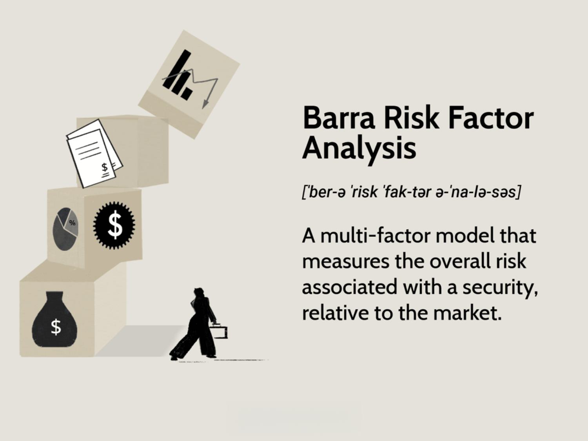

## Table of Contents

## What is Barra Risk Factor Analysis?

Barra Risk Factor Analysis is a way to understand and manage investment risks. It looks at different things that can affect how well investments do, like how the economy is doing, how companies are run, and even how people feel about the market. By figuring out these factors, investors can see what might make their investments go up or down.

This analysis helps investors make smarter choices. It groups risks into different types, like the risk from the whole market moving or risks specific to certain industries or companies. By understanding these risks, investors can pick investments that match what they want and how much risk they are okay with taking. This can lead to better investment results over time.

## How does Barra Risk Factor Analysis help in portfolio management?

Barra Risk Factor Analysis helps in portfolio management by giving investors a clear picture of the risks they are taking. It breaks down the risks into different parts, like the risk from the whole market, the risk from specific industries, and the risk from individual companies. By understanding these risks, investors can see which parts of their portfolio might be too risky or not risky enough. This helps them make their portfolio more balanced, so it matches their goals and how much risk they want to take.

Using Barra Risk Factor Analysis, investors can also see how different investments might affect their portfolio's overall risk. For example, if an investor wants to add a new stock, they can use this analysis to see how it might change the risk of their whole portfolio. This way, they can make smart choices about adding or removing investments. It's like having a map that shows the safest and riskiest paths, helping investors navigate their way to better investment results.

## What are the key components of a Barra risk model?

A Barra risk model has three main parts: risk factors, [factor](/wiki/factor-investing) returns, and factor exposures. Risk factors are the things that can affect how investments do, like the economy, how companies are run, or how people feel about the market. Factor returns show how much each risk factor has changed over time. Factor exposures tell us how much each investment is affected by these risk factors. By looking at these parts together, we can understand what might make an investment go up or down.

These parts help investors manage their portfolios better. By knowing the risk factors, investors can see what might affect their investments. Factor returns help them see how these factors have done in the past, which can give clues about the future. Factor exposures let investors see which investments might be more or less affected by these risks. This way, investors can pick investments that match their goals and how much risk they are okay with taking. It's like having a toolkit that helps investors build a strong and balanced portfolio.

## How are risk factors identified and categorized in Barra models?

In Barra models, risk factors are identified by looking at lots of data about how investments have done in the past. They look at things like how the economy is doing, how companies are run, and even how people feel about the market. By studying this data, they find patterns that show what makes investments go up or down. These patterns help them pick out the risk factors that matter the most.

Once the risk factors are found, they are put into different groups to make them easier to understand. There are usually three big groups: market risk, which is about the whole market moving; style risk, which is about things like how big a company is or how fast it's growing; and industry risk, which is about what kind of business a company is in. By sorting the risk factors this way, investors can see which parts of their investments might be more risky and make better choices about what to buy or sell.

## What is the difference between systematic and specific risk in Barra analysis?

In Barra analysis, systematic risk is the risk that affects the whole market or large parts of it. It comes from things like the economy, interest rates, or big events that everyone feels. This kind of risk can't be gotten rid of by just [picking](/wiki/asset-class-picking) different investments because it impacts everything. For example, if the economy goes into a recession, most stocks will go down no matter what. Barra models help investors understand this kind of risk by looking at factors like market returns and economic trends.

On the other hand, specific risk is about things that affect just one company or a small group of companies. It could be because of something happening inside the company, like a bad earnings report or a change in leadership. This kind of risk can be reduced by spreading investments across many different companies. Barra models measure specific risk by looking at how much each company's stock moves on its own, separate from the market. By understanding both types of risk, investors can make smarter choices about their portfolios.

## How does Barra use statistical methods to estimate risk factors?

Barra uses statistical methods to estimate risk factors by looking at a lot of data about how investments have done in the past. They use something called regression analysis, which is a way to see how different things are connected. For example, they might look at how stock prices change when the economy grows or when interest rates go up. By doing this, they can figure out which factors have the biggest impact on investments and how much they matter. This helps them create a list of risk factors that they can use to understand and predict how investments might do in the future.

Once they have the list of risk factors, Barra uses more [statistics](/wiki/bayesian-statistics) to see how much each investment is affected by these factors. They do this by looking at something called factor exposures, which show how sensitive each stock is to the different risk factors. For example, a tech company might be more affected by changes in technology trends than a food company. By understanding these exposures, Barra can help investors see which parts of their portfolio might be more risky and make better choices about what to buy or sell. This way, investors can manage their risks better and aim for better results.

## Can you explain the concept of factor exposures in Barra Risk Factor Analysis?

Factor exposures in Barra Risk Factor Analysis are like scores that show how much a stock or an investment is affected by different risk factors. These risk factors can be things like the economy, how big a company is, or what industry it's in. Each stock gets a score for each factor, and these scores tell us how sensitive the stock is to changes in those factors. For example, if a stock has a high score for the "growth" factor, it means that stock will go up a lot when the economy is growing but might go down a lot if the economy slows down.

By understanding these factor exposures, investors can see which parts of their portfolio might be more risky. If a lot of their investments have high scores for the same risk factor, it means their portfolio could be heavily affected by changes in that factor. This helps investors make better choices about which stocks to buy or sell to balance their risks. It's like knowing which parts of your boat are most likely to take on water, so you can make sure to strengthen those areas to keep the boat afloat.

## How are factor returns calculated in a Barra model?

Factor returns in a Barra model are calculated by looking at how much each risk factor affects the overall returns of investments. They do this by using a lot of past data about how stocks and other investments have done. They use something called regression analysis to see how changes in risk factors, like the economy or company size, have made stock prices go up or down in the past. This helps them figure out how much each factor has added to or taken away from the returns of investments.

Once they have this information, they can estimate what the returns for each factor might be in the future. This is important because it helps investors understand which factors are doing well and which ones are not. By knowing the factor returns, investors can see if their portfolio is doing better or worse than expected because of these factors. This way, they can make smarter choices about which investments to keep or change to match their goals and how much risk they want to take.

## What role do Barra risk models play in asset allocation and risk management?

Barra risk models help investors decide how to spread their money across different investments, which is called asset allocation. They do this by looking at the risks that come with each investment. The models show investors which parts of their portfolio might be too risky or not risky enough. By understanding these risks, investors can pick investments that match what they want and how much risk they are okay with taking. For example, if an investor wants to be safer, they might choose investments that are less affected by big market changes.

These models also help with risk management by breaking down risks into different types, like market risk, style risk, and industry risk. This helps investors see where the risks in their portfolio are coming from. If they see that too much of their portfolio is affected by one kind of risk, they can make changes to balance it out. This way, they can keep their investments safer and aim for better results over time. It's like having a map that shows the safest and riskiest paths, helping investors navigate their way to better investment outcomes.

## How can Barra Risk Factor Analysis be integrated with other financial models?

Barra Risk Factor Analysis can be mixed with other financial models to make better investment choices. For example, it can be used with models that look at how much money a company makes, called [fundamental analysis](/wiki/fundamental-analysis). By combining these, investors can see not just the risks but also how well a company is doing. This helps them pick investments that are both safe and likely to grow. Another way to mix it is with models that look at market trends, like technical analysis. This can help investors understand how the market might move and how that affects their investments.

Another important way to use Barra Risk Factor Analysis is with models that help decide how to spread money across different types of investments, called portfolio optimization models. These models look at how to balance risk and reward. By adding Barra's risk factors, investors can see how different choices will affect their whole portfolio's risk. This makes their decisions more accurate and helps them build a stronger, more balanced investment plan. By mixing Barra's risk insights with other models, investors get a fuller picture of their investments, leading to smarter choices and better results over time.

## What are some advanced techniques for optimizing portfolios using Barra risk factors?

One advanced way to use Barra risk factors for optimizing portfolios is by doing something called multi-factor optimization. This means looking at many risk factors at the same time to find the best mix of investments. Investors can use computers to run lots of different scenarios, seeing how changing the amounts of different stocks affects the overall risk and reward of the portfolio. By doing this, they can find a balance that fits their goals, like wanting more growth or less risk. It's like trying different recipes to find the one that tastes the best but also fits your diet.

Another technique is called risk budgeting. This is about deciding how much risk to take in different parts of the portfolio. With Barra risk factors, investors can see which parts of their investments are riskier and then decide how much risk they want to take in each area. For example, they might want to take more risk in tech stocks but less in utilities. By setting these risk budgets, investors can control their overall risk better and make sure their portfolio matches what they want. It's like planning a trip where you decide how much time to spend in each city to make the most of your journey.

## How does Barra Risk Factor Analysis adapt to different market conditions and asset classes?

Barra Risk Factor Analysis is really good at changing with different market conditions and types of investments. It looks at a lot of data to find out what's happening in the market right now. If the economy is doing well, Barra can see that and adjust the risk factors to match. If things are not going so well, like during a recession, Barra can also see that and change the risk factors to show more risk. This way, investors can always have a good idea of what's going on and make smart choices no matter what the market is doing.

Barra also works well with different kinds of investments, like stocks, bonds, or even things like real estate. Each type of investment has its own set of risks, and Barra can look at these risks separately. For example, stocks might be affected a lot by how the economy is doing, while bonds might be more affected by interest rates. By understanding these different risks, Barra helps investors pick the right mix of investments for their goals, no matter what they are investing in. This makes it easier for investors to build a strong and balanced portfolio that can handle different market conditions.

## What is the history and evolution of Barra Risk Factor Analysis?

Barra Risk Factor Analysis, a prominent framework in the financial analytics sector, was initiated by Barr Rosenberg through the establishment of Barra Inc. Rosenberg's vision stemmed from the need to quantitatively assess risk and manage it across diverse securities. In the 1970s, a period marked by significant advancements in financial theories and computing capabilities, Barra Inc. introduced its multi-factor analysis model. This was a pioneering effort that merged quantitative finance with systematic risk assessment, aiming to decompose and evaluate the various factors influencing asset returns.

The initial focus of Barra's models was equity markets, where they systematically categorized risk into specific factors such as market risk, industry risk, and specific risk not explained by market-wide movements. The mathematical formulation of the model typically involves estimating the factor sensitivities, or betas, of each security to these risk factors, represented as:

$$
R_i = \alpha + \beta_1 F_1 + \beta_2 F_2 + \ldots + \beta_n F_n + \epsilon
$$

Here, $R_i$ is the expected return of asset $i$, $\alpha$ is the asset-specific return component, $\beta_n$ represents the sensitivity to factor $F_n$, and $\epsilon$ is the residual or idiosyncratic risk.

Over time, these initial models saw an extensive evolution. Barra expanded their applicability and enhanced their sophistication, accommodating fixed income securities and multi-asset portfolios. This broadening emerged in response to the growing complexities of financial markets and the recognition that diverse asset classes required rigorous risk analytics to manage effectively.

By the 1980s and 1990s, Barra's models had entrenched themselves as essential tools for portfolio managers. They provided actionable insights by predicting potential risk outcomes and suggesting optimal risk-return adjustments. These advancements helped portfolio managers not only understand the risk landscape but also enhance portfolio performance through strategically informed decisions.

With technological progression and the imperative for integrated financial analytics, MSCI Inc. acquired Barra in 2004. This acquisition acted as a catalyst for modernizing Barra’s models. The integration with MSCI led to substantial upgrades, transforming these models into advanced, scalable tools capable of handling contemporary trading strategies involving large data sets and complex algorithms.

Recently, the incorporation of [machine learning](/wiki/machine-learning) techniques into Barra models under MSCI’s wing further refined their predictive accuracy and applicability. These models now align with the dynamic requirements of modern financial markets, assisting algorithmic traders in harnessing real-time data for superior risk management and investment strategies.

In conclusion, Barra Risk Factor Analysis has deeply influenced the landscape of financial risk management, from its origins in the 1970s to its current standing as an integrated component of MSCI Inc.'s offerings. With each evolution, it has pushed the boundaries of how financial markets assess and manage risks, thereby remaining an indispensable part of financial analysis and trading frameworks.

## References & Further Reading

[1]: Grinold, R. C., & Kahn, R. N. (1999). ["Active Portfolio Management: A Quantitative Approach for Producing Superior Returns and Controlling Risk."](https://www.amazon.com/Active-Portfolio-Management-Quantitative-Controlling/dp/0070248826) McGraw-Hill.

[2]: MSCI. (n.d.). ["Barra Risk Model Handbook."](https://www.msci.com/www/research-report/barra-risk-model-handbook/015929568) MSCI Research Paper.

[3]: López de Prado, M. (2018). ["Advances in Financial Machine Learning."](https://www.amazon.com/Advances-Financial-Machine-Learning-Marcos/dp/1119482089) Wiley.

[4]: Rosenberg, B., & Marathe, V. (1975). ["Tests of Capital Asset Pricing Hypotheses."](https://www.semanticscholar.org/paper/Tests-of-Capital-Asset-Pricing-Hypotheses-Marathe./bfee5b567a0f20d26a46c2b345a4c1180102b28c) Journal of Finance, 30(2), 329-339.

[5]: Connor, G., & Korajczyk, R. A. (1988). ["Risk and return in an equilibrium APT: Application of a new test methodology."](https://www.sciencedirect.com/science/article/pii/0304405X88900621) Journal of Financial Economics, 21(2), 255-289.