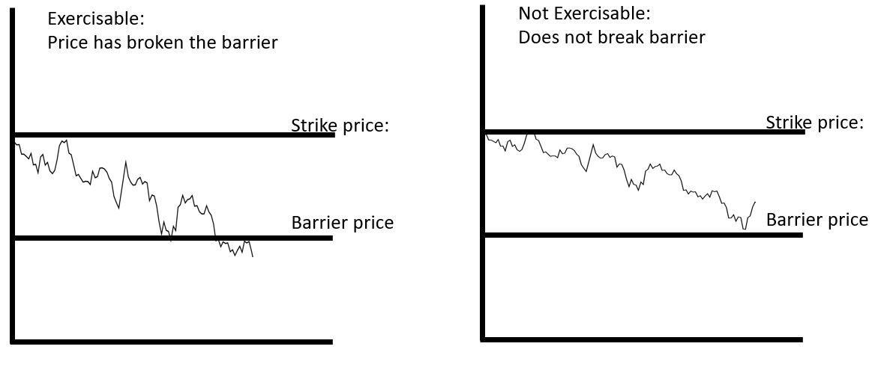

The world of options trading encompasses a diverse array of strategies and instruments, each offering unique possibilities for risk management and profit maximization. Among these financial instruments, barrier options stand out for their distinct features and complexities. These options, which include the varieties known as knock-in and knock-out options, present traders with a unique set of tools for optimizing their financial strategies.

Barrier options are classified as "exotic options" because their payoff is contingent upon the underlying asset reaching or not reaching a particular price level during the life of the option. This feature introduces an additional layer of strategy and potential reward that standard options may not provide. The conditions under which these options become active or inactive can make them particularly appealing in certain market scenarios where predicting price movements is feasible.



The use of barrier options in algorithmic trading further enhances their potential. Algorithmic trading systems can execute trades more efficiently by rapidly responding to market conditions that might trigger the barriers integral to these options. This automation allows for complexity management that might be unmanageable manually, making barrier options an attractive choice for traders seeking to harness technology to capitalize on market movements.

Understanding the intricacies of barrier options, including how they function within different market contexts, is crucial for traders aiming to refine their trading strategies. By mastering the specifics of knock-in and knock-out options, traders can leverage these exotic instruments to hedge risk effectively or capture gains in anticipated market scenarios. This exploration of barrier options provides valuable insights into their practical applications and the strategic advantages they offer within the broader landscape of options trading.

## Table of Contents

## Understanding Barrier Options

Barrier options are a type of financial derivative known as "exotic options" because their value and payoff structures are contingent upon specific conditions tied to the price movements of the underlying asset. Unlike standard options, where the payoff is determined solely by the asset's price at expiration, barrier options are path-dependent. This characteristic means that their payoff can be either triggered or nullified when the price of the underlying asset hits a predetermined level, known as the barrier.

Barrier options are generally classified into two main types: knock-in and knock-out options. Each type operates with unique dynamics based on the barrier levels:

1. **Knock-In Options**: These options become active, or "knock-in," only if the underlying asset's price reaches a certain barrier level during the option's life. They can be further categorized into:
   - *Up-and-In Options*: Triggered when the asset's price rises above a specific level.
   - *Down-and-In Options*: Activated when the asset's price falls below a certain threshold.

2. **Knock-Out Options**: These cease to exist, or "knock-out," if the underlying asset's price hits the barrier level. They include:
   - *Up-and-Out Options*: Voided when the asset's price breaches above a given level.
   - *Down-and-Out Options*: Terminated when the asset's price descends below a predefined point.

The inherent path-dependent nature of barrier options implies that their valuation not only depends on the final price of the underlying asset at expiration but also on its trajectory over time. This makes the pricing and risk management of barrier options more complex compared to standard options.

Moreover, barrier options often [carry](/wiki/carry-trading) lower premiums than standard options. This cost efficiency is a result of the conditional nature of the payoffs – the options may never become active (in the case of knock-ins) or may become void (in the case of knock-outs) if the barrier is never breached. For traders, this presents an opportunity for strategic hedging, as they can use barrier options to manage risks associated with price movements they anticipate will or will not occur. This makes barrier options particularly appealing in situations where traders have specific views about the future [volatility](/wiki/volatility-trading-strategies) or price levels of the underlying asset.

## Knock-In Options Explained

Knock-in options are a type of barrier option that come into existence only when the underlying asset's price hits a predetermined barrier level. This feature sets them apart as a flexible tool for traders who seek conditional exposure to the market. The two primary types of knock-in options are:

1. **Up-and-In Options**: These options become active when the underlying asset's price climbs above a specific barrier level. Traders use up-and-in options when they expect the asset price to rise and breach the barrier, allowing the option to activate and participate in further upside movements.

2. **Down-and-In Options**: These options are activated when the underlying asset's price falls below a certain barrier. They are preferred by traders anticipating a decline in asset price beyond the barrier level, which triggers the option and allows for potential profits if the price subsequently rebounds or continues its downward trajectory beneficially.

The pricing and risk-profile of knock-in options are influenced by the likelihood of the asset's price reaching or surpassing the barrier. If a barrier is very likely to be reached, the premium for a knock-in option tends to be higher due to the increased probability of activation. Conversely, if the barrier is unlikely to be breached, the option might carry a lower premium, reflecting the diminished risk of activation.

Traders utilizing knock-in options do so in anticipation of specific market conditions that are conducive to barrier activation. For example, a trader might employ an up-and-in option in a bullish market scenario where technical analysis or economic indicators suggest a substantial probability of the asset price surpassing the barrier. Conversely, a down-and-in option might be used in a bearish context, where the market is expected to drop, and subsequently, the trader forecasts an opportunity for the price to rebound after breaching a lower barrier.

Consider a practical scenario: A trader believes that a stock, currently priced at $100, will surpass $120 in the wake of an upcoming earnings report. By purchasing an up-and-in call option with a barrier set at $120, the trader can potentially benefit from the subsequent price movements if the barrier activates the option. This strategy allows for reduced upfront cost compared to traditional options since the premium accounts for the condition that the barrier must be reached.

In summary, knock-in options offer traders versatile strategies by providing conditional market exposure. They are tools that can be strategically selected based on market analysis and predictions about the asset’s price movements in relation to predefined barrier levels.

## Knock-Out Options Explained

Knock-out options are a type of barrier option that expire worthless if the underlying asset's price hits a predefined barrier during the option's life. This characteristic differentiates them from standard options. There are two main types of knock-out options: up-and-out and down-and-out. An up-and-out option is nullified when the asset price rises above a certain level. Conversely, a down-and-out option is voided if the asset price falls below a specified threshold.

One of the primary advantages of knock-out options is their ability to offer limited loss potential. By embedding a barrier, these options inherently come with lower premiums compared to their vanilla counterparts. This cost-effective nature stems from the added risk that the option can become worthless if the barrier is breached. 

However, the limited loss potential comes at the cost of capping potential profits. For instance, if a trader purchased an up-and-out call option and the underlying asset's price exceeds the barrier, the option would terminate, even if the asset's price continues to rise further, eliminating any additional profit that could have been realized with a standard call option.

Knock-out options are valuable tools in market hedging due to their ability to offer protection while minimizing costs. For example, consider a scenario where a trader anticipates that a stock's price will increase but not surpass a certain level due to expected market conditions. In such cases, the trader might opt for an up-and-out call option to gain exposure to the potential upside, while benefiting from a lower premium relative to a standard call option.

In terms of practical application, let’s consider a trader who holds a portfolio sensitive to downward movements in a stock’s price. The trader could buy a down-and-out put option with a barrier set at a price level deemed unlikely to be reached. By doing so, the trader gains cost-effective protection against significant declines without incurring the higher costs associated with a non-barrier put option.

In summary, knock-out options serve as an efficient tool in particular hedging and speculative strategies. Understanding their dual nature of risk and opportunity can help traders make more informed decisions when attempting to lock in gains or protect against adverse price movements.

## Algorithmic Trading with Barrier Options

Algorithmic trading employs sophisticated technology and computational algorithms to streamline the implementation of barrier options in financial markets. This technological integration allows traders to navigate the complex landscape of barrier options, which includes knock-in and knock-out variants, with greater precision and reduced latency.

In [algorithmic trading](/wiki/algorithmic-trading), automated strategies are designed to swiftly adapt to market conditions that trigger the activation or deactivation of barrier options. These systems constantly monitor price movements and predefined thresholds, executing trades instantly when barriers are breached. This rapid response capability is crucial in barrier options trading, where timing can significantly influence profitability.

The algorithms utilized in this context are often programmed to handle intricate calculations necessary for optimizing the execution of barrier options strategies. For instance, they may involve determining the probability of barrier breaches using stochastic models, calculating optimal entry and [exit](/wiki/exit-strategy) points, and assessing the impact of volatility on option pricing. The use of quantitative models like the Monte Carlo simulation or the Black-Scholes model, modified for barriers, can aid in estimating fair values and risks associated with these options.

Python, a versatile programming language, is commonly used to develop these algorithmic trading systems due to its robust libraries such as NumPy, pandas, and SciPy that are well-suited for numerical computations and data analysis. A basic example could look like this:

```python
import numpy as np

# Function to simulate asset prices using Geometric Brownian Motion
def simulate_asset_price(S0, T, r, sigma, steps):
    dt = T/steps
    prices = np.zeros(steps)
    prices[0] = S0

    for t in range(1, steps):
        Z = np.random.standard_normal()
        prices[t] = prices[t-1] * np.exp((r - 0.5 * sigma**2) * dt + sigma * np.sqrt(dt) * Z)

    return prices

# Parameters: initial price, time horizon, risk-free rate, volatility, number of steps
prices = simulate_asset_price(S0=100, T=1, r=0.05, sigma=0.2, steps=252)
```

Utilizing algorithms not only enhances operational efficiency but also helps traders to capitalize on specific market opportunities associated with knock-in and knock-out scenarios. By systematically monitoring and reacting to conditions that meet barrier parameters, these strategies can exploit transient market inefficiencies.

Case studies in algorithmic trading have demonstrated the efficacy of such systems. For instance, during periods of high volatility, algorithmic strategies have successfully managed multiple barrier trades concurrently, maximizing gains by leveraging precisely timed executions. Additionally, the integration of [machine learning](/wiki/machine-learning) techniques can further refine these strategies, adapting dynamically to evolving market conditions and improving predictive accuracy over time.

In summary, the convergence of algorithmic trading and barrier options offers traders a powerful toolkit to navigate the complex dynamics of modern financial markets. By automating the monitoring and execution processes, these systems not only improve precision and speed but also enhance the strategic deployment of barrier options.

## Advantages and Considerations

Barrier options are recognized for their lower premiums compared to traditional options, which is one of their primary advantages. This cost efficiency arises from the conditional nature of their payoff structure. Since barrier options only activate or deactivate upon reaching predetermined price levels, the probability of payoff is reduced, leading to less expensive premiums. This can provide a substantial cost advantage for traders who are bearish or conservative in spending on option premiums.

Moreover, barrier options offer tailored risk management opportunities. Their distinct price point activation or deactivation allows traders to design strategies that align precisely with their market forecasts. For example, if a trader is confident that a particular event or price movement will not occur, they can use barrier options to hedge specific risks more effectively. This capability can be particularly useful in hedging strategies, allowing traders to mitigate potential downside risks without hedging against all possible market fluctuations.

However, while barrier options have clear advantages, they also present complexities and potential limitations, notably concerning [liquidity](/wiki/liquidity-risk-premium). These options are less commonly traded than vanilla options, which might lead to wider bid-ask spreads and less favorable pricing. Traders should be aware that the intricate conditions attached to these options could impact their liquidity and marketability, potentially leading to challenges in executing large orders without influencing market prices.

When considering barrier options for overall trading and risk management strategies, traders should assess their market outlook, confidence in the non-occurrence of specific events, and premium budget. The specific market conditions and the trader's risk tolerance will influence the choice between using barrier options or more conventional alternatives. Effective use of barrier options requires careful planning and a thorough understanding of the underlying asset's potential price paths.

In summary, barrier options can be a strategic tool in the trader's arsenal due to their lower premiums and tailored risk management capabilities. However, traders must navigate their complexities and potential liquidity challenges to leverage these benefits effectively.

## Conclusion

Barrier options present both challenges and opportunities for traders due to their unique characteristics. By understanding the mechanics of knock-in and knock-out options, traders can significantly enhance their portfolio strategies. Knock-in options only become active when the underlying asset reaches a specified price, offering traders a potentially profitable position if market movements occur as anticipated. Conversely, knock-out options cease to exist upon hitting a set barrier, providing a cost-effective way to participate in the market with limited loss potential. This conditional activation and deactivation allow traders to tailor risk management strategies according to their market outlook.

With the rise of algorithmic trading, these complex instruments can be exploited more effectively. Algorithms enable traders to implement systematic trading strategies that swiftly react to market conditions, optimizing the execution of knock-in and knock-out options. By leveraging advanced technology, traders can enhance their market positioning and capitalize on specific scenarios associated with barrier options.

However, traders must weigh the benefits of lower premiums against the risks and potential drawbacks of barrier activation. The conditional nature of these options means that they can become worthless if the specified price points are not met, posing a risk that must be carefully considered in strategy formulation.

A comprehensive understanding of barrier options, coupled with the strategic use of algorithmic trading, can lead to more informed trading practices. Traders who master these tools are better positioned to exploit market opportunities, balancing the cost-effectiveness of barrier options with the inherent risks involved. This strategic incorporation of barrier options into a trading portfolio can potentially yield enhanced returns and more robust risk management.

## References & Further Reading

[1]: ["Exotic Options Trading: How to invest with long-short swaps, digital, barrier, and compound options"](https://www.investopedia.com/terms/e/exoticoption.asp) by Frans de Weert

[2]: Hull, J. C. (2017). ["Options, Futures, and Other Derivatives"](https://www.semanticscholar.org/paper/Options%2C-Futures%2C-and-Other-Derivatives-Hull/89bdee500c8623864fc9eb7a471546aa713acc44). Pearson Education.

[3]: ["Quantitative Finance: A Simulation-Based Introduction Using Excel"](https://www.taylorfrancis.com/books/mono/10.1201/b16039/quantitative-finance-matt-davison) by Matt Davison

[4]: Black, F., & Scholes, M. (1973). ["The Pricing of Options and Corporate Liabilities"](https://www.cs.princeton.edu/courses/archive/fall09/cos323/papers/black_scholes73.pdf). Journal of Political Economy, 81(3), 637-654.

[5]: Derman, E., & Kani, I. (1994). ["Riding on a Smile"](https://www.researchgate.net/publication/239059413_Riding_on_a_Smile). Risk Magazine, 7(2), 32-39.

[6]: Duffy, D. J. (2018). ["Financial Instrument Pricing Using C++."](https://onlinelibrary.wiley.com/doi/book/10.1002/9781119170518) Wiley Finance.

[7]: Wilmott, P. (2007). ["Paul Wilmott Introduces Quantitative Finance."](https://www.amazon.com/Paul-Wilmott-Introduces-Quantitative-Finance/dp/0470319585) Wiley.