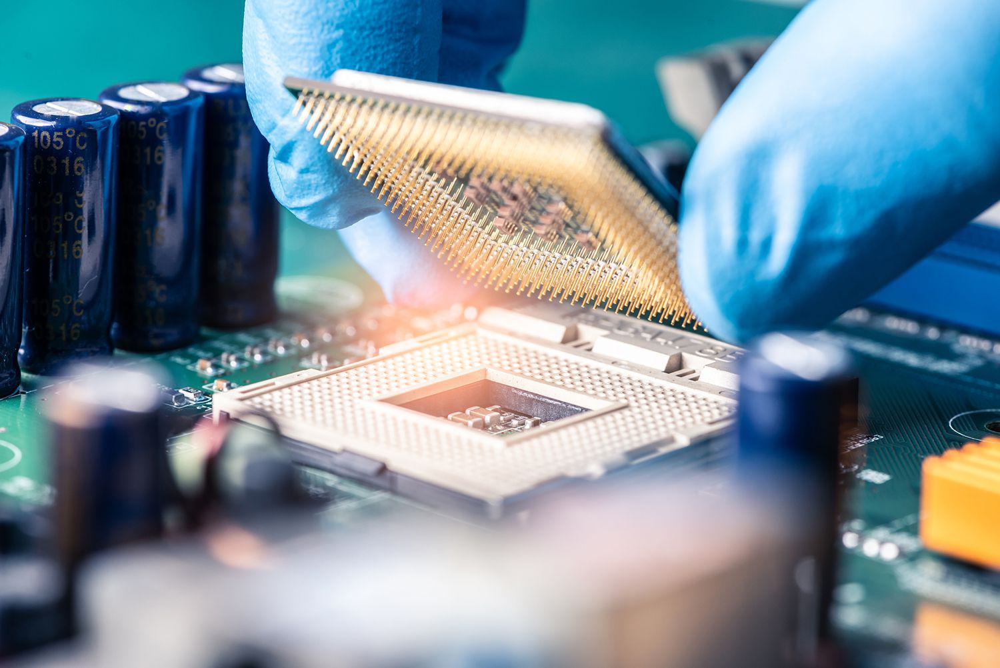

## Table of Contents

## What are barriers to entry in general?

Barriers to entry are things that make it hard for new companies to start in a certain market. These can be things like needing a lot of money to start, strict government rules, or special technology that only some companies have. When these barriers are high, it can be tough for new businesses to compete with the big companies that are already there.

Sometimes, barriers to entry can also come from things like brand loyalty, where customers stick with well-known companies, or from having a big network of customers and suppliers that new companies can't easily match. These barriers can protect existing companies from new competition, but they can also mean fewer choices and higher prices for customers.

## What specific barriers exist in the electronics industry?

In the electronics industry, one big barrier to entry is the high cost of research and development. Making new electronics like smartphones or computers needs a lot of money for research and testing. Big companies can spend billions of dollars on this, which is tough for new companies to match. They also need to keep up with fast-changing technology, which means they always need to be investing in new ideas.

Another barrier is the need for a strong supply chain. Electronics have many parts that come from all over the world. Big companies already have good relationships with suppliers and can get parts cheaper and faster. New companies might struggle to find these suppliers and might have to pay more for parts, making their products more expensive.

Brand loyalty is also a big deal in electronics. People often stick with brands they know and trust, like Apple or Samsung. New companies have to work hard to get people to try their products. This can be really hard and expensive, especially when big companies spend a lot on advertising to keep their customers.

## How does the high cost of research and development affect new entrants in the electronics industry?

The high cost of research and development makes it really hard for new companies to get into the electronics industry. To make new electronics like phones or computers, companies need to spend a lot of money on research and testing. Big companies can spend billions of dollars on this, and they have the money to keep doing it over and over. New companies usually don't have that much money, so they can't keep up with the big companies. This means they might not be able to make products that are as good or as advanced.

Also, the electronics industry changes really fast. New technology comes out all the time, and companies need to keep up with it. Big companies can keep spending money on new research to stay ahead, but new companies might not be able to do that. They might make a product, but by the time it's ready, it could already be out of date. This makes it even harder for new companies to compete and stay in the market.

## What role does intellectual property play as a barrier in the electronics sector?

Intellectual property, like patents and trademarks, is a big barrier for new companies in the electronics industry. Big companies often have lots of patents that protect their inventions. This means new companies can't use those inventions without permission. They might have to pay a lot of money to use these patented technologies, or they might have to find a different way to do things, which can be hard and expensive.

Also, trademarks make it tough for new companies. Big electronics companies have well-known brand names that people trust. New companies have to come up with their own unique brand, which can be hard when everyone already knows the big names. Plus, if a new company tries to use a name or logo that's too similar to a big company's, they could get in legal trouble. This makes it even harder for new companies to get started and compete in the electronics market.

## How do economies of scale impact new companies trying to enter the electronics market?

Economies of scale make it tough for new companies in the electronics market. Big companies can make a lot of products at once, which means they can buy parts cheaper and spend less money on each product they make. New companies usually can't make as many products because they don't have as much money or as many customers yet. This means they have to pay more for parts and spend more money on each product, making their products more expensive than the big companies' products.

Because of this, new companies have a hard time competing on price. Customers often choose the cheaper product, so new companies might not sell as many products. This makes it even harder for them to grow and start making more products at a lower cost. It's like a cycle that keeps new companies from getting big enough to compete with the giants in the electronics industry.

## What are the regulatory hurdles for new businesses in the electronics industry?

New companies in the electronics industry have to deal with a lot of rules and regulations. Governments have strict laws about things like safety, environmental impact, and how products are made. For example, electronics need to meet certain safety standards to make sure they don't hurt people. New companies have to spend time and money to make sure their products meet all these rules. This can be really hard for them because they might not have as much money or experience as big companies.

Also, there are rules about how electronics are made and what materials can be used. Some countries have laws to reduce electronic waste and make sure harmful materials aren't used. New companies need to learn all these rules and follow them, which can be confusing and expensive. Big companies already know these rules and have teams to handle them, but new companies might struggle to keep up. All these regulations can make it a lot harder for new businesses to get started in the electronics industry.

## How does access to distribution channels pose a challenge for new electronics firms?

Getting products into stores and online can be really hard for new electronics companies. Big companies already have deals with big stores and online sellers. They can get their products on shelves easily because they have been working with these stores for a long time. New companies don't have these deals yet, so they might have to start small or sell their products online themselves. This can make it hard for them to reach a lot of customers right away.

Also, new companies might have to pay more to get their products into stores. Big stores might not want to take a chance on a new brand because they don't know if it will sell well. This means new companies might have to offer big discounts or pay extra fees just to get their products on the shelf. This can make it even harder for them to make money and grow their business.

## What is the impact of brand loyalty and established customer bases on new entrants?

Brand loyalty and established customer bases make it really hard for new companies in the electronics industry. Big companies like Apple and Samsung have lots of loyal customers who keep buying their products. These customers trust these brands and might not want to try something new. This means new companies have to work extra hard to convince people to give their products a chance. It's tough because people often stick with what they know and like.

Also, big companies have been around for a long time and have built up a lot of customers. These customers keep coming back, which helps the big companies stay strong. New companies don't have this built-in group of customers yet. They have to start from scratch and build their own customer base. This can take a lot of time and money, and it's not easy when big companies are already so popular and trusted.

## How do technological complexities serve as barriers to entry in electronics manufacturing?

Technological complexities make it tough for new companies to start making electronics. The electronics industry uses a lot of advanced technology and needs special skills to make things like smartphones and computers. New companies might not have these skills or the money to hire experts. They also need special machines and tools to make the products, and these can be very expensive. Big companies already have these machines and experts, so it's easier for them to keep making new and better products.

Another problem is that the technology in electronics changes really fast. Big companies can spend a lot of money to keep up with these changes and make new products quickly. New companies might not be able to do this because they don't have as much money. By the time a new company makes a product, it might already be out of date. This makes it hard for them to compete with the big companies that can always have the latest technology.

## What are the financial barriers to entry, such as capital requirements, in the electronics industry?

Starting a business in the electronics industry needs a lot of money. New companies need to spend a lot on research and development to make new products. Big companies can spend billions of dollars on this, but new companies usually don't have that much money. They also need money to buy expensive machines and tools to make the products. Without enough money, new companies can't make products that are as good or as advanced as the big companies.

Another financial problem is that new companies need money to grow. They have to spend money on marketing to get people to know about their products. They also need money to build a supply chain and get their products into stores. Big companies already have these things set up, so they don't have to spend as much money on them. New companies might have to borrow money or find investors, but this can be hard and risky. All these financial needs make it really tough for new companies to start and grow in the electronics industry.

## How do global supply chain complexities affect new entrants in the electronics industry?

The electronics industry relies on parts from all over the world, and this makes things hard for new companies. Big companies have been working with suppliers for a long time, so they can get parts cheaper and faster. New companies don't have these relationships yet, so they might have to pay more for parts or wait longer to get them. This can make their products more expensive and slow down how fast they can make them.

Also, global supply chains can be tricky because things like shipping and customs can cause problems. If a new company doesn't know how to handle these things well, it can mess up their plans. Big companies have teams that are good at dealing with these issues, but new companies might not have the experience or the money to do this. This makes it even harder for new companies to get started and compete in the electronics industry.

## What strategies can new companies use to overcome these barriers to entry in the electronics sector?

New companies in the electronics sector can try a few things to get past the big barriers. One good idea is to focus on a small part of the market that big companies might not care about as much. This way, they can make products that meet the needs of a specific group of customers. They can also try to work with other small companies to share the cost of research and development. This can help them make new products without spending too much money. Another strategy is to use crowdfunding to get money from lots of people who want to see their product succeed. This can help them get the money they need to start making and selling their products.

Another way for new companies to overcome barriers is by building strong relationships with suppliers. If they can find good suppliers and work well with them, they might be able to get parts cheaper and faster. This can help them keep their costs down and make their products more competitive. New companies can also use online platforms to sell their products directly to customers. This can help them reach more people without having to deal with big stores. By using these strategies, new companies can have a better chance of making it in the tough electronics industry.

## References & Further Reading

[1]: Porter, M. E. (1979). ["How Competitive Forces Shape Strategy."](https://hbr.org/1979/03/how-competitive-forces-shape-strategy) Harvard Business Review.

[2]: Sturgeon, T. J. (2002). ["Modular Production Networks: A New American Model of Industrial Organization."](https://www.researchgate.net/profile/Timothy-Sturgeon/publication/5212397_Turn-key_Production_Networks_A_New_American_Model_of_Industrial_Organization/links/02bfe50dc6ffeba028000000/Turn-key-Production-Networks-A-New-American-Model-of-Industrial-Organization.pdf?origin=journalDetail) Industrial and Corporate Change, Oxford University Press.

[3]: Gomber, P., Arndt, B., Lutat, M., & Uhle, T. (2011). ["High-Frequency Trading."](https://papers.ssrn.com/sol3/papers.cfm?abstract_id=1858626) Börsen-Zeitung.

[4]: Malkiel, B. G., & Fama, E. F. (1970). ["Efficient Capital Markets: A Review of Theory and Empirical Work."](https://onlinelibrary.wiley.com/doi/abs/10.1111/j.1540-6261.1970.tb00518.x) The Journal of Finance.

[5]: Rahul, D., Sinha, A., & Kumar, S. (2020). ["Challenges at the Entry and Growth Stages of Startups: A Review from an Indian Context."](https://www.nature.com/articles/s41597-024-04308-7) Journal of Entrepreneurship in Emerging Economies.

[6]: Burgelman, R. A., & Grove, A. S. (1996). ["Strategic Dissonance."](https://journals.sagepub.com/doi/10.2307/41165830) Harvard Business Review.