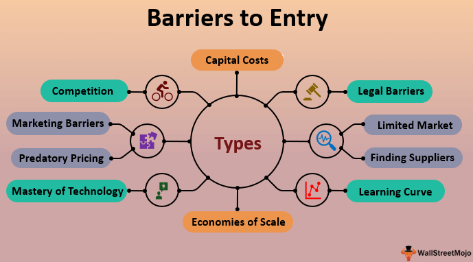

## Table of Contents

## What are barriers to entry in general?

Barriers to entry are things that make it hard for new businesses to start in a certain industry. These can be things like high costs to get started, strict rules and laws, or the need for special technology or skills. When barriers to entry are high, it can be tough for new companies to break into the market because they have to spend a lot of money or time just to get started.

Another type of barrier to entry is when a few big companies already control most of the market. These big companies might have strong brands that people trust, or they might be able to sell their products for less because they can buy things in bulk. This makes it hard for new, smaller companies to compete because they can't offer the same low prices or have the same level of trust from customers.

Overall, barriers to entry can protect existing businesses from new competition, but they can also limit new ideas and innovation in an industry. When it's too hard for new companies to enter a market, it can lead to less choice for customers and higher prices, because there's less pressure on the big companies to keep improving and lowering their prices.

## How do barriers to entry specifically affect the financial services sector?

Barriers to entry in the financial services sector can make it really tough for new companies to start up. One big barrier is the high cost of getting all the right technology and systems in place. Financial services need secure and reliable systems to handle money, and setting these up can be very expensive. Another barrier is all the rules and regulations that financial companies have to follow. Governments have strict laws to protect people's money and make sure companies are behaving properly. These rules can be hard to understand and follow, especially for new companies that don't have a lot of experience.

Another way barriers to entry affect the financial services sector is through the power of big, established companies. These companies, like big banks, have been around for a long time and people trust them. They also have a lot of money, which they can use to offer better services or lower prices. This makes it hard for new companies to attract customers because they have to compete against these big names. Because of these barriers, the financial services sector can be slow to change and innovate, as new ideas and companies struggle to break into the market.

## What are the main types of barriers to entry in financial services?

One main type of barrier to entry in financial services is the high cost of starting up. To run a financial service, you need fancy technology and secure systems to handle people's money safely. These systems are expensive to set up and maintain. Plus, new companies need to spend a lot of money on marketing to get customers to trust them over big, well-known banks.

Another big barrier is all the rules and regulations that financial companies must follow. Governments have strict laws to make sure financial services are safe and fair. These laws can be hard to understand and follow, especially for new companies. They might need to hire experts just to make sure they're doing everything right, which adds to their costs.

Lastly, the power of big, established companies in the financial sector is a huge barrier. Big banks have been around for a long time and people trust them. They can also offer lower prices because they have more money. This makes it hard for new, smaller companies to compete and attract customers. Because of these barriers, it can be tough for new ideas and companies to enter the financial services market.

## Can you explain the role of capital requirements as a barrier to entry in financial services?

Capital requirements are rules that say how much money a financial company needs to have before it can start doing business. This is a big barrier to entry because it can be really hard for new companies to come up with that much money. For example, banks need a lot of money to cover any losses they might have, like if people can't pay back their loans. This means new banks have to find a lot of money just to get started, which can be tough for them.

These capital requirements are there to make sure financial companies are safe and can handle any problems that come up. But they also make it harder for new companies to enter the financial services market. Big banks already have a lot of money, so these rules don't bother them as much. But for a new company, finding enough money to meet these requirements can be a huge challenge. This means fewer new companies can start up, which can limit new ideas and competition in the financial services sector.

## How do regulatory requirements act as barriers to entry in the financial sector?

Regulatory requirements are rules that financial companies have to follow. These rules can make it hard for new companies to start up in the financial sector. For example, new companies need to understand a lot of complicated laws and make sure they follow them. This can be tough because they might need to hire experts to help them, which costs a lot of money. Also, these rules can take a long time to follow, which delays when a new company can start doing business.

Big, established companies already know how to follow these rules and have the money to do it. This makes it easier for them to keep doing business, but harder for new companies to compete. Because of these regulatory requirements, new companies might decide not to enter the financial sector at all. This can mean fewer new ideas and less competition, which might not be good for customers who want more choices and lower prices.

## What impact does technology have on barriers to entry in financial services?

Technology can make it harder for new companies to start in the financial services industry. To offer financial services, companies need special technology that is safe and reliable. This technology can be very expensive to set up and keep running. New companies might not have enough money to buy all the technology they need, which makes it tough for them to compete with big banks that already have all the right systems in place.

On the other hand, technology can also help lower some barriers to entry. New technology like online banking and fintech apps can make it easier for new companies to reach customers without needing big offices or lots of staff. These technologies can help new companies offer new and different services that big banks might not have. But even with these new technologies, new companies still need to spend a lot of money on things like cybersecurity to make sure their services are safe, which can be a big challenge.

## How do economies of scale and scope create barriers to entry in the financial services industry?

Economies of scale and scope are big reasons why it's hard for new companies to start in the financial services industry. Economies of scale mean that bigger companies can do things cheaper because they do them a lot. For example, a big bank can spread the cost of its technology and staff over a lot of customers, so each customer costs less to serve. A new, small company can't do this because it doesn't have as many customers. This means the new company has to charge more for its services, which makes it hard to compete with the big banks.

Economies of scope also make it tough for new companies. This means that big companies can offer a lot of different services and use the same resources to do it. For example, a big bank can offer checking accounts, loans, and investment services all at once. They can use the same staff and technology to do all these things, which saves them money. A new company might only be able to offer one or two services at first, so they can't save money the same way. This makes it hard for new companies to offer as many services or keep their prices low enough to compete with the big banks.

## What are the effects of brand loyalty and reputation on new entrants in financial services?

Brand loyalty and reputation make it really hard for new companies to start in the financial services industry. Big banks and financial companies have been around for a long time, so people trust them. Customers feel safe with these big names because they know them and believe they will take care of their money. When a new company tries to enter the market, it's tough for them to convince people to switch from the banks they already trust. People might not want to take a chance on a new company, especially with something as important as their money.

This loyalty to big brands means new companies have to spend a lot of money on marketing to build their own reputation. They need to show people that they are trustworthy and good at what they do. But even with a lot of marketing, it can take a long time for a new company to become well-known and trusted. During this time, they might struggle to get enough customers to make their business successful. So, brand loyalty and reputation are big barriers that can slow down or even stop new companies from breaking into the financial services market.

## How do existing financial service providers use strategic actions to maintain barriers to entry?

Big financial companies use different tricks to keep new companies from starting up in their industry. One way they do this is by buying new technology or companies that could help new businesses. When a big bank buys a new fintech company, it stops that company from helping new competitors. Big companies also spend a lot of money on ads to make sure people keep trusting them. This makes it hard for new companies to get noticed and win over customers.

Another thing big financial companies do is offer special deals and services to keep their customers happy. They might give lower prices or better services to people who use a lot of their products, like checking accounts, loans, and investments. This makes it tough for new companies to compete because they can't offer the same good deals right away. By doing these things, big companies make it harder for new businesses to break into the market and challenge them.

## What role do patents and proprietary technology play in creating barriers to entry in financial services?

Patents and proprietary technology can make it hard for new companies to start in the financial services industry. When a big company has a patent, it means they have the right to use a special idea or technology that no one else can use. This can be things like new ways to handle money or special software that makes banking easier. If a new company wants to use similar technology, they might have to pay a lot of money to the company that owns the patent, or they might not be able to use it at all. This makes it tough for new companies to offer the same good services as the big banks.

Proprietary technology is also a big barrier because it's technology that only one company has. Big banks might have their own special systems that help them do things faster or better. These systems can be very expensive to build and keep running. A new company might not have the money to create their own special technology, so they can't compete as well. Because of patents and proprietary technology, new companies have to find other ways to offer good services, which can be hard and take a lot of time.

## How have fintech companies influenced barriers to entry in the financial services sector?

Fintech companies have changed the way new businesses can enter the financial services sector. They use new technology like apps and online platforms to offer financial services without needing big offices or lots of staff. This makes it easier for new companies to start because they don't have to spend as much money as traditional banks do. Fintech companies can also reach customers in new ways, like through smartphones, which helps them get noticed even though they are new.

However, fintech companies still face some of the same barriers as other new companies. They need to follow strict rules and laws, which can be hard and expensive. They also need to build trust with customers, which takes time and money. Big banks might still have an advantage because they have been around for a long time and people trust them. But fintech companies are showing that it's possible to break into the financial services market with new ideas and technology.

## What future trends might affect barriers to entry in the financial services industry?

In the future, new technology like [artificial intelligence](/wiki/ai-artificial-intelligence) and blockchain could change how hard it is for new companies to start in the financial services industry. AI can help new companies offer better services by making decisions faster and understanding what customers want. Blockchain can make transactions safer and easier, which might help new companies compete with big banks. But these technologies can also be expensive to use, so new companies still need to find ways to pay for them.

Another thing that might change is how governments make rules for financial services. If rules become simpler and easier to follow, it could be easier for new companies to start. But if rules get even stricter, it could make it harder. Also, more people using the internet and smartphones could help new companies reach customers in new ways. This might lower some barriers to entry, but new companies will still need to work hard to build trust and offer good services to compete with big banks.

## References & Further Reading

[1]: Bergstra, J., Bardenet, R., Bengio, Y., & Kégl, B. (2011). ["Algorithms for Hyper-Parameter Optimization."](https://dl.acm.org/doi/10.5555/2986459.2986743) Advances in Neural Information Processing Systems 24.

[2]: ["Advances in Financial Machine Learning"](https://www.amazon.com/Advances-Financial-Machine-Learning-Marcos/dp/1119482089) by Marcos Lopez de Prado

[3]: ["Evidence-Based Technical Analysis: Applying the Scientific Method and Statistical Inference to Trading Signals"](https://www.amazon.com/Evidence-Based-Technical-Analysis-Scientific-Statistical/dp/0470008741) by David Aronson

[4]: ["Machine Learning for Algorithmic Trading"](https://github.com/stefan-jansen/machine-learning-for-trading) by Stefan Jansen

[5]: ["Quantitative Trading: How to Build Your Own Algorithmic Trading Business"](https://www.amazon.com/Quantitative-Trading-Build-Algorithmic-Business/dp/1119800064) by Ernest P. Chan