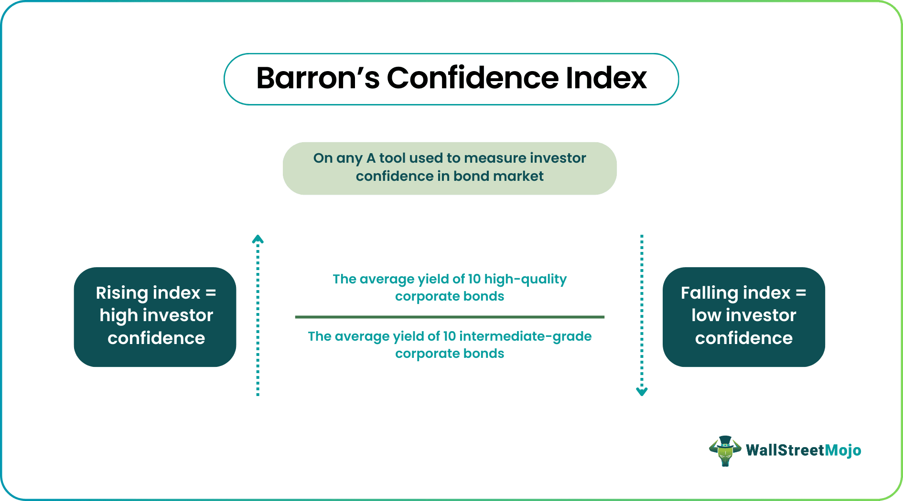

## Table of Contents

## What is Barron's Confidence Index?

Barron's Confidence Index is a tool that helps investors understand how confident other investors are in the stock market. It compares the yield of high-quality bonds to the yield of lower-quality bonds. If investors are feeling confident, they will buy more stocks and fewer bonds, which makes the yield on high-quality bonds go up compared to lower-quality bonds. This means the Confidence Index will be higher.

The index is calculated by dividing the average yield of high-grade bonds by the average yield of intermediate-grade bonds. A higher number means investors are more confident because they are willing to take more risk by investing in stocks instead of bonds. On the other hand, if the index is lower, it suggests that investors are less confident and are moving their money into safer, higher-yield bonds. This index is useful for investors who want to gauge the overall mood of the market and make decisions based on that.

## Who created Barron's Confidence Index and when was it introduced?

Barron's Confidence Index was created by Barron's, a financial newspaper. The index was introduced in 1932. It was a time when people needed a way to understand how others felt about the stock market, especially after the big crash in 1929.

The index helps investors see if others are feeling confident or worried about the market. It does this by comparing the interest rates of safe bonds to riskier bonds. If people are confident, they buy more stocks and the index goes up. If they are worried, they buy more bonds and the index goes down.

## What is the purpose of Barron's Confidence Index?

Barron's Confidence Index helps investors understand how other people feel about the stock market. It does this by comparing the interest rates of safe bonds to riskier bonds. If people are feeling confident, they will buy more stocks and the interest rates on safe bonds will go up compared to riskier bonds. This makes the Confidence Index go up. If people are feeling worried, they will buy more bonds and the index will go down.

The index is useful because it gives investors a quick way to see if the market is feeling confident or worried. By looking at the index, investors can decide if it's a good time to buy stocks or if they should be more careful. It's like a thermometer for the stock market's mood, helping people make smarter choices about their investments.

## How is Barron's Confidence Index calculated?

Barron's Confidence Index is calculated by comparing the interest rates, or yields, of two types of bonds. The first type is high-grade bonds, which are safe and reliable. The second type is intermediate-grade bonds, which are a bit riskier. To find the index, you take the average yield of the high-grade bonds and divide it by the average yield of the intermediate-grade bonds. The result is a number that tells you how confident investors are feeling.

If the number is high, it means investors are feeling good about the stock market. They are willing to take more risks by buying stocks instead of bonds, so the yield on high-grade bonds goes up compared to the intermediate-grade bonds. On the other hand, if the number is low, it means investors are worried and are buying more bonds to stay safe. This makes the yield on intermediate-grade bonds go up compared to high-grade bonds. So, the index helps investors see if others are feeling confident or worried about the market.

## What do the different levels of Barron's Confidence Index indicate?

Barron's Confidence Index tells us how investors feel about the stock market. When the index is high, it means investors are feeling good and confident. They are willing to take more risks by buying stocks instead of bonds. This happens because when people feel confident, they move their money from safe, high-grade bonds to riskier investments like stocks. As a result, the yield on high-grade bonds goes up compared to intermediate-grade bonds, making the index number higher.

On the other hand, when the index is low, it shows that investors are worried and less confident. They are moving their money into safer investments like bonds to protect their money. This makes the yield on intermediate-grade bonds go up compared to high-grade bonds, which lowers the index number. By looking at the index, investors can get a quick idea of whether the market is feeling confident or worried, helping them make better choices about their investments.

## How often is Barron's Confidence Index updated?

Barron's Confidence Index is updated every week. This means investors can check it regularly to see how other people feel about the stock market. The weekly update helps investors stay on top of changes in market confidence and make timely decisions about their investments.

The index is published in Barron's newspaper and on their website. By looking at the index every week, investors can understand if others are feeling more or less confident about the market. This information can guide them in choosing whether to buy stocks or safer bonds based on the latest trends in investor sentiment.

## Can Barron's Confidence Index predict market trends?

Barron's Confidence Index can give investors clues about what might happen in the stock market, but it's not a crystal ball. The index shows how confident or worried investors are feeling by comparing the interest rates of safe bonds to riskier bonds. If the index is high, it means people are feeling good and might be more likely to buy stocks, which could push the market up. If the index is low, it suggests people are worried and might be moving their money into safer bonds, which could mean the market might go down.

However, the index doesn't always predict the future perfectly. Sometimes, even if the index is high, the market might still go down because of other things happening in the world or the economy. And sometimes, a low index might not lead to a big drop in the market if something good happens to make people feel better. So, while the index can be a helpful tool for understanding how people feel about the market, it's just one piece of the puzzle and should be used along with other information to make investment decisions.

## What are the limitations of using Barron's Confidence Index?

Barron's Confidence Index is a helpful tool, but it has some limits. It only looks at how people feel about bonds, not stocks directly. So, it might not catch everything that's happening in the stock market. Also, the index can be affected by things like changes in interest rates or big economic news that don't have much to do with how people feel about stocks.

Another thing to remember is that the index is based on the past. It tells you how people felt last week, not how they will feel next week. The stock market can change quickly because of new information or events. So, even if the index is high or low, the market might do something different than what the index suggests. It's important to use the index along with other tools and information to make the best investment choices.

## How does Barron's Confidence Index compare to other market sentiment indicators?

Barron's Confidence Index is just one way to check how people feel about the stock market. It looks at the difference between the interest rates of safe bonds and riskier bonds. If people are feeling good, they might buy more stocks, and the index goes up. If they're worried, they might buy more bonds, and the index goes down. But it's not the only tool out there. Other indicators, like the Volatility Index (VIX), measure how much people expect the market to move up or down. The VIX is sometimes called the "fear gauge" because it goes up when people are worried the market will change a lot.

Another popular indicator is the American Association of Individual Investors (AAII) Sentiment Survey. This survey asks people if they think the market will go up, down, or stay the same over the next six months. It gives a quick snapshot of what a lot of people are thinking. Unlike Barron's Confidence Index, which looks at bond yields, the AAII survey directly asks people about their feelings on stocks. Both the VIX and the AAII survey can give different information than Barron's Confidence Index, so investors often use them together to get a fuller picture of market sentiment.

Each of these indicators has its own strengths and weaknesses. Barron's Confidence Index is good for seeing how people feel about risk, but it's based on bond yields, not stocks directly. The VIX can show how nervous people are about big changes in the market, but it doesn't tell you if they think the market will go up or down. The AAII survey directly asks about stock market feelings, but it's just a snapshot and can change quickly. By using all these tools together, investors can get a better idea of what's going on in the market and make smarter choices.

## What historical events have significantly impacted Barron's Confidence Index?

Barron's Confidence Index has been affected by many big events over the years. One of the most important was the Great Depression in the 1930s. After the stock market crashed in 1929, people were really scared and unsure about the future. They moved their money into safer bonds, which made the index go down a lot. It showed how worried everyone was about losing more money in the stock market. Another big event was World War II. During the war, people were worried about what would happen to the economy, so the index stayed low for a while. But after the war ended, people started to feel better and the index went up as they started investing in stocks again.

Another event that had a big impact was the financial crisis in 2008. When the housing market crashed and big banks started failing, people got very nervous. They moved their money into bonds to try and keep it safe, which made the index drop. It showed how little confidence people had in the stock market at that time. More recently, the COVID-19 pandemic in 2020 also affected the index. At first, when the virus started spreading and lockdowns began, people were very worried and the index went down. But as things started to get better and governments helped the economy, people felt more confident and the index went back up. These events show how the index can change a lot based on what's happening in the world.

## How can investors use Barron's Confidence Index in their investment strategy?

Investors can use Barron's Confidence Index to help them decide when to buy or sell stocks. The index tells them how other people feel about the market. If the index is high, it means people are feeling good and are willing to take more risks by buying stocks. This could be a good time for investors to buy stocks too, because the market might keep going up. But if the index is low, it means people are worried and are moving their money into safer bonds. This might be a good time for investors to be careful and maybe not buy as many stocks, or even sell some if they think the market might go down.

It's important for investors to remember that the index is just one piece of information. They should use it along with other tools and news to make the best choices. For example, if the index is high but there's bad economic news coming out, the market might still go down. So, investors need to look at the whole picture. By checking the index regularly and understanding what it means, investors can get a better feel for the market's mood and make smarter decisions about their money.

## What advanced statistical methods can be applied to analyze trends in Barron's Confidence Index?

To analyze trends in Barron's Confidence Index, investors can use a method called time series analysis. This method looks at how the index changes over time. It can help find patterns, like if the index goes up and down in a regular way, or if it's going up or down over a long time. One part of time series analysis is called moving averages. This means taking the average of the index over a few weeks or months to smooth out the ups and downs and see the bigger trend. Another part is called autoregressive integrated moving average (ARIMA) models. These models can predict what the index might do next based on what it did before.

Another useful method is regression analysis. This can help see how the index is affected by other things, like interest rates or big news events. For example, investors can use regression to see if the index goes up when interest rates go down. They can also use something called correlation analysis to see if the index moves in the same way as other market indicators, like the stock market or the VIX. By using these advanced statistical methods, investors can get a better understanding of what's driving the index and make smarter guesses about where it might go next.

## What is Barron's Confidence Index?

Barron’s Confidence Index is an economic indicator designed to gauge investor confidence by comparing the yields of high-grade bonds to those of intermediate-grade bonds. The historical inception of this index can be traced back to a period where there was a need to understand shifts in market sentiment, providing a quantitative measure to assess how confident investors are in the economic outlook and the creditworthiness of bond issuers.

The calculation of Barron’s Confidence Index involves the ratio of the yield of high-grade bonds, typically those rated AAA, to intermediate-grade bonds, often rated BBB. The formula can be represented as:

$$
\text{Barron’s Confidence Index} = \frac{\text{Yield on High-Grade Bonds}}{\text{Yield on Intermediate-Grade Bonds}}
$$

A higher index value suggests increased investor confidence, as the yield on high-grade bonds, which are considered safer, becomes more comparable to that of intermediate-grade bonds. Conversely, a declining index indicates a flight to quality, signaling reduced confidence as investors demand higher yields for holding riskier bonds, widening the spread between high-grade and intermediate-grade bonds.

Conceptually, Barron’s Confidence Index reflects the sentiment of economic stability. Investors shift towards high-grade bonds when uncertainty looms, reducing the index value. Conversely, a narrowing yield spread reflects confidence in riskier investments, elevating the index. For example, in bullish economic conditions with low interest rates and stable growth, the index might rise as investors accept lower premiums for higher risk. In contrast, during recessionary phases or financial crises, the index typically declines sharply due to increased risk aversion.

Historically, the index has acted as a lead indicator for market trends. For instance, prior to financial downturns, the index has often shown a marked decline as investors preemptively move towards safer asset classes. This predictive capacity highlights its utility in forecasting potential market movements and adjusting investment strategies accordingly.

The theoretical framework of the Barron’s Confidence Index lies in the Efficient Market Hypothesis and investor behavior theories which suggest that market prices always fully reflect all available information. However, deviations in this index reflect changing perceptions and sentiment among investors, indicative of opportunities or risks not immediately visible in market prices. 

In practice, the index provides insights into prevailing economic conditions and helps forecast market trends due to its sensitivity to shifts in investor sentiment. As such, it is an essential tool for investors and analysts in constructing and adjusting investment strategies and assessing the broader economic environment under varying market conditions.

## References & Further Reading

[1]: Bergstra, J., Bardenet, R., Bengio, Y., & Kégl, B. (2011). ["Algorithms for Hyper-Parameter Optimization."](https://dl.acm.org/doi/10.5555/2986459.2986743) Advances in Neural Information Processing Systems 24.

[2]: ["Advances in Financial Machine Learning"](https://www.amazon.com/Advances-Financial-Machine-Learning-Marcos/dp/1119482089) by Marcos Lopez de Prado

[3]: ["Evidence-Based Technical Analysis: Applying the Scientific Method and Statistical Inference to Trading Signals"](https://www.amazon.com/Evidence-Based-Technical-Analysis-Scientific-Statistical/dp/0470008741) by David Aronson

[4]: ["Machine Learning for Algorithmic Trading"](https://github.com/stefan-jansen/machine-learning-for-trading) by Stefan Jansen

[5]: ["Quantitative Trading: How to Build Your Own Algorithmic Trading Business"](https://www.amazon.com/Quantitative-Trading-Build-Algorithmic-Business/dp/1119800064) by Ernest P. Chan