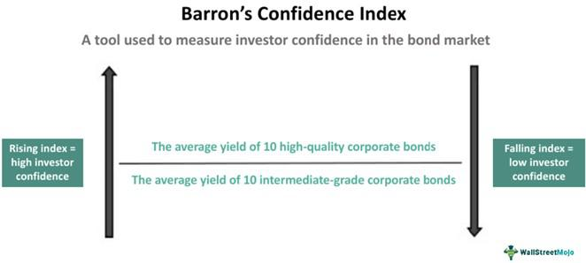

Understanding economic indicators and investor sentiment plays a critical role in financial decision-making, providing valuable insights into market trends and potential investment strategies. Among the various metrics employed in this analysis, Barron's Confidence Index stands out as a pivotal tool for gauging investor confidence. This index, by analyzing the yields on high-grade and intermediate-grade bonds, offers a quantitative measure of the market's confidence in economic stability and growth prospects.

The purpose of this article is to explore how Barron's Confidence Index is utilized in financial index investment and algorithmic trading strategies. The index's ability to predict market trends makes it a noteworthy component in both of these investment approaches. As markets become increasingly influenced by complex algorithms and sentiment analysis, understanding and integrating metrics like Barron's Confidence Index can enhance investment decision-making.

In the upcoming sections, readers can expect a comprehensive breakdown of the Barron's Confidence Index, starting with its definition and historical context. The article will then shed light on the calculation methodology, along with the index's relevance in measuring investor confidence and drawing market insights. Furthermore, the article will expand upon the integration of this index into financial index investment strategies, exploring its benefits, challenges, and strategic implications.

Moreover, the use of Barron's Confidence Index in algorithmic trading will be discussed, highlighting its advantages in leveraging investor sentiment data for improved trade execution and strategy formulation. We will also examine the impact of macroeconomic factors on the index's predictive power, navigating through the influences of interest rates, inflation, and geopolitical events.

The role of Barron's Confidence Index in portfolio management will be analyzed, offering both case studies and recommendations to enhance investment outcomes. Finally, the article will address the limitations of relying solely on sentiment indices and propose a balanced approach by incorporating a mix of quantitative and qualitative analyses.

By understanding and applying the insights offered by Barron's Confidence Index, investors can gain a more precise understanding of market dynamics, paving the way for more informed financial decisions. This article aims to equip readers with the knowledge necessary to harness this index effectively within the broader landscape of modern investment strategies.

## Table of Contents

## What is Barron’s Confidence Index?

Barron’s Confidence Index is an economic indicator designed to gauge investor confidence by comparing the yields of high-grade bonds to those of intermediate-grade bonds. The historical inception of this index can be traced back to a period where there was a need to understand shifts in market sentiment, providing a quantitative measure to assess how confident investors are in the economic outlook and the creditworthiness of bond issuers.

The calculation of Barron’s Confidence Index involves the ratio of the yield of high-grade bonds, typically those rated AAA, to intermediate-grade bonds, often rated BBB. The formula can be represented as:

$$
\text{Barron’s Confidence Index} = \frac{\text{Yield on High-Grade Bonds}}{\text{Yield on Intermediate-Grade Bonds}}
$$

A higher index value suggests increased investor confidence, as the yield on high-grade bonds, which are considered safer, becomes more comparable to that of intermediate-grade bonds. Conversely, a declining index indicates a flight to quality, signaling reduced confidence as investors demand higher yields for holding riskier bonds, widening the spread between high-grade and intermediate-grade bonds.

Conceptually, Barron’s Confidence Index reflects the sentiment of economic stability. Investors shift towards high-grade bonds when uncertainty looms, reducing the index value. Conversely, a narrowing yield spread reflects confidence in riskier investments, elevating the index. For example, in bullish economic conditions with low interest rates and stable growth, the index might rise as investors accept lower premiums for higher risk. In contrast, during recessionary phases or financial crises, the index typically declines sharply due to increased risk aversion.

Historically, the index has acted as a lead indicator for market trends. For instance, prior to financial downturns, the index has often shown a marked decline as investors preemptively move towards safer asset classes. This predictive capacity highlights its utility in forecasting potential market movements and adjusting investment strategies accordingly.

The theoretical framework of the Barron’s Confidence Index lies in the Efficient Market Hypothesis and investor behavior theories which suggest that market prices always fully reflect all available information. However, deviations in this index reflect changing perceptions and sentiment among investors, indicative of opportunities or risks not immediately visible in market prices. 

In practice, the index provides insights into prevailing economic conditions and helps forecast market trends due to its sensitivity to shifts in investor sentiment. As such, it is an essential tool for investors and analysts in constructing and adjusting investment strategies and assessing the broader economic environment under varying market conditions.

## Understanding Financial Index Investment

Financial index investment is a strategy that involves the use of financial instruments designed to track the performance of a market index. This approach is favored by both individual and institutional investors for its ability to provide broad market exposure, reduced risk through diversification, and often lower fees compared to actively managed funds. Index investments aim to emulate the performance of specific segments within the financial markets, allowing investors to capture overall market gains rather than the performance of individual securities.

Barron's Confidence Index is one kind of sentiment index which fits within the broader landscape of investment indexes by providing insights into investor confidence levels. This index is calculated using the yield spreads on high-grade bonds compared to intermediate-grade bonds. Higher confidence levels lead to narrower spreads, indicating a robust interest in higher-risk investments, while wider spreads suggest increased caution. In the context of index-based investing, Barron's Confidence Index serves as a tool to gauge market sentiment and potential investor behavior, complementing the quantitative data provided by traditional market indexes.

Market sentiment analysis plays a crucial role in index-based investing, offering an additional layer of understanding concerning investor mood and behaviors. Sentiment indices like Barron's Confidence Index can influence investment strategies by guiding adjustments in portfolio allocations based on prevailing market conditions. A positive sentiment might encourage a shift towards indices with a higher representation of [growth stocks](/wiki/growth-stocks), whereas negative sentiment could push investors towards more defensive equities.

The strategic advantages of diversifying portfolios using index investments are significant. By diversifying across various indices, investors can mitigate unsystematic risk associated with individual markets or sectors. Index investments typically represent a wide array of securities, thereby reducing the impact of poor performance by any single entity on the overall portfolio. This diversification allows investors to benefit from the compounding effect of reinvested dividends over time, maximizing long-term returns while maintaining a risk-balanced approach.

However, financial index investments come with their own set of challenges and considerations. One major challenge is tracking error—the deviation of portfolio performance from the index it seeks to replicate, often resulting from fees, taxes, or imperfect replication methodologies. Additionally, overreliance on past performance trends can mislead investors if the underlying market dynamics shift, potentially resulting in suboptimal investment outcomes. Furthermore, while index investing inherently promotes diversification, it does not protect against systemic market risks that can affect entire market segments.

In summary, understanding and utilizing financial index investments involve recognizing the benefits of broad market exposure and diversification, while also integrating tools like Barron's Confidence Index for enhanced insight into market sentiment. Navigating the inherent challenges requires a careful assessment of tracking errors, market conditions, and strategic portfolio management.

## Algorithmic Trading and Barron’s Confidence Index

Algorithmic trading, or algo trading, has revolutionized modern investment strategies by employing computer algorithms to execute large orders at speeds and frequencies that human traders cannot match. This method strategically analyzes various market indicators, including sentiment indices like Barron’s Confidence Index, to make informed trade decisions. Algorithmic trading can incorporate Barron's Confidence Index by automatically adjusting trading strategies based on changes in investor sentiment, extracted from the index's analysis of bond yields.

Barron's Confidence Index is a measure of investor confidence, calculated as the ratio of the yield of high-grade bonds to the yield of intermediate-grade bonds. The index provides insights into market sentiment: a higher index value suggests a more confident market, whereas a lower value indicates increased caution among investors. Integrating this index into [algorithmic trading](/wiki/algorithmic-trading) models can enhance the understanding of market moods and trends, allowing traders to optimize buy and sell decisions.

One of the primary advantages of using algorithms in trading is their ability to process vast amounts of data quickly and execute trades at high speeds. This capability is crucial in leveraging real-time investor sentiment data like that from Barron’s Confidence Index. Algorithms can be programmed to recognize certain thresholds in the index that trigger automatic trades, thus minimizing human errors and biases.

Various algorithmic strategies can harness Barron’s Confidence Index. For example, a [momentum](/wiki/momentum) strategy may involve initiating trades when the index crosses a predetermined threshold, indicating a bullish or bearish market sentiment. Similarly, mean reversion strategies might take positions based on historical patterns observed in the index, assuming that deviations from the norm will eventually revert.

However, incorporating Barron’s Confidence Index into algorithmic trading is not without its risks. Financial markets are complex and influenced by numerous unpredictable factors. Over-reliance on any single indicator, including the Confidence Index, could lead to significant losses if external variables change unexpectedly. Additionally, ensuring robust data processing infrastructure and real-time data access is paramount to avoid delays and errors in execution. Implementing advanced analytics and [machine learning](/wiki/machine-learning) algorithms can enhance the adaptability of trading strategies to changing market conditions.

In conclusion, while Barron’s Confidence Index offers valuable insights into investor sentiment, it should be used in conjunction with a comprehensive set of data and analyses to effectively inform algorithmic trading strategies. This balanced approach helps manage risks and capitalize on market opportunities with increased precision and confidence.

## The Impact of Economic Factors on the Index

Barron's Confidence Index is a valuable tool for gauging investor sentiment, but its predictive power is profoundly influenced by macroeconomic indicators. These indicators include interest rates, inflation, GDP, and even geopolitical events, all of which interact with investors' confidence and affect how the Index is interpreted and utilized.

**Interest Rates**: Interest rates are pivotal in determining bond yields, a core component of Barron's Confidence Index. When interest rates rise, the cost of borrowing increases, which usually leads to a decrease in economic activities. High-interest rates can diminish corporate profits and deter investment in high-grade bonds—often seen as safer investments—thereby affecting the Index. Conversely, lower interest rates generally result in a more favorable bond market, reflecting increased investor confidence.

**Inflation**: Inflation erodes the purchasing power of fixed-income returns, thus impacting bond markets significantly. Persistent inflation can drive investors toward intermediate-grade bonds over high-grade bonds, seeking higher yields to offset inflationary pressure. This scenario affects the spread between high-grade and intermediate-grade bond yields, adjusting the Confidence Index, which is calculated as a ratio of the former to the latter.

**GDP**: Economic growth, as measured by GDP, often boosts investor confidence, positively impacting the Index. A growing GDP points to a healthy economy, encouraging investment in high-grade bonds as business prospects improve. In contrast, a shrinking GDP can signal economic trouble, prompting investors to shift preferences to lower-grade bonds for potentially higher returns, thereby impacting the Index negatively.

**Geopolitical Events**: Geopolitical stability or turmoil significantly influences markets and can lead to rapid shifts in investor sentiment. For instance, political unrest or major international conflicts can result in risk aversion, as investors move towards safer asset classes like high-grade bonds, potentially raising the Confidence Index.

**Historical Data Analysis**: Historical data can offer insights into how these economic conditions have swayed the Index over time. During periods of economic expansion, one would typically observe higher confidence reflected in the Index due to increased investment activities and robust economic indicators like low unemployment rates and rising GDP. Conversely, during economic contractions or crises, the Index often reflects the prevailing pessimism.

**Navigating Economic Variability**: The Barron's Confidence Index can serve as a compass for investors navigating economic variability. By analyzing shifts in the Index in response to changing macroeconomic conditions, investors can gain foresight into market trends. For instance, a narrowing yield spread could indicate growing confidence, suggesting potential market upswings, while a widening spread may serve as a warning of increasing apprehensions and potential downturns.

In sum, understanding the interplay between macroeconomic factors and Barron's Confidence Index is crucial for interpreting investor sentiment accurately. This awareness enables investors to make informed decisions and craft strategies that are responsive to economic changes, thus enhancing their investment approaches in both stable and volatile markets.

## Using Barron’s Confidence Index for Portfolio Management

Barron's Confidence Index (BCI) offers a valuable tool for both long-term and short-term portfolio management by providing insights into investor sentiment based on bond yields. This can help investors anticipate market conditions and make informed decisions about asset allocation. 

### Role of the Index in Portfolio Management

In long-term portfolio management, BCI serves as a barometer for economic conditions. When BCI is high, indicating high investor confidence, it may signal opportunities for increasing exposure to riskier assets like equities, which typically offer higher returns over time. Conversely, a low BCI suggests caution and a potential shift toward safer investments such as bonds or cash.

For short-term management, BCI can help in tactical asset allocation. Short-term fluctuations in the index might suggest upcoming market [volatility](/wiki/volatility-trading-strategies), allowing investors to adjust their portfolios quickly to safeguard against potential losses.

### Strategies for Incorporating BCI

Investors can incorporate BCI into investment portfolios by using it as a key indicator within broader economic trend analysis. For example, an investment strategy might involve increasing exposure to stocks when BCI trends upward over a quarter while reducing it during downturns. This approach leverages BCI as a sentiment signal.

### Case Studies

Historical analysis suggests that portfolios adjusted according to BCI trends have seen improved risk-adjusted returns. A study of portfolios during the 2008 financial crisis demonstrated that those which decreased equity exposure following a drop in BCI managed to preserve capital more effectively than portfolios ignoring the index.

### Recommendations

For individual investors, understanding BCI can provide a straightforward approach to gauge market sentiment and adjust investment strategies accordingly. An individual might match their equity exposure to BCI trends, reducing risk exposure when the index declines.

Institutional investors, with access to more sophisticated tools, might use BCI alongside other indicators to refine quantitative models or enhance algorithmic trading strategies. Given institutional investors' ability to process and react to multiple data points, BCI can serve as a fundamental sentiment measure in decision algorithms.

### Balancing Index-Driven Decisions and Traditional Analysis

While BCI is a powerful tool, it should not be the sole determinant in investment decisions. A balanced approach combining BCI with traditional analysis, such as financial ratios, macroeconomic indicators, and company specifics, ensures a more comprehensive understanding of market dynamics.

Incorporating both BCI and traditional methods, investors mitigate risks associated with reliance on a single index, adapt to varying market conditions, and potentially enhance their portfolios' performance.

## Limitations and Considerations

Barron's Confidence Index, while a valuable tool for gauging investor sentiment, possesses several limitations when used as a standalone predictor. One primary limitation is its reliance on bond yield spreads, which may not always accurately reflect broader market conditions. The index is calculated by comparing the yields of high-grade bonds to those of intermediate-grade bonds. A higher index indicates a more optimistic investor sentiment, as investors are willing to accept lower yields for perceived safer investments. However, this simplification might overlook nuanced market dynamics. Investor sentiment, captured through bond spreads, may not fully encompass changes in equities, commodities, or other asset classes. 

Relying solely on sentiment indices like Barron's Confidence Index can lead to several pitfalls in investment decisions. Market sentiment, although influential, is inherently volatile and can be swayed by short-term news events or psychological factors, which may not accurately represent long-term trends. Additionally, the index's sensitivity to credit market conditions might cause false signals during periods of credit market distress, leading to misguided investment strategies.

A more comprehensive approach involves integrating Barron's Confidence Index with other financial and economic indicators. Combining sentiment analysis with macroeconomic data such as interest rates, inflation rates, and gross domestic product (GDP) growth can provide a more robust framework for decision-making. This integrated approach helps to validate signals from the index, reducing the risk of misinterpretation caused by isolated market events.

Market sentiment analysis continues to evolve with advancements in technology and data processing. The advent of big data analytics and machine learning has opened avenues for more sophisticated sentiment analysis, capturing real-time investor behavior through social media, news, and other non-traditional sources. These advancements augment traditional indicators, offering a more detailed view of market sentiment. However, the complexity of these models also necessitates careful validation and back-testing to ensure reliability in dynamic markets.

To improve the use of Barron's Confidence Index within dynamic markets, investors should consider adopting a balanced strategy that incorporates both quantitative and qualitative analysis. Exploring hybrid models that combine sentiment indices with technical analysis, [fundamental analysis](/wiki/fundamental-analysis), and macroeconomic indicators can enhance predictive accuracy. Moreover, regular calibration of these models in response to changing market conditions and economic cycles can mitigate the risks associated with relying on sentiment indices alone. This balanced approach ensures a more nuanced understanding of market trends, supporting informed investment decisions in increasingly complex financial landscapes.

## Conclusion

Barron's Confidence Index stands as a vital tool for investors aiming to gauge market sentiment and make informed decisions. This index's applications in investment strategies underscore its utility, from guiding portfolio management to enhancing algorithmic trading models. By leveraging differences in bond yields, it serves as a robust measure of investor confidence, reflecting broader economic conditions and expectations.

The future prospects of incorporating sentiment indices like Barron's Confidence Index in financial markets are promising. As technology continues to evolve, the integration of [artificial intelligence](/wiki/ai-artificial-intelligence) and machine learning models with sentiment analysis can potentially optimize investment strategies. This technological advancement could lead to more precise predictions and timely decisions, further embedding sentiment indices into the fabric of financial trading.

A balanced approach in investment strategies, one that fuses quantitative metrics like Barron's Confidence Index with qualitative analysis, remains essential. Investor sentiment should complement, not replace, traditional financial analysis and macroeconomic evaluations. This hybrid methodology allows for a comprehensive understanding of market dynamics and investor behavior, fostering a more resilient approach to financial decision-making.

As financial markets become increasingly complex, the role of investor confidence grows more significant. Readers are encouraged to deepen their comprehension of how sentiment indices can influence their financial pursuits. A profound understanding of these indices can fortify one's investment acumen, adding a valuable dimension to portfolio management.

Modern fintech tools, such as algorithmic trading and big data analytics, offer innovative solutions to harness sentiment metrics like Barron's Confidence Index. When integrated with traditional investment practices, these tools can yield powerful insights and efficient trading strategies. As the financial landscape continues to evolve, merging cutting-edge technology with established investment wisdom will be pivotal in navigating the challenges and opportunities that lie ahead.

## References & Further Reading

[1]: Bergstra, J., Bardenet, R., Bengio, Y., & Kégl, B. (2011). ["Algorithms for Hyper-Parameter Optimization."](https://dl.acm.org/doi/10.5555/2986459.2986743) Advances in Neural Information Processing Systems 24.

[2]: ["Advances in Financial Machine Learning"](https://www.amazon.com/Advances-Financial-Machine-Learning-Marcos/dp/1119482089) by Marcos Lopez de Prado

[3]: ["Evidence-Based Technical Analysis: Applying the Scientific Method and Statistical Inference to Trading Signals"](https://www.amazon.com/Evidence-Based-Technical-Analysis-Scientific-Statistical/dp/0470008741) by David Aronson

[4]: ["Machine Learning for Algorithmic Trading"](https://github.com/stefan-jansen/machine-learning-for-trading) by Stefan Jansen

[5]: ["Quantitative Trading: How to Build Your Own Algorithmic Trading Business"](https://www.amazon.com/Quantitative-Trading-Build-Algorithmic-Business/dp/1119800064) by Ernest P. Chan