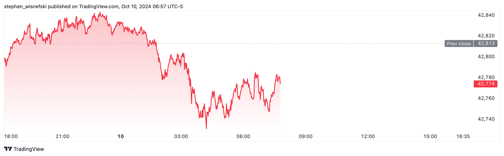

Algorithmic trading, often referred to as algo trading, utilizes computer programs to execute trading strategies based on predefined criteria. This method has revolutionized financial markets by enhancing the speed and precision of trades, allowing traders to take advantage of even the smallest market inefficiencies. A key element of algorithmic trading is the use of bars and tables, which provide traders with a structured way to analyze data and develop strategies.

Bars in trading typically represent a visual depiction of financial data over a specified time frame. They convey critical information such as opening and closing prices, highs and lows, and are often used to identify patterns and trends. This visualization enables traders to apply various technical analysis techniques, enhancing their ability to predict future price movements. Understanding the configuration and interpretation of these bars is essential for informed decision-making in algorithmic trading.



In parallel, tables organize this financial data into a structured format, facilitating more straightforward analysis and comparison of key metrics. Table rows may include important data points such as timestamps, price, volume, and indicator values, offering traders a comprehensive dataset for backtesting strategies and refining their approach. This organized representation of data is crucial for developing sophisticated trading algorithms capable of operating in different market conditions.

This article explores the role of bars and table rows in algo trading, providing insights into how they contribute to strategy development and execution. Understanding these elements is crucial for anyone looking to succeed in the fast-paced world of algo trading.

## Table of Contents

## What Are Bars and Tables in Algorithmic Trading?

Bars and tables are fundamental components in [algorithmic trading](/wiki/algorithmic-trading), serving as the building blocks for data representation and analysis. 

Bars in trading are graphical representations of market data over a specified time frame. They display key price points—open, high, low, and close (OHLC). These data points provide a snapshot of market activity within specific intervals, such as minutes, hours, or days, allowing traders to visualize price movements and identify trends. For example, a bar representing daily prices would show the price at market open, the highest and lowest prices observed during the day, and the closing price at market close. This format is crucial for traders employing technical analysis, as patterns and trends can be more readily identified from these structured visuals.

Tables, on the other hand, offer a method to organize extensive financial data in a format that is simple to analyze and compare. Each row typically contains timestamps, price information, trade volumes, and various indicator values. This structured approach allows traders to perform quantitative analysis with ease, facilitating the comparison of key metrics over different time periods. For instance, a table might include columns for time, open price, high price, low price, close price, and [volume](/wiki/volume-trading-strategy), with each row representing data for a specific time interval.

In algorithmic trading, the integration of bars and tables is crucial for developing and executing sophisticated trading algorithms. Bars provide the visual interpretation necessary for traders to identify market trends and patterns, while tables offer the detailed quantitative breakdown required for in-depth analysis. Together, these tools enable traders to form the basis of complex trading strategies, leveraging historical data to predict future market movements. The inherent structure of bars and tables supports algorithmic operations, such as filtering and sorting data, which are vital for efficient strategy development.

## Importance of Using Bars in Trading Strategies

Bars in trading are indispensable tools for visually representing price movements, serving as key instruments in the identification of trends and patterns. This representation is often realized through charts that display a sequence of individual bars for defined time intervals, such as minutes, hours, or days. Each bar encapsulates essential market data, specifically the opening, high, low, and closing prices within the time frame, sometimes augmented with volume data.

The comprehensive visual nature of bars enables traders to discern market trends efficiently. For instance, a series of ascending bars typically indicates an upward trend, while descending bars suggest a downward trend. This visual pattern recognition is fundamental to various technical analyses, allowing traders to predict future price movements based on historical data.

Technical analysis, a critical component of trading strategies, leverages bars for implementing methodologies like moving averages and price patterns. Moving averages involve calculating the average price over a specific number of periods, smoothing out price data to identify ongoing trends. For example, a simple moving average (SMA) can be computed as:

$$
\text{SMA} = \frac{P_1 + P_2 + ... + P_n}{n}
$$

where $P_1, P_2, \ldots, P_n$ represent the closing prices over $n$ time periods. Moving averages help traders to disregard market noise and focus on overall trend directions.

Furthermore, bar charts allow the identification of price patterns such as head and shoulders, double tops, and flag formations. These patterns are pivotal in anticipating price movements and market reversals.

Another significant advantage of using bars is the ability to customize their settings. Traders can adjust the time intervals of the bars to suit various trading strategies. For instance, high-frequency traders may prefer shorter intervals like 1-minute bars, while swing traders may utilize daily bars. This customization aids in accommodating different market conditions and trader preferences, thereby enhancing the analytical power and flexibility of trading strategies.

In summary, bars are more than mere graphical representations; they are powerful analytical tools that provide insights into market structures and dynamics. By allowing traders to visualize and interpret detailed market information, bars facilitate informed decision-making and the development of robust trading strategies.

## Structuring Data with Table Rows

Tables play a critical role in organizing financial data, thereby facilitating in-depth quantitative analysis crucial for algorithmic trading. By leveraging table structures, traders can manage extensive datasets more effectively, enabling the extraction of meaningful insights from raw data. Each row in a table often represents a specific instance or time slice of market conditions, documented with precise timestamps. This information is crucial for maintaining a chronological order of events, which allows traders to accurately recreate historical market conditions during analysis.

Key data points included in table rows typically comprise the asset’s price, traded volume, and various indicator values. The price component often captures the open, high, low, and close (OHLC) figures, offering a comprehensive view of price movements within a specific period. The inclusion of volume—a measure of the number of shares or contracts transacted—offers insights into market activity and potential [liquidity](/wiki/liquidity-risk-premium).

Indicator values, which may be computed from raw price and volume data, serve as vital tools for technical analysis. These indicators can include, but are not limited to, moving averages, relative strength index (RSI), and Bollinger Bands. By incorporating these indicators into table rows, traders gain access to enhanced datasets that support more nuanced strategy development and validation.

The structured nature of tables allows for streamlined [backtesting](/wiki/backtesting) processes where traders can test their strategies against historical data to evaluate performance and identify areas for improvement. By methodically iterating through datasets row by row, traders are equipped to simulate past trading scenarios, measure strategy responses, and tweak algorithms to better fit desired outcomes.

The use of structured tables also enhances traders' decision-making processes by providing access to a wealth of intricate and organized datasets. This organization supports not only historical analyses but also real-time monitoring and decision-making, allowing traders to respond swiftly to evolving market conditions. Such structured datasets ensure that decisions are backed by quantifiable insights, thereby increasing the probability of executing profitable trades.

In summary, tables serve as a fundamental component within algorithmic trading frameworks by structuring complex data into manageable and actionable formats, ultimately supporting comprehensive data analysis and strategy optimization.

## Developing Trading Strategies Using Bars and Tables

Algorithmic trading strategies leverage the structured representations of financial data provided by bars and tables to create and test hypotheses regarding market behaviors. Traders utilize bar patterns to discern trends, reversals, and other significant market signals. These visual representations, when analyzed quantitatively, can yield valuable insights regarding price behavior over specific periods. Patterns such as candlesticks in bars help identify market sentiment and [momentum](/wiki/momentum), which are critical for making informed trading decisions.

Tables complement this visual analysis by organizing the underlying financial data related to these bars in an accessible format, usually comprising rows with key metrics like timestamps, prices, volumes, and indicator values. This tabular data is essential for traders looking to test hypotheses about market movements through backtesting—a process that simulates a strategy's performance over historical data—to ensure its viability in live markets.

The development of trading strategies through the utilization of bars and tables is significantly enhanced by programming languages like Python. Python's extensive libraries, such as Pandas for data manipulation and Matplotlib for plotting, allow traders to automate the analysis of bar patterns and tabular data, enabling efficient exploration of diverse strategies. Through scripts, traders can perform complex calculations and visualize results in ways that guide decision-making.

For instance, using Python, a simple moving average crossover strategy can be developed by calculating the moving averages of price over two different periods and executing trades based on crossover points:

```python
import pandas as pd
import numpy as np

# Load financial data into Pandas DataFrame
data = pd.read_csv('financial_data.csv')

# Calculate short-term and long-term moving averages
data['Short_MA'] = data['Close'].rolling(window=50).mean()
data['Long_MA'] = data['Close'].rolling(window=200).mean()

# Generate buy/sell signals
data['Signal'] = np.where(data['Short_MA'] > data['Long_MA'], 1, 0)
data['Position'] = data['Signal'].diff()

# Output the trading signals
signals = data[data['Position'] != 0][['Date', 'Signal', 'Position']]
print(signals)
```

This code snippet demonstrates how traders can automate the generation of trading signals by analyzing bar data (closing prices) and utilizing tables to store and manipulate the financial information needed for decision-making.

By systematically studying bar patterns and table data, traders can hypothesize future market moves and automate their analytical processes to implement strategies across various time frames and market conditions. This approach not only streamlines strategy development but also enhances the precision and speed at which trading strategies are deployed, a crucial advantage in the fast-paced environment of algorithmic trading.

## Backtesting and Optimizing Strategies

Backtesting is a critical aspect of algorithmic trading, providing a systematic approach to evaluating the viability of trading strategies by applying them to historical market data. The goal is to understand how a strategy would have performed in the past, enabling traders to gain insights into its potential future performance. This process relies heavily on the accurate representation of market conditions, which is where bars and tables become indispensable.

Bars, which represent aggregated data points like open, high, low, and close prices over specific time intervals, offer traders a visual and quantitative framework to simulate past trading environments. These data points are essential for assessing how a strategy responds to price fluctuations and trend developments. Tables serve as a fundamental data structure to organize these bars into structured datasets, encompassing not only price data but also associated metrics such as volume and technical indicators.

A typical backtesting workflow involves several steps:

1. **Data Collection**: Historical data for the chosen financial instrument is collected, often in the form of bars (e.g., candlesticks) and tabulated into a structured format. The data typically includes timestamps, price points, and volume information.

2. **Strategy Implementation**: The trading strategy is coded, often using programming languages like Python, enabling the manipulation of bar and table data to generate buy or sell signals based on predefined criteria. Below is an example of a simple moving average crossover strategy in Python:

    ```python
    import pandas as pd

    def moving_average_crossover(data, short_window=50, long_window=200):
        signals = pd.DataFrame(index=data.index)
        signals['price'] = data['Close']
        signals['short_mavg'] = data['Close'].rolling(window=short_window, min_periods=1, center=False).mean()
        signals['long_mavg'] = data['Close'].rolling(window=long_window, min_periods=1, center=False).mean()
        signals['signal'] = 0.0
        signals['signal'][short_window:] = np.where(signals['short_mavg'][short_window:] > signals['long_mavg'][short_window:], 1.0, 0.0)
        signals['positions'] = signals['signal'].diff()
        return signals
    ```

3. **Simulation**: The strategy is then applied to the historical data. This simulation generates a series of hypothetical trades, allowing traders to analyze profit and loss under the conditions set by the historical dataset.

4. **Performance Evaluation**: Key performance metrics such as net profit, percentage of winning trades, maximum drawdown, and Sharpe ratio are calculated to assess strategy effectiveness.

Optimization plays a vital role in refining these strategies to enhance performance and robustness. Traders adjust various parameters, such as moving average window sizes or stop-loss limits, iteratively backtesting each variation to identify the best-performing parameters. However, caution must be taken to avoid overfitting—designing a strategy too closely aligned to historical data, which may not perform well in live markets due to its lack of adaptability.

The iterative nature of backtesting and optimization ensures that strategies are not only theoretically sound but also practically viable. As the trading landscape evolves, continuous refinement through backtesting enables traders to maintain an edge in increasingly competitive markets.

## Challenges and Considerations

One of the primary challenges associated with using bars and tables in algorithmic trading is maintaining data accuracy and integrity. Data inaccuracies can arise from various sources, such as feed errors, incorrect timestamps, or missing data points. Ensuring clean and reliable data is fundamental for the development of effective trading algorithms. Traders often employ data validation and cleaning techniques to mitigate such issues, recognizing that even minor discrepancies in data can lead to significant errors in strategy outcomes.

Another critical consideration is the risk of overfitting trading strategies to historical data. Overfitting occurs when a model is excessively tailored to past data, capturing noise rather than valid market signals. This can result in strategies that perform well in backtesting but fail in live markets due to their lack of generalizability. To avoid overfitting, traders implement techniques such as cross-validation, where data is divided into separate sets for training and testing, and regularization methods that limit the complexity of the model.

Regulatory considerations also play a vital role in algorithmic trading. Financial markets are governed by strict regulations aimed at ensuring fair and transparent trading practices. Traders must adhere to these legal requirements, which may include restrictions on order types, execution speeds, and data usage. Failing to comply with such regulations can lead to severe penalties, including fines and trading bans.

Moreover, the technical infrastructure needed to implement trading algorithms based on bars and tables calls for substantial investment and expertise. High-frequency trading, for instance, requires state-of-the-art hardware with low-latency connectivity to markets, robust software platforms for processing massive amounts of data quickly, and skilled personnel to manage and oversee operations. As technology continues to evolve, traders must continuously upgrade their systems to maintain a competitive edge, all while balancing cost and efficiency.

In summary, while bars and tables are indispensable tools in algorithmic trading, traders must navigate challenges related to data quality, model robustness, regulatory compliance, and technical infrastructure to achieve sustained success in live markets.

## Conclusion

Bars and tables serve as foundational elements in the domain of algorithmic trading, offering a systematic approach to representing and dissecting intricate financial data. These tools enable traders to visualize market movements and perform quantitative analyses, which are crucial for crafting robust trading strategies. Mastery in deploying bars and tables is vital for traders who seek to build effective and profitable algorithmic strategies. Precision in these areas allows for informed decision-making and enhances the ability to anticipate market shifts. 

As technology and data analytics continue to evolve, the utility of bars and tables is set to expand, offering more nuanced insights and greater accuracy. Enhanced computational power and sophisticated programming languages like Python facilitate the automation and optimization of trading strategies, making it possible to process large data sets efficiently and swiftly. For instance, libraries such as Pandas and NumPy enable comprehensive data manipulation and analysis, providing traders with the tools needed to generate actionable insights from bars and tables. 

With ongoing advancements, these mechanisms will further empower traders to harness complex data, improving their potential to succeed in fast-paced trading environments. Adapting to these technological shifts is not only advantageous but necessary for staying competitive in modern financial markets.

## References & Further Reading

[1]: ["Advances in Financial Machine Learning"](https://www.amazon.com/Advances-Financial-Machine-Learning-Marcos/dp/1119482089) by Marcos Lopez de Prado

[2]: ["Evidence-Based Technical Analysis: Applying the Scientific Method and Statistical Inference to Trading Signals"](https://www.amazon.com/Evidence-Based-Technical-Analysis-Scientific-Statistical/dp/0470008741) by David Aronson

[3]: ["Machine Learning for Algorithmic Trading"](https://github.com/PacktPublishing/Machine-Learning-for-Algorithmic-Trading-Second-Edition) by Stefan Jansen

[4]: ["Quantitative Trading: How to Build Your Own Algorithmic Trading Business"](https://www.amazon.com/Quantitative-Trading-Build-Algorithmic-Business/dp/1119800064) by Ernest P. Chan

[5]: Bergstra, J., Bardenet, R., Bengio, Y., & Kégl, B. (2011). ["Algorithms for Hyper-Parameter Optimization."](https://dl.acm.org/doi/10.5555/2986459.2986743) Advances in Neural Information Processing Systems 24.