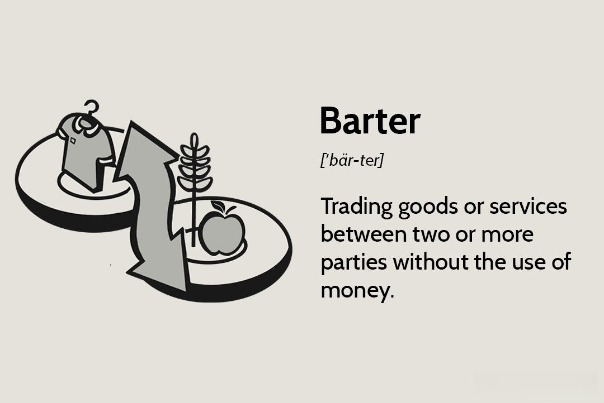

## Table of Contents

## What is barter?

Barter is a way of trading goods or services without using money. Instead of buying something with cash, you exchange something you have for something someone else has. For example, if you have apples and your friend has bread, you can trade apples for bread. This system has been used for thousands of years and is still used in some places today.

Bartering can be useful when people don't have money or when money is not trusted. It helps people get what they need by sharing what they have. However, it can be hard to find someone who wants what you have and has what you want at the same time. This problem is called the "double coincidence of wants." Despite this, bartering remains a simple and direct way to trade.

## How does barter differ from using money?

Barter and using money are two different ways to trade things. With barter, you trade goods or services directly without using money. For example, if you have a chicken and you want some corn, you can trade your chicken for corn with someone who has corn but wants a chicken. Using money is different because you don't trade goods directly. Instead, you use money to buy things. If you have money, you can buy corn from anyone who is selling it, without needing to have something they want in return.

Using money makes trading easier because it solves the problem of finding someone who wants what you have and has what you want at the same time. Money is accepted by everyone, so you can use it to buy anything you need. Barter can be harder because you need to find the right person to trade with. But barter can be useful when money is not available or trusted. Both ways of trading have been used for a long time, but using money is more common today because it makes trading simpler and faster.

## What are the historical origins of barter?

Barter has been around for a very long time, even before people used money. It started when early humans traded things they had with others. For example, if one group had extra food like fish, they might trade it with another group that had something like tools or animal skins. This way, both groups could get what they needed without using money. Barter helped early societies share resources and survive better.

As societies grew and became more complex, barter continued to be important. Ancient civilizations like the Mesopotamians, Egyptians, and Greeks used barter to trade goods. They would exchange things like grains, livestock, and pottery. Even though money started to be used in some places, barter was still common because it was a simple way to trade without needing coins or paper money. Over time, as money became more widely used, barter became less common but never completely went away.

## Can you provide examples of barter in everyday life?

Barter happens in everyday life when people trade things without using money. For example, if you have some old clothes that you don't wear anymore, you might trade them with a friend who has some books you want to read. Both of you get something new without spending any money. This kind of trade can happen between friends, family, or even neighbors.

Another example is when someone needs help with a task, like fixing a bike, and they don't have money to pay for it. They might offer to help with something else in return, like cooking a meal or helping with gardening. This way, both people get what they need by trading skills or services. Barter can be a useful way to get things done without using money, especially when people trust each other and have something the other person wants.

## What are the advantages of using barter systems?

Barter systems have some good things about them. One big advantage is that you don't need money to get what you want. If you have something that someone else needs, you can trade it for something you need. This can be really helpful if you don't have money or if money is not trusted in your area. Barter helps people share what they have and get what they need without using cash.

Another advantage of barter is that it can help build strong relationships between people. When you trade with someone, you often get to know them better. This can create a sense of trust and community. Barter also encourages people to value what they have and to be creative in finding ways to trade. It can make people feel more connected to each other and to their community.

## What are the challenges and limitations of barter?

Barter can be hard because you need to find someone who wants what you have and has what you want at the same time. This problem is called the "double coincidence of wants." For example, if you have apples and you want bread, you need to find someone who has bread and wants apples. It can take a lot of time and effort to find the right person to trade with. This makes bartering less efficient than using money, where you can buy anything you need as long as you have enough money.

Another challenge with barter is deciding how much something is worth. If you want to trade your apples for bread, how many apples should you give for one loaf of bread? It can be hard to agree on a fair trade. Sometimes, one person might feel like they are giving more than they are getting. This can lead to disagreements and make people not want to barter. Even though barter can be useful, these challenges can make it less practical for everyday trading.

## How has technology influenced modern barter practices?

Technology has changed how people use barter today. With the internet, it's easier to find someone who wants to trade with you. Websites and apps let you post what you have and what you want, so you can find people all over the world who are interested in trading. This makes the "double coincidence of wants" problem easier to solve. You don't have to look for someone in your neighborhood; you can find someone online.

Also, technology helps keep track of trades and makes sure they are fair. Some websites use a point system or digital tokens to help people value what they are trading. This can make it easier to agree on a fair trade. Even though barter is still about trading things without money, technology makes it more organized and easier to do.

## What role does barter play in economic theories?

Barter plays an important role in economic theories because it shows how people traded before they used money. Economists think that barter was the first way people exchanged things. It helps explain how trade started and why money was created. In theories like Adam Smith's, barter is seen as the beginning of economic activity. People traded things they had, like food or tools, for things they needed. This helped early societies grow and share resources.

Barter also shows some problems in economic systems. One big problem is the "double coincidence of wants." This means you need to find someone who wants what you have and has what you want at the same time. This can be hard and makes barter less efficient. Economists use this problem to explain why money is useful. Money solves this problem because it can be used to buy anything, making trade easier and faster. Even though barter is not used as much today, it helps economists understand how trade works and why money is important.

## How do businesses implement barter as part of their operations?

Some businesses use barter as a way to trade goods or services without using money. They might join a barter exchange, which is like a club where businesses can trade with each other. For example, a restaurant might trade meals for advertising services from a marketing company. This can help businesses save money and get things they need, like new equipment or services, by using what they already have.

Barter can also help businesses build relationships with other companies. When businesses trade with each other, they get to know each other better and can work together more in the future. However, barter can be tricky because it's hard to agree on what things are worth. Businesses need to make sure the trade is fair for both sides. Even with these challenges, barter can be a useful tool for businesses to grow and save money.

## What are some successful case studies of barter systems in different cultures?

In ancient Mesopotamia, barter was a big part of how people traded. They would exchange things like grains, livestock, and pottery. For example, if a farmer had too much barley, they might trade it with someone who had wool. This helped them get what they needed without using money. The Mesopotamians even had rules about how to make fair trades, which shows how important barter was to their society.

In some Pacific Island cultures, like the Trobriand Islands, people use a special kind of barter called the Kula ring. In the Kula ring, people trade shell necklaces and armbands in a big circle. It's not just about getting things; it's also about building friendships and trust. People travel to different islands to trade, and this helps them connect with each other. The Kula ring shows how barter can be a part of culture and help bring people together.

## How can barter be integrated into a community or local economy?

Barter can be a great way to help a community or local economy grow. People in the community can start trading things they have, like fruits and vegetables from their gardens, for things they need, like tools or services. This can help everyone get what they need without using money. For example, a farmer might trade some of their crops for help fixing a fence. This kind of trading can build strong relationships between people in the community and make everyone feel more connected.

To make barter work well in a community, people can set up a local barter group or use an online platform to find others who want to trade. They can agree on what things are worth so trades are fair. For example, they might decide that a basket of apples is worth a certain amount of hours of babysitting. This way, everyone knows what they are getting and giving. Barter can help the local economy by keeping money in the community and encouraging people to share what they have with each other.

## What future trends might we see in the evolution of barter systems?

In the future, barter systems might become more popular because of technology. People can use apps and websites to find others who want to trade. These tools can make it easier to find someone who wants what you have and has what you want. They can also help keep track of trades and make sure they are fair. This could make barter a bigger part of how people trade, even if they also use money.

Another trend might be that more businesses start using barter. Companies can trade goods or services with each other without using money. This can help them save money and get what they need. For example, a restaurant might trade meals for advertising services. As more businesses see the benefits of barter, they might use it more often. This could change how businesses work together and help local economies grow.

## References & Further Reading

[1]: Bergstra, J., Bardenet, R., Bengio, Y., & Kégl, B. (2011). ["Algorithms for Hyper-Parameter Optimization."](https://papers.nips.cc/paper/4443-algorithms-for-hyper-parameter-optimization) Advances in Neural Information Processing Systems 24.

[2]: ["Advances in Financial Machine Learning"](https://www.amazon.com/Advances-Financial-Machine-Learning-Marcos/dp/1119482089) by Marcos Lopez de Prado

[3]: ["Evidence-Based Technical Analysis: Applying the Scientific Method and Statistical Inference to Trading Signals"](https://www.amazon.com/Evidence-Based-Technical-Analysis-Scientific-Statistical/dp/0470008741) by David Aronson

[4]: ["Machine Learning for Algorithmic Trading"](https://github.com/PacktPublishing/Machine-Learning-for-Algorithmic-Trading-Second-Edition) by Stefan Jansen

[5]: ["Quantitative Trading: How to Build Your Own Algorithmic Trading Business"](https://books.google.com/books/about/Quantitative_Trading.html?id=j70yEAAAQBAJ) by Ernest P. Chan