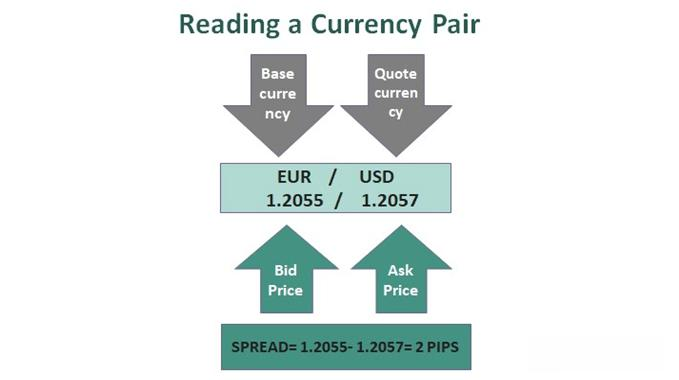

In the world of finance, understanding currencies is crucial for any trader or investor, especially in the foreign exchange (forex) market. At the core of forex trading are currency pairs, which consist of a base currency and a quote currency. The base currency represents the currency you are buying, while the quote currency represents the currency you are selling. For example, in the EUR/USD pair, EUR is the base currency, and USD is the quote currency, indicating how much USD is required to purchase one EUR.

This article aims to shed light on the concepts of quote currency, base currency, and currency exchange, especially in the context of algorithmic trading. Algorithmic trading employs computer programs to execute trades based on pre-defined criteria, making it possible to analyze and react to market data at speeds and efficiencies beyond human capabilities. Understanding how algorithmic trading interacts with currency exchange is essential, as it has transformed forex markets, influencing liquidity and volatility.



Exploring the intricacies of base and quote currencies reveals how they form the foundation of forex trading. These components enable traders to assess the relative strength of currencies, driving decisions for entering or exiting trades. Additionally, understanding currency exchange mechanisms—including the factors influencing exchange rates such as economic indicators, market sentiment, and geopolitical events—provides insight into potential profit and loss scenarios.

Furthermore, the role of algorithmic trading in currency exchange will be examined to understand its impact on the forex market. Algorithmic trading enhances the ability to execute large volumes of orders with precision, harnessing real-time data analytics to capitalize on arbitrage opportunities, trend movements, and liquidity conditions. However, while it offers numerous advantages, traders must also be aware of the associated risks, particularly during periods of sudden market volatility.

Achieving a comprehensive understanding of these elements will equip traders with the knowledge to optimize their trading strategies. By combining insights into currency dynamics with advanced algorithmic techniques, traders stand to improve their decision-making abilities, potentially increasing profitability in the competitive forex market.

## Table of Contents

## Understanding Base and Quote Currencies

A currency pair in the forex market comprises two key elements: the base currency and the quote currency. The base currency is the first currency listed in a forex pair and serves as the reference point for the transaction. It is indicative of the amount of the second currency, the quote currency, required to purchase one unit of the base currency. Therefore, the expression of currency exchange rates involves comparing the base currency to the quote currency and analyzing potential profits or losses in trading activities.

For instance, consider the currency pair USD/GBP. Here, USD serves as the base currency, which means the rate expresses the quantity of British Pounds (GBP), the quote currency, necessary to buy one US Dollar (USD). If the exchange rate displayed is 0.75, it implies that one USD is equivalent to 0.75 GBP.

Understanding these roles is essential for traders evaluating currency exchange rates. It enables them to make informed decisions based on anticipated shifts in currency value. The price movements of these currencies result from various economic factors, such as inflation rates, economic growth, or monetary policy decisions, which influence the demand and supply dynamics.

Accurate analysis of base and quote currencies is crucial for assessing the potential profit or loss in [forex](/wiki/forex-system) trading transactions. Traders aim to forecast the fluctuations in the currency pair values, thereby deciding whether to buy or sell the base currency. This involves not only understanding the numerical representation of the exchange rate but also considering the market forces that may affect the relative strengths of the currencies involved.

## Currency Exchange Mechanism

Currency exchange is the process by which one currency is converted into another, allowing for international trade, investment, and travel. In the forex market, this conversion occurs through the trading of currency pairs. Each pair consists of two currencies: the base currency and the quote currency. This market-driven exchange is governed by supply and demand dynamics, which are influenced by various economic and geopolitical factors.

The exchange rate between currencies fluctuates primarily due to changes in economic indicators such as inflation rates, interest rates, and the economic growth outlook of a country. For example, if Country A has a high inflation rate, its currency may depreciate compared to other currencies, leading to a higher exchange rate for its currency. Conversely, when a country experiences economic growth and stable interest rates, its currency tends to appreciate.

Market sentiment also plays a critical role in influencing exchange rates. Traders' perceptions about future events, economic policies, or geopolitical tensions can lead to rapid shifts in currency demand. A positive sentiment towards a country's economic prospects might result in an increased demand for its currency, strengthening it against others. In contrast, negative sentiment can lead to a sell-off of that currency, resulting in depreciation.

Traders in the forex market make transactions based on their expectations of how these factors will influence exchange rates. They may choose to buy a currency pair if they anticipate that the base currency will strengthen against the quote currency. This action is taken with the expectation that the exchange rate will rise, allowing them to sell the base currency later at a higher price for a profit.

Conversely, traders might opt to sell a currency pair if they predict the base currency will weaken relative to the quote currency. This decision is made with the expectation that the exchange rate will fall, enabling them to buy back the base currency at a lower price, thereby making a profit on the transaction.

To illustrate these transactions, consider the USD/EUR currency pair. If a trader believes the U.S. dollar (USD) will appreciate against the euro (EUR) due to robust U.S. economic data, they will buy the USD/EUR pair. If the contrary occurs, and poor U.S. economic performance is anticipated, the trader may sell the USD/EUR pair.

In the context of [algorithmic trading](/wiki/algorithmic-trading), these decisions and transactions can be automated using computer programs. Algorithms are designed to execute trades based on predefined criteria, such as specific economic indicators or technical analysis patterns, allowing for a systematic approach to currency exchange. These automated systems enhance the efficiency of trading by rapidly executing large volumes of trades and reducing the emotional bias that might affect human traders.

## The Rise of Algorithmic Trading in Forex

Algorithmic trading has revolutionized the forex market by harnessing the power of computer programs to automate trading tasks based on predefined criteria. This technological advancement allows traders to increase the efficiency of their trading operations significantly. By employing algorithms, traders can execute a vast number of orders rapidly, thereby reducing the time invested in manual trading processes and minimizing the emotional biases that often affect human decision-making.

A significant aspect of algorithmic trading is high-frequency trading ([HFT](/wiki/high-frequency-trading-strategies)), which represents a subset focused on executing trades at remarkable speeds—often in fractions of a second. HFT aims to exploit small price movements, leveraging the minute fluctuations in the forex market to generate profits. For example, an HFT algorithm might be programmed to capitalize on [arbitrage](/wiki/arbitrage) opportunities where even a minor price discrepancy between two market venues can be rapidly identified and acted upon.

The use of algorithms in forex trading facilitates the analysis of extensive datasets, enabling traders to uncover patterns or detect arbitrage possibilities that may be invisible to the human eye due to their complexity or the speed at which they occur. Through sophisticated statistical and mathematical models, these algorithms can parse through historical price data, current market conditions, and even real-time news feeds to make informed trading decisions.

The precision offered by algorithmic trading derives from its ability to process immense amounts of data and execute trades with exact timing. This precision is paramount in the highly liquid and volatile forex market, where the difference between success and failure can hinge on millisecond-level timing and minute price fluctuations.

Overall, algorithmic trading has not only enhanced the efficiency and potential profitability of forex trading but has also transformed the landscape of the forex market itself by shifting the dynamics of how trades are executed and how strategies are formulated.

## Benefits and Risks of Algorithmic Trading

Algorithmic trading, also known as algo-trading or automated trading, provides numerous advantages to participants in the forex market. Primarily, it enhances accuracy and speed by allowing traders to execute a vast number of orders within milliseconds. The automation reduces human error, promotes consistency, and eliminates emotion-based decision-making, which can adversely affect trading outcomes. Furthermore, algorithmic trading lowers transaction costs by optimizing execution strategies, helping traders achieve better pricing and reducing market impact through techniques such as order slicing and smart order routing.

However, algorithmic trading is not devoid of risks. One major concern is the potential for increased market [volatility](/wiki/volatility-trading-strategies). During periods of extreme market stress or unforeseen events, rapid automated trading can exacerbate price swings, leading to destabilized markets. The Flash Crash of 2010 serves as a notable example, where algorithmic trading contributed to a significant and swift market downturn.

Another risk involves increased market fragmentation. Algorithmic strategies often target multiple trading venues to capitalize on slight price discrepancies, which can result in fragmented [liquidity](/wiki/liquidity-risk-premium) pools. This fragmentation can pose challenges during periods of market turbulence when liquidity is crucial.

Unexpected liquidity shortages are another issue linked with algorithmic trading. While these systems are designed to operate in liquid markets, sudden shifts in liquidity can disrupt trading strategies, resulting in substantial losses. Traders rely on predictive models to anticipate market conditions, but unexpected liquidity changes can render these models ineffective.

To mitigate these risks, robust monitoring and fail-safes are essential components of any algorithmic trading system. Traders need to implement comprehensive risk management protocols, including real-time system monitoring, circuit breakers, and backup execution strategies. Ensuring that algorithms can adapt to changing market conditions is critical. Developing algorithms with adaptive learning capabilities or incorporating [machine learning](/wiki/machine-learning) techniques can enhance their robustness in dynamic environments. Here is a basic Python example demonstrating how one might implement an adaptive algorithm:

```python
import numpy as np

class AdaptiveAlgoTrader:
    def __init__(self, initial_threshold=0.05):
        self.threshold = initial_threshold

    def update_threshold(self, market_volatility):
        if market_volatility > self.threshold:
            self.threshold += 0.01  # Adapt threshold based on volatility
        else:
            self.threshold -= 0.01
        self.threshold = max(0.01, self.threshold)  # Ensure threshold remains positive

    def trade_decision(self, price_change):
        if price_change > self.threshold:
            return "Buy"
        elif price_change < -self.threshold:
            return "Sell"
        else:
            return "Hold"

# Example usage
trader = AdaptiveAlgoTrader()
market_volatility = np.random.rand()  # Simulated market volatility
price_change = np.random.uniform(-0.1, 0.1)  # Simulated price change

trader.update_threshold(market_volatility)
decision = trader.trade_decision(price_change)
print("Trade Decision:", decision)
```

This simple adaptive algorithm adjusts its sensitivity (threshold) based on market volatility, making it more resilient to changing market conditions. Nevertheless, adapting algorithms is a complex and research-intensive endeavor, requiring continuous [backtesting](/wiki/backtesting) and performance evaluation.

Ultimately, while algorithmic trading presents substantial advantages, it requires balanced implementation, vigilant oversight, and strategic adaptability to navigate potential drawbacks effectively.

## Conclusion: Navigating Base and Quote Currencies with Algorithms

The interplay between base and quote currencies is foundational in forex trading, serving as the primary framework that traders use to evaluate currency exchange rates. Understanding these roles is pivotal for making informed trading decisions. Algorithmic trading enhances this understanding by equipping traders with the tools needed to analyze and respond to forex market conditions quickly and accurately. Utilizing algorithms allows traders to process large datasets, uncover patterns, and execute trades with precision—all of which are crucial in a market where milliseconds can make a significant difference.

In the context of algorithmic trading, forex strategies are often encoded into computer programs that automate trading decisions based on predefined criteria. This automation facilitates swift execution of trades, ensuring that traders can capitalize on fleeting opportunities in the market. For example, algorithms might be programmed to execute a buy order if a particular technical indicator signals impending currency strength. By removing emotional biases from decision-making, algorithmic trading enhances the consistency and reliability of trading strategies.

However, leveraging algorithmic trading requires balancing opportunity with caution. While these systems offer heightened efficiency and accuracy, they also come with inherent risks. Rapid automated trading can exacerbate market volatility during unexpected events, and reliance on algorithms may sometimes lead to market fragmentation or liquidity challenges. Furthermore, algorithms are only as effective as their underlying logic; programming errors or insufficient modeling can result in significant losses.

To mitigate these risks, traders must employ robust monitoring systems and implement fail-safes to protect against unfavorable market conditions. Continuous market evaluation, combined with adaptive algorithmic strategies, ensures that traders remain responsive to changing market dynamics. By anticipating potential pitfalls and adjusting algorithms as necessary, traders can harness the substantial benefits of algorithmic trading while minimizing its risks.

In summary, understanding the dynamics between base and quote currencies, and integrating algorithmic trading, empowers traders to efficiently navigate the forex market. With a strategic approach that embraces both opportunities and limitations, traders can optimize their operations and enhance their potential for success in currency exchange.

## References & Further Reading

[1]: ["Foreign Exchange: The Complete Deal: A Comprehensive Guide to the Theory and Practice of the Forex Market"](https://archive.org/details/foreignexchangec0000shar) by James Sharpe

[2]: ["Algorithmic Trading: Winning Strategies and Their Rationale"](https://www.wiley.com/en-us/Algorithmic+Trading%3A+Winning+Strategies+and+Their+Rationale-p-9781118460146) by Ernie Chan

[3]: ["High-Frequency Trading: A Practical Guide to Algorithmic Strategies and Trading Systems"](https://www.amazon.com/High-Frequency-Trading-Practical-Algorithmic-Strategies/dp/0470563761) by Irene Aldridge

[4]: ["The Forex Trading Course: A Self-Study Guide to Becoming a Successful Currency Trader"](https://www.amazon.com/Forex-Trading-Course-Self-Study-Successful/dp/1118998650) by Abe Cofnas

[5]: ["Algorithmic and High-Frequency Trading"](https://assets.cambridge.org/97811070/91146/frontmatter/9781107091146_frontmatter.pdf) by Álvaro Cartea, Sebastian Jaimungal, and José Penalva

[6]: Gomber, P., Arndt, B., Lutat, M., & Uhle, T. (2011). ["High-Frequency Trading."](https://papers.ssrn.com/sol3/papers.cfm?abstract_id=1858626) Wirtschaftsinformatik, 53(5), 319-330.