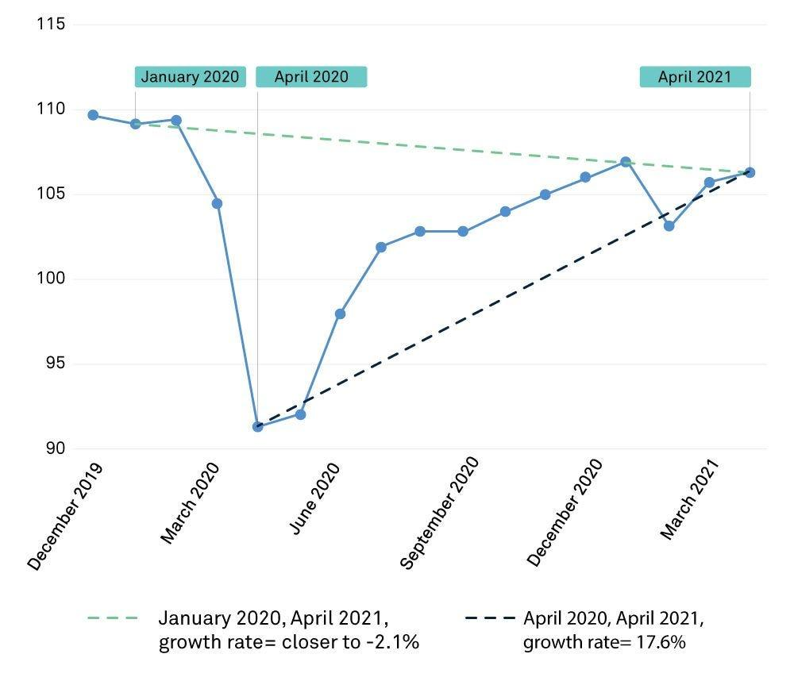

## Table of Contents

## What is the base effect in economic analysis?

The base effect in economic analysis is a concept that helps us understand how current economic data compares to the data from the same period in the previous year. It's like looking at this year's sales in January and comparing them to last January's sales. If last January was unusually bad, this year's January might look good even if it's not really that great. This can make the numbers seem better or worse than they really are, just because of what happened last year.

This effect is important because it can affect how we see the economy's health. For example, if inflation was very low last year, even a small increase this year might seem big because of the base effect. Economists need to be careful when they look at these numbers so they don't get the wrong idea about how things are going. By understanding the base effect, they can make better decisions and give more accurate advice.

## How does the base effect influence inflation rates?

The base effect can make inflation rates look higher or lower than they really are. Imagine last year, prices went down a lot in January. If this year, prices go up just a little bit in January, it might seem like a big jump because we're comparing it to last year's low prices. This is the base effect at work. It makes the inflation rate for this year's January look bigger than it would if we were comparing it to a normal year.

This can be confusing for people trying to understand the economy. If the base effect makes inflation look high, people might think the economy is doing worse than it is. On the other hand, if the base effect makes inflation look low, people might think the economy is doing better than it is. Economists need to explain the base effect so everyone understands what's really happening with prices. By knowing about the base effect, we can get a clearer picture of whether inflation is really going up or down.

## Can you explain the base effect with a simple example?

Imagine last year in January, a toy store had a big sale and sold toys for $10 each. This year in January, the same toys are sold for $12 each. If we compare this year's price to last year's sale price, it looks like the price went up by 20% ($2 more on $10). But if last year's January wasn't a sale month and the toys were sold for $11, the price increase this year would only be about 9% ($1 more on $11). This difference is because of the base effect.

The base effect can make things seem better or worse than they really are. In our toy store example, if people only look at the 20% increase from last year's sale, they might think the prices are going up a lot. But if they know about the base effect and compare it to a normal year, they see it's only a 9% increase. Understanding the base effect helps us see the real changes in prices and not get tricked by big jumps or drops from last year.

## What are the key factors to consider when performing a comparison analysis?

When doing a comparison analysis, it's important to look at the right starting points or bases. You need to know if last year was a special year, like if there was a big sale or if prices were unusually high or low. This helps you understand if the changes you see this year are really big or if they just look big because of what happened last year. Also, make sure you're comparing the same things. If you're looking at toy prices, compare toy prices, not toy prices to something else like clothes.

Another thing to think about is the time frame. Are you comparing month to month, or year to year? Different time frames can show different results. For example, looking at January to January might show a big change because of the base effect, but looking at the whole year might show a smaller change. It's also good to look at more than just numbers. Think about what's happening in the world or in the economy that might affect the numbers you're comparing. This gives you a fuller picture of what's going on.

## How does the base effect impact year-over-year data comparisons?

The base effect can make year-over-year data comparisons tricky. It happens when we compare this year's numbers to last year's numbers, and last year was unusual. For example, if last year's January was really cold and people didn't go out much, sales might have been low. If this year's January is normal, sales might look much better just because we're comparing to a bad month last year. This can make it seem like things are improving a lot more than they really are.

To understand year-over-year data better, we need to look at more than just the numbers. We should think about what was happening last year that might have made the numbers unusual. If we know that last year was special, we can adjust our expectations for this year. This way, we won't be fooled by big changes that are just because of the base effect. By considering the base effect, we can get a clearer picture of what's really happening with the data over time.

## What are common pitfalls to avoid when analyzing data using the base effect?

One common pitfall when using the base effect is not knowing what made last year's numbers unusual. If last year was special because of a big sale or a bad weather event, this year's numbers might look better or worse just because of that. If we don't think about what was different last year, we might think things are changing more than they really are. It's important to look at the whole picture and understand why last year's numbers were what they were.

Another pitfall is focusing too much on the base effect and forgetting about other things that can affect the data. For example, if there's a new law or a big change in the economy, it can change the numbers in ways that aren't just about the base effect. We need to look at all the factors that might be influencing the data, not just the comparison to last year. By considering everything, we can avoid making mistakes and get a better understanding of what's really happening.

## How can the base effect distort economic indicators and forecasts?

The base effect can make economic indicators look different from what they really are. Imagine last year's numbers were really low because of something unusual, like a big sale or a natural disaster. If this year's numbers are normal, they might look much better just because we're comparing them to last year's low numbers. This can make it seem like the economy is growing a lot more than it really is. For example, if last year's inflation rate was very low, even a small increase this year might look big because of the base effect. This can make people think inflation is getting out of control when it's not really that bad.

When economists make forecasts, they need to be careful about the base effect. If they don't think about what made last year's numbers unusual, their predictions for the future might be off. They might predict a big jump in sales or prices just because they're comparing to last year's low numbers. But if they understand the base effect, they can adjust their forecasts to be more accurate. By considering the base effect, economists can give better advice and help people understand what's really happening with the economy.

## What advanced statistical methods can be used to adjust for the base effect in time series analysis?

To adjust for the base effect in time series analysis, one useful method is to use seasonal adjustment. This means looking at the data over many years and figuring out what's normal for each month or season. By doing this, we can see if this year's numbers are really different or if they just look different because last year was unusual. For example, if January sales are usually low but were extra low last year because of a big sale, seasonal adjustment can help us see that this year's January sales are actually normal, not a big jump.

Another method is to use year-over-year percentage changes with adjustments. Instead of just comparing this year's numbers to last year's, we can look at the average of several years before. This helps smooth out the effects of any one unusual year. For instance, if last year's inflation rate was very low, we can compare this year's rate to the average of the last few years to get a better idea of whether inflation is really going up or if it just looks that way because of the base effect. By using these advanced methods, we can get a clearer picture of economic trends and make better decisions.

## How do different economic sectors experience the base effect differently?

Different economic sectors can feel the base effect in different ways because each sector has its own special times and events that can make last year's numbers unusual. For example, in the retail sector, big sales like Black Friday can make last year's numbers look low if there was a huge sale. If this year's numbers are normal, they might look like a big jump just because we're comparing them to last year's sale. On the other hand, in the agriculture sector, bad weather last year might have made crop prices go up a lot. If this year's weather is normal, crop prices might look like they've dropped a lot, even if they're just back to normal.

In the energy sector, things like oil prices can be affected by global events. If there was a big drop in oil prices last year because of a war or a big change in production, this year's prices might look like they've gone up a lot even if they're just back to normal. Each sector needs to think about what made last year's numbers unusual and adjust their comparisons to get a true picture of what's happening. By understanding how the base effect works in their own sector, businesses can make better plans and decisions.

## What role does the base effect play in monetary policy decisions?

The base effect can be really important when people who make money rules, like central bankers, decide what to do. If last year's numbers were very low because of something unusual, like a big sale or a natural disaster, this year's numbers might look a lot better just because we're comparing them to last year. If the central bankers don't think about this, they might think the economy is doing much better than it really is. This could make them decide to raise interest rates or change other money rules in a way that might not be good for the economy.

To make the right choices, central bankers need to understand the base effect. They should look at more than just the numbers from last year and this year. They need to think about what made last year's numbers unusual and adjust their plans to make sure they're making decisions based on what's really happening with the economy. By considering the base effect, they can help keep the economy stable and make sure their money rules are helping people and businesses in the right way.

## How can organizations use comparison analysis to improve strategic decision-making?

Organizations can use comparison analysis to make better strategic decisions by looking at how they're doing now compared to how they did before or how others are doing. For example, if a company compares its sales this year to last year, it can see if it's growing or not. If last year's sales were low because of a big sale, the company needs to think about the base effect and not just see a big jump this year as a big success. By understanding these comparisons, the company can make smarter choices about where to spend money or what new products to launch.

Another way comparison analysis helps is by looking at how competitors are doing. If a company sees that its competitor's sales went up a lot, it might want to find out why and see if it can do the same thing. But it's important to think about the base effect here too. If the competitor's sales went up because last year was bad for them, the company should not just try to copy what they did without understanding the whole story. By using comparison analysis the right way, organizations can learn from the past and from others to make better plans for the future.

## What are the latest research findings on the impact of the base effect on long-term economic trends?

Recent research shows that the base effect can make it hard to see the real long-term trends in the economy. When we compare this year's numbers to last year's, if last year was unusual because of things like big sales or natural disasters, it can make this year's numbers look much better or worse than they really are. Over time, these short-term changes can hide the bigger picture of where the economy is heading. Researchers have found that to understand long-term trends, we need to look at data over many years and adjust for these unusual events. This way, we can see if the economy is really growing or if it's just the base effect making it look that way.

For example, a study from the National Bureau of Economic Research looked at how the base effect can affect our understanding of inflation rates over time. They found that if we don't adjust for the base effect, we might think inflation is going up or down a lot more than it really is. This can lead to wrong decisions about money rules like interest rates. By using methods like seasonal adjustment and looking at averages over several years, researchers can get a clearer picture of what's really happening with inflation and other economic indicators. This helps in making better long-term plans and policies for the economy.

## What is the Base Effect and how can it be understood?

The base effect is a pivotal concept in data analysis, particularly when comparing economic indicators over time. It refers to the impact that the choice of a reference point, or base period, can have on the interpretation of growth rates and other economic figures. This is especially important in the analysis of indicators such as inflation rates and economic growth figures.

When comparing economic data over time, the base effect can lead to significant variances in interpretive outcomes. For instance, if the base year for calculating inflation is marked by unusually high or low prices, subsequent comparisons may appear distorted. This distortion arises because the relative change measured is impacted by the anomalous nature of the chosen base year. A high base period may lead to understated growth rates, whereas a low base period may exaggerate these rates.

To gain a more accurate understanding of economic trends, analysts must carefully choose the most appropriate base periods. This involves selecting a base year that is free from anomalies that could skew the data. By doing so, the analysts ensure the integrity and reliability of the comparative data analysis. Such careful selection reduces potential distortion, allowing for more informed decision-making and precise forecasts.

Mathematically, if $V_t$ represents the value of an economic indicator at time $t$ and $V_b$ is the value of the same indicator during the base period, the growth rate can be expressed as:

$$
\text{Growth Rate} = \frac{V_t - V_b}{V_b} \times 100\%
$$

Selecting an appropriate $V_b$ ensures that the calculated growth rate provides a realistic depiction of economic changes.

In practice, government agencies, financial institutions, and economic analysts employ various techniques to manage the base effect. They might use a rolling base system, where the base period is updated regularly, helping mitigate the impact of any single anomalous base year. This careful management of base effects enables analysts to offer more consistent insights, facilitating more effective economic planning and strategy formulation.

## References & Further Reading

[1]: Bergstra, J., Bardenet, R., Bengio, Y., & Kégl, B. (2011). ["Algorithms for Hyper-Parameter Optimization."](https://papers.nips.cc/paper/4443-algorithms-for-hyper-parameter-optimization) Advances in Neural Information Processing Systems 24.

[2]: ["Advances in Financial Machine Learning"](https://www.amazon.com/Advances-Financial-Machine-Learning-Marcos/dp/1119482089) by Marcos Lopez de Prado

[3]: ["Evidence-Based Technical Analysis: Applying the Scientific Method and Statistical Inference to Trading Signals"](https://www.amazon.com/Evidence-Based-Technical-Analysis-Scientific-Statistical/dp/0470008741) by David Aronson

[4]: ["Machine Learning for Algorithmic Trading"](https://github.com/stefan-jansen/machine-learning-for-trading) by Stefan Jansen

[5]: ["Quantitative Trading: How to Build Your Own Algorithmic Trading Business"](https://www.amazon.com/Quantitative-Trading-Build-Algorithmic-Business/dp/1119800064) by Ernest P. Chan