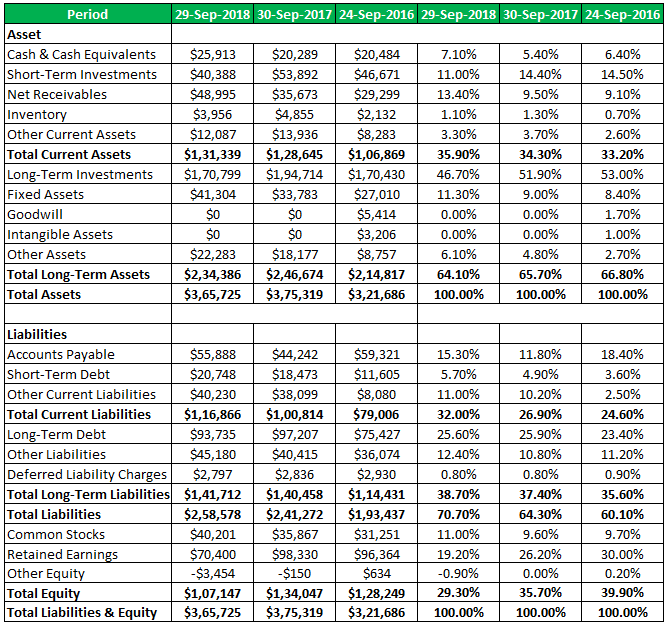

The intersection of data analysis, economics, and algorithmic trading has significantly transformed how traders and economists perceive and interpret market trends. With the advent of sophisticated computational tools, algorithmic trading has emerged as a vital component of contemporary financial markets. It relies extensively on quantitative data analysis, integrating various economic indicators and financial models to enhance and optimize trading strategies. By leveraging large datasets and complex algorithms, traders can automatically execute orders based on predetermined criteria, thus maximizing potential returns and minimizing risks.

A critical element in this sophisticated interplay is the base effect, a concept that plays a pivotal role in the interpretation of economic data. Understanding the base effect involves recognizing how differing reference points can substantially alter the perception and analysis of economic indicators, such as inflation rates or GDP growth. The choice of a comparison base can determine whether data points are seen as indicative of growth or decline, stability or volatility.



Quantitative analysts and traders must possess a comprehensive understanding of the base effect to accurately interpret economic data and implement effective trading strategies. This article explores these intricate concepts, highlighting their interconnections and practical applications in modern trading environments. By addressing the complexities associated with the base effect and data analysis, traders and economists can make more informed decisions that align with existing market conditions.

## Table of Contents

## Understanding the Base Effect

The base effect is a pivotal concept in data analysis, particularly when comparing economic indicators over time. It refers to the impact that the choice of a reference point, or base period, can have on the interpretation of growth rates and other economic figures. This is especially important in the analysis of indicators such as inflation rates and economic growth figures.

When comparing economic data over time, the base effect can lead to significant variances in interpretive outcomes. For instance, if the base year for calculating inflation is marked by unusually high or low prices, subsequent comparisons may appear distorted. This distortion arises because the relative change measured is impacted by the anomalous nature of the chosen base year. A high base period may lead to understated growth rates, whereas a low base period may exaggerate these rates.

To gain a more accurate understanding of economic trends, analysts must carefully choose the most appropriate base periods. This involves selecting a base year that is free from anomalies that could skew the data. By doing so, the analysts ensure the integrity and reliability of the comparative data analysis. Such careful selection reduces potential distortion, allowing for more informed decision-making and precise forecasts.

Mathematically, if $V_t$ represents the value of an economic indicator at time $t$ and $V_b$ is the value of the same indicator during the base period, the growth rate can be expressed as:

$$
\text{Growth Rate} = \frac{V_t - V_b}{V_b} \times 100\%
$$

Selecting an appropriate $V_b$ ensures that the calculated growth rate provides a realistic depiction of economic changes.

In practice, government agencies, financial institutions, and economic analysts employ various techniques to manage the base effect. They might use a rolling base system, where the base period is updated regularly, helping mitigate the impact of any single anomalous base year. This careful management of base effects enables analysts to offer more consistent insights, facilitating more effective economic planning and strategy formulation.

## The Role of Data Analysis in Economic Comparisons

Data analysis plays a critical role in evaluating and comparing economic indicators, providing a foundation for informed decision-making for economists and traders. By applying statistical tools, analysts can dissect complex datasets to reveal underlying economic trends and eliminate irrelevant data, often referred to as "noise," that can obscure meaningful insights.

One fundamental aspect of data analysis in economics is the application of statistical models and methods to interpret datasets. Techniques such as regression analysis facilitate the understanding of relationships between different economic variables, thereby offering insights into how changes in one variable may affect others. For example, a simple linear regression might be used to assess the relationship between interest rates (independent variable) and consumer spending (dependent variable), helping to forecast future economic activity based on current data.

Advanced techniques, particularly [machine learning](/wiki/machine-learning), are enhancing the robustness and specificity of data analysis. Machine learning algorithms can process large volumes of data with high dimensionality—characterized by numerous potential predictors—beyond the capability of traditional methods. For example, algorithms such as Random Forests or Gradient Boosting can be employed to analyze complex economic patterns, identifying significant predictors and trends that might not be apparent through conventional analysis.

Python, a versatile programming language, offers an extensive suite of libraries like Pandas, NumPy, and scikit-learn, which are invaluable in data analysis. A typical Python script for economic data analysis could look like the following:

```python
import pandas as pd
from sklearn.model_selection import train_test_split
from sklearn.ensemble import RandomForestRegressor
from sklearn.metrics import mean_squared_error

# Load economic data
data = pd.read_csv('economic_data.csv')

# Select features and target
features = data[['interest_rate', 'unemployment_rate', 'inflation_rate']]
target = data['consumer_spending']

# Split the data
X_train, X_test, y_train, y_test = train_test_split(features, target, test_size=0.2, random_state=42)

# Initialize and train the model
model = RandomForestRegressor(n_estimators=100, random_state=42)
model.fit(X_train, y_train)

# Make predictions
predictions = model.predict(X_test)

# Evaluate the model
mse = mean_squared_error(y_test, predictions)
print(f'Mean Squared Error: {mse}')
```

This example demonstrates how machine learning models can be utilized to predict economic outcomes, such as consumer spending, based on various macroeconomic indicators. Such predictive analytics provide traders and economists with a clearer picture of potential future trends, affording them a competitive edge in the market.

Overall, data analysis transcends mere number-crunching; it serves as a pivotal tool in discerning economic trajectories and making strategic decisions that align with identified patterns and predictions. The integration of cutting-edge analytical techniques continues to refine this process, promising even greater clarity and foresight in economic planning and trading strategies.

## Algo Trading: Strategies and Data

Algorithmic trading automates investment strategies aiming to maximize returns through systematic and data-driven insights. The foundation of [algorithmic trading](/wiki/algorithmic-trading) lies in utilizing technical indicators to predict market movements and generate profitable trading signals. Among the most commonly used indicators are the Relative Strength Index (RSI), Exponential Moving Averages (EMAs), and the Moving Average Convergence Divergence (MACD).

The RSI measures the speed and change of price movements, providing insights into potential overbought or oversold conditions. Typically, RSI values above 70 indicate an overbought condition, suggesting a potential selling opportunity, whereas values below 30 suggest an oversold condition, indicating a potential buying opportunity.

Exponential Moving Averages (EMAs) give more weight to the most recent prices, making them responsive to new information. This responsiveness helps in identifying current trends more quickly compared to simple moving averages (SMAs). Traders often look for crossovers between short-term and long-term EMAs to signal potential trading opportunities.

The MACD indicator is built on the relationship between two EMAs (e.g., 12-day and 26-day) and is often used to determine [momentum](/wiki/momentum) and trend direction. The MACD line is calculated by subtracting the longer-term EMA from the shorter-term EMA, with trends signaled by the crossing of the MACD line and the signal line (usually a 9-day EMA of the MACD).

Backtesting strategies using historical data is crucial for refining algorithmic trading systems to closely align with real-world outcomes. By simulating trades based on historical data, traders can assess the performance of their strategies under various market conditions and make necessary adjustments to improve effectiveness. In Python, [backtesting](/wiki/backtesting) can be implemented using libraries such as `Backtrader` or `Zipline`, which allow for testing algorithmic strategies efficiently.

```python
import backtrader as bt

# Create a trading strategy
class MyStrategy(bt.Strategy):
    def __init__(self):
        self.rsi = bt.indicators.RSI(self.data.close)
        self.ema_short = bt.indicators.ExponentialMovingAverage(self.data.close, period=12)
        self.ema_long = bt.indicators.ExponentialMovingAverage(self.data.close, period=26)
        self.macd = bt.indicators.MACD(self.data.close)

    def next(self):
        if self.rsi < 30 and self.ema_short > self.ema_long:
            self.buy()
        elif self.rsi > 70 and self.ema_short < self.ema_long:
            self.sell()

# Initialize cerebro
cerebro = bt.Cerebro()
cerebro.addstrategy(MyStrategy)

# Load data into cerebro, such as CSV data file
data = bt.feeds.YahooFinanceData(dataname='AAPL', fromdate=datetime(2020, 1, 1), todate=datetime(2021, 1, 1))
cerebro.adddata(data)

# Run the backtest
cerebro.run()
cerebro.plot()
```

This example illustrates how traders can create and test a strategy incorporating RSI, EMAs, and MACD in Python. By iterating through historical prices, the strategy assesses buying and selling signals generated by the predefined conditions. This rigorous testing process helps in refining models, minimizing risks, and enhancing potential returns, thereby optimizing the strategy for real-time market conditions.

Algorithmic trading systems, thus, leverage these robust analysis techniques not only to predict price movements but also to continuously refine their strategies through meticulous testing, ensuring optimal performance in a rapidly evolving market.

## Impact of the Base Effect on Economic Indicators in Algo Trading

The base effect plays a critical role in interpreting economic indicators within the framework of algorithmic trading. Traders use historical economic data to formulate strategies, but the chosen base periods can significantly impact these strategies' outcomes. By altering the reference points, or bases, the perceived performance of variables such as inflation rates or GDP growth can change dramatically. This alteration can lead to misleading signals if not managed accurately, potentially resulting in suboptimal trading decisions or financial losses.

For example, consider the situation where an algorithm uses inflation data to assess market conditions. If the base period corresponds to an anomalous economic event, such as the 2008 financial crisis or the COVID-19 pandemic, the base effect can distort the interpretation of current inflation trends. A high inflation rate, when compared to a period of deflation or exceptionally low inflation, may appear severe and prompt incorrect algorithmic responses. On the contrary, comparing against a period of hyperinflation might underestimate current inflationary pressures.

To mitigate the impact of the base effect, traders continuously re-evaluate and update their analytical models. Adjusting algorithms to dynamically respond to updated base periods can help traders avoid misleading signals. This adaptability involves recalibrating the base periods used in calculations, ensuring they reflect the most relevant and accurate economic context.

Python, a popular language for data analysis in trading, can be used to automate these adjustments. Here is a simple Python snippet illustrating how an algorithm might adjust its base period for inflation data:

```python
import pandas as pd

# Assume df is a dataframe containing inflation data with 'date' and 'rate' columns
def adjust_base_period(df, new_base_period):
    """
    Adjusts the base period for inflation data in df to the new_base_period.

    Parameters:
    df (DataFrame): DataFrame containing the date and inflation rate.
    new_base_period (str): New base period in YYYY-MM-DD format.

    Returns:
    DataFrame: Adjusted inflation data with new base period.
    """
    base_rate = df.loc[df['date'] == new_base_period, 'rate'].values[0]
    df['adjusted_rate'] = df['rate'] - base_rate
    return df

# Example usage
inflation_data = pd.DataFrame({
    'date': ['2021-01-01', '2021-02-01', '2021-03-01'],
    'rate': [1.5, 1.7, 1.6]
})

new_base = '2021-01-01'
adjusted_data = adjust_base_period(inflation_data, new_base)
print(adjusted_data)
```

This snippet subtracts the base rate from each data point to adjust the inflation data relative to a new base period. This methodology helps ensure that trading algorithms remain aligned with current market conditions, minimizing the risk of acting on distorted data.

Furthermore, GDP growth rates are another indicator susceptible to the base effect. For instance, a trading strategy might leverage GDP growth data to predict stock market trends. In this scenario, selecting a base period that includes unsustainable economic booms or busts could distort growth assessments. By consistently updating these bases, traders can develop algorithms that better align with actual market dynamics, reducing vulnerability to potentially misleading economic signals.

Thus, a profound grasp of the base effect allows traders to optimize algorithmic strategies, aligning them more closely with present market realities and elevating the potential for successful trading outcomes.

## Choosing the Right Basis for Economic Comparison

Selecting the appropriate basis for economic comparison is vital for managing the base effect, as it plays a crucial role in ensuring the accuracy and relevance of data interpretations. The base effect can significantly impact the perception of economic indicators and trends. Hence, using consistent or more representative reference points becomes essential for providing clearer insights and enhancing data-driven predictions, especially in the context of trading.

Consistency in selecting a base period involves using the same reference point for consecutive analyses whenever possible. This approach helps in minimizing discrepancies that may arise from changing base values and offers a more stable view of trends over time. For example, when evaluating inflation, choosing a consistent base year allows for a direct comparison of changes in price levels, reducing the distortion of year-on-year differences in economic performance [statistics](/wiki/bayesian-statistics).

Moreover, it is crucial for analysts and traders to select bases that are representative of the current economic environment. This means selecting a base period that aligns with similar market conditions or phases of the economic cycle. For instance, if the economy is currently experiencing heightened [volatility](/wiki/volatility-trading-strategies) due to external shocks, the base period should reflect similar conditions to allow for meaningful comparisons.

Regularly updating and adjusting base periods is necessary to maintain relevance with the ongoing market dynamics. As economic conditions change, it may be necessary to shift the reference period to one that better reflects the current economic landscape. This is particularly important in fast-evolving markets where historical data might quickly become outdated due to rapid technological, political, or economic shifts.

To support decision-making, analysts may employ quantitative methods and algorithms to determine the most effective base period. By analyzing historical data patterns and assessing current economic indicators, algorithms can suggest base periods that minimize the base effect distortion. Python, for example, offers libraries such as NumPy and pandas, which can be used to automate this analysis process:

```python
import pandas as pd
import numpy as np

# Sample economic data
data = pd.DataFrame({
    'Year': range(2000, 2023),
    'Inflation_Rate': np.random.uniform(1, 5, 23)
})

# Function to evaluate base effect differences
def evaluate_base_effect(data, base_year):
    base_value = data.loc[data['Year'] == base_year, 'Inflation_Rate'].values[0]
    data['Base_Effect'] = data['Inflation_Rate'] / base_value
    return data

# Identify a suitable base year
selected_base_year = 2010  # This would be determined through proper analysis

# Evaluate using the selected base year
base_effect_data = evaluate_base_effect(data, selected_base_year)
print(base_effect_data)
```

This approach highlights the importance of methodological rigor in choosing reference points for economic comparisons. Such diligence not only aids in more accurately reflecting ongoing trends but also equips traders and economists with the necessary insights to make informed decisions in the ever-changing landscape of global markets.

## Future of Data Analysis in Economic and Trading Domains

As data collection and computational analysis continue to evolve, their applications within economics and trading are becoming more sophisticated and precise. The growing [volume](/wiki/volume-trading-strategy) of data available from various sources, combined with the advancement of computational resources, is enabling more refined analyses and forecasts. 

Emerging technologies, such as big data analytics, machine learning, and [artificial intelligence](/wiki/ai-artificial-intelligence), are playing a crucial role in transforming how economic data is interpreted and utilized. Machine learning algorithms, for instance, improve the predictive power by identifying complex patterns in datasets that traditional statistical methods might miss, thereby facilitating more accurate economic forecasting. This capability is instrumental in addressing challenges like the base effect, which can skew interpretations if not accounted for properly.

For algorithmic trading models, these technological advancements offer significant improvements. Models are increasingly benefiting from enhanced data inputs and analytics capabilities. They can now process vast datasets in real-time, leading to more timely and informed trading decisions. By employing advanced algorithms, traders can generate sophisticated strategies that are better aligned with current market conditions. Python, a highly versatile programming language, is extensively used in this context due to its rich ecosystem of libraries like Pandas for data manipulation and TensorFlow or PyTorch for implementing machine learning models.

For instance, consider a Python snippet that uses machine learning to enhance prediction accuracy:

```python
import pandas as pd
from sklearn.model_selection import train_test_split
from sklearn.ensemble import RandomForestRegressor

# Load economic data
data = pd.read_csv('economic_data.csv')

# Feature selection
features = data[['feature1', 'feature2', 'feature3']]
target = data['target_variable']

# Split the data
X_train, X_test, y_train, y_test = train_test_split(features, target, test_size=0.2, random_state=42)

# Initialize and train the model
model = RandomForestRegressor(n_estimators=100, random_state=42)
model.fit(X_train, y_train)

# Evaluate the model
accuracy = model.score(X_test, y_test)
print(f'Model Accuracy: {accuracy:.2f}')
```

The above script demonstrates a basic framework for modeling economic data using random forests, a type of ensemble learning method. This setup can be adapted and expanded to integrate more complex datasets and analytical techniques.

Additionally, the integration of real-time data processing and natural language processing technologies can provide traders with enhanced situational awareness by analyzing market sentiment from news, reports, and even social media. These tools help traders to adjust their strategies dynamically, adapting quickly to emerging trends or unexpected events.

As these technologies advance, they promise to further diminish the impact of adverse factors, such as the base effect, providing more reliable economic indicators for establishing robust trading strategies. Continued innovation in data analysis methodologies offers significant potential to enhance the precision and profitability of trading activities, encouraging a more integrated and responsive approach to market dynamics.

## Conclusion

The synergy between data analysis, economic comparison, and algorithmic trading has significantly enhanced trading efficiency and profitability. This intersection utilizes quantitative research and statistical analysis to interpret complex market data, thereby facilitating informed decision-making. A key aspect of this process is understanding and effectively managing the base effect—a concept crucial for accurately interpreting variations in economic data. The base effect refers to how the choice of reference point can alter the perceived magnitude and direction of change in economic indicators. Recognizing and adjusting for this effect ensures that traders and economists can draw accurate conclusions, thereby avoiding misleading signals that could arise from inappropriate comparisons.

In algorithmic trading, comprehension of the base effect allows for the optimization of algorithms to reflect true market conditions, enhancing their predictive power and the reliability of generated trading signals. This precision is essential as it empowers traders to make strategic decisions based on a realistic analysis of economic trends, leading to improved profitability.

Innovation and continuous refinement in data analysis and algorithmic tools present immense potential for traders and economists. Advanced methodologies, including machine learning and artificial intelligence, are progressively minimizing distortions like the base effect, improving the precision of economic forecasts. These technologies are shaping the future landscape by providing more sophisticated tools for evaluating market dynamics, leading to strategic advantages and more robust investment strategies. As computational abilities expand and methodologies become more refined, the capacity to efficiently navigate complex market environments grows, unlocking new opportunities for enhanced economic insight and trading success.

## References & Further Reading

[1]: Bergstra, J., Bardenet, R., Bengio, Y., & Kégl, B. (2011). ["Algorithms for Hyper-Parameter Optimization."](https://papers.nips.cc/paper/4443-algorithms-for-hyper-parameter-optimization) Advances in Neural Information Processing Systems 24.

[2]: ["Advances in Financial Machine Learning"](https://www.amazon.com/Advances-Financial-Machine-Learning-Marcos/dp/1119482089) by Marcos Lopez de Prado

[3]: ["Evidence-Based Technical Analysis: Applying the Scientific Method and Statistical Inference to Trading Signals"](https://www.amazon.com/Evidence-Based-Technical-Analysis-Scientific-Statistical/dp/0470008741) by David Aronson

[4]: ["Machine Learning for Algorithmic Trading"](https://github.com/stefan-jansen/machine-learning-for-trading) by Stefan Jansen

[5]: ["Quantitative Trading: How to Build Your Own Algorithmic Trading Business"](https://www.amazon.com/Quantitative-Trading-Build-Algorithmic-Business/dp/1119800064) by Ernest P. Chan