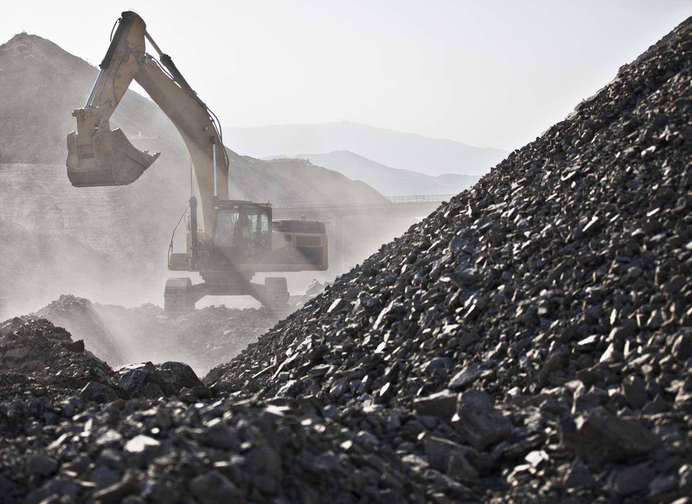

## Table of Contents

## What are base metals and how do they differ from precious metals?

Base metals are common metals that are not as valuable as precious metals. They include metals like copper, zinc, and iron. These metals are often used in everyday items like pipes, wires, and construction materials. They are more abundant in the earth's crust and usually less expensive than precious metals.

Precious metals, on the other hand, are rare and highly valued. Examples include gold, silver, and platinum. These metals are often used in jewelry, coins, and high-end electronics. Because they are scarce and have special properties, like being resistant to corrosion, they are much more expensive than base metals.

In summary, the main difference between base metals and precious metals is their value and rarity. Base metals are common and used in everyday applications, while precious metals are rare and used in more specialized, high-value items.

## What are the most common types of base metals?

The most common types of base metals are copper, zinc, and iron. Copper is a reddish metal that is very good at conducting electricity and heat. It is used in electrical wires, plumbing, and in making coins. Zinc is a bluish-white metal often used to coat other metals like iron to stop them from rusting. Iron is a strong metal used in buildings, cars, and many tools. It can rust if not protected.

Another common base metal is aluminum. Aluminum is light and does not rust easily, making it great for things like airplane parts, beverage cans, and kitchen foil. Lead is another base metal, known for being heavy and soft. It is used in batteries, as weights, and in some types of construction. These base metals are important because they are used in so many everyday items.

## What are the primary industrial uses of base metals?

Base metals like copper, zinc, iron, aluminum, and lead are very important in industries. Copper is used a lot in making electrical wires and pipes because it conducts electricity and heat very well. It's also used in coins and in making things like motors and electronics. Zinc is often used to coat other metals, like iron, to stop them from rusting. This process is called galvanizing. Iron is strong and used in making buildings, cars, and many tools. It's also used to make steel, which is even stronger.

Aluminum is light and doesn't rust easily, so it's perfect for making airplane parts, beverage cans, and kitchen foil. It's also used in cars and bikes to make them lighter. Lead is heavy and soft, so it's used in batteries, as weights, and in some types of construction. Lead is also used to protect against radiation in things like x-ray machines. These base metals are essential because they help make many things we use every day.

## How do base metals contribute to the economy?

Base metals are very important for the economy because they are used in so many things we need every day. They are used to make cars, buildings, and electronics. When companies use base metals to make these things, they create jobs for people who mine the metals, transport them, and turn them into useful products. This helps the economy grow because more people are working and [earning](/wiki/earning-announcement) money.

Also, base metals are traded all over the world. Countries that have a lot of base metals can sell them to other countries that need them. This trade helps countries make money and can make their economies stronger. For example, if a country has a lot of copper, it can sell that copper to other countries and use the money to build schools or hospitals. So, base metals are really important for keeping the economy going and helping it grow.

## What are the basic principles of trading base metals?

Trading base metals involves buying and selling metals like copper, zinc, and iron. People trade these metals because they are used in many things we use every day, like cars and buildings. The price of these metals can go up or down based on how much people want them and how much is available. If a lot of people want copper and there isn't much of it, the price will go up. But if there is a lot of copper and not many people want it, the price will go down.

Traders need to watch the market carefully to see when the prices might change. They use information about how much metal is being produced and how much is being used to guess what will happen to the prices. They also look at things like the economy and news that might affect the demand for metals. Trading base metals can be risky because prices can change quickly, but it can also be a good way to make money if you know what you're doing.

## What factors influence the price of base metals?

The price of base metals like copper, zinc, and iron can change because of how much people want them and how much is available. If a lot of people need these metals for making things like cars and buildings, the price will go up. But if there is a lot of the metal and not many people want it, the price will go down. The amount of metal that is produced also matters. If a big mine starts producing a lot more copper, it can make the price go down because there is more of it to go around.

Other things can also affect the price of base metals. The economy is important because if it's doing well, more people will be building and buying things, so they will need more metals. News and events, like new laws or problems at mines, can also change the price. For example, if a big mine has to close because of a problem, it can make the price go up because there is less metal available. Traders watch all these things to try to guess what will happen to the prices and make good trades.

## How can one start investing in base metals?

To start investing in base metals, you first need to learn about the different metals like copper, zinc, and iron. These metals are used in many things we use every day, like cars and buildings. You can invest in them by buying the actual metal, like copper bars, or by buying shares in companies that mine these metals. Another way is to trade futures contracts, which let you buy or sell the metal at a set price in the future.

Once you decide how you want to invest, you need to find a good broker or platform to make your trades. Make sure to choose one that is reliable and has good fees. It's also important to keep an eye on the market and news that might affect the prices of base metals. Prices can go up and down because of how much people want the metals and how much is available. So, always do your research and be ready for the prices to change.

## What are the risks associated with trading and investing in base metals?

Trading and investing in base metals like copper, zinc, and iron can be risky. One big risk is that the prices of these metals can change a lot. If a lot of people suddenly want more metal, the price can go up fast. But if there is too much metal and not many people want it, the price can go down quickly. This can make it hard to know if you will make money or lose money when you trade.

Another risk is that things like the economy and news can affect the prices of base metals. If the economy is not doing well, fewer people might be building things, so they won't need as much metal. Also, if there is a problem at a big mine, it can make the price of the metal go up because there is less of it. So, you need to keep an eye on these things and be ready for the prices to change. It's important to do a lot of research and be careful when you trade base metals.

## What are some advanced trading strategies for base metals?

One advanced trading strategy for base metals is called "hedging." This means you buy and sell different kinds of base metals at the same time to lower your risk. For example, if you think the price of copper will go down, you can sell copper futures and buy zinc futures. If the price of copper does go down, you might lose money on the copper, but you could make money on the zinc. This way, you don't lose as much money overall. Hedging can be tricky because you need to know a lot about how different metals affect each other, but it can help protect your money.

Another strategy is called "technical analysis." This is when you look at charts and graphs of past prices to guess what will happen next. Traders use things like moving averages and trend lines to see patterns in the prices of base metals. If they see a pattern that usually means the price will go up, they might buy the metal. If they see a pattern that means the price will go down, they might sell it. Technical analysis takes a lot of practice and you need to be good at reading charts, but it can help you make better trading decisions.

A third strategy is "[fundamental analysis](/wiki/fundamental-analysis)." This means you look at things like how much metal is being produced and how much people want it. You also look at news and events that might affect the prices. For example, if a big mine is going to close, you might think the price of that metal will go up because there will be less of it. If you see that a lot of new buildings are being built, you might think the price will go up because more metal will be needed. Fundamental analysis requires a lot of research, but it can help you understand what might happen to the prices of base metals in the future.

## How do global economic trends affect base metal markets?

Global economic trends can really change the prices and demand for base metals like copper, zinc, and iron. When the world economy is doing well, people build more houses, cars, and factories. This means they need more base metals, so the prices go up. But if the economy is not doing well, people build less, so they don't need as much metal. This can make the prices go down. Also, if one big country, like China, starts to use a lot more metal, it can affect the whole world's prices.

Another way global economic trends affect base metals is through trade and money. If countries trade a lot with each other, it can make the demand for base metals go up. But if countries start putting up trade barriers or if there is a big change in how much their money is worth, it can make the prices of base metals change a lot. For example, if the value of the US dollar goes down, it can make base metals cheaper for people in other countries, so they might buy more. Keeping an eye on these global trends can help traders and investors make better decisions about base metals.

## What role do base metals play in sustainable and green technologies?

Base metals like copper and zinc are really important for making green technologies that help the environment. Copper is a great conductor of electricity, so it's used a lot in things like solar panels and wind turbines. These help us make electricity from the sun and wind instead of using dirty fuels like coal. Zinc is used to make batteries that store energy from these clean sources, so we can use the electricity even when the sun isn't shining or the wind isn't blowing. Without these base metals, it would be harder to make and use green technology.

Base metals also help in making things last longer, which is good for the environment. For example, zinc is used to coat other metals to stop them from rusting. This means things like buildings and cars don't need to be replaced as often, which saves resources and reduces waste. Aluminum is another base metal that is light and doesn't rust easily, so it's used in electric cars and other green vehicles. Using base metals in these ways helps us make the world a cleaner and more sustainable place.

## How can one analyze and forecast base metal market trends?

To analyze and forecast base metal market trends, you need to look at both the supply and demand of the metals. Supply is about how much metal is being produced. You can check reports from mining companies and industry groups to see if more or less metal is being mined. Demand is about how much people want to buy the metal. This can change based on things like how many new buildings are being made or how many cars people are buying. By comparing the supply and demand, you can start to guess if the price of the metal will go up or down.

Another important part of forecasting base metal market trends is looking at the economy and news. If the world economy is doing well, more people will be building and buying things, so they will need more metal. But if the economy is not doing well, people will buy less, and the demand for metal will go down. News like new laws or problems at mines can also affect the prices. For example, if a big mine has to close, it can make the price of that metal go up because there is less of it. By keeping an eye on these things, you can make better guesses about where the base metal market is headed.

## References & Further Reading

[1]: Ilyas, K., & Gupta, P. (2021). ["Base Metal Trading and Investment Strategies."](https://rjptonline.org/AbstractView.aspx?PID=2024-17-12-63) ResearchGate.

[2]: McLellan, W. M. (2015). ["Metals and Alloys: Industrial Applications."](https://www.degruyter.com/document/doi/10.1515/9783110441857/html) Industrial and Engineering Chemistry.

[3]: Irwin, S. H., & Sanders, D. R. (2012). ["Financialization and Structural Change in Commodity Futures Markets."](https://caia.org/sites/default/files/membersonly/Financialization_and_Structural_Change_in_Commodity_Future_Markets.pdf) Agricultural Economics 44(1): 45–57.

[4]: Zhang, Y. J., & Zhang, L. (2018). ["Market reaction to macroeconomic news in commodity futures markets."](https://onlinelibrary.wiley.com/doi/10.1002/fut.21905) Energy Economics, 74, 292-305.

[5]: Hudson, R. & Gregoriou, A. (2015). ["Algorithmic trading and market quality: A review of the literature."](https://cris.brighton.ac.uk/ws/files/343976/Gregoriou%202014%20Calculating%20and%20comparing.pdf) Journal of Economic Surveys 29(4): 613-636. 

[6]: Kaufman, P. J. (2013). ["Trading Systems and Methods"](https://onlinelibrary.wiley.com/doi/book/10.1002/9781119202561). Wiley.

[7]: Fabozzi, F. J., Focardi, S. M., & Jonas, C. (2014). ["The Basics of Algorithmic Trading."](https://www.semanticscholar.org/paper/Quantitative-Equity-Investing%3A-Techniques-and-Fabozzi-Focardi/1c49a2a53919f7e65cb96f16691b8ff726fd3cd7) CFA Institute.

