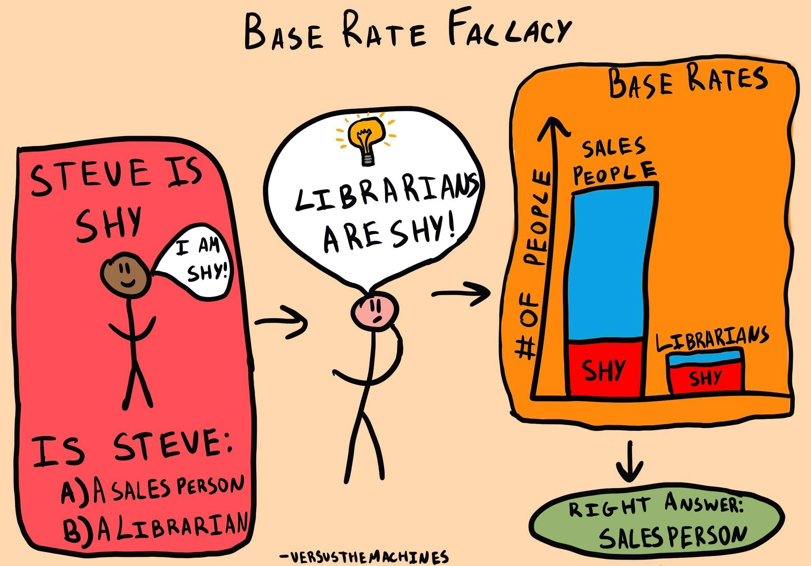

## Table of Contents

## What is the base rate fallacy?

The base rate fallacy is when people make mistakes in judging how likely something is to happen. They focus too much on specific details and not enough on general information. For example, if you hear about a person who is quiet and likes math, you might think they are more likely to be a librarian than a farmer. But if you think about how many more farmers there are than librarians, you'd see that the person is actually more likely to be a farmer.

This mistake happens because people often pay more attention to new or interesting information instead of looking at the big picture. In the example, the details about the person being quiet and liking math are interesting, but they don't change the fact that there are way more farmers than librarians. Understanding the base rate fallacy can help us make better decisions by reminding us to consider all the information, not just the parts that stand out.

## Can you provide a simple example of the base rate fallacy?

Imagine you have a test that can tell if someone has a rare disease. This disease affects only 1 out of every 1,000 people. The test is pretty good - it's right 95% of the time when someone has the disease, and it's also right 95% of the time when someone doesn't have it. Now, let's say you test someone and the test comes back positive. You might think they probably have the disease, right? But here's where the base rate fallacy comes in.

Because the disease is so rare, even with a good test, most positive results are actually wrong. Out of 1,000 people, only 1 person actually has the disease. The test will correctly identify this person, but it will also incorrectly say that about 50 of the other 999 people have the disease (since it's wrong 5% of the time for people without the disease). So, if you get a positive result, it's more likely that you're one of those 50 false positives than the 1 true positive. The base rate - how common the disease is - is more important than the test's accuracy in this case.

## Why is understanding the base rate important in decision-making?

Understanding the base rate is important in decision-making because it helps us see the big picture. When we make choices, we often focus on new or interesting details, but these can trick us if we don't also think about how common or rare something is. For example, if we're trying to guess if someone is a librarian or a farmer based on their personality, knowing that there are way more farmers than librarians can change our guess. Ignoring the base rate can lead us to make wrong decisions because we're not considering all the information.

In everyday life, understanding the base rate can help us make better choices. For instance, if we're deciding whether to believe a medical test result, knowing how common the condition is can tell us if the test is likely to be right or wrong. This can affect big decisions like whether to start treatment or not. By always thinking about the base rate, we can avoid being fooled by specific details and make decisions that are more likely to be correct.

## How does the base rate fallacy affect everyday decisions?

The base rate fallacy can mess up our everyday decisions because it makes us focus on the wrong things. Imagine you're trying to guess if a new friend likes a certain kind of music. If they wear a lot of black and have tattoos, you might think they like heavy metal. But if you don't think about how many more people like pop music than heavy metal, you could be wrong. Ignoring how common something is can lead us to make bad guesses about people or situations.

This mistake can also affect bigger decisions, like buying a car or choosing a doctor. Let's say you're looking at a car that's had a recall for a small issue. You might think it's a bad car because of that one problem, but if you look at how many cars of that type are on the road and how few have had that issue, you might see it's still a good choice. The same goes for choosing a doctor. If one doctor had a bad review, but most reviews are good, the base rate of good reviews should guide your decision more than that one bad experience. By keeping the base rate in mind, we can make choices that are more likely to be right.

## What are some common scenarios where the base rate fallacy occurs?

One common scenario where the base rate fallacy happens is when people make guesses about others based on small details. For example, if you meet someone who loves [books](/wiki/algo-trading-books) and is quiet, you might think they're a librarian. But if you don't think about how many more people work in other jobs, like being a teacher or a salesperson, you could be wrong. The base rate - how common each job is - should help you make a better guess, but it's easy to forget about it and focus only on the details.

Another scenario is when people decide whether to trust a test result, like a medical test. If the test says you have a rare disease, you might worry a lot. But if you know that the disease is very rare, even a good test might be wrong more often than right. Most positive results could be false alarms because the disease is so uncommon. So, understanding how rare the disease is - the base rate - is key to deciding if the test result is something to really worry about.

## How can one avoid falling into the base rate fallacy trap?

To avoid falling into the base rate fallacy trap, it's important to always think about how common or rare something is before making a decision. For example, if you're trying to guess someone's job based on their personality, remember to consider how many people work in different jobs. Don't just focus on the interesting details about the person. By keeping the big picture in mind - like how many more farmers there are than librarians - you can make better guesses and decisions.

Another way to avoid the base rate fallacy is to always check the overall numbers when you're looking at test results or data. If you get a positive result on a medical test, don't panic right away. Think about how common the condition is. If it's very rare, the test might be wrong even if it's usually accurate. By always considering the base rate - how often something happens - you can make choices that are more likely to be right and not get tricked by focusing too much on specific details.

## What role does statistical thinking play in overcoming the base rate fallacy?

Statistical thinking helps us overcome the base rate fallacy by making us pay attention to the big picture. It reminds us to look at how common or rare something is, instead of just focusing on new or interesting details. For example, if we're trying to guess if someone is a librarian or a farmer, statistical thinking tells us to think about how many more farmers there are than librarians. This way, we don't get tricked by details like the person being quiet and liking books.

When we use statistical thinking, we can make better decisions about things like medical test results. If a test says we have a rare disease, we might worry. But if we think statistically, we remember that the disease is very rare. Even if the test is usually right, most positive results could still be wrong because the disease is so uncommon. By always considering the base rate - how often something happens - we can avoid being fooled by the base rate fallacy and make choices that are more likely to be correct.

## Can you explain the impact of the base rate fallacy in professional fields like medicine or finance?

In medicine, the base rate fallacy can lead doctors to make wrong decisions about patients. Imagine a doctor uses a test to check for a rare disease. Even if the test is good, it might still say a healthy person has the disease because the disease is so rare. If the doctor doesn't think about how uncommon the disease is, they might start the wrong treatment. This can make the patient worry a lot and even get sick from the treatment. By always thinking about how common the disease is, doctors can make better choices and help their patients more.

In finance, the base rate fallacy can mess up decisions about investing money. For example, if someone hears about a new company that's doing well, they might want to invest all their money in it. But if they don't think about how many new companies fail compared to how many succeed, they could lose a lot of money. The base rate - how often new companies do well - is important to consider. By remembering to look at the big picture and not just the exciting news about one company, people in finance can make smarter choices and keep their money safer.

## How do cognitive biases contribute to the base rate fallacy?

Cognitive biases are like tricks our brains play on us that can make the base rate fallacy worse. One common bias is called the availability heuristic. This happens when we think something is more likely to happen just because we can easily remember examples of it. For instance, if you hear a lot about plane crashes on the news, you might think flying is more dangerous than it really is. You're not thinking about how many more safe flights there are compared to crashes. This focus on what's easy to remember can make us ignore the base rate - how common or rare something really is.

Another bias that contributes to the base rate fallacy is confirmation bias. This is when we look for information that agrees with what we already believe and ignore information that doesn't. If you believe a certain type of person is more likely to be a criminal, you might only pay attention to news stories about crimes committed by that type of person. You're not thinking about how many more people of that type are law-abiding citizens. By only looking at the information that fits our beliefs, we can miss the bigger picture and fall into the base rate fallacy trap.

## What are the psychological reasons behind the prevalence of the base rate fallacy?

The base rate fallacy happens a lot because our brains like to focus on new or interesting information. We pay more attention to specific details than to the bigger picture. For example, if someone tells us about a new company that's doing well, we might think it's a great investment. But we don't think about how many new companies fail compared to how many succeed. This focus on the exciting news makes us forget to look at the base rate - how common or rare something is.

Another reason the base rate fallacy is common is because of how our brains work with information. We have cognitive biases that trick us into making mistakes. One bias is called the availability heuristic, where we think something is more likely to happen because we can easily remember examples of it. If we hear a lot about plane crashes, we might think flying is more dangerous than it really is. Another bias is confirmation bias, where we only pay attention to information that agrees with what we already believe. These biases make us ignore the base rate and focus on what stands out or fits our beliefs, leading to the base rate fallacy.

## How can educational systems help in reducing the impact of the base rate fallacy?

Educational systems can help reduce the impact of the base rate fallacy by teaching students about it early on. Schools can include lessons on how to think about how common or rare something is before making decisions. For example, teachers can use simple examples, like guessing someone's job based on their personality, to show how important it is to think about the big picture. By practicing with these examples, students can learn to always consider the base rate and not just focus on interesting details.

Another way educational systems can help is by teaching students about cognitive biases that lead to the base rate fallacy. Schools can explain biases like the availability heuristic, where we think something is more likely because we can easily remember examples of it, and confirmation bias, where we only look at information that fits what we already believe. By understanding these biases, students can learn to avoid them and make better decisions. This way, they'll be less likely to fall into the base rate fallacy trap in the future.

## What advanced statistical methods can be used to correct for the base rate fallacy in research and analysis?

One advanced statistical method to correct for the base rate fallacy is Bayesian statistics. This method helps us update our guesses about how likely something is based on new information, but it also makes sure we don't forget about how common or rare that thing is. For example, if we're trying to guess if someone has a rare disease based on a test result, Bayesian statistics reminds us to think about how rare the disease is before we decide. This way, we can make better guesses and not get tricked by focusing too much on the test result alone.

Another method is using decision trees or [machine learning](/wiki/machine-learning) models that are trained to consider the base rate. These models can look at a lot of data and learn how common different outcomes are. When they make predictions, they take into account how often something happens, not just the new information they get. This helps researchers and analysts make decisions that are more accurate because they're based on the whole picture, not just the interesting details. By using these advanced methods, we can reduce the impact of the base rate fallacy and make better choices in our research and analysis.

## What is the Base Rate Fallacy and how can we understand it?

Base rate fallacy, also known as base rate neglect, describes a common cognitive bias where people tend to disregard general statistical information (base rates) and instead rely on specific or anecdotal evidence. This bias is prevalent in various decision-making contexts and is especially significant in trading, where it can significantly impact the effectiveness of algorithmic strategies.

In [algorithmic trading](/wiki/algorithmic-trading), decisions are often influenced by recent or emotionally salient events rather than historical or statistical data. This focus on recent events, a tendency amplified by the availability heuristic, can cause traders to neglect base rates—the underlying probabilities that should guide rational decision-making. For example, if an investor observes several consecutive days of declining stock prices, they might be inclined to believe that this trend will continue despite historical data indicating that the stock has consistently rebounded in similar circumstances. Such a bias can lead investors to make suboptimal trades, deviating from strategies that are statistically sound based on long-term data.

The mathematical foundation of base rate neglect can be related to Bayes' Theorem, which describes how to update the probability of a hypothesis based on new evidence. Base rate fallacy occurs when the base rate, or the prior probability, is insufficiently weighted. Mathematically, Bayes' Theorem is expressed as:

$$
P(H|E) = \frac{P(E|H) \cdot P(H)}{P(E)}
$$

where:
- $P(H|E)$ is the probability of the hypothesis $H$ given the evidence $E$.
- $P(E|H)$ is the probability of observing the evidence given that the hypothesis is true.
- $P(H)$ is the base rate or prior probability of the hypothesis.
- $P(E)$ is the probability of the evidence.

In the context of trading, $P(H)$ might represent the probability of market trends based on long-term data, while $P(E)$ involves recent market events. Ignoring $P(H)$ results in a trading strategy overly influenced by recent data, potentially leading to misjudgments.

Overcoming the base rate fallacy in trading requires conscious efforts to integrate statistical thinking within algorithmic models. By emphasizing long-term datasets and incorporating base rate probabilities into algorithms, traders can develop strategies that are more aligned with historical trends and less susceptible to emotional or anecdotal influences. This approach can help mitigate the risks associated with base rate neglect, thereby enhancing the reliability and performance of trading algorithms.

## What are the strategies to overcome biases in algorithmic trading?

To counteract cognitive biases in algorithmic trading, traders should harness insights from behavioral finance to enrich algorithmic models. Behavioral finance examines psychological influences on investors and financial markets, providing valuable perspectives for algorithm design. Here are some key strategies:

**1. Diverse Data Sets and Algorithmic Adaptability:**

Incorporating a wide range of data sets is crucial for reducing the risk of cognitive biases in trading algorithms. By using data from diverse sources, traders can avoid overfitting, which occurs when models become excessively tailored to recent or emotionally charged data, thus failing to generalize well to new situations. Adaptable algorithms, capable of adjusting to varying market conditions, are better equipped to handle the inherent uncertainty and [volatility](/wiki/volatility-trading-strategies) in financial markets. This adaptability can be achieved through techniques like [reinforcement learning](/wiki/reinforcement-learning), where algorithms dynamically update their strategies based on new information.

**2. Bayesian Approaches and Base Rates:**

Bayesian methods offer a formal framework for incorporating prior knowledge, including base rates, into trading algorithms. In Bayesian [statistics](/wiki/bayesian-statistics), prior probabilities (or base rates) are combined with new evidence to update beliefs effectively. This approach is beneficial for algorithmic trading as it allows models to adjust dynamically to new data while retaining the foundational statistical probabilities. The Bayesian formula for updating probabilities is:

$$
P(H|D) = \frac{P(D|H) \cdot P(H)}{P(D)}
$$

Where:
- $P(H|D)$ is the posterior probability of hypothesis $H$ given data $D$.
- $P(D|H)$ is the likelihood of data $D$ given hypothesis $H$.
- $P(H)$ is the prior probability of hypothesis $H$.
- $P(D)$ is the probability of data $D$.

By explicitly incorporating base rates, Bayesian algorithms can enhance decision-making accuracy, mitigating the impact of cognitive biases such as overconfidence or the neglect of long-term trends.

**Python Implementation Example:**

Here is a simple implementation of a Bayesian update in Python, demonstrating how traders can incorporate prior probabilities:

```python
# Prior probabilities and evidence update
def bayesian_update(prior, likelihood, evidence):
    return (likelihood * prior) / evidence

# Example values
prior_prob = 0.2
likelihood = 0.7
evidence = 0.6

# Updating the probability
posterior_prob = bayesian_update(prior_prob, likelihood, evidence)
print(f"Updated Probability: {posterior_prob:.2f}")
```

This code calculates the posterior probability, given a prior probability, likelihood, and evidence, offering a template for incorporating Bayesian reasoning in trading algorithms.

By leveraging these strategies—embracing diverse data and adopting Bayesian methods—traders can create resilient algorithms that are less susceptible to cognitive biases and more effective in navigating complex financial landscapes.

## References & Further Reading

[1]: Barber, B. M., & Odean, T. (2001). ["Boys Will Be Boys: Gender, Overconfidence, and Common Stock Investment."](https://academic.oup.com/qje/article-abstract/116/1/261/1939000) The Quarterly Journal of Economics, 116(1), 261-292.

[2]: Kahneman, D. (2011). ["Thinking, Fast and Slow."](https://psycnet.apa.org/record/2011-26535-000) Farrar, Straus and Giroux.

[3]: Tetlock, P. E., & Gardner, D. (2015). ["Superforecasting: The Art and Science of Prediction."](https://psycnet.apa.org/record/2015-22864-000) Crown Publishing Group.

[4]: Tversky, A., & Kahneman, D. (1974). ["Judgment under Uncertainty: Heuristics and Biases."](https://www2.psych.ubc.ca/~schaller/Psyc590Readings/TverskyKahneman1974.pdf) Science, 185(4157), 1124-1131.

[5]: Vasan, A., Bhattacharyya, S., & Mukhopadhyay, K. (2019). ["Work Class Identification Using Bayesian Belief Networks."](https://link.springer.com/article/10.1007/s10479-022-04598-3) In J. R. Mohanty & S. P. Das (Eds.), Advances in Intelligent Systems and Computing (Vol. 743, pp. 103-109). Springer.