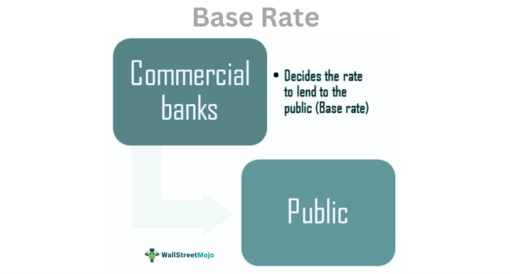

In today's rapidly evolving financial landscape, understanding the intricacies of financial terms and trading strategies is crucial. Among the key areas of focus are base rate interest rates and algorithmic trading (algo trading), which play pivotal roles in shaping market dynamics.

This article aims to dissect these concepts, providing insights into how they interact and influence various aspects of trading and investment. Base rate interest rates are significant as they are set by central banks and serve as benchmarks influencing the rates commercial banks offer on loans and savings. These rates also have broader economic implications, as they affect borrowing costs, consumer spending, and overall economic growth. By adjusting base rates, central banks attempt to control inflation and stabilize the economy.



On the other hand, algorithmic trading represents a technological advancement that has revolutionized the way financial markets operate. It involves the use of automated scripts and pre-programmed algorithms to execute trades at speeds and frequencies unattainable for human traders. This method relies heavily on precise mathematical models and robust computational power to make timely trading decisions, often within milliseconds.

Understanding these terms and their interplay allows traders and investors to make more informed decisions. Knowledge of how base rates influence market sentiment and financial conditions, combined with the strategic implementation of algorithmic trading, provides market participants with a profound edge in navigating the complex financial milieu.

## Table of Contents

## Understanding Base Rate Interest Rates

A base rate is the fundamental interest rate established by a central bank, such as the Bank of England or the Federal Reserve. This rate functions as a benchmark for the interest rates that commercial banks apply to loans and savings products. It is an essential lever in monetary policy, enabling central banks to influence economic activity and inflation.

Changes in the base rate have a pronounced effect on consumer spending and economic growth. An increase in the base rate typically results in higher borrowing costs for businesses and individuals. This can lead to a reduction in consumer spending, as loans and mortgages become more expensive, ultimately slowing economic growth. Conversely, when a central bank lowers the base rate, it becomes cheaper to borrow money. This often encourages increased consumer and business spending, which can stimulate economic activity.

The base rate is a crucial tool for central banks to manage inflation and stabilize the economy. By increasing the base rate, central banks aim to reduce inflationary pressures by discouraging borrowing and spending. Conversely, by reducing the base rate, they seek to stimulate the economy in times of slow growth or recession, aiming to enhance [liquidity](/wiki/liquidity-risk-premium) and investment.

For traders and investors, understanding the impact of the base rate is vital. Changes in the base rate can influence market sentiment, as they affect the cost of capital and anticipated economic growth. Investors often adjust their portfolios based on expectations of [interest rate](/wiki/interest-rate-trading-strategies) movements, given their substantial influence on the valuation of equities, bonds, and other financial instruments. Recognizing these impacts allows market participants to make more informed decisions, aligning their strategies with prevailing economic conditions.

## The Role of Base Rates in Financial Markets

Base rates serve as a cornerstone in financial market operations, impacting various aspects of economic activities, from mortgage rates to bond yields. They act as a signal to market participants, influencing both short-term and long-term financial decisions. When central banks adjust base rates, they send a clear message about the direction of future monetary policy and economic expectations. 

Changes in base rates often trigger speculative activities as traders and investors seek to capitalize on anticipated movements in asset prices. For instance, if the base rate is increased, borrowing costs rise, which might dampen consumer spending and investment, leading to a potential decrease in asset values. Conversely, a reduction in the base rate typically encourages borrowing and investing, as cheaper credit becomes available, potentially boosting asset prices.

Market participants, including banks, hedge funds, and individual investors, vigilantly monitor announcements from central banks regarding base rate changes. These announcements provide critical insights into shifts in monetary policy, helping investors align their portfolios with anticipated economic conditions. A surprise hike or cut in the base rate can lead to rapid adjustments in financial markets, affecting everything from currency exchange rates to stock market indices.

For long-term investors, understanding base rates is vital because they have a direct relationship with economic growth forecasts and investment returns. Higher base rates generally increase the cost of capital, making it more expensive for companies to finance projects, which can dampen earnings growth and thus, the prospects for equity investments. Lower base rates can stimulate economic activity, benefiting businesses and promoting favorable conditions for equities.

The next section will examine how these fluctuations in base rates interact with [algorithmic trading](/wiki/algorithmic-trading) strategies, highlighting the opportunities and challenges inherent in this fast-evolving intersection of finance and technology.

 to Algorithmic Trading

Algorithmic trading, commonly known as algo trading, is a technological advancement in financial markets that utilizes automated systems to execute trades at velocities and volumes unattainable by human traders. This trading paradigm employs sophisticated mathematical models and precise formulas to drive trading decisions, frequently operating within timescales as minuscule as milliseconds.

The core of algorithmic trading lies in its ability to translate complex trading strategies into programmable scripts. These scripts allow for the automatic execution of trades when certain predefined market conditions are met. This automation not only ensures precision in trade execution but also eliminates the influence of human emotions, such as fear and greed, which often lead to irrational trading decisions.

One of the standout features of algorithmic trading is its capacity to manage and analyze vast datasets swiftly, identifying trends and opportunities that may be unnoticeable to human traders. This is especially critical in high-frequency trading ([HFT](/wiki/high-frequency-trading-strategies)), where algorithms capitalize on minor price discrepancies in instruments across various markets. The efficiency of these systems is measured by their ability to process and react to market data with minimal latency, thereby maximizing the potential for profit.

The prevalent use of algorithmic trading in contemporary markets necessitates an understanding of both its strategic implementations and technical infrastructure. Future sections will further examine the mechanics of algorithmic systems, detailing the diverse strategies such as statistical [arbitrage](/wiki/arbitrage), [trend following](/wiki/trend-following), and [market making](/wiki/market-making) which they employ. Moreover, an exploration of the technical requirements, such as low-latency network connections and powerful computational resources, will provide insight into the operational demands of maintaining these systems.

Algorithmic trading continues to evolve, continually integrating advanced technologies like [machine learning](/wiki/machine-learning) and [artificial intelligence](/wiki/ai-artificial-intelligence) to enhance its forecasting and decision-making abilities. This integration allows for adaptive systems capable of refining their strategies in response to dynamic market conditions, further amplifying the strategic edge of traders and financial institutions employing these methods.

## How Algorithmic Trading Works

Algorithmic trading operates using a framework of pre-defined rules that enable the automation of trade execution once certain conditions are fulfilled. These systems employ mathematical models and computer algorithms to systematically determine the most opportune times for transactions. They can be programmed to implement a wide array of strategies, such as trend-following, which capitalizes on the [momentum](/wiki/momentum) of asset price movements, arbitrage opportunities that exploit price differentials, or mean reversion strategies focusing on asset prices reverting to their average over time.

An integral component of algorithmic trading systems is the incorporation of artificial intelligence (AI) and machine learning (ML). These technologies enhance the adaptability of trading algorithms by allowing them to modify their approaches based on evolving market conditions. For example, a machine learning model could adjust its parameters in real-time to accommodate shifts in [volatility](/wiki/volatility-trading-strategies) or liquidity patterns. The objective is to optimize trade execution processes to improve profitability and manage risk better.

One critical procedure in the implementation of algorithmic trading strategies is [backtesting](/wiki/backtesting). This involves validating an algorithmic strategy against historical market data to assess its potential performance. Backtesting helps to ensure that the strategy behaves as expected under varied market conditions before being deployed in live trading environments. The accuracy and integrity of the historical data are crucial in this process, as they directly affect the reliability of backtest results.

The ongoing evolution of technology and the accessibility of large datasets have significantly propelled the capabilities of algorithmic trading. Today, it stands as an indispensable tool for professional traders and financial institutions, enabling them to manage complex trading portfolios with enhanced precision and speed. The following Python snippet demonstrates how a simple algorithm might be backtested using historical stock data:

```python
import pandas as pd
import numpy as np

# Sample historical data
data = pd.read_csv('historical_stock_data.csv')

# Example moving average strategy
data['SMA_20'] = data['Close'].rolling(window=20).mean()
data['SMA_50'] = data['Close'].rolling(window=50).mean()

# Signal generation
data['Signal'] = np.where(data['SMA_20'] > data['SMA_50'], 1, 0)

# Calculate returns
data['Return'] = data['Close'].pct_change()

# Strategy returns
data['Strategy_Return'] = data['Return'] * data['Signal'].shift(1)

# Cumulative returns
cumulative_returns = (1 + data['Strategy_Return']).cumprod()

print(cumulative_returns.tail())
```

This script demonstrates a simple moving average crossover strategy, evaluating its effectiveness by calculating the cumulative returns based on historical pricing data. As algorithmic trading continues to progress, incorporating more sophisticated models and expanding data availability, it remains a vital asset in strategic financial market operations.

## The Interplay Between Base Rates and Algo Trading

The relationship between base rate changes and algorithmic trading is intricate and significant, impacting the dynamics of financial markets. Base rates, determined by central banks, influence the cost of capital, which, in turn, affects various financial instruments and economic performance. Algorithmic traders leverage these rate fluctuations to formulate strategies aimed at optimizing trading outcomes.

Algorithmic traders frequently analyze historical data to understand how central bank announcements regarding base rate adjustments have influenced asset prices in the past. This analysis aids in predicting potential market reactions and developing strategies that exploit these insights. For example, backtesting tools are employed to simulate how algorithms would have performed under past interest rate scenarios. This process allows traders to refine their algorithms to better anticipate and adapt to future rate changes.

Adjustments in base rates influence trading strategies by altering the cost of borrowing and lending. Algorithmic systems can be programmed to react automatically to these changes. For instance, a rate increase might signal tighter monetary policy, prompting a recalibration of trading models to consider potential decreases in asset values. Conversely, a rate cut could lead to the expectation of asset appreciation, triggering strategic acquisitions.

To maintain competitiveness and profitability, traders must continuously assess the impact of base rate movements on their algorithmic models. This requires an understanding of economic indicators that signal potential rate changes, such as inflation rates and employment data. By integrating this information into their models, algorithmic traders can remain agile and responsive in volatile market conditions.

The synergy between base rate awareness and the execution capabilities of algorithmic trading presents substantial opportunities. Traders who effectively combine insights derived from interest rate movements with the precision and speed of algorithmic systems can gain a competitive edge. This approach enables them to not only respond to market fluctuations but also to capitalize on emerging trends, thereby maximizing their trading potential.

## Challenges and Future of Algo Trading in Relation to Interest Rates

Algorithmic trading, while offering distinct advantages such as speed and precision, faces an array of challenges. Technological risks are inherent due to the dependence on complex software systems and high-frequency data processing infrastructures. An unforeseen software glitch, for instance, could result in significant financial losses almost instantaneously. Furthermore, the ever-present threat of cyberattacks requires that algorithmic systems have robust security protocols in place.

Regulatory scrutiny is another critical challenge. As algorithmic trading grows in prominence, financial regulators worldwide are increasingly focusing on ensuring that these trading systems do not destabilize markets. This scrutiny has led to the development of regulations aimed at controlling the speed and transparency of trades, which, in turn, can limit certain high-frequency trading strategies. Algorithmic traders must remain in compliance with these evolving regulations to avoid legal repercussions and trading disruptions.

Market volatility poses an additional hurdle, as algorithmic models require constant adjustments to function optimally amidst unpredictable market conditions. The inevitability of changes in base interest rates further complicates this, as such fluctuations directly influence market dynamics and the cost of capital. Consequently, algorithmic systems must be continuously updated to incorporate these variations in interest rates and their broader economic effects. New machine learning models are often employed to predict the impact of such changes and to recalibrate trading strategies accordingly.

Looking to the future, innovations in computing power and artificial intelligence (AI) are poised to further enhance the capabilities of algorithmic trading systems. Quantum computing, for instance, has the potential to further boost processing speeds, enabling even more complex data analysis and execution of trading strategies. AI technologies, including [deep learning](/wiki/deep-learning) and neural networks, are being adopted to improve pattern recognition and predictive accuracy, which are crucial for effective trading decisions.

The ongoing evolution of base rates, coupled with financial regulations, represents both challenges and opportunities for algorithmic traders. As central banks around the world adjust interest rates in response to economic exigencies, these changes invariably impact market behaviors. Traders who can integrate these shifts into their algorithms effectively stand to gain a competitive advantage, capitalizing on the resultant opportunities.

In conclusion, traders must continually update their knowledge of interest rate trends and leverage emerging technologies to thrive in an ever-changing financial landscape. By adopting a proactive approach to both the technological and regulatory aspects of algorithmic trading, they can harness the potential of these systems while mitigating associated risks. Continued learning and adaptation are essential for success in this dynamic and complex field.

## Conclusion

Understanding base rate interest rates and their impact on financial markets is pivotal for traders and investors who seek to utilize algorithmic trading strategies effectively. Both elements are integral to the global financial system, influencing critical investment decisions and economic policies. Base rates, as benchmark interest rates set by central banks, directly affect borrowing costs, the availability of capital, and overall market sentiment. These elements, in turn, influence asset pricing, economic growth forecasts, and the strategic decisions made by financial market participants.

Algorithmic trading, leveraging technology and specifically programmed algorithms, allows traders to execute orders with high precision and speed. When traders keep an eye on base rate fluctuations and central bank policies, they can refine their algorithmic strategies to respond swiftly to market changes. This awareness enables the anticipation of market trends based on interest rate movements, thereby optimizing trading performance.

In a consistently evolving financial landscape, the ability to navigate changes in base rates and integrate this understanding with algorithmic trading provides a competitive advantage. Traders who are adaptable and maintain a keen awareness of interest rate trends and economic indicators can better position themselves to capitalize on market opportunities.

Continued learning and adaptation stand as foundations for success in this dynamic field. As technology and financial market conditions advance, traders and investors must remain proactive, seeking innovation and new strategies to thrive in an ever-changing environment. By doing so, market participants can ensure their strategies remain relevant and effective, securing their position in the competitive world of finance.

## References & Further Reading

[1]: ["Advances in Financial Machine Learning"](https://www.amazon.com/Advances-Financial-Machine-Learning-Marcos/dp/1119482089) by Marcos Lopez de Prado

[2]: ["Machine Learning for Algorithmic Trading"](https://github.com/PacktPublishing/Machine-Learning-for-Algorithmic-Trading-Second-Edition) by Stefan Jansen

[3]: ["Quantitative Trading: How to Build Your Own Algorithmic Trading Business"](https://books.google.com/books/about/Quantitative_Trading.html?id=j70yEAAAQBAJ) by Ernest P. Chan

[4]: Bank for International Settlements. (2020). ["The Role of Central Banks in Dealing with Risks Associated with COVID-19."](https://www.bis.org/)

[5]: Aldridge, I. (2013). ["High-Frequency Trading: A Practical Guide to Algorithmic Strategies and Trading Systems."](https://www.wiley.com/en-us/High+Frequency+Trading%3A+A+Practical+Guide+to+Algorithmic+Strategies+and+Trading+Systems-p-9780470579770)