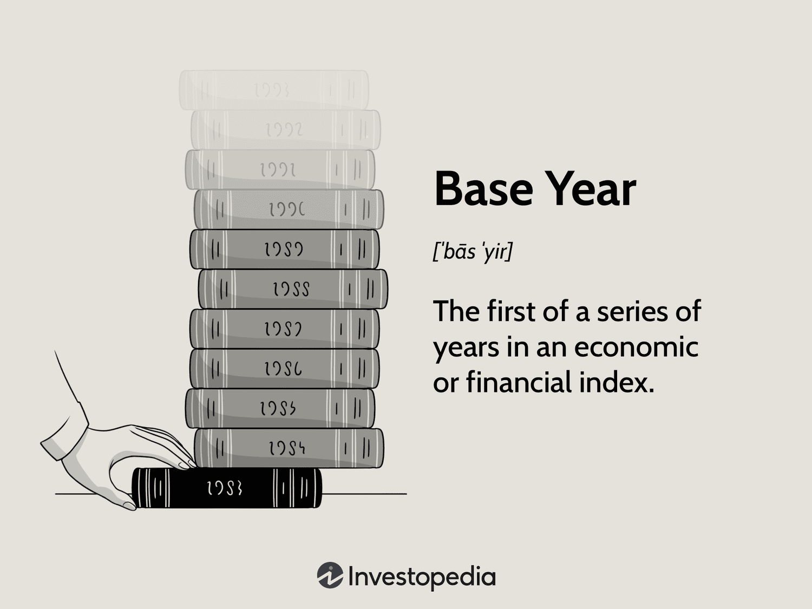

In today's dynamic financial landscape, understanding economic indicators is vital for investors and traders. These indicators provide essential insights into the health and direction of an economy, helping stakeholders make informed decisions. Economic analysis, base year analysis, and algorithmic trading have emerged as critical tools in this context, each playing a unique role in shaping investment strategies and optimizing financial outcomes.

Economic analysis involves assessing various indicators such as gross domestic product (GDP), consumer price index (CPI), and employment data to evaluate economic conditions. This analysis assists investors and traders in anticipating market movements and potential investment opportunities. A thorough understanding of these indicators helps in navigating the complexities of global markets, ensuring that investment decisions align with the prevailing economic climate.



Base year analysis, on the other hand, serves as a reference point for tracking economic growth and fluctuations over time. By designating a specific year as the baseline, analysts can accurately measure changes in economic indicators, removing the effects of inflation or other temporal factors. This consistency is crucial for reliable trend analysis and forecasting, enabling investors to assess long-term growth patterns and make informed projections.

Algorithmic trading marks a significant advancement in financial technology, leveraging computational power to execute trades based on predefined criteria. By incorporating economic indicators and statistical models, algorithms can respond rapidly to market changes, execute trades with precision, and reduce human error. This approach optimizes trading efficiency and can enhance the precision of investment strategies.

Understanding how economic analysis, base year analysis, and algorithmic trading intersect is essential for modern investment practices. By integrating these elements, investors and traders can enhance their decision-making processes, anticipate economic shifts, and optimize their investment strategies in a volatile financial environment.

## Table of Contents

## Understanding Economic Indicators

Economic indicators are essential tools that provide quantitative insights into the state and direction of an economy. They are systematically categorized into three types:

1. **Leading Indicators**: These indicators are used to predict future economic activity. They change before the economy starts to follow a particular trend, making them valuable for forecasting developments. Common leading indicators include stock market returns, business inventories, and new orders for capital goods. These indicators offer early signals about the forthcoming phases of the business cycle.

2. **Lagging Indicators**: Unlike leading indicators, lagging indicators change after the economy has already begun to follow a particular trend. They typically confirm a trend rather than predict it. Some examples include unemployment rates, the Consumer Price Index (CPI), and corporate profits. These indicators are crucial for validating economic assessments and assisting policymakers in understanding the effects of economic policies.

3. **Coincident Indicators**: These indicators change at approximately the same time as the overall economy, correlating closely with the current state of economic conditions. Personal income levels, GDP, and industrial production are prime examples. Coincident indicators are invaluable for providing a real-time snapshot of an economy's health. 

Key economic indicators such as Gross Domestic Product (GDP), Consumer Price Index (CPI), and Nonfarm Payrolls furnish significant insights into economic trends:

- **Gross Domestic Product (GDP)**: GDP measures the total value of all goods and services produced over a specific time period within a country. It serves as a comprehensive scorecard of a country’s economic health. High rates of GDP growth indicate a thriving economy, while negative GDP growth can signal economic distress.

- **Consumer Price Index (CPI)**: CPI measures the average change over time in the prices paid by urban consumers for a market basket of consumer goods and services. The CPI is often used as an indicator of inflation, offering insights into the purchasing power and cost of living.

- **Nonfarm Payrolls (NFP)**: This indicator represents the total number of paid U.S. workers of any business, excluding general government, private household, nonprofit workers, and farm employees. The NFP is a critical metric for gauging employment levels and providing insights into labor market trends.

Accurate interpretation of these indicators enables policymakers, investors, and analysts to make informed decisions, facilitating strategic planning and policy implementation.

## The Role of Base Year in Financial Analysis

A base year serves as a crucial benchmark in financial analysis, providing a reference point to measure economic and financial growth. By establishing a standardized basis for comparison, the base year allows analysts and economists to evaluate changes in economic indicators over time. This comparison is vital for understanding trends, making forecasts, and assessing the overall health of an economy.

The concept of a base year is central to constructing real economic figures—those adjusted for inflation—such as Real Gross Domestic Product (GDP). The formula for calculating the real value using a base year is:

$$
\text{Real Value} = \frac{\text{Nominal Value}}{\text{Price Index}} \times 100
$$

In this equation, the nominal value is the current monetary value of an economic statistic, while the price index represents the change in price levels compared to the base year.

Selecting an appropriate base year is crucial for accurate analysis. An ideal base year should be one in which the economy was stable, without significant inflation or deflation pressures and free from major economic disruptions. This ensures comparability and credibility in the evaluation of economic progress or regression. In practice, however, choosing the most representative base year can be challenging due to inherent economic fluctuations and unforeseen events.

The base year also plays a significant role in financial markets, particularly in the equity markets, where stock indices often use a base value to represent a simplified view of market movements over time. An appropriately chosen base year allows for the neutralization of [volatility](/wiki/volatility-trading-strategies), offering a clearer perspective on trends devoid of short-term fluctuations or anomalies.

Furthermore, as economies evolve, it becomes necessary to periodically update the base year to more accurately reflect the current economic structure and consumption patterns. This periodic alignment with the present economic environment ensures the continued relevance and accuracy of economic indicators, aiding in more precise forecasting and policy-making.

The practice of selecting and using a base year in financial analysis forms the foundation for comprehensive economic assessments. Analysts leverage this tool to discern patterns, predict future economic conditions, and make informed decisions about policy or investment strategies, highlighting its indispensability in financial analysis and economic planning.

## Algorithmic Trading: A New Horizon

Algorithmic trading harnesses advanced technology to facilitate the execution of trades based on pre-determined criteria, transforming the landscape of modern finance. By leveraging precise algorithms, it aims to increase trade efficiency and take advantage of market opportunities that may be elusive through manual trading. This method involves integrating economic indicators and statistical models to inform trading decisions, reflecting a sophisticated synergy between economic analysis and cutting-edge technology.

Economic indicators, including Gross Domestic Product (GDP), Consumer Price Index (CPI), and employment [statistics](/wiki/bayesian-statistics), are pivotal in shaping the strategies employed in [algorithmic trading](/wiki/algorithmic-trading). These indicators provide critical insights into macroeconomic conditions, allowing algorithms to adjust trading strategies to align with prevailing economic environments. This adaptive approach is essential for anticipating and responding to market fluctuations.

Statistical models play a significant role in algorithmic trading, employing quantitative techniques to analyze market data and forecast potential outcomes. Machine learning algorithms, for example, are capable of recognizing patterns and trends in vast datasets that may not be immediately apparent to human analysts. These models can identify correlations and predict price movements, thereby enabling traders to execute trades with enhanced precision.

Backtesting represents a vital component of algorithmic trading, allowing traders to validate and refine their strategies against historical data. This process involves simulating the strategy on past market conditions to assess its potential performance. Through [backtesting](/wiki/backtesting), traders can identify the strengths and weaknesses of their algorithms, optimize them, and minimize potential risks before deployment in live trading environments.

Backtesting also incorporates statistical metrics such as the Sharpe ratio, which assesses the risk-adjusted return of a trading strategy. A higher Sharpe ratio indicates a more favorable risk-reward balance, providing traders with a metric to compare the performance of different strategies. Moreover, metrics like maximum drawdown, which measures the largest peak-to-trough decline, help quantify the risk involved in a particular strategy.

Overall, algorithmic trading signifies a new frontier in financial markets, where technology and data analysis converge to provide a competitive edge. By effectively incorporating economic indicators and robust statistical models, algorithmic trading enables investors and traders to optimize their strategies and navigate the complexities of global markets with increased agility and confidence.

## Integrating Economic Indicators with Algorithmic Trading

Economic indicators are essential in providing macroeconomic context vital for the effectiveness of algorithmic trading strategies. These indicators reflect the overall economic health and can signal potential market movements. By utilizing indicators such as Gross Domestic Product (GDP) and Consumer Price Index (CPI), traders can dynamically adjust their algorithms to align with prevailing economic conditions.

GDP is a comprehensive measure of a nation's economic activity, reflecting the total value of goods and services produced. When algorithmic trading strategies incorporate GDP data, they can identify periods of economic growth or contraction. For instance, an increase in GDP might signal a favorable economic climate, prompting algorithms to adopt risk-on strategies. Conversely, a declining GDP could lead algorithms to shift towards more conservative, risk-off positions.

Similarly, the CPI measures inflation by tracking changes in the price level of a basket of consumer goods and services. By integrating CPI data, algorithmic trading strategies can anticipate inflationary trends and adjust accordingly. For example, a rising CPI might indicate increasing inflationary pressures, prompting algorithms to adjust their asset allocations from cash to equities or commodities that tend to benefit from inflationary periods.

A Python-based example of integrating an economic indicator, like GDP, into an algorithmic trading strategy might look like this:

```python
import pandas as pd

def adjust_strategy_based_on_gdp(gdp_data, market_data):
    """
    Adjusts trading strategy based on GDP changes.

    :param gdp_data: DataFrame with 'date' and 'gdp_value' columns
    :param market_data: DataFrame with 'date', 'asset', and 'price_change' columns
    :return: DataFrame with adjusted trade signals
    """

    # Merging GDP data with market data
    combined_data = pd.merge(market_data, gdp_data, on='date', how='inner')

    # Determine trading signal based on GDP trend
    combined_data['gdp_trend'] = combined_data['gdp_value'].diff()
    combined_data['trade_signal'] = combined_data['gdp_trend'].apply(
        lambda x: 'buy' if x > 0 else 'sell'
    )

    return combined_data[['date', 'asset', 'trade_signal']]

# Example data
gdp_data = pd.DataFrame({
    'date': ['2023-01-01', '2023-02-01', '2023-03-01'],
    'gdp_value': [2000, 2050, 2040]
})

market_data = pd.DataFrame({
    'date': ['2023-01-01', '2023-02-01', '2023-03-01'],
    'asset': ['Asset_1', 'Asset_2', 'Asset_3'],
    'price_change': [0.02, -0.01, 0.03]
})

adjusted_strategies = adjust_strategy_based_on_gdp(gdp_data, market_data)
print(adjusted_strategies)
```

Integrating economic indicators in algorithmic trading not only provides a robust framework for decision-making but also optimizes financial outcomes by predicting market trends with greater accuracy. However, while these indicators offer valuable insights, they should be used complementary with other models and data to account for market complexities and anomalies. This holistic approach enhances the adaptability and performance of algorithmic trading strategies amidst changing economic landscapes.

## Challenges and Considerations

In the field of algorithmic trading, solely relying on economic indicators without a broader context can lead to misleading conclusions. These indicators, while valuable, often offer a snapshot of economic conditions that may not account for underlying complexities or unforeseen events. For instance, misinterpretation of indicators like GDP or CPI can result from overlooking contextual factors such as geopolitical tensions or sudden regulatory changes that impact markets independently of general economic health.

Market anomalies further complicate this scenario by distorting data interpretation. These anomalies—unexpected or irregular market behaviors—can arise from various factors such as [liquidity](/wiki/liquidity-risk-premium) shortages, unexpected political events, or technological mishaps. Such deviations can disrupt established patterns, rendering predictions based on historical data less reliable. Traders who depend heavily on algorithmic models may find these models vulnerable to failures when confronted with anomalies that were not anticipated in their design.

To contend with these challenges, continuous evaluation and refinement of trading algorithms are imperative. Algorithms must be adaptable, incorporating mechanisms to reassess their parameters and assumptions in response to new data and changing market conditions. One effective approach is backtesting, which involves running simulations of trading algorithms on historical data to gauge their performance. However, backtesting must be approached with caution; overfitting—a situation where an algorithm performs exceptionally on historical data but fails in real-time scenarios—remains a significant risk.

Algorithm developers can employ techniques such as walk-forward optimization to mitigate overfitting. This process involves updating the algorithm's parameters as new data becomes available, ensuring its adaptability to shifts within the market environment. Additionally, incorporating [machine learning](/wiki/machine-learning) models into algorithms can enable them to learn from new patterns and adapt predictions accordingly.

Machine learning models, specifically those involving time-series analysis, help in identifying underlying trends and fluctuations within economic indicators. For instance, using Python's `statsmodels` library, traders can deploy advanced models like ARIMA (AutoRegressive Integrated Moving Average) to forecast economic indicator movements:

```python
from statsmodels.tsa.arima.model import ARIMA

# Example of fitting an ARIMA model
model = ARIMA(gdp_timeseries, order=(5, 1, 0))
model_fit = model.fit()
forecast = model_fit.forecast(steps=5)
```

In summary, the integration of economic indicators in algorithmic trading demands a nuanced understanding of potential market anomalies and the continuous refinement of models to effectively navigate evolving market dynamics. This adaptive approach is crucial for aligning trading strategies with the volatile nature of financial markets.

## Conclusion

Integrating economic indicators with base-year analysis and algorithmic trading ushers in a more nuanced approach to financial decision-making. This synergy allows traders and investors to better anticipate market shifts and optimize investment strategies, thereby capitalizing on both macroeconomic insights and technological advancement.

Economic indicators, traditionally used to assess the health and direction of an economy, provide critical data that, when used in conjunction with base-year analysis, offer a stable reference point for tracking economic dynamics over extended periods. This provides a strategic foundation for understanding economic trends and making informed decisions.

Algorithmic trading leverages this enhanced understanding by employing sophisticated algorithms to execute trades based on predefined criteria. These algorithms often incorporate economic indicators such as Gross Domestic Product (GDP) and Consumer Price Index (CPI), allowing them to adapt trading strategies in real-time according to economic conditions. For instance, a Python-based algorithm could be employed to adjust investment positions based on changes in GDP:

```python
def adjust_strategy(gdp_growth):
    if gdp_growth > 2.5:
        # Increase investment in growth stocks
        return "Increase growth stock allocation"
    elif gdp_growth < 1.5:
        # Shift to defensive stocks
        return "Shift to defensive stock allocation"
    else:
        # Maintain a balanced portfolio
        return "Maintain current allocation"

current_gdp_growth = 2.0
strategy = adjust_strategy(current_gdp_growth)
print(strategy)
```

Despite the robustness provided by these tools, continuous adaptation and evaluation of algorithms are imperative. Market anomalies, such as sudden geopolitical events, can alter data interpretations and thus affect algorithm performance. To mitigate these risks, it is crucial for traders to remain informed and adaptable, updating and refining algorithms as required to stay aligned with shifting market conditions.

In summary, the integration of economic indicators, base-year analysis, and algorithmic trading not only enhances decision-making capabilities but also empowers traders to preemptively adjust their investment strategies in response to economic fluctuations. This approach not only optimizes financial outcomes but also equips traders with the agility to navigate the complexities of financial markets effectively, ensuring resilience in an ever-evolving economic landscape.

## References & Further Reading

Bergstra, J., Bardenet, R., Bengio, Y., & Kégl, B. (2011). "Algorithms for Hyper-Parameter Optimization." This paper discusses the optimization of hyper-parameters, which is relevant for enhancing the efficacy of algorithmic trading models. By improving parameter selection, traders can refine trading algorithms, ensuring they respond optimally to economic indicator inputs. The paper details methodologies such as grid search and Bayesian optimization, critical for tuning models in algorithmic trading.

López de Prado, M. (2018). "Advances in Financial Machine Learning." López de Prado's work is an essential resource for understanding the intersection of algorithmic trading and machine learning. The book offers insights into backtesting strategies and developing more advanced trading algorithms that incorporate economic indicators. It emphasizes the importance of robust machine learning approaches to improve the predictability of algorithmic models.

Aronson, D. (2007). "Evidence-Based Technical Analysis: Applying the Scientific Method to Trading Signals." Aronson's book focuses on enhancing trading signal reliability through scientific methods, highlighting the need for evidence-based approaches in trading. It is a valuable read for traders looking to integrate technical analysis with economic indicators to validate and improve their algorithmic trading strategies.

