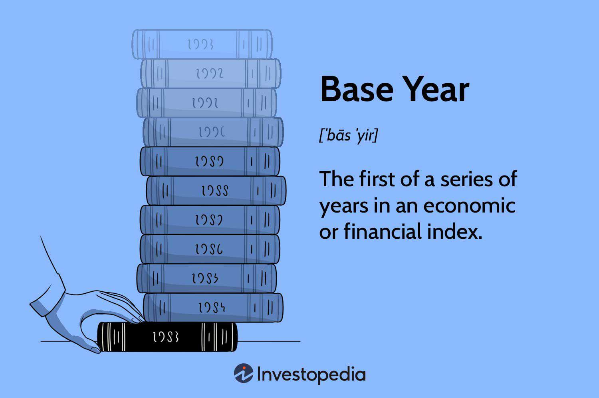

In today's fast-paced financial landscape, analyzing economic indicators is crucial for investors and traders alike. Economic indicators serve as essential tools in understanding the current status and future direction of economies, influencing decision-making processes in investment and trading. These indicators, which include metrics like Gross Domestic Product (GDP), the Consumer Price Index (CPI), and employment data, offer valuable insights into economic health and potential trends.

Recognizing the significance of these indicators, this article will explore their role in financial analysis. A vital part of this analysis is the use of a base year, which acts as a stable point of comparison that facilitates the measurement of economic and financial growth over time. The base year is fundamental in calculating indices and determining growth rates, such as inflation and corporate performance. Accurate selection of a base year is crucial for producing reliable financial forecasts and trend analyses.



Moreover, this article will examine the integration of economic indicators within the context of algorithmic trading. This modern trading approach leverages pre-set criteria and advanced statistical models to execute trades efficiently and effectively. Algorithmic trading relies heavily on real-time data, and economic indicators provide the macroeconomic context necessary to refine and adapt trading strategies.

By exploring these elements, this article aims to provide insight into how economic indicators, base year analysis, and algorithmic trading strategies converge to enhance decision-making and optimize investment strategies in today's financial markets. Understanding economic trends and the tools used to interpret them enables traders to navigate the complexities of financial markets with greater precision and adaptability.

## Table of Contents

## Understanding Economic Indicators

Economic indicators are essential tools that offer critical data reflecting the health and direction of an economy. They serve as statistical proxies, allowing economists, investors, and policymakers to assess economic activity and make informed decisions. Economic indicators are broadly categorized into three types: leading, lagging, and coincident indicators.

**Leading indicators** are predictive by nature, signaling future economic activities. They typically change before the economy as a whole shifts and are used to forecast future trends. Examples of leading indicators include the stock market returns, new business startups, and the manufacturing new orders index. These indicators help anticipate turning points in the economic cycle.

**Lagging indicators**, in contrast, are retrospective, providing confirmation of patterns observed in the broader economy. They typically change after the economy has already begun to follow a particular trend. Unemployment rates, corporate profits, and consumer credit are considered lagging indicators. These indicators are often used to confirm long-term trends rather than predict new ones.

**Coincident indicators** occur simultaneously with economic shifts, providing real-time data on the current state of the economy. These indicators align closely with the overall economic performance, helping to assess the current phase of the economic cycle. Common coincident indicators include gross domestic product (GDP), industrial production, and retail sales.

Key economic indicators such as GDP, the Consumer Price Index (CPI), and Nonfarm Payrolls offer significant insights into economic performance and trends. GDP quantifies the total value of goods and services produced over a specific time frame, serving as a broad indicator of economic health. The formula for GDP is given by:

$$
\text{GDP} = C + I + G + (X - M)
$$

where $C$ stands for consumption, $I$ denotes investment, $G$ represents government spending, and $(X - M)$ is net exports (exports minus imports).

The CPI tracks changes in the price level of a market basket of consumer goods and services, representing an economy's inflation rate. A rising CPI indicates increasing prices, while a decreasing CPI reflects deflationary pressures.

Nonfarm Payrolls report the number of jobs added or lost in the U.S. economy over a specific month, excluding certain sectors like agriculture, private households, and non-profit organizations. This indicator is vital for understanding labor market trends and its impact on economic direction.

Understanding these indicators, their implications, and interrelations is crucial for comprehending economic dynamics and making strategic economic and investment decisions.

## The Role of Base Year in Financial Analysis

A base year is a reference point that serves as a standard of comparison for analyzing and measuring economic and financial growth over time. It is essential in financial analysis because it provides a consistent basis against which changes in economic indicators can be assessed. This is particularly important when trying to understand trends in indicators such as indices and growth rates, including inflation and corporate performance.

By selecting an appropriate base year, economic data can be normalized, allowing for meaningful comparisons across different time periods. For instance, in computing the Consumer Price Index (CPI), a base year is selected, often with an index level of 100, and subsequent years are compared to this base level. The formula for calculating the index in any given year would look something like this:

$$
\text{CPI for Year n} = \left(\frac{\text{Cost of Basket in Year n}}{\text{Cost of Basket in Base Year}}\right) \times 100
$$

This concept extends beyond the CPI to other indices used in economic and financial analysis. When evaluating company performance, the use of a base year helps in converting past financial data, such as sales or earnings, into real terms, which are then comparable over time. This is done to adjust for inflationary impacts and to identify true growth patterns, independent of price level changes.

Choosing the right base year is critical to achieving accurate trend analysis and reliable financial forecasting. Ideally, the base year selected should be a period of economic stability, without significant fluctuations that might distort future comparisons. Analysts must also continuously adjust base years to keep the analysis relevant, considering economic shifts and structural changes in the market.

In summary, the utilization of a base year in financial analysis allows for the consistent comparison of economic and financial data over time, which is fundamental for understanding growth trends, sectoral performance, and the broader economic outlook.

## Algorithmic Trading: A New Horizon

Algorithmic trading represents a significant shift in how trades are executed in financial markets, harnessing the power of technology to make rapid, data-driven decisions based on pre-determined criteria. This sophisticated method of trading uses complex algorithms and computational models to evaluate market conditions and execute trades at speeds and frequencies far beyond the capabilities of human traders.

One of the primary advantages of [algorithmic trading](/wiki/algorithmic-trading) is its ability to incorporate a vast array of economic indicators and statistical models into the decision-making process. Platforms like UltraAlgo exemplify this approach by employing advanced technical indicators to automate trading decisions through real-time data analysis. These platforms analyze live market data, taking into consideration various variables such as price movements, trading [volume](/wiki/volume-trading-strategy), and economic reports, to make informed trading decisions in milliseconds.

A critical aspect of algorithmic trading is [backtesting](/wiki/backtesting), which involves testing an algorithm or trading strategy against historical data. This process allows traders to assess how a strategy would have performed in the past, identifying both strengths and weaknesses before it is applied in real-time trading. By conducting robust backtesting, traders can refine and optimize their algorithms, improving performance and increasing the likelihood of future success. The following is an example of a simple backtesting setup in Python:

```python
import pandas as pd
import backtrader as bt

class MyStrategy(bt.Strategy):
    def __init__(self):
        self.sma = bt.indicators.SimpleMovingAverage(self.data, period=15)

    def next(self):
        if self.data.close[0] > self.sma[0]:
            self.buy(size=100)
        elif self.data.close[0] < self.sma[0]:
            self.sell(size=100)

data = bt.feeds.YahooFinanceData(dataname='AAPL', fromdate=pd.datetime(2022, 1, 1), todate=pd.datetime(2023, 1, 1))
cerebro = bt.Cerebro()
cerebro.addstrategy(MyStrategy)
cerebro.adddata(data)
cerebro.run()
cerebro.plot()
```

This example showcases a simple moving average strategy, leveraging historical data to determine optimal buying and selling points. Such refined strategies, when implemented accurately, can lead to enhanced decision-making and potentially greater financial gains.

Incorporating algorithmic trading into financial strategies provides a competitive edge by automating the trading process and improving the speed and accuracy of trade executions. As the financial landscape evolves, the application of algorithmic trading is likely to expand, driven by advancements in technology and data science. By continually refining these algorithms, traders can adapt to changing market conditions, integrating new data sources and indicators to maintain their strategic advantage.

## Integrating Economic Indicators with Algorithmic Trading

Economic indicators are integral to the development and refinement of algorithmic trading strategies. By providing essential macroeconomic context, these indicators enable traders to synchronize their algorithms with the evolving market environment. This section explores how economic indicators are employed within algorithmic trading and their influence on trading decisions and market predictions.

**Integration of Economic Indicators**

Traders often incorporate key economic indicators such as Gross Domestic Product (GDP) growth and the Consumer Price Index (CPI) into their trading algorithms. GDP growth reflects the overall economic health, indicating periods of expansion or recession, while CPI measures inflationary trends, impacting consumer purchasing power. By integrating these indicators, traders can adjust their algorithmic strategies to reflect current economic conditions.

For instance, a surge in GDP growth might signal strong economic performance, prompting algorithmic traders to adopt a bullish stance in equity markets. Conversely, a rising CPI could signal inflation concerns, leading algorithms to pivot towards commodities or inflation-protected securities.

**Algorithmic Adjustment Using Economic Indicators**

The dynamic nature of algorithmic trading hinges on the real-time assimilation and analysis of economic data. Algorithms are designed to recalibrate trading strategies based on current and projected economic conditions. Here's a simple Python example to illustrate how an algorithm might adjust trading decisions based on GDP and CPI indicators:

```python
def adjust_strategy(gdp_growth, cpi):
    if gdp_growth > 2.0 and cpi < 2.5:
        return "buy equities"
    elif gdp_growth < 1.0 or cpi > 3.0:
        return "move to bonds or commodities"
    else:
        return "hold current position"

# Example usage
gdp_growth = 2.1  # Example GDP growth rate
cpi = 2.2         # Example CPI rate
strategy = adjust_strategy(gdp_growth, cpi)
print(f"Recommended strategy: {strategy}")
```

**Anticipating Market Movements**

The integration of economic indicators into algorithmic trading systems allows traders to anticipate market movements more effectively. By understanding the underlying economic trends, algorithms can predict potential shifts in market sentiment, facilitating more informed trading decisions. For example, during periods of economic uncertainty or predicted recessions, algorithms might tilt towards safer assets, while periods of economic optimism could lead to increased equity exposure.

**Optimizing Financial Outcomes**

The ability to adjust for economic data ensures that algorithmic trading remains responsive to market changes, optimizing financial outcomes for traders. Through the systematic inclusion of economic indicators, algorithms can mitigate risks associated with volatile market conditions and capitalize on emerging opportunities by timely aligning trades with economic forecasts.

In conclusion, the strategic use of economic indicators enhances the functionality of algorithmic trading systems by embedding a fundamental understanding of macroeconomic contexts. This advancement not only aids in anticipating market trends but also enhances the precision and effectiveness of trading strategies, enabling traders to achieve their financial objectives with greater accuracy and reliability.

## Challenges and Considerations

Over-relying on economic indicators without comprehending their broader economic implications can lead investors astray. Economic indicators are powerful tools, yet they should not be viewed in isolation. Understanding the wider economic context is crucial for making informed trading decisions. For instance, an increase in the Consumer Price Index (CPI) might initially signal inflationary pressures, suggesting a potentially negative impact on bond prices. However, without considering accompanying factors like employment data or central bank policies, this interpretation could lead to misguided trading actions.

Algorithmic traders face unique challenges in interpreting economic indicators as potential false signals due to market anomalies can distort decision-making. Anomalies such as flash crashes or sudden geopolitical events can temporarily skew economic data interpretation, leading to erroneous trading signals. Algorithms designed to execute trades based solely on specific indicator thresholds may need correction or disruption during such events, which can affect profitability and increase risks.

To combat these challenges, continuous evaluation and refinement of trading algorithms are essential. An adaptive approach allows algorithms to integrate new data and reshape their strategies. This ongoing process is crucial in adapting to the ever-changing economic landscape and maintaining profitability. For example, employing [machine learning](/wiki/machine-learning) models enables traders to dynamically adjust algorithm parameters. Python, with its libraries such as scikit-learn, can aid in this process:

```python
from sklearn.model_selection import train_test_split
from sklearn.ensemble import RandomForestRegressor
import numpy as np

# Sample economic data (for demonstration purposes only)
economic_data = np.array([[1.2, 2.4, 3.1], [1.5, 2.5, 2.9], [1.8, 2.3, 3.2]])
trading_signals = np.array([0.3, 0.4, 0.5])

# Splitting data into training and testing sets
X_train, X_test, y_train, y_test = train_test_split(economic_data, trading_signals, test_size=0.2)

# Initialize the model
model = RandomForestRegressor(n_estimators=100)

# Train the model
model.fit(X_train, y_train)

# Predict trading signals
predictions = model.predict(X_test)
```

This code snippet demonstrates the use of a machine learning model to predict trading signals based on economic data. By continuously feeding new data into the model, traders can maintain an updated strategy tailored to current economic conditions.

In summary, the effective use of economic indicators in algorithmic trading lies in the careful balance of understanding the context of each indicator within the larger economic picture. Constant adaptation and evaluation of trading models ensure their continued relevance and effectiveness in navigating the complexities of financial markets.

## Conclusion

Integrating economic indicators with base-year financial analysis within algorithmic trading frameworks provides traders with a robust strategy to enhance decision-making processes. By systematically analyzing economic trends, traders can adjust their algorithms and strategies to align with the prevailing market conditions. This is achieved by maintaining a comprehensive understanding of critical economic indicators such as Gross Domestic Product (GDP), Consumer Price Index (CPI), and employment [statistics](/wiki/bayesian-statistics), which offer insights into the macroeconomic environment.

Economic indicators serve as vital components in formulating predictive models and algorithmic strategies that respond to market signals. By leveraging real-time data and incorporating these indicators into algorithmic models, traders can anticipate market shifts and identify potential investment opportunities. For instance, an increase in the CPI may signal rising inflation, prompting the adjustment of [interest rate](/wiki/interest-rate-trading-strategies)-based trading strategies to mitigate risks associated with inflationary pressures.

To effectively exploit the benefits of these economic indicators, traders must remain informed and adaptable. The dynamic nature of financial markets requires continuous monitoring and reconfiguration of algorithms to respond to new data and emerging economic trends. This involves regularly updating models to reflect current base-year data, ensuring accurate comparison and analysis of economic growth and market trajectories.

Moreover, combining algorithmic trading with robust financial analysis techniques enables traders to optimize portfolio management and enhance overall financial outcomes. Mathematical modeling and computer simulations can be utilized to test various scenarios, adapting trading strategies to changing economic conditions and reducing the probability of adverse financial results.

In conclusion, the synthesis of economic indicators with base-year analysis and algorithmic trading techniques provides a comprehensive framework for traders aiming to navigate the complexities of financial markets. By embracing the advances in technology and maintaining a keen awareness of economic developments, traders can effectively harness the potential of these tools, optimizing their strategies for better performance and adaptability in a rapidly evolving economic landscape.

## References & Further Reading

[1]: Bergstra, J., Bardenet, R., Bengio, Y., & Kégl, B. (2011). ["Algorithms for Hyper-Parameter Optimization."](https://dl.acm.org/doi/10.5555/2986459.2986743) Advances in Neural Information Processing Systems 24.

[2]: ["Advances in Financial Machine Learning"](https://www.amazon.com/Advances-Financial-Machine-Learning-Marcos/dp/1119482089) by Marcos Lopez de Prado

[3]: ["Evidence-Based Technical Analysis: Applying the Scientific Method and Statistical Inference to Trading Signals"](https://www.semanticscholar.org/paper/Evidence-Based-Technical-Analysis%3A-Applying-the-and-Aronson/3b33df8737f1772e9e14d66a08c9696f140a2ee1) by David Aronson

[4]: ["Machine Learning for Algorithmic Trading"](https://github.com/PacktPublishing/Machine-Learning-for-Algorithmic-Trading-Second-Edition) by Stefan Jansen

[5]: ["Quantitative Trading: How to Build Your Own Algorithmic Trading Business"](https://books.google.com/books/about/Quantitative_Trading.html?id=j70yEAAAQBAJ) by Ernest P. Chan