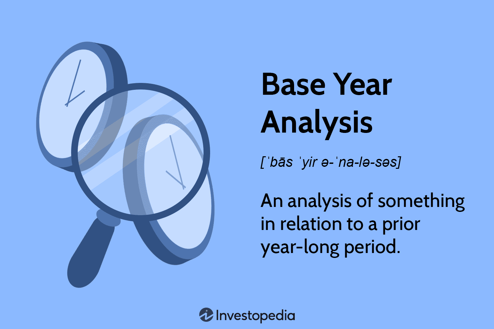

## Table of Contents

## What is a base year in economic terms?

A base year in economics is a specific year that is used as a reference point for comparing economic data over time. It helps economists and statisticians to measure changes in economic indicators like inflation, GDP, and other economic statistics. By using a base year, it becomes easier to see how much these indicators have changed from that year to the current year.

For example, if 2010 is chosen as the base year, all economic data for subsequent years will be compared to the data from 2010. This makes it possible to understand trends and changes in the economy more clearly. The choice of the base year is important because it can affect how we interpret economic growth or decline.

## Why is a base year important in economic analysis?

A base year is important in economic analysis because it gives us a starting point to measure how the economy changes over time. Imagine you want to know if prices are going up or if the country is making more money than before. By picking a specific year as the base year, you can compare everything to that year. This helps everyone understand if things are getting better or worse compared to that time.

Using a base year also makes it easier to see trends and patterns in the economy. For example, if we want to see how much inflation has changed, we can look at prices now and compare them to the prices in the base year. This way, we can tell if things are getting more expensive faster than they used to. It's like having a ruler to measure how much the economy has grown or shrunk since that base year.

## How is a base year chosen?

Choosing a base year is an important decision that economists and statisticians make. They pick a year that they think is a good representation of the economy. This means the year should not be one where something really unusual happened, like a big economic crisis or a major change in how the economy works. The goal is to pick a year that shows what the economy is usually like, so that when we compare other years to it, we get a fair idea of how things have changed.

Sometimes, the choice of the base year can depend on what kind of data is available and how easy it is to get that data. For example, if a country started keeping good records of prices in a certain year, that year might be chosen as the base year. Also, the base year might be updated every few years to keep the comparisons relevant. This way, the base year stays a good reference point for understanding how the economy is doing over time.

## What are the common uses of a base year in economic indicators?

A base year is often used to calculate inflation rates. Economists look at the prices of things like food, clothes, and services in the base year and compare them to prices in later years. This helps them figure out how much more expensive things have become over time. For example, if a loaf of bread cost $1 in the base year and now it costs $1.10, they can say that bread prices have gone up by 10% since the base year.

Another common use of a base year is to measure the growth of the economy, like the Gross Domestic Product (GDP). By comparing the total value of all goods and services produced in the base year to the current year, economists can see if the economy is growing or shrinking. If the GDP this year is higher than in the base year, it means the economy has grown. This helps people understand if the country is doing better or worse than before.

Sometimes, a base year is also used to adjust other economic indicators, like unemployment rates or income levels. By using the base year as a reference, economists can see how these indicators have changed over time. This helps in making decisions about policies and understanding the overall health of the economy.

## Can you explain how inflation is calculated using a base year?

Inflation is calculated by comparing the prices of things now to the prices in a base year. Economists pick a base year that represents a normal time for the economy. They then create a list of things that people commonly buy, like food, clothes, and services. This list is called a "basket of goods." They find out how much this basket of goods cost in the base year and then they check the price of the same basket in the current year.

To figure out the inflation rate, economists use a formula. They take the price of the basket in the current year and divide it by the price of the basket in the base year. Then, they multiply the result by 100 to get a percentage. If the basket cost $100 in the base year and $110 now, the inflation rate would be (($110 / $100) * 100) - 100 = 10%. This means prices have gone up by 10% since the base year. This helps everyone understand how much more expensive things have become over time.

## What are the challenges in selecting an appropriate base year?

Choosing a good base year can be tricky. One big challenge is making sure the year is a normal one for the economy. If something big and unusual happened that year, like a huge economic crisis or a big change in how the economy works, it might not be a fair year to use as a base. Economists want a year that shows what the economy is usually like, so they can compare other years to it and get a true picture of how things have changed.

Another challenge is getting good data. The base year should be one where there is a lot of reliable information about prices and other economic stuff. If a country started keeping good records in a certain year, that might be a good choice for the base year. But if the data from that year isn't very good or complete, it might not be useful for making accurate comparisons. So, economists need to make sure they have all the information they need before they pick a base year.

Sometimes, the base year might need to be updated. As time goes by, what people buy and how the economy works can change a lot. If the base year gets too old, it might not be a good reference point anymore. Economists might decide to pick a new base year to keep their comparisons up to date and relevant. This way, they can keep a good understanding of how the economy is doing over time.

## How does changing the base year affect economic data?

Changing the base year can make a big difference in how we look at economic data. When we pick a new base year, we start comparing all the numbers to this new year instead of the old one. This can change how we see things like inflation rates or how much the economy has grown. If the new base year had different prices or economic conditions, the numbers we get after changing the base year might look different. This doesn't mean the economy itself changed, but it can make it seem like it did when we look at the numbers.

It's important to know that changing the base year doesn't change what actually happened in the economy. It just changes the starting point we use to measure changes. For example, if prices went up a lot in the old base year, switching to a new base year with lower prices might make it look like inflation has been higher in recent years. Economists and people who use this data need to understand these changes so they don't get confused about what's really going on in the economy.

## What is the impact of a base year on real GDP calculations?

The base year is really important when we calculate real GDP. Real GDP is a way to measure how much stuff a country makes, but it adjusts for changes in prices over time. By using a base year, we can see how much the economy has grown or shrunk without being confused by inflation. If we pick a base year when prices were lower, the real GDP for later years will be higher because we're comparing to a year with cheaper prices. This helps us understand if the economy is actually making more stuff, not just if things are getting more expensive.

Changing the base year can change how we see the real GDP numbers. If we switch to a new base year, all the numbers get recalculated using this new year as the starting point. This can make it look like the economy grew more or less than we thought before. But it doesn't mean the economy itself changed; it just means we're using a different starting point to measure it. So, when the base year changes, it's important to remember that the numbers might look different, but it's still the same economy we're talking about.

## How do different countries handle the selection of a base year?

Different countries handle the selection of a base year in ways that make sense for their own economies. They often pick a year that is a good representation of what their economy usually looks like. This means they try to avoid years with big events like economic crises or major policy changes. They also need to make sure they have good data for that year, so they can make accurate comparisons later on. For example, if a country started keeping detailed records of prices in a certain year, that year might be chosen as the base year.

Countries also update their base year from time to time. This is because what people buy and how the economy works can change over the years. If the base year gets too old, it might not be a good reference point anymore. So, countries might decide to pick a new base year to keep their economic data up to date and relevant. This helps them understand how their economy is doing compared to more recent times.

## What are the implications of using an outdated base year?

Using an outdated base year can make it hard to understand what's really going on in the economy. When the base year is old, the things people buy and how much they cost might be very different from today. This can make the numbers we use to measure things like inflation or how much the economy is growing seem off. If prices have gone up a lot since the old base year, it might look like inflation is lower than it really is. This can make it tough for people to make good decisions about money and for the government to know if they need to do something to help the economy.

Changing the base year to a more recent one can help fix these problems. When we use a new base year, we start comparing everything to a year that is more like today. This gives us a better idea of how prices and the economy are changing right now. But it's important to remember that changing the base year doesn't change what's actually happening in the economy. It just changes how we look at the numbers, so we need to be careful not to get confused when we see different numbers after the change.

## How can the use of a base year lead to biases in economic analysis?

Using a base year can lead to biases in economic analysis if the year chosen doesn't reflect the usual state of the economy. For example, if the base year was during a time of unusual economic boom or a deep recession, comparing current economic data to that year might make things seem better or worse than they really are. If the base year had very low prices due to a recession, current inflation rates might look higher than they should. This can make people think prices are rising faster than they really are, which can affect their decisions about spending and saving.

Another way bias can happen is if the base year is too old. Over time, what people buy and how they live changes. If the base year is old, the things in the "basket of goods" used to measure inflation might not match what people buy now. For example, if the base year is from a time before smartphones were common, the basket won't include them, even though they're a big part of today's spending. This can make inflation numbers seem wrong because they're not looking at what's important to people now. To avoid these biases, economists need to pick a good base year and update it regularly to keep the comparisons fair and accurate.

## What advanced statistical methods are used to adjust for base year changes in long-term economic studies?

When economists need to adjust for changes in the base year in long-term economic studies, they often use a method called "chain-linking." This method helps them connect data from different base years smoothly. They take the GDP or other economic numbers from one base year and link them to the numbers from a new base year. This way, they can see how the economy has grown or changed over time without big jumps or gaps when the base year changes. Chain-linking makes sure the long-term trends are clear and easy to understand, even when the base year gets updated.

Another method economists use is called "index number theory." This helps them adjust prices and other economic indicators when the base year changes. They create indexes that show how prices or other things have changed compared to the base year. When they switch to a new base year, they recalculate these indexes to make sure they still show the right changes over time. This method helps them keep the data accurate and useful, even when the base year is old and needs updating. By using these methods, economists can make sure their long-term studies give a true picture of how the economy is doing.

## What is the importance of understanding economic indicators?

Economic indicators are essential tools that offer critical data reflecting the health and direction of an economy. They serve as statistical proxies, allowing economists, investors, and policymakers to assess economic activity and make informed decisions. Economic indicators are broadly categorized into three types: leading, lagging, and coincident indicators.

**Leading indicators** are predictive by nature, signaling future economic activities. They typically change before the economy as a whole shifts and are used to forecast future trends. Examples of leading indicators include the stock market returns, new business startups, and the manufacturing new orders index. These indicators help anticipate turning points in the economic cycle.

**Lagging indicators**, in contrast, are retrospective, providing confirmation of patterns observed in the broader economy. They typically change after the economy has already begun to follow a particular trend. Unemployment rates, corporate profits, and consumer credit are considered lagging indicators. These indicators are often used to confirm long-term trends rather than predict new ones.

**Coincident indicators** occur simultaneously with economic shifts, providing real-time data on the current state of the economy. These indicators align closely with the overall economic performance, helping to assess the current phase of the economic cycle. Common coincident indicators include gross domestic product (GDP), industrial production, and retail sales.

Key economic indicators such as GDP, the Consumer Price Index (CPI), and Nonfarm Payrolls offer significant insights into economic performance and trends. GDP quantifies the total value of goods and services produced over a specific time frame, serving as a broad indicator of economic health. The formula for GDP is given by:

$$
\text{GDP} = C + I + G + (X - M)
$$

where $C$ stands for consumption, $I$ denotes investment, $G$ represents government spending, and $(X - M)$ is net exports (exports minus imports).

The CPI tracks changes in the price level of a market basket of consumer goods and services, representing an economy's inflation rate. A rising CPI indicates increasing prices, while a decreasing CPI reflects deflationary pressures.

Nonfarm Payrolls report the number of jobs added or lost in the U.S. economy over a specific month, excluding certain sectors like agriculture, private households, and non-profit organizations. This indicator is vital for understanding labor market trends and its impact on economic direction.

Understanding these indicators, their implications, and interrelations is crucial for comprehending economic dynamics and making strategic economic and investment decisions.

## What is the role of the base year in financial analysis?

A base year is a reference point that serves as a standard of comparison for analyzing and measuring economic and financial growth over time. It is essential in financial analysis because it provides a consistent basis against which changes in economic indicators can be assessed. This is particularly important when trying to understand trends in indicators such as indices and growth rates, including inflation and corporate performance.

By selecting an appropriate base year, economic data can be normalized, allowing for meaningful comparisons across different time periods. For instance, in computing the Consumer Price Index (CPI), a base year is selected, often with an index level of 100, and subsequent years are compared to this base level. The formula for calculating the index in any given year would look something like this:

$$
\text{CPI for Year n} = \left(\frac{\text{Cost of Basket in Year n}}{\text{Cost of Basket in Base Year}}\right) \times 100
$$

This concept extends beyond the CPI to other indices used in economic and financial analysis. When evaluating company performance, the use of a base year helps in converting past financial data, such as sales or earnings, into real terms, which are then comparable over time. This is done to adjust for inflationary impacts and to identify true growth patterns, independent of price level changes.

Choosing the right base year is critical to achieving accurate trend analysis and reliable financial forecasting. Ideally, the base year selected should be a period of economic stability, without significant fluctuations that might distort future comparisons. Analysts must also continuously adjust base years to keep the analysis relevant, considering economic shifts and structural changes in the market.

In summary, the utilization of a base year in financial analysis allows for the consistent comparison of economic and financial data over time, which is fundamental for understanding growth trends, sectoral performance, and the broader economic outlook.

## References & Further Reading

[1]: Bergstra, J., Bardenet, R., Bengio, Y., & Kégl, B. (2011). ["Algorithms for Hyper-Parameter Optimization."](https://dl.acm.org/doi/10.5555/2986459.2986743) Advances in Neural Information Processing Systems 24.

[2]: ["Advances in Financial Machine Learning"](https://www.amazon.com/Advances-Financial-Machine-Learning-Marcos/dp/1119482089) by Marcos Lopez de Prado

[3]: ["Evidence-Based Technical Analysis: Applying the Scientific Method and Statistical Inference to Trading Signals"](https://www.semanticscholar.org/paper/Evidence-Based-Technical-Analysis%3A-Applying-the-and-Aronson/3b33df8737f1772e9e14d66a08c9696f140a2ee1) by David Aronson

[4]: ["Machine Learning for Algorithmic Trading"](https://github.com/PacktPublishing/Machine-Learning-for-Algorithmic-Trading-Second-Edition) by Stefan Jansen

[5]: ["Quantitative Trading: How to Build Your Own Algorithmic Trading Business"](https://books.google.com/books/about/Quantitative_Trading.html?id=j70yEAAAQBAJ) by Ernest P. Chan