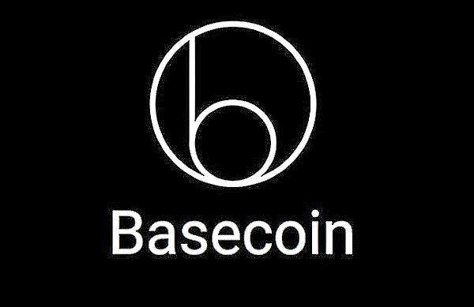

The rise of stablecoins has marked a new era in the cryptocurrency landscape, providing an innovative way to balance the volatility seen in traditional cryptocurrencies like Bitcoin. Stablecoins are a unique class of cryptocurrencies pegged to a stable reserve of assets, often fiat currencies like the U.S. dollar, which help mitigate drastic price swings common in crypto markets. This stability is their main appeal, offering a reliable medium of exchange and store of value that contrasts sharply with more volatile cryptocurrencies.

Despite their advantages, stablecoins, including Basecoin, have sparked significant debate and concern regarding their stability mechanisms and regulatory compliance. Basecoin, an algorithmic stablecoin that later rebranded to Basis, is emblematic of the challenges faced by these digital assets. The mechanism by which Basecoin aimed to maintain stability—through algorithmic adjustments and self-created securities—has been a focal point of discussion and critique.

The story of Basecoin illustrates the regulatory challenges encountered by algorithmic stablecoins, where innovation often collides with regulation. The complexities involved in ensuring both stable operations and compliance with financial regulations are non-trivial. As the market for stablecoins expands, the importance of understanding the regulatory frameworks becomes increasingly critical, encompassing both the potential benefits and inherent risks these digital assets present.

This article examines the multifaceted concerns associated with stablecoins, the evolving regulatory landscape, and the implications for the future, with a particular focus on the now-defunct Basecoin model. Such examination is pertinent, as it sheds light on the complexities and hurdles that must be navigated to ensure that these innovations can contribute positively to the global financial ecosystem.

## Table of Contents

## What Is Basecoin?

Basecoin was a cryptocurrency project launched in 2018 with the objective of achieving price stability through an algorithmic protocol. Initially pegged to the U.S. dollar, Basecoin's mechanism was designed to mimic the operations of a central bank by algorithmically adjusting its supply to maintain a stable value. This approach aimed to address the inherent volatility found in traditional cryptocurrencies like Bitcoin, offering a stable alternative suitable for everyday transactions and as a store of value.

The Basecoin system utilized a three-token model to manage its supply based on market conditions. The primary token was Basecoin itself, which was intended to maintain a stable $1 value. To achieve this, the protocol included two additional types of tokens: Base Bonds and Base Shares. 

Base Bonds functioned akin to debt instruments, issued when the price of Basecoin fell below its $1 peg. Investors could purchase Base Bonds at a discount with the expectation that they would be redeemable for Basecoins once the price returned to parity. This mechanism was designed to contract supply, thereby incentivizing price stabilization.

Base Shares represented equity in the system and were distributed during expansionary phases when the price of Basecoin exceeded $1. As more Basecoins were introduced into circulation to lower the price, Base Shares afforded holders a claim on the newly minted Basecoins, acting as an incentive to manage the surplus supply.

Despite the innovative theoretical framework, Basecoin faced substantial skepticism from economists and regulatory authorities. Critics questioned the efficacy and sustainability of its self-referential tokens, doubting whether an algorithmic approach devoid of traditional asset backing could sustain price stability effectively. The stabilization mechanism, relying purely on mathematical models and market incentives, was a point of contention regarding its vulnerability to market dynamics and external shocks.

In 2018, the U.S. Securities and Exchange Commission (SEC) intervened, which led to the shutdown of the Basecoin project shortly after it rebranded as Basis. The SEC's involvement underscored the regulatory challenges and compliance issues algorithmic stablecoins faced during a time of heightened scrutiny on initial coin offerings (ICOs). As a result, the project was discontinued, marking a significant episode in the ongoing debate over the feasibility and regulation of algorithmic stablecoins.

## How Basecoin Worked

Basecoin, conceived by Nader Al-Naji and a team of Princeton alumni, sought to achieve a stable value through a pioneering algorithmic framework. The primary objective was to emulate mechanisms akin to a central bank by adjusting the monetary supply in response to price movements relative to a predetermined peg, usually the U.S. dollar.

Central to Basecoin's design was a system that utilized three distinct tokens: Basecoin, Base Bonds, and Base Shares. This multi-token model was devised to adjust supply dynamically and regulate market price effectively. When the market price of Basecoin rose above one dollar, indicating an appreciation, the system was engineered to issue additional Basecoins. Theoretically, this increase in supply would exert downward pressure on the price, restoring it towards the intended peg. Conversely, if the price fell below the peg, Base Bonds would be sold, effectively reducing the supply of Basecoins in circulation. Investors could buy these bonds with the expectation of future redemption should the price return above the peg, thereby incentivizing stabilization efforts.

Innovatively, Base Shares functioned analogously to equity in a company, providing holders with rights to the newly issued Basecoins when the system expanded. This mechanism aligned the interests of shareholders with maintaining the peg, assuming future profitability contingent on stable prices.

Despite these mechanisms, a critical aspect of Basecoin's framework was its lack of tangible asset reserves, which raised significant concerns about the system's real-world efficacy. Unlike fiat-backed stablecoins that maintain reserves to assure value, Basecoin's reliance on its derivative tokens introduced vulnerabilities. The success of the stabilization model was predicated on market confidence rather than intrinsic value guarantees, challenging its operational viability.

This algorithmic approach, lacking external collateral, highlighted inherent risks and questioned the practicability of achieving sustained stability through self-referential financial constructs alone, without the foundational backing of traditional or physical assets.

## Concerns and Criticisms

Basecoin faced substantial skepticism largely due to the reliance on its own system of tokens rather than external assets. This approach was designed to regulate its economy by expanding and contracting the supply of Basecoins, Base Bonds, and Base Shares. However, this method attracted critiques from economists, including John Cochrane, who disputed the robustness of Basecoin’s foundation on several grounds.

Cochrane highlighted fundamental misunderstandings within Basecoin’s economic principles, emphasizing inaccuracies in their use of monetary models. At the core of this criticism was the idea that Basecoin attempted to stabilize its currency through self-created securities, a method viewed as precarious when compared to fiat-backed models. Unlike traditional currencies backed by tangible reserves, Basecoin lacked an intrinsic safety net, raising concerns about its vulnerability to market [volatility](/wiki/volatility-trading-strategies) and speculative attacks.

The critique called into question the assumption underlying Basecoin’s stability mechanism; specifically, the belief that an algorithm could effectively mimic the operations of a central bank in maintaining a stable currency without an external reserve. This skepticism extends beyond Basecoin, representing a broader challenge to the viability of algorithmic stablecoins, which do not rely on conventional asset backing. Such concerns underscore the difficulty in achieving reliable stability in cryptocurrencies using purely algorithmic approaches, which many argue may not withstand economic pressures as effectively as their fiat-backed or commodity-backed counterparts.

## Regulatory Challenges and Closure

Basecoin's closure in 2018 was primarily due to regulatory complications that arose amidst the boom of Initial Coin Offerings (ICOs). The U.S. Securities and Exchange Commission (SEC) played a crucial role in this process by exerting pressure on Basis, the entity into which Basecoin was rebranded. The SEC's concerns stemmed from the broader regulatory landscape surrounding ICOs and the need for these entities to comply with existing securities laws.

The compliance measures demanded by the SEC were stringent and posed significant challenges to Basecoin's operational model, which relied on a decentralized supply regulation mechanism. The SEC's requirements were centered on investor protection and transparency, as outlined in existing securities legislation. However, these demands clashed with Basecoin's algorithmic approach to supply adjustments, which was supposed to function independently of centralized intervention. 

Nader Al-Naji, the CEO of Basis, highlighted the impracticality of reconciling the SEC's compliance requirements with the decentralized ethos of the project. The inability to meet these regulatory standards led to the decision to return remaining funds to investors and discontinue the project. This resolution not only underscored the difficulties of aligning innovative blockchain ventures with traditional regulatory frameworks but also set a significant precedent for future developments in the stablecoin sector.

Basecoin's shutdown marked a pivotal moment for algorithmic stablecoins, spotlighting the regulatory difficulties they face. It illustrated the inherent risks of deploying untested monetary frameworks without securing adequate regulatory approval. The entire episode emphasized the need for clear regulatory guidelines and frameworks to facilitate innovation while safeguarding stakeholders within the rapidly evolving [cryptocurrency](/wiki/cryptocurrency) market.

## Comparison: Basecoin and Tether

Basecoin and Tether represent two distinct models of stablecoin design, each with unique mechanisms for maintaining price stability. Basecoin, an algorithmic stablecoin, relied entirely on its self-regulating algorithmic system without any backing from physical assets. Its model involved the use of a three-token system—Basecoin, Base Bonds, and Base Shares—to dynamically adjust the supply of Basecoins in response to market demand, aiming to stabilize its value against a specified peg, such as the U.S. dollar.

In contrast, Tether (USDT) employs a fiat-collateralized model, wherein each issued Tether token is purportedly backed by an equivalent amount of fiat currency held in reserve by financial institutions. This reserve-backing ensures that Tether maintains a one-to-one peg with its underlying fiat currency, most commonly the U.S. dollar, thereby offering a degree of transparency and perceived stability not inherent in algorithmic stablecoin models like that of Basecoin. The reliance on actual reserves is intended to instill user confidence by aligning the cryptocurrency's value with tangible assets.

While Tether's reserve-based approach provides a straightforward mechanism to uphold its pegged value, it is not without its own controversies. Allegations have arisen concerning the sufficiency and transparency of Tether's reserves, which have periodically cast doubt on its claims of full backing. Despite these controversies, Tether's model fundamentally differs from Basecoin's, showcasing the divergent methodologies within the stablecoin sector aimed at addressing price volatility.

Overall, while Tether's model is based on physical reserves, providing a seemingly stable foundation, Basecoin's fully algorithmic approach illustrates the innovative yet risky nature of attempting to achieve stability without external collateral. This clear distinction underscores the complex considerations that both models encounter in their quest to maintain stable and reliable value within the digital currency market.

## The Future of Stablecoin Regulation

As the stablecoin market evolves, regulatory bodies worldwide are actively designing frameworks to ensure that these digital assets contribute to market stability while fostering innovation. The European Union's Markets in Crypto-Assets (MiCA) Regulation exemplifies a significant attempt to unify regulatory approaches. MiCA classifies stablecoins into distinct categories such as "asset-referenced tokens" and "e-money tokens," providing comprehensive guidelines for issuance and governance. This regulation aims to mitigate the risks associated with stablecoins, including financial instability and lack of transparency, while promoting technological growth within the EU.

In the United States, discussions surrounding the regulation of stablecoins reflect a careful balancing act between encouraging technological advancements and maintaining robust financial safeguards. Policymakers are considering various legislative proposals that would impose requirements on stablecoin issuers, such as mandating reserve transparency, implementing anti-money laundering (AML) policies, and safeguarding investor interests. The U.S. regulatory approach seeks to harness the potential benefits of stablecoins, such as efficient payment systems and financial inclusion, while addressing the legal ambiguities and operational risks they present.

Globally, the importance of stablecoin regulation cannot be overstated for the financial markets. Stablecoins offer the potential to improve transaction efficiency, reduce costs, and facilitate more integrated monetary systems. However, their rapid adoption poses challenges to financial stability and consumer protection, necessitating well-crafted regulatory measures. As frameworks continue to emerge, the ability of stablecoins to operate harmoniously with traditional financial systems and under regulatory scrutiny will be crucial in determining their long-term viability and integration. The ongoing evolution of these regulations will shape the future of stablecoins, influencing both trust and market proliferation in the global financial landscape.

## Conclusion

Basecoin's rise and subsequent fall underscore the multifaceted challenges that confront the stablecoin sector within the cryptocurrency industry. As a pioneering algorithmic stablecoin, Basecoin initially promised a new era of decentralized finance by attempting to maintain stability without the need for traditional fiat backing. However, its attempts also highlighted significant vulnerabilities inherent in such systems.

Algorithmic stablecoins like Basecoin offer an enticing vision of a decentralized financial ecosystem, where equilibrium is maintained through algorithmic adjustments rather than reliance on fiat currencies. This model could, theoretically, provide a system less susceptible to governmental control and potentially more adaptable in accommodating cryptocurrency's decentralized ethos. Nonetheless, these theoretical advantages are tempered by tangible risks—primarily concerning stability and regulatory scrutiny—which regulators focus on alleviating. 

Current and future regulatory developments are poised to significantly influence the landscape of stablecoins, affecting both their adoption and the trust consumers place in them. Regulatory bodies worldwide have shown increased interest in ensuring these digital assets do not disrupt financial stability while still fostering innovation. In this context, the European Union's Markets in Crypto-Assets (MiCA) Regulation and various U.S. legislative efforts illustrate a growing global consensus on the need for robust and clear regulatory frameworks that balance innovation with risk mitigation.

As the financial landscape continues to integrate digital currencies, the lessons extracted from Basecoin’s trajectory are invaluable. They serve not only as a guide for developing more resilient algorithmic mechanisms but also in shaping comprehensive regulatory strategies that permit stablecoins to integrate seamlessly into existing financial structures. The experience of Basecoin will likely inform both the technical evolution of stablecoin protocols and the regulatory policies that govern them, ultimately contributing to their sustainable adoption and integration into global financial systems.

## References & Further Reading

[1]: Samsi, Siddhartha, et al. (2019). ["Algorithmic Stablecoins: A Short Introduction."](https://arxiv.org/pdf/2308.07041) arXiv preprint arXiv:1906.00162.

[2]: Gans, Joshua S., and Andrew Leigh. (2019). ["How Stable are Stablecoins?"](https://www.joshuagans.com/innovation-equality) National Bureau of Economic Research. 

[3]: Lo, Andrew W., and S. Craig Pirrong. (2018). ["Understanding Cryptocurrencies."](https://academic.oup.com/jfec/article-abstract/18/2/181/5735422) National Bureau of Economic Research.

[4]: Zohar, Aviv. (2015). ["Bitcoin: under the hood."](https://dl.acm.org/doi/10.1145/2701411) Communications of the ACM, 58(9), 104-113.

[5]: Camp-de la Riva, Ignacio, Pablo Camp-Fabra, and Nacho Alamillo-Domingo. (2023). ["Legal perspectives on stablecoin regulation."](https://www.researchgate.net/profile/Ignacio-De-La-Riva) Computer Law & Security Review.