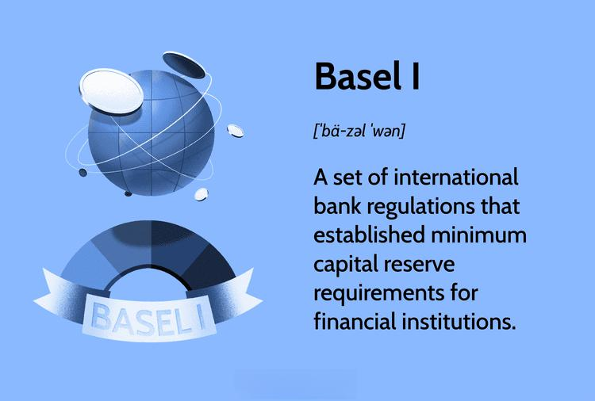

The world of finance operates under intricate regulations aimed at ensuring operational stability and risk management. Among these regulations, the Basel Accords are pivotal. Initiated by the Basel Committee on Banking Supervision, they serve as frameworks to promote financial stability across the global banking sector. This article focuses on Basel I, the foundational accord, its relationship with banking regulation, and its implications for algorithmic trading.

Algorithmic trading has revolutionized the financial markets with its speed and efficiency, making it integral to modern banking operations. This method leverages computer algorithms to execute trading decisions based on predefined criteria, enabling the processing of vast amounts of data at high speed. While offering substantial advantages, it presents regulatory and operational challenges, notably in risk management and compliance.

Through a detailed examination, the article will illuminate how Basel I, with its capital requirement mandates, intersects with algorithmic trading practices. It will also explore the challenges and opportunities presented by this interaction for financial institutions. These insights are essential for institutions seeking to harness technological advancements in trading while adhering to regulatory requirements. Maintaining this balance is crucial for ensuring the continued integrity and stability of the global financial system.

## Table of Contents

## Understanding Basel I: A Foundation of Banking Regulation

Basel I, established in 1988, represents the first set of international banking regulations initiated by the Basel Committee on Banking Supervision (BCBS). Its primary goal was to foster financial stability on a global scale through the establishment of minimum capital requirements for banks to mitigate credit risk. This was critical as it addressed the need for banks to hold sufficient capital to cover potential losses, thereby reducing the likelihood of bank failures.

Under Basel I, banks were mandated to maintain capital equal to at least 8% of their risk-weighted assets (RWA). The risk-weighting system classified bank assets according to their credit risk, with different asset types assigned different weights. For instance, government bonds were typically considered low risk and given a lower weight, while corporate loans carried higher risk and were assigned a higher weight. The formula for calculating the minimum capital requirement under Basel I is:

$$
\text{Minimum Capital Requirement} = 0.08 \times \text{RWA}
$$

This structured approach ensured that banks maintained a sufficient capital buffer, thereby enhancing the overall soundness of the banking system.

Basel I set the stage for subsequent accords such as Basel II and Basel III, which aimed to refine and expand upon the principles introduced in the original framework. Although Basel I primarily focused on credit risk, it laid the groundwork for future regulatory developments that tackled a broader spectrum of risks, including market and operational risks.

The introduction of Basel I played a fundamental role in stabilizing global financial systems by creating a standardized approach to capital adequacy. This standardization encouraged sound banking practices and facilitated more equitable competition among international banks. Furthermore, the framework provided a crucial foundation that influenced the development of national regulatory frameworks, ensuring a level of consistency and reliability that adhered to international standards.

Basel I's impact was significant in that it not only provided a benchmark for evaluating banks' capital positions but also promoted confidence among stakeholders, including investors and regulators, by signaling a commitment to financial prudence and risk management. Overall, Basel I was a pivotal development in international banking regulation, paving the way for more comprehensive regulatory measures to address the complexities of modern financial landscapes.

## Algorithmic Trading: A Modern Approach in the Financial Markets

Algorithmic trading is the process of using computer algorithms to execute trading orders with high speed and precision, based on predefined criteria such as timing, price, or [volume](/wiki/volume-trading-strategy). This approach minimizes human intervention, allowing for automated and efficient trading operations. The adoption of [algorithmic trading](/wiki/algorithmic-trading) has surged since the early 2000s, driven by technological advancements, including increased computing power and enhanced data analysis capabilities. 

**Advantages**: Algorithmic trading offers numerous benefits. It significantly boosts efficiency by enabling simultaneous processing of numerous transactions across different markets. The speed of execution, which can occur in fractions of a second, allows traders to capitalize on fleeting market opportunities that would be inaccessible through manual trading. Additionally, algorithmic systems are capable of handling vast volumes of data, identifying patterns, and making data-driven decisions, enhancing the precision and reliability of trading strategies.

**Risks**: Despite its advantages, algorithmic trading is not without risks. The reliance on technology introduces vulnerabilities, such as the potential for system failures or errors in algorithms, which can lead to substantial financial losses. Such incidents underline the importance of thorough testing and monitoring of algorithmic trading systems. Moreover, the complexity of these systems can increase the difficulty of pinpointing and rectifying any malfunctions or unexpected behaviors during trading operations.

**Regulatory Necessity**: The rapid evolution and widespread adoption of algorithmic trading highlight the need for robust regulatory frameworks to manage associated risks. These regulations aim to ensure market stability and protect against systemic failures. Effective regulation involves setting standards for risk management, including capital requirements and stress testing, and enforcing transparency in algorithmic processes to safeguard the integrity of financial markets.

In sum, while algorithmic trading heralds a new era of efficiency and precision in financial markets, it necessitates a careful balance between leveraging technological innovation and implementing stringent regulatory measures to mitigate inherent risks.

## The Intersection of Basel I and Algorithmic Trading

Basel I, introduced by the Basel Committee on Banking Supervision in 1988, primarily aimed to mitigate credit risk by establishing minimum capital requirements for banks. Although its primary focus was not on the intricacies of trading techniques like algorithmic trading, its capital adequacy framework plays a crucial role in shaping the risk management practices of financial institutions involved in such trading activities.

Algorithmic trading, characterized by the use of algorithms to automate trading processes, is often utilized by large financial institutions, including banks, which are subject to Basel I's regulatory capital stipulations. These stipulations mandate that banks maintain a capital reserve equivalent to at least 8% of their risk-weighted assets. This requirement ensures that institutions involved in high-frequency and algorithmic trading have sufficient financial buffers to withstand potential market fluctuations and trading losses. 

For a financial institution employing algorithmic trading strategies, the capital adequacy framework provided by Basel I serves as a defensive measure against the inherent risks of these activities. Algorithmic trading can expose firms to significant risks, such as market [volatility](/wiki/volatility-trading-strategies) and technological glitches, that necessitate robust capital reserves. While Basel I's primary focus was on credit risk, its principles provide a foundation for managing the broader spectrum of risks encountered in modern financial markets.

The intersection of Basel I's capital requirements and algorithmic trading underscores the importance of risk management in financial institutions. By adhering to these requirements, institutions can better manage their risk exposures, ensuring they have adequate capital to cover unexpected losses. Despite its limitations and criticisms, Basel I's framework remains pertinent, offering a standardized approach to capital adequacy while fostering sound banking practices within the evolving landscape of algorithmic trading. 

Understanding the application of Basel I in algorithmic trading is vital for institutions seeking to balance innovation and regulatory compliance. As algorithmic trading continues to advance, the principles of risk management embedded within Basel I will persist as a key component in safeguarding the global financial system's stability.

## Challenges and Criticisms of Basel I in the Context of Modern Trading

Basel I, established as a pioneering international regulatory framework, aimed to fortify banking stability by introducing uniform capital requirements. Despite its groundbreaking role at inception, criticism has been directed towards its simplistic risk-weighting system. Basel I assigns fixed risk weights to different asset classes, which are broadly categorized: 0% for cash and government securities, 20% for interbank loans, 50% for residential mortgages, and 100% for corporate debt and equity. This approach, while straightforward, is seen as lacking precision in capturing the nuanced risks associated with diverse and complex financial instruments prevalent in modern trading, particularly in algorithmic trading environments.

Algorithmic trading, characterized by high-speed transactions and intricate strategies, frequently involves sophisticated financial instruments that do not fit neatly within Basel I's rigid asset categories. The framework's failure to differentiate between varying risk levels of these instruments can lead to inadequate capital buffers. For instance, a high-frequency trading firm using complex derivatives might be subject to the same capital requirements as a bank holding traditional corporate loans, despite the stark differences in their risk profiles.

Moreover, Basel I's successors, Basel II and Basel III, emerged as corrective measures, introducing more dynamic and nuanced risk assessment mechanisms. Basel II incorporated a more refined approach with the introduction of the internal ratings-based (IRB) approach, allowing banks to use their risk assessment models to calculate capital requirements. Basel III further responded by increasing [liquidity](/wiki/liquidity-risk-premium) standards and introducing the leverage ratio to address broader systemic risks.

However, even with these advancements, the frameworks have faced criticism for not fully preventing systemic financial crises, such as the 2007-2008 global financial crisis. Observers argue that the pace of financial innovation often outstrips regulatory adaptation, leaving gaps in oversight that can be exploited.

In the context of evolving trading technologies, Basel I's framework has sparked debates on the need for continuous reform. Traditional regulatory mechanisms must evolve to address the specific risks associated with algorithmic and high-frequency trading. These include the potential for market manipulation, flash crashes, and systemic risk propagation due to automated trading strategies.

The dialogue continues on how best to update regulatory frameworks to balance the innovation in trading technologies with financial stability. As the financial landscape continues to change, the challenge remains to develop regulations that are both flexible and comprehensive enough to anticipate and manage emerging risks effectively.

## Regulatory Developments and Future Prospects

As financial markets and technologies continue to advance, regulatory frameworks must evolve to address emerging challenges and ensure system stability. A notable development in this context is the Markets in Financial Instruments Directive (MiFID), which has been pivotal in shaping regulatory responses to the complexities of algorithmic trading. Originally implemented in 2007 and significantly revised as MiFID II in 2018, this directive aims to enhance transparency, improve investor protection, and address the risks associated with high-speed trading technologies.

Algorithmic trading, characterized by its reliance on sophisticated algorithms for rapid decision-making and execution, introduces unique risks such as system failures and market manipulation. MiFID II specifically targets these challenges by imposing stringent requirements on investment firms that employ algorithmic trading. These include mandatory testing of trading algorithms, systems resilience audits, and the ability to halt trading if anomalies are detected. The regulatory focus extends to maintaining comprehensive records of trading activities, enabling oversight and accountability.

Looking to the future, there is potential for Basel regulations to evolve further, incorporating explicit considerations for the intricacies of algorithmic and high-frequency trading ([HFT](/wiki/high-frequency-trading-strategies)). While Basel I laid the groundwork for risk management through capital adequacy standards, subsequent accords like Basel III have increasingly addressed market-imposed risks. Future iterations of these regulations may encompass more detailed risk assessments for trading technologies, recognizing their systemic significance.

The evolving regulatory landscape emphasizes the importance of fortifying financial institutions against technological failures and market volatilities. Post the 2008 financial crisis, the resilience of financial systems has become a priority. This has led to a focus on stress testing, robust risk management frameworks, and ensuring sufficient capital buffers to absorb potential shocks. Such measures are critical as institutions engage with complex trading strategies that might amplify risks in turbulent market conditions.

Crucially, a collaborative approach involving regulators, financial institutions, and technology providers is essential in shaping the future of banking regulations. Continuous dialogue among these stakeholders is necessary to identify emerging threats, share best practices, and develop frameworks that keep pace with technological innovation. This process is integral to crafting regulations that not only safeguard the financial system but also allow for the beneficial aspects of innovation in the sector.

In summary, as algorithmic trading becomes an increasingly dominant force in financial markets, regulatory frameworks like MiFID and potential revisions to Basel standards will play a critical role in ensuring market stability. By adapting to technological advancements and fostering cooperation among industry participants, regulators aim to strike a balance that promotes both safety and progress within the financial ecosystem.

## Conclusion

The integration of Basel I and subsequent financial standards into algorithmic trading represents both a challenge and an opportunity for financial institutions. This intersection demands a rigorous attention to regulatory compliance while allowing firms to capitalize on the benefits provided by advancements in technology. Financial institutions must adeptly navigate this complex landscape, ensuring that they maintain adherence to capital requirements while enhancing their trading strategies through technology-driven approaches.

As the financial ecosystem continues its rapid evolution, achieving a balanced approach becomes paramount. This necessitates combining robust regulatory frameworks with innovative trading methodologies. The continuous adaptation and refinement of financial standards are critical to keeping pace with the fast-changing nature of financial markets and technologies. Stakeholders must engage in ongoing research and foster collaboration across the industry. Such efforts will aid in refining these financial standards, making them more compatible with contemporary financial landscapes.

Ultimately, the overarching objective remains clear: to preserve the integrity and stability of the global financial system amid increasing complexities. This requires diligent oversight, proactive risk management, and a commitment to evolving regulatory measures that accommodate technological realities without compromising financial stability.

## References & Further Reading

[1]: ["International Convergence of Capital Measurement and Capital Standards: A Revised Framework"](https://www.bis.org/publ/bcbs128.htm) by the Basel Committee on Banking Supervision, Bank for International Settlements.

[2]: Hull, J. C. (2018). ["Options, Futures, and Other Derivatives"](https://www.semanticscholar.org/paper/Options%2C-Futures%2C-and-Other-Derivatives-Hull/89bdee500c8623864fc9eb7a471546aa713acc44). Pearson.

[3]: Cartea, A., Jaimungal, S., & Penalva, J. (2015). ["Algorithmic and High-Frequency Trading"](https://assets.cambridge.org/97811070/91146/frontmatter/9781107091146_frontmatter.pdf). Cambridge University Press.

[4]: Scharfstein, D. S., & Stein, J. C. (1990). ["Herd Behavior and Investment."](https://www.jstor.org/stable/2006678) The American Economic Review, 80(3), 465-479.

[5]: Aldridge, I. (2010). ["High-Frequency Trading: A Practical Guide to Algorithmic Strategies and Trading Systems"](https://books.google.com/books/about/High_Frequency_Trading.html?id=8QpIsVUMhmEC). Wiley.