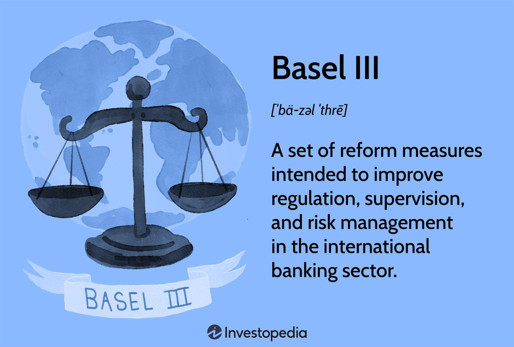

In the wake of the global financial crisis, significant reform efforts have profoundly reshaped banking regulations worldwide. The 2008 crisis underscored the vulnerabilities in the global financial system, revealing how interconnected and fragile financial institutions could be. In response, international banking regulations have been developed with the primary aim of ensuring the stability and transparency of financial institutions. These regulations intend to mitigate the risk of future financial turmoil by enforcing measures that promote a more resilient banking sector.

A cornerstone of these regulatory efforts is Basel III, a comprehensive set of reform measures introduced by the Basel Committee on Banking Supervision. Basel III is designed to strengthen regulation, supervision, and risk management in the banking industry. The framework focuses on key areas such as capital adequacy, leverage ratios, and liquidity standards, ensuring that banks maintain sufficient capital buffers to withstand economic shocks. These measures are critical to maintaining financial stability and reducing systemic risk, which, in turn, fosters greater confidence in the financial system.

Parallel to these developments, the rise of algorithmic trading has introduced a new dimension of complexity to the financial markets. Algorithmic trading uses sophisticated computer algorithms to execute trades at high speed and volume, contributing to market efficiency and liquidity. However, this technology also poses new risks, such as flash crashes and volatile market events, which challenge existing regulatory frameworks. Consequently, understanding how algorithmic trading interacts with established regulations like Basel III is essential for market participants who must navigate this evolving landscape.

Grasping these elements is crucial for stakeholders in today's complex financial landscape. Both the stringent regulatory frameworks instituted post-crisis and innovations in trading technologies are pivotal in steering the future of global financial systems. Market participants must remain savvy and adaptable, engaging with both regulatory advancements and technological innovations to ensure stability and competitiveness in an interconnected world.

## Table of Contents

## Understanding Basel III: The Basics

Basel III is a robust framework of regulatory measures formulated by the Basel Committee on Banking Supervision, initiated in response to the deficiencies exposed by the global financial crisis of 2007-2008. Its primary goal is to fortify the soundness of banks, mitigating systemic risk and enhancing the stability of the global financial system. Basel III introduces a series of stringent regulatory standards designed to ensure that banks maintain adequate capital and liquidity buffers to withstand potential economic shocks.

### Capital Requirements

Central to Basel III is the enhancement of capital requirements, aimed at ensuring that banks possess sufficient capital to absorb losses. The framework elevates the minimum common equity Tier 1 (CET1) capital ratio, which is the core measure of a bank's financial strength. Banks are required to maintain a CET1 ratio of 4.5% of their risk-weighted assets (RWA), up from the previous Basel II requirement.

Moreover, Basel III introduces two additional capital buffers: the capital conservation buffer and the countercyclical buffer. The capital conservation buffer mandates banks to hold an extra 2.5% of CET1 capital, which is intended to absorb losses during periods of financial and economic stress. The countercyclical capital buffer, varying between 0% and 2.5%, allows national regulators to impose additional capital requirements in times of excessive credit growth, providing a macroprudential tool to protect the banking sector.

### Leverage Ratios

Basel III implements a leverage ratio requirement as a non-risk-based backstop to prevent excessive leverage within banks. The leverage ratio is defined as the ratio of Tier 1 capital to the bank's total exposure, which includes both on-balance-sheet and off-balance-sheet assets. Basel III sets a minimum leverage ratio of 3%, aimed at restricting the accumulation of leverage in the banking sector irrespective of the riskiness of assets.

### Liquidity Standards

Liquidity management is a cornerstone of Basel III, addressed through two main ratios: the Liquidity Coverage Ratio (LCR) and the Net Stable Funding Ratio (NSFR). The LCR requires banks to hold a sufficient stock of high-quality liquid assets (HQLA) to cover their total net cash outflows over a 30-day stress scenario. This ensures that banks have adequate short-term [liquidity](/wiki/liquidity-risk-premium) to survive acute stress.

The NSFR complements the LCR by enforcing a longer-term funding stability, requiring that banks maintain a stable funding profile relative to their asset composition over a one-year horizon. The NSFR encourages banks to fund their activities with more stable sources, reducing reliance on short-term wholesale funding and enhancing resilience during financial market disruptions.

### Summary

Overall, Basel III advances the regulatory landscape by introducing comprehensive measures that fortify bank capital, impose constraints on leverage, and improve bank liquidity management. These foundational elements collectively aim to enhance the resiliency of banks, ensuring they can endure periods of economic uncertainty and contribute to a stable financial system.

## The Importance of Basel III in Financial Stability

Basel III regulations are pivotal in preserving global financial stability, with a primary focus on minimizing systemic risk and safeguarding financial institutions from potential collapse. These regulations were introduced in response to the deficiencies revealed during the global financial crisis of 2007-2008. A key aspect of Basel III is its stringent capital requirements, which are instrumental in enhancing the shock-absorbing capability of banks.

The capital requirements mandate that banks maintain a higher Common Equity Tier 1 (CET1) ratio, intended to promote the maintenance of high-quality capital that can efficiently absorb losses. The formula for calculating the CET1 ratio is:

$$
\text{CET1 ratio} = \frac{\text{CET1 Capital}}{\text{Risk-Weighted Assets (RWA)}}
$$

Where CET1 Capital represents the bank's core capital, including common shares and retained earnings, regarded as the most stable form of financial foundation.

This capital adequacy framework ensures that banks possess a robust capacity to endure economic downturns, thereby limiting the prospects of financial instability. In addition to capital requirements, Basel III introduces leverage and liquidity standards. The leverage ratio, calculated as:

$$
\text{Leverage Ratio} = \frac{\text{Tier 1 Capital}}{\text{Exposure Measure}}
$$

where the exposure measure includes balance sheet exposures, derivatives, securities financing transactions, and off-balance-sheet items, is designed to constrain the build-up of leverage in the banking sector.

Furthermore, the liquidity coverage ratio (LCR) and net stable funding ratio (NSFR) are critical components of Basel III, aimed at promoting short-term and long-term liquidity, respectively, thereby ensuring banks can meet their financial obligations during times of market stress.

The rigorous implementation of Basel III has undoubtedly led to a more resilient banking framework. By compelling banks to maintain higher levels of capital and liquidity, these regulations have significantly contributed to a stronger protection mechanism against financial stress. Consequently, the confidence in the financial system has been bolstered, as these regulations reduce the likelihood of a recurrence of the systemic collapses experienced during previous financial crises. 

Basel III represents a significant advancement in ensuring global financial stability, aiming to fortify the banking sector against future adversities and instill confidence among market participants.

## Algorithmic Trading: A Double-Edged Sword

Algorithmic trading has revolutionized financial markets by enabling the execution of trades with unprecedented speed and precision through the use of computer algorithms. These algorithms are designed to analyze market data and execute trades based on pre-defined criteria, often completing transactions in fractions of a second. The introduction of [algorithmic trading](/wiki/algorithmic-trading) has brought about increased efficiency and liquidity, as it allows for the rapid processing of large volumes of data and transactions, thereby reducing market friction and improving price discovery.

Despite these advantages, algorithmic trading also comes with inherent risks. One of the primary concerns is the potential for market [volatility](/wiki/volatility-trading-strategies), sometimes manifesting in the form of flash crashes. These events occur when algorithms, interacting with each other without human intervention, simultaneously trigger a cascade of trades that can significantly destabilize the market. A notable instance of such volatility is the "Flash Crash" of May 6, 2010, when the U.S. stock market experienced an inexplicable sell-off, resulting in a loss of nearly $1 trillion in market value within minutes, only to recover shortly thereafter.

In addition to volatility, algorithmic trading can exacerbate systemic risk. The interconnectivity and rapid pace of trades can lead to a situation where errors or malicious activities propagate quickly through financial systems, potentially leading to widespread disruptions. Furthermore, the opacity of algorithmic operations poses a challenge for regulators and market participants in understanding the underlying mechanisms driving market movements.

To mitigate these risks, regulatory frameworks are essential. These regulations must be carefully crafted to strike a balance between fostering innovation and ensuring market stability. Authorities such as the U.S. Securities and Exchange Commission (SEC) and the European Securities and Markets Authority (ESMA) have introduced measures aimed at enhancing transparency and oversight. For example, circuit breakers, which temporarily halt trading in the event of drastic price movements, have been implemented to prevent and manage flash crashes. Additionally, rules requiring the disclosure of trading algorithms and enforcing stringent risk management practices are part of efforts to ensure that the market remains robust against the potential downsides of algorithmic trading.

Ultimately, while algorithmic trading presents both opportunities and challenges, it remains a critical component of modern financial systems. Properly managed, it has the potential to enhance market efficiency and liquidity, but it requires ongoing vigilance and adaptation of regulatory frameworks to safeguard against the risks it poses.

## Navigating Regulations with Algorithmic Trading

Financial institutions are increasingly tasked with the challenge of integrating algorithmic trading within the stringent framework of Basel III regulations. Compliance with these regulations demands a multifaceted approach involving risk management, technological innovation, and collaboration with regulatory authorities.

Algorithmic trading, characterized by its speed and complexity, necessitates sophisticated risk management practices. Such practices must be tailored to handle the increased [volume](/wiki/volume-trading-strategy) and velocity of transactions generated by algorithms. Establishing robust risk assessment tools and [backtesting](/wiki/backtesting) strategies is critical. These tools help in simulating various market scenarios, thereby allowing firms to anticipate potential risks and devise appropriate mitigation strategies. For example, value-at-risk (VaR) models can be employed to estimate potential losses and allocate capital accordingly, ensuring compliance with Basel III's capital adequacy requirements.

Technology is at the core of aligning algorithmic trading practices with regulatory standards. Advanced technologies such as [machine learning](/wiki/machine-learning) and data analytics enhance the capability of financial institutions to monitor trades in real-time, ensuring adherence to compliance frameworks. These technologies facilitate the automation of compliance processes, reducing the risk of human error and enhancing the accuracy of reporting mechanisms. Moreover, blockchain technology can be leveraged to maintain immutable transaction records, providing a transparent audit trail that aligns with Basel III's emphasis on transparency.

The success of integrating algorithmic trading with Basel III requirements relies heavily on collaboration between financial institutions and regulatory bodies. Regular communication and feedback loops help in identifying potential regulatory ambiguities and developing pragmatic solutions. Regulatory sandboxes, environments where firms can test new products under regulatory supervision, can serve as platforms for innovation while ensuring compliance. This collaborative approach ensures that both regulators and market participants are aligned in their objectives, fostering a stable financial environment.

To effectively harmonize algorithmic trading with existing banking regulations, financial institutions should adopt a strategic approach that encompasses the following steps:

1. **Development of Compliance Frameworks**: Establish comprehensive internal policies that align algorithmic trading practices with Basel III standards. This includes the integration of risk management systems with real-time monitoring capabilities.

2. **Investment in Technology**: Leverage cutting-edge technology to automate compliance processes. Develop proprietary algorithms capable of detecting anomalies and reporting deviations promptly.

3. **Collaboration and Communication**: Engage with regulators and industry peers to gain insights into emerging regulatory trends and challenges. Participation in industry forums and committees can provide valuable perspectives for compliance strategies.

4. **Continuous Evaluation and Improvement**: Regularly assess risk management practices and compliance frameworks. Adapt these practices based on evolving market conditions and regulatory amendments to maintain competitiveness and alignment with regulatory expectations.

By adopting these strategies, financial institutions can navigate the complex regulatory landscape effectively, ensuring that their algorithmic trading practices are both innovative and compliant. This strategic alignment not only mitigates potential risks but also contributes to the overall stability and transparency of the global financial system.

## The Future of International Banking Regulations

As financial markets develop, banking regulations must evolve to address new challenges and innovations. A potential update to the existing Basel III framework is likely to focus on several areas, reflecting both technological advances and shifts in market dynamics.

One foreseeable area for future Basel III updates is the incorporation of measures to address risks associated with emerging technologies, including digital currencies and fintech innovations. As digital currencies, such as Central Bank Digital Currencies (CBDCs) and cryptocurrencies, gain prominence, regulators may need to develop new guidelines to ensure these digital assets are managed safely within the banking framework. This includes addressing challenges related to cybersecurity, money laundering, and market manipulation.

Moreover, the rise of climate-related financial risks is another area gaining attention. Climate change can introduce systemic risks to financial institutions, necessitating the integration of environmental risk assessments into the regulatory framework. Basel III could evolve to include standards for assessing and monitoring climate-related risks, reinforcing the banking sector's resilience against environmental disruptions.

International coordination remains essential to tackle the global nature of banking and trading activities. Efforts to harmonize regulations across jurisdictions will be crucial in managing the interconnectedness of financial markets. This synchronization can prevent regulatory [arbitrage](/wiki/arbitrage), where institutions exploit differences between national regulations, potentially undermining financial stability.

Stakeholders, including banks, regulatory bodies, and market participants, must remain vigilant and proactive. This involves staying informed about regulatory trends, participating in consultative processes, and adapting operational practices to align with updated rules. Financial institutions will need to invest in technology and human capital to ensure compliance with evolving standards.

The future regulatory landscape may also introduce new metrics and tools to assess bank resilience. For instance, advanced stress-testing models could be employed to capture a wider array of risk factors, including those arising from geopolitical tensions and rapid technological advances.

In summary, as the financial environment evolves, international banking regulations such as Basel III will continue to adapt. By embracing technological innovation, environmental considerations, and global coordination, future updates will aim to ensure that the banking sector remains robust, stable, and capable of supporting economic growth.

## Conclusion

Basel III and algorithmic trading are pivotal in shaping the modern financial systems. Basel III regulations, with their focus on stability-oriented measures, are designed to safeguard the economy from the vulnerabilities exposed during the global financial crisis. By enforcing stringent capital requirements, leverage ratios, and liquidity standards, these regulations help ensure that banks maintain the strength necessary to withstand economic stress. Consequently, Basel III aims to reduce systemic risk and contribute to a more resilient and transparent banking sector.

The landscape of algorithmic trading, while offering efficiency and enhanced liquidity, presents challenges that financial institutions must navigate. With the potential for market disruptions, such as flash crashes, regulators must strike a delicate balance that allows innovation while mitigating the risks inherent in high-frequency transactions. Comprehending these dynamics is crucial for stakeholders, as both compliance and adaptation are necessary for financial institutions to remain competitive in a rapidly evolving environment.

Engagement and ongoing dialogue between regulators and market participants are essential to a stable financial landscape. As international financial markets are inherently connected, collaboration and coordination among global regulatory bodies become increasingly important. This dialogue will play a critical role in evolving and refining regulations like Basel III, ensuring they are equipped to handle emerging challenges and innovations.

In summary, the interplay between Basel III regulations and algorithmic trading forms a complex component of modern finance. Staying informed and proactively adjusting to these regulatory frameworks is vital for market participants seeking to ensure competitiveness and compliance in the global market.

## References & Further Reading

[1]: Basel Committee on Banking Supervision. (2011). ["Basel III: A global regulatory framework for more resilient banks and banking systems."](https://www.bis.org/publ/bcbs189.htm) Bank for International Settlements.

[2]: Hull, J. C. (2018). ["Risk Management and Financial Institutions."](https://books.google.com/books/about/Risk_Management_and_Financial_Institutio.html?id=1J1QDwAAQBAJ) Wiley Finance.

[3]: Aldridge, I. (2013). ["High-Frequency Trading: A Practical Guide to Algorithmic Strategies and Trading Systems."](https://www.amazon.com/High-Frequency-Trading-Practical-Algorithmic-Strategies/dp/1118343506) Wiley.

[4]: Caruana, J., & Narain, A. (2013). ["Get to Know: Basel III—Measures Aimed at Strengthening the Banking System."](https://www.semanticscholar.org/paper/Basel-III%3A-New-strains-and-old-debates-challenges-Caruana/e3f1ba18cbfab040984ff80147bb72e863c87f79) International Monetary Fund.

[5]: MacKenzie, D. (2019). ["Flash Crash: How a Trading Algorithm Went Awry and Cost a Billion-Dollar Loss."](https://www.sciencedirect.com/science/article/pii/S2214845013000082) Penguin Books.