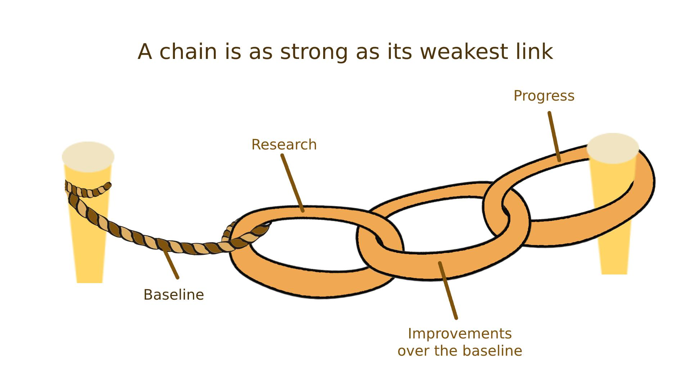

## Table of Contents

## What is a baseline in machine learning?

A baseline in machine learning is a simple model or method that you use as a starting point for comparison. It helps you understand how well your more complex models are performing. For example, if you are trying to predict whether it will rain tomorrow, a baseline model might just predict that it will rain every day. This simple model gives you a reference point. If your more advanced model does not perform better than this baseline, then you know you need to improve it.

Baselines are important because they set a standard for what is considered "good enough." They help you measure the progress of your machine learning project. For instance, if your baseline model predicts rain with 50% accuracy, and your new model predicts with 60% accuracy, you can see that your new model is an improvement. Using a baseline helps you avoid overfitting, where a model might perform well on training data but poorly on new data. By comparing against a baseline, you ensure that your model's improvements are meaningful and not just due to chance.

## Why is establishing a baseline important in machine learning projects?

Establishing a baseline is important in machine learning projects because it gives you a starting point to compare your models. Imagine you are trying to guess how many candies are in a jar. If you just guess a number without any strategy, that's your baseline. When you use a more advanced method to count the candies, you can see if it's better than your initial guess. In machine learning, the baseline helps you understand if the fancy methods you are using are actually improving your predictions.

Moreover, a baseline helps you avoid wasting time on complex models that don't perform any better than a simple one. If your new model isn't better than the baseline, you know you need to try something different. This saves time and resources. For example, if your baseline model predicts whether it will rain with 50% accuracy, and your new model only gets to 51%, you might decide to keep working on it or try a different approach. By having a baseline, you make sure your efforts are leading to real improvements.

## How do you choose an appropriate baseline model?

Choosing an appropriate baseline model starts with understanding your problem. If you want to predict something, like if it will rain tomorrow, you might start with a simple model that always predicts the most common outcome. For example, if it rains more often than not in your area, your baseline could always predict rain. This gives you a starting point to see if your fancier models can do better than just guessing the most common thing.

Next, think about how complex your problem is. If you're trying to sort emails into spam or not spam, a baseline might be a simple rule like "if the email has the word 'free', it's spam." This rule is easy to understand and use, and it helps you see if more complex methods, like using [machine learning](/wiki/machine-learning) algorithms, are worth the effort. The key is to pick a baseline that is simple but relevant to your problem, so you can clearly see if your more advanced models are making a real difference.

## What are some common baseline models used in different types of machine learning tasks?

In classification tasks, a common baseline model is to always predict the majority class. For example, if you're trying to predict if an email is spam or not, and 80% of your emails are not spam, your baseline model could always predict "not spam." This gives you a starting point where your accuracy is 80%. Another simple baseline for classification is a random guess, where you randomly pick a class with the same probability as it appears in your data. If your more advanced model doesn't beat these simple baselines, you know you need to work on it more.

For regression tasks, where you're predicting a number, a common baseline is to predict the mean or median of the target variable. If you're trying to predict house prices, your baseline model might always predict the average price of houses in your dataset. This gives you a benchmark to see if your more complex models are doing better than just guessing the average. Another simple baseline for regression is to predict zero for all cases, which can be useful if your data has a lot of zeros or if you're predicting changes from a baseline value.

In time series forecasting, a common baseline is to use the last observed value as the prediction for the next time step. This is called the naive forecast. If you're predicting daily temperatures, your baseline model might predict tomorrow's temperature to be the same as today's. Another baseline for time series is to use the average of the last few observations. These simple methods help you see if your more advanced models, like ARIMA or machine learning algorithms, are actually improving your forecasts.

## Can you explain how to implement a simple baseline model for a classification problem?

Let's say you want to predict if an email is spam or not. A simple way to start is by always guessing the most common type of email in your data. If most emails in your dataset are not spam, your baseline model will always predict "not spam." To do this, you first need to check your data to see which type of email is more common. Once you know that, you can make your model always guess that type. For example, if 80% of your emails are not spam, your baseline model's accuracy will be 80% because it will correctly guess "not spam" 80% of the time.

Here's how you might write this in Python:

```python
import numpy as np
from sklearn.metrics import accuracy_score

# Let's assume we have a dataset where y_true is the actual labels (0 for not spam, 1 for spam)
y_true = np.array([0, 0, 0, 1, 0, 0, 1, 0, 0, 0])  # Example data

# Find the most common class
most_common_class = np.bincount(y_true).argmax()

# Create predictions where all are the most common class
y_pred = np.full_like(y_true, most_common_class)

# Calculate the accuracy of the baseline model
accuracy = accuracy_score(y_true, y_pred)
print(f"Baseline model accuracy: {accuracy:.2f}")
```

In this code, we use `np.bincount` to count how many times each class appears, and `argmax` to find the most common one. We then create a prediction array `y_pred` that's full of the most common class. Finally, we use `accuracy_score` from scikit-learn to see how well our baseline model did. This simple model gives you a starting point to compare against more complex models you might build later.

## How does a baseline model help in evaluating the performance of more complex models?

A baseline model helps in evaluating the performance of more complex models by providing a simple reference point. Imagine you are trying to predict if it will rain tomorrow. A simple baseline model might always guess "no rain" if most days are dry. If your more complex model, which uses lots of weather data, doesn't predict better than this simple guess, you know you need to improve it. The baseline gives you a clear standard to see if your hard work on a complex model is paying off.

By comparing your complex model's performance to the baseline, you can see if the extra effort is worth it. For example, if your baseline model predicts rain with 50% accuracy, and your new model gets 60%, you can tell that your new model is doing better. This comparison helps you avoid spending time on models that don't really improve your predictions. It also helps you spot if your model is overfitting, where it might do well on the data it was trained on but not on new data. Using a baseline keeps your focus on making real, meaningful improvements.

## What metrics should be used to compare a baseline model with other models?

When comparing a baseline model with other models, accuracy is a common metric to start with. Accuracy tells you the percentage of correct predictions out of all predictions made. For example, if your baseline model predicts rain with 50% accuracy, and your new model predicts rain with 60% accuracy, you can see the improvement. However, accuracy alone might not be enough, especially if your data is imbalanced. If most of your data is one class, like "not spam," a model that always predicts "not spam" could have high accuracy but be useless for identifying spam emails.

In addition to accuracy, you should look at other metrics like precision, recall, and the F1 score. Precision measures how many of the positive predictions were actually correct, which is important if false positives are costly. Recall measures how many of the actual positives were correctly identified, which matters if missing a positive is costly. The F1 score is the harmonic mean of precision and recall, giving you a single number that balances both. For example, if your baseline model has a low F1 score and your new model has a higher F1 score, you know your new model is better at balancing precision and recall. Using these metrics together gives you a fuller picture of how well your model is doing compared to the baseline.

For regression tasks, metrics like Mean Absolute Error (MAE) and Root Mean Squared Error (RMSE) are useful. MAE measures the average of the absolute differences between predictions and actual values, while RMSE gives more weight to larger errors. If your baseline model predicts the average house price with an MAE of $50,000, and your new model predicts with an MAE of $40,000, you can see the improvement. Comparing these metrics against the baseline helps you understand if your more complex model is truly better at making predictions.

## How can a baseline be used to set performance expectations in a machine learning project?

A baseline model helps set performance expectations in a machine learning project by giving you a simple starting point to compare against. Imagine you're trying to predict if it will rain tomorrow. Your baseline model might always guess "no rain" if most days are dry. This simple model sets an expectation for how well you should be able to predict rain. If your more complex model, which uses lots of weather data, doesn't predict better than this simple guess, you know you need to improve it. The baseline gives you a clear standard to see if your hard work on a complex model is paying off.

By comparing your complex model's performance to the baseline, you can see if the extra effort is worth it. For example, if your baseline model predicts rain with 50% accuracy, and your new model gets 60% accuracy, you can tell that your new model is doing better. This comparison helps you set realistic goals for your project. It also helps you avoid spending time on models that don't really improve your predictions. Using a baseline keeps your focus on making real, meaningful improvements, and it sets a clear benchmark for what you should aim to achieve with your more advanced models.

## What are the limitations of using a baseline model in machine learning?

A baseline model can be too simple to capture the complexity of some problems. Imagine you're trying to predict if a student will pass a test. If your baseline model always guesses "pass" because most students pass, it might not help much if you need to predict for students who often fail. This simple model can miss important patterns in the data, like how studying or previous grades affect test results. So, while a baseline model is a good starting point, it might not be enough for more complex tasks where you need to understand many different factors.

Another limitation is that a baseline model might give you a false sense of security. If your more advanced model only slightly beats the baseline, you might think it's doing well when it's not really that great. For example, if your baseline model predicts rain with 50% accuracy and your new model predicts with 52% accuracy, the improvement might not be meaningful. You could spend a lot of time and effort on a model that doesn't really help. It's important to keep looking for better ways to improve your predictions, even if you've beaten the baseline.

## How can you improve upon a baseline model in machine learning?

To improve upon a baseline model in machine learning, you can start by adding more features to your data. For example, if your baseline model for predicting house prices just uses the average price, you could add features like the number of bedrooms, the size of the house, and the location. These extra details can help your model understand more about what makes a house expensive or cheap. You can also use more complex algorithms, like decision trees or neural networks, which can learn patterns in your data that a simple baseline model can't see.

Another way to improve your model is by tuning its parameters. If you're using a decision tree, you might adjust how deep the tree can go or how many samples it needs to split a node. This can help your model make better predictions by fitting the data more closely. You can also try different techniques like cross-validation to make sure your model works well on new data, not just the data it was trained on. By carefully choosing your features, algorithms, and parameters, you can make your model much better than the baseline.

## In what scenarios might a baseline model be sufficient for deployment?

A baseline model might be enough to use in real life if the problem you're trying to solve is simple. Imagine you're trying to guess if a customer will buy something on your website. If most customers don't buy anything, a baseline model that always guesses "no buy" might be good enough. This simple guess can still be useful if the cost of being wrong isn't too high. For example, if sending an email to a customer who won't buy costs very little, using a simple model might save you time and effort compared to building a more complex one.

Another situation where a baseline model could work is when you don't have a lot of data. If you only have a few examples to learn from, a more complex model might not do much better than a simple one. In this case, sticking with a baseline model that uses the most common outcome can be a good choice. It's better to have a simple model that works okay than to try to build a fancy model that doesn't have enough data to learn from properly.

## How do advanced techniques like ensemble methods or deep learning compare to baseline models in terms of performance and complexity?

Advanced techniques like ensemble methods and [deep learning](/wiki/deep-learning) usually perform much better than baseline models. Ensemble methods combine several simple models to make better predictions. For example, a random forest is an ensemble of decision trees that vote on the final prediction. Deep learning, on the other hand, uses neural networks with many layers to learn complex patterns in data. These methods can capture details that a simple baseline model misses, leading to higher accuracy and better performance on tasks like image recognition or natural language processing. If your baseline model predicts house prices with an average error of $50,000, an ensemble method or deep learning model might reduce that error to $30,000 or less.

However, these advanced techniques are also much more complex and harder to understand than baseline models. A baseline model might be as simple as always guessing the most common outcome, which anyone can understand. In contrast, ensemble methods require you to manage multiple models and understand how they work together. Deep learning models, with their many layers and parameters, can be like black boxes, making it hard to explain why they make certain predictions. This complexity means you need more time and resources to build and maintain these models. If your problem is simple or if you don't have much data, the extra effort might not be worth it, and a baseline model could be good enough.

## References & Further Reading

[1]: Ayerdi, Ángel. (2017). ["Benchmarking Machine Learning Models: Learning from Baselines"](https://link.springer.com/chapter/10.1007/979-8-8688-0962-0_10) Towards Data Science.

[2]: Kuhn, M., & Johnson, K. (2013). ["Applied Predictive Modeling"](https://link.springer.com/book/10.1007/978-1-4614-6849-3) New York: Springer.

[3]: ["An Introduction to Statistical Learning"](https://www.statlearning.com/) by Gareth James, Daniela Witten, Trevor Hastie, Robert Tibshirani.

[4]: Russell, S.J., & Norvig, P. (2010). ["Artificial Intelligence: A Modern Approach."](https://api.pageplace.de/preview/DT0400.9781292401171_A41586057/preview-9781292401171_A41586057.pdf) Prentice Hall.

[5]: Goodfellow, I., Bengio, Y., & Courville, A. (2016). ["Deep Learning"](https://link.springer.com/article/10.1007/s10710-017-9314-z) MIT Press.