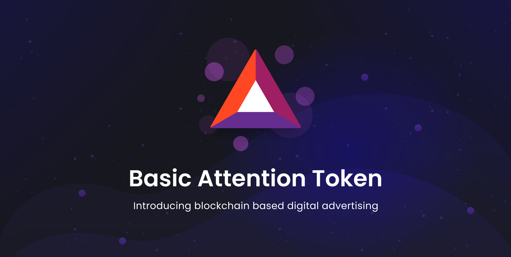

The Basic Attention Token (BAT) represents a significant shift in the digital advertising landscape by leveraging blockchain technology to transform the manner in which media consumption is tracked and valued. Developed as an integral component of the Brave web browser ecosystem, BAT focuses on enhancing advertising effectiveness and bolstering data privacy. By introducing a decentralized system, it allows for precise and confidential monitoring of how media consumers engage with content, aiming to reshape the dynamics between advertisers, publishers, and users.

At the forefront of BAT's innovation is its unique approach to capturing consumer attention. Traditionally, the digital advertising industry has struggled with issues such as ad-blocking, fraud, and inefficient targeting, which not only compromise user experience but also reduce the return on investment for advertisers. BAT addresses these challenges by incentivizing users to engage with advertisements, thereby creating a fairer and more productive digital marketplace. As a result, consumers receive compensation in the form of BAT tokens for their attention, which is securely tracked and analyzed using blockchain technology.



Beyond its impact on digital advertising, BAT's method of consumer tracking offers promising applications in algorithmic trading. Insights derived from user engagement data can inform trading models, enabling traders to predict market trends and better understand consumer behavior. This integration of blockchain-based consumer tracking into financial markets illustrates the broader potential of BAT to influence various sectors through its privacy-centric, data-driven approach.

## Table of Contents

## What is Basic Attention Token (BAT)?

The Basic Attention Token (BAT) is a pivotal component of the Brave browser ecosystem, designed to promote security, fairness, and efficiency in digital advertising. BAT operates on the Ethereum blockchain, which is known for its robust and decentralized infrastructure. As the native token for the Brave browser, BAT facilitates a novel approach to online advertising by directly involving the three key stakeholders: advertisers, publishers, and users.

The traditional digital advertising landscape is fraught with inefficiencies, including issues like ad fraud, user privacy invasion, and discrepancies in reward distribution. BAT addresses these concerns by providing a system that equitably rewards users for their attention while ensuring transparency and security. Users who consume content and interact with advertisements on the Brave browser are rewarded with BAT, thereby incentivizing engagement through a value-exchange model. This model not only enhances user experience but also assists advertisers and publishers in obtaining more meaningful engagement metrics.

The technological foundation of BAT is built on smart contracts operating within the Ethereum ecosystem, ensuring that transactions are verifiable and immutable. This level of security and transparency helps in building trust among users and advertisers alike. By leveraging blockchain technology, BAT minimizes intermediary roles and reduces costs, allowing for more direct transactions between advertisers and users.

In summary, the Basic Attention Token represents a transformative shift in digital advertising, offering a sustainable solution where user privacy is respected and engagement is fairly compensated. By rewarding attention in this manner, BAT creates a synergistic environment that aligns the interests of advertisers, publishers, and users, aiming to redefine interaction dynamics in the web ecosystem.

## Understanding Consumer Tracking with BAT

The Basic Attention Token (BAT) employs blockchain technology to transform consumer tracking in online advertising, prioritizing user privacy while enhancing ad targeting. By recording user engagement with content and advertisements directly on users' devices, BAT ensures that data collection remains both private and anonymous. This approach contrasts with traditional models that often involve third-party trackers and centralized databases, which can lead to privacy infringements.

In practice, BAT integrates with the Brave browser to observe and collect data such as time spent on content, interaction intensity, and preferences without compromising user anonymity. This data is processed locally on the user's device, fundamentally altering how consumer data is typically gathered. Instead of exporting data to external servers, the information remains encrypted and is only used as aggregate [statistics](/wiki/bayesian-statistics).

The collected engagement metrics are subsequently recorded in a distributed ledger, ensuring that the information is tamper-proof and transparent. This blockchain-based ledger facilitates secure data transactions and empowers advertisers with reliable, detailed consumer insights. This method supports precise targeting and personalized advertising strategies, while users maintain control over their data privacy. This innovative approach offers a balanced solution for advertisers seeking targeted engagement and users desiring confidentiality, marking a significant shift in how consumer interaction data is managed in digital advertising ecosystems.

## Algorithmic Trading and Consumer Data

Algorithmic trading, or algo trading, is a method of executing orders using automated pre-programmed trading instructions. These instructions account for variables such as time, price, and [volume](/wiki/volume-trading-strategy) and rely heavily on the analysis of vast datasets. The integration of consumer behavior patterns into these trading strategies is a growing trend, offering a competitive edge to traders who can accurately interpret this data.

The Basic Attention Token (BAT), through its consumer tracking capabilities, offers a unique data source that can significantly enhance [algorithmic trading](/wiki/algorithmic-trading) models. BAT tracks user engagement with digital content and advertisements in a privacy-focused manner. This data, when aggregated, can provide insights into consumer behavior that are both comprehensive and current. By understanding how users interact with content, traders can glean insights into consumer sentiment, which is a key [factor](/wiki/factor-investing) in determining market movements.

Consider an example where a trader wants to predict the sentiment around a new tech product about to be launched. By accessing the engagement data collected through the BAT ecosystem, the trader can assess the general reception of related advertisements and content. If the data indicates a high level of positive interaction, the trader might infer a likely positive sentiment in the market, adjusting their trading strategy accordingly.

Moreover, consumer data from BAT can also help traders in predictive analytics. By analyzing patterns and trends in user engagement, traders can forecast potential market shifts. Python, among other programming languages, is often used to process and analyze such data with libraries like pandas for data manipulation and scikit-learn for [machine learning](/wiki/machine-learning):

```python
import pandas as pd
from sklearn.linear_model import LinearRegression

# Assume df is a DataFrame containing BAT user engagement data
# Columns: ['ad_exposure', 'interaction_time', 'positive_feedback']

X = df[['ad_exposure', 'interaction_time']]
y = df['positive_feedback']

# Fit a simple linear regression model
model = LinearRegression().fit(X, y)

# Predict future positive feedback
future_engagement = pd.DataFrame({'ad_exposure': [500], 'interaction_time': [120]})
predicted_feedback = model.predict(future_engagement)
```

The accurate collection of user data by BAT also mitigates one of the trading industry's pervasive challenges: data privacy concerns. Traditional means of data collection can infringe on consumer privacy, leading to potential regulatory and ethical issues. BAT's privacy-centric model ensures that consumer insights are derived without compromising individual privacy, thereby aligning with both legal standards and public expectations.

In summary, consumer data obtained through BAT offers algorithmic traders robust insights into market sentiment and trends, facilitating more informed and strategic trading decisions. The ethical collection and utilization of this data not only enhances trading accuracy but also builds trust with a privacy-conscious user base, strengthening the overall ecosystem in which this data is applied.

## Applications of BAT in Algo Trading

Basic Attention Token (BAT) data provides a unique opportunity for algo trading by offering anonymized, consent-based insights into consumer engagement patterns. These insights enable traders to develop strategies that respond dynamically to changes in consumer attention and behavior.

Algorithmic trading, primarily driven by quantitative models, benefits from incorporating behavioral data to refine predictions and optimize trading strategies. By analyzing data derived from user interactions with digital content and advertisements, traders can identify trends and patterns that are not immediately apparent through traditional financial data. Such analysis can lead to the development of more accurate predictive models that anticipate shifts in consumer priorities and market conditions.

For example, the data can be fed into machine learning algorithms to predict market movements. Here is a simple Python example using a decision tree classifier:

```python
from sklearn.model_selection import train_test_split
from sklearn.tree import DecisionTreeClassifier
from sklearn.metrics import accuracy_score

# Example data (replace with BAT-derived features)
data = [[0.5, 1.2, 0.4], [1.3, 3.2, 1.5], [0.9, 2.7, 1.0]]
target = [0, 1, 0]  # Example target (buy/sell decision)

# Split the data
X_train, X_test, y_train, y_test = train_test_split(data, target, test_size=0.2)

# Train the model
model = DecisionTreeClassifier()
model.fit(X_train, y_train)

# Evaluate the model
predictions = model.predict(X_test)
accuracy = accuracy_score(y_test, predictions)
print(f'Accuracy: {accuracy:.2f}')
```

Anonymized BAT data upholds data privacy, yet provides a rich dataset for extracting consumer insights. This allows traders to adjust their strategies based on shifts in user engagement without violating privacy regulations. Furthermore, it can contribute to reducing fraudulent trading activities. By leveraging distributed ledger technologies, BAT ensures transparency and verifiability of data, allowing traders to detect and prevent deceitful trading practices.

In summary, BAT data enables algorithmic traders to enhance predictive accuracy and uphold ethical standards in trading activities by leveraging comprehensive yet privacy-compliant consumer engagement insights.

## Privacy Concerns and Solutions

As the Basic Attention Token (BAT) promises to revolutionize digital advertising, privacy concerns remain at the forefront of its adoption. User privacy is a central feature, with several innovative measures implemented to protect data and prevent misuse.

To address these concerns, BAT utilizes Zero-Knowledge Proofs (ZKPs), a cryptographic protocol allowing one party to prove to another that a certain statement is true without revealing any additional information. In the context of BAT, ZKPs ensure that user data remains private while still verifying user interactions with content and advertisements. This mechanism helps maintain anonymity, making it impossible for third parties to misuse consumer data for unauthorized purposes.

Beyond ZKPs, BAT's privacy-enhancing features have broader implications for consumer adoption. By reinforcing trust in its secure data handling, BAT can increase the engagement of privacy-conscious users, potentially driving higher adoption rates of the Brave browser and BAT itself. For consumers, this means they can interact with content confidently, knowing their data is secure and not subject to commercial exploitation. For advertisers, reliable and ethical data collection methods translate into more accurate targeting, ultimately improving advertising efficiency.

The effectiveness of these privacy measures is crucial for BAT's future growth. As data privacy continues to be a significant concern for digital consumers, BAT's emphasis on protecting personal information positions it favorably in the digital advertising landscape. The ability to balance privacy with robust data analytics may enhance BAT's appeal, fostering a shift toward privacy-centric digital ecosystems. This approach not only sets a new standard for data privacy but also reshapes the ongoing relationship between consumers, advertisers, and the digital economy.

## Future Prospects of BAT in Digital Markets

The Basic Attention Token (BAT) stands as a progressive entity in the digital markets, paving new opportunities across advertising and trading sectors. It is engineered to enhance user privacy and redefine the user-advertiser relationship through innovative blockchain technology. As BAT continues to mature within the Brave browser ecosystem, its potential influence on digital markets is multifaceted and promising.

The widespread adoption of the Brave browser can markedly increase the value and utilization of BAT. As more users install and utilize Brave, the network effect could drive a positive feedback loop, enhancing the value proposition for advertisers and users alike. This increase in browser adoption could subsequently elevate BAT's market value, as it becomes integral to advertising transactions within this privacy-centric framework. As adoption rates scale, so will the metrics tracking user engagement, providing advertisers with precise data in a user-protective environment.

The rise in user engagement and the enhancement of privacy measures offered by BAT also present an avenue for influencing digital trading markets. As BAT accumulates user interaction data—fully anonymized and safeguarded—the token creates a rich dataset owing to its secure tracking abilities. Such comprehensive data could enrich algorithmic trading models, helping refine predictive analytics and provide robust insights without compromising user privacy.

From the standpoint of privacy-focused digital ecosystems, BAT's forward trajectory is potentially transformative. The emphasis on a decentralized and user-focused approach aligns with growing consumer preferences for platforms that prioritize their privacy and data security. By combining transparency and confidentiality, BAT may lead the charge in establishing standards for privacy in digital advertising, setting precedents for other systems. As advertising and consumer data shift increasingly towards decentralized models, BAT's role could crystallize as foundational, driving both technological innovation and user empowerment.

In conclusion, the Basic Attention Token's prospects in digital markets are undiminished. Its increasing integration into the everyday browsing activities through the Brave browser and the systematic structuring of a privacy-considered advertising model positions BAT as a potential cornerstone in evolving digital ecosystems. Its impact could stem not just from adoption but also its ability to redefine the paradigms through which data, trust, and privacy are managed in both advertising and algorithmic trading environments.

## References & Further Reading

[1]: Eich, B., & Bondy, A. (2017). ["Basic Attention Token (BAT) Whitepaper."](https://basicattentiontoken.org/static-assets/documents/BasicAttentionTokenWhitePaper-4.pdf)

[2]: Narayanan, A., Bonneau, J., Felten, E., Miller, A., & Goldfeder, S. (2016). ["Bitcoin and Cryptocurrency Technologies."](https://press.princeton.edu/books/hardcover/9780691171692/bitcoin-and-cryptocurrency-technologies) Princeton University Press.

[3]: Brave Software, Inc. ["Brave Browser Privacy Features."](https://brave.com/privacy-features/)

[4]: Tapscott, D., & Tapscott, A. (2016). ["Blockchain Revolution: How the Technology Behind Bitcoin Is Changing Money, Business, and the World."](https://dl.acm.org/doi/10.5555/3051781) Penguin.

[5]: Moorman, M., & Schultz, D. E. (2019). ["The Marketing Data Lake for Superior Customer Insights" in the Handbook of Research on Managing Information Systems in Developing Economies."](https://tracker.specialtyfood.com/About/browse/Download_PDFS/the_dark_side_of_crm_bang_nguyen.pdf) Information Science Reference.

[6]: Lopez de Prado, M. (2018). ["Advances in Financial Machine Learning."](https://www.amazon.com/Advances-Financial-Machine-Learning-Marcos/dp/1119482089) Wiley.