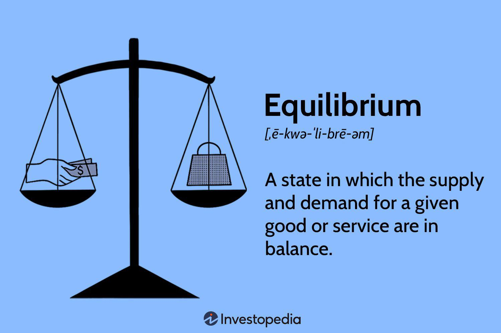

## Table of Contents

## What is the basic definition of balance in everyday life?

Balance in everyday life means finding a way to handle all the different parts of your life without feeling too stressed or overwhelmed. It's about making sure you have time for work, family, friends, and yourself. When you have balance, you feel more relaxed and happy because you're not focusing too much on one thing and ignoring the others.

For example, if you work a lot and don't spend time with your family or friends, you might feel lonely or sad. On the other hand, if you spend all your time with friends and don't work, you might struggle to pay your bills. Balance helps you find a middle ground where you can enjoy all parts of your life without any one part taking over.

## How does balance function in the human body?

Balance in the human body is all about staying steady and not falling over. It's controlled by a system in our body called the vestibular system, which is in our inner ear. This system works with our eyes and muscles to keep us balanced. When we move, the fluid in our inner ear moves too, sending signals to our brain about our position. Our eyes also send information to the brain about what we see, and our muscles and joints tell the brain about our body's position. All this information helps our brain figure out how to keep us upright and stable.

Sometimes, things can go wrong with our balance. If we get dizzy or feel like the room is spinning, it might be because our vestibular system isn't working right. This can happen if we have an ear infection or if we get hurt. Also, as we get older, our balance can get worse, which is why older people sometimes fall more often. Keeping our balance good is important for staying safe and doing everyday things like walking or climbing stairs.

## What are the different types of balance?

There are three main types of balance: static balance, dynamic balance, and vestibular balance. Static balance is when you stay still in one position, like standing on one leg or sitting without moving. It's about keeping your body steady when you're not moving. Dynamic balance is when you move and still stay balanced, like walking, running, or riding a bike. It's about adjusting your body as you move to keep from falling.

Vestibular balance is about the inner ear's role in keeping you balanced. It's the part of your body that helps you know where you are in space, even when you can't see. This type of balance is important for things like standing up straight or not getting dizzy when you spin around. All these types of balance work together to help you stay upright and move around safely.

## What role does the inner ear play in maintaining balance?

The inner ear is really important for keeping us balanced. Inside our ears, there's a part called the vestibular system. It has tiny tubes filled with fluid. When we move our head, this fluid moves too. The movement of the fluid sends signals to our brain about how our head is moving. This helps our brain know if we're tilting, turning, or spinning.

Our brain uses this information from the inner ear along with what our eyes see and what our muscles and joints feel to keep us steady. If the inner ear isn't working right, we might feel dizzy or like the room is spinning. This can happen if we have an ear infection or if we hurt our head. Keeping the inner ear healthy is important for staying balanced and not falling over.

## How do vision and proprioception contribute to balance?

Vision helps us stay balanced by giving our brain information about where we are in space. When we look around, our eyes send signals to the brain about what we see. This helps our brain know if we're on a flat surface or if there are things around us that we need to avoid. If we can't see well, like in the dark or if we have a problem with our eyes, it can be harder to stay balanced because our brain doesn't have all the information it needs.

Proprioception is another way our body helps us stay balanced. It's like our body's sense of where it is. Our muscles and joints send signals to the brain about how they're moving and where they are. This helps us know if we're standing straight or if we're leaning to one side. When we walk or move, proprioception helps us adjust our body to stay steady. If we didn't have proprioception, it would be like trying to walk with our eyes closed and our hands tied, making it really hard to stay balanced.

## What are common balance disorders and their symptoms?

Common balance disorders include vertigo, Meniere's disease, and benign paroxysmal positional vertigo (BPPV). Vertigo makes you feel like you or the room is spinning. It can make you feel dizzy and sick to your stomach. Meniere's disease causes sudden attacks of vertigo, along with hearing loss and a ringing sound in your ear. BPPV happens when tiny crystals in your inner ear move to the wrong place, causing short bursts of vertigo when you move your head in certain ways.

These disorders can make everyday life hard. You might feel unsteady when you walk or stand, which can lead to falls. You might also have trouble focusing your eyes or feel like the world is moving around you. Sometimes, these problems can make you feel anxious or scared because you don't know when the next dizzy spell will come. Seeing a doctor can help figure out what's wrong and how to feel better.

## How can balance be assessed and measured?

Balance can be assessed and measured in a few different ways. One common way is through simple tests that doctors or physical therapists use. For example, they might ask you to stand on one leg with your eyes closed. This test checks your static balance, which is how well you can stay still without falling over. Another test might be walking in a straight line, which checks your dynamic balance, or how well you can stay balanced while moving. These tests help doctors see if you're at risk of falling or if you need help improving your balance.

There are also more advanced ways to measure balance. Special machines like force plates can measure how much you sway when you're standing still. These plates have sensors that detect even tiny movements, giving a detailed picture of your balance. Another tool is a computerized dynamic posturography (CDP) system, which uses a moving platform and visual surroundings to test how well you can keep your balance under different conditions. These advanced tests are often used in research or when a more detailed assessment is needed to figure out what's causing balance problems and how to treat them.

## What exercises can improve balance in healthy individuals?

One simple exercise to improve balance is standing on one leg. You can do this by standing next to a wall or chair for support, then lifting one foot off the ground and trying to balance on the other leg. Start with your eyes open and try to hold the position for as long as you can. As you get better, you can close your eyes to make it harder. Doing this every day can help strengthen the muscles you need to stay balanced.

Another good exercise is the heel-to-toe walk. To do this, place the heel of one foot directly in front of the toes of your other foot, like you're walking on a tightrope. Take slow steps and try to keep your balance as you walk in a straight line. This exercise helps improve your dynamic balance, which is important for moving without falling. Practicing this regularly can make you steadier on your feet.

You can also try the tai chi exercise, which is a slow, flowing movement that helps with balance and strength. Tai chi involves shifting your weight from one leg to the other while moving your arms in smooth, controlled ways. It's a gentle way to work on your balance, and it's good for people of all ages. Doing tai chi a few times a week can make a big difference in how steady you feel.

## How does aging affect balance and what can be done to mitigate these effects?

As people get older, their balance can get worse. This happens because the body changes with age. The inner ear, which helps with balance, might not work as well. Also, muscles and joints can become weaker, making it harder to stay steady. The brain might not get the signals it needs as quickly, which can make older people feel dizzy or unsteady. All these changes together can make it more likely for older people to fall, which can be dangerous.

To help with balance as we age, it's good to do exercises that make muscles stronger and improve balance. Simple exercises like standing on one leg or walking heel-to-toe can be really helpful. Tai chi is another good exercise because it's gentle and helps with both balance and strength. It's also important to keep the ears healthy by seeing a doctor if you feel dizzy a lot. Using things like canes or walkers can give extra support and help prevent falls. By doing these things, older people can stay steadier on their feet and feel more confident moving around.

## What are the latest technologies used in balance rehabilitation?

The latest technologies used in balance rehabilitation include virtual reality (VR) systems and wearable devices. VR systems create a 3D world where people can practice balance exercises in a safe and controlled environment. These systems can be set up to simulate different situations, like walking on uneven ground or climbing stairs. This helps people get used to balancing in various conditions without the risk of falling. Wearable devices, like smartwatches or special sensors, can track how well someone is balancing and give feedback in real-time. This helps people know if they're improving and what they need to work on.

Another technology used is biofeedback, which uses sensors to measure things like muscle activity and body position. This information is shown on a screen, so people can see how their body is moving and learn to control it better. For example, if someone is leaning too much to one side, the biofeedback system can show them this, and they can adjust their posture to stay more balanced. These technologies make balance rehabilitation more fun and effective, helping people get better faster and stay safe.

## How do neurological conditions impact balance and what are the treatment options?

Neurological conditions can really mess up balance. Things like Parkinson's disease, multiple sclerosis, and stroke can make it hard to stay steady. These conditions can affect the brain and nerves that control how we move and stay balanced. For example, with Parkinson's, people might have trouble walking smoothly because their muscles are stiff and they shake. With a stroke, part of the brain might not work right, making one side of the body weak and harder to control. All these problems can make people more likely to fall and get hurt.

There are different ways to help with balance problems caused by neurological conditions. One way is physical therapy, where people work with a therapist to do exercises that make their muscles stronger and help them stay balanced. These exercises can be things like standing on one leg or walking in a special way. Another way is using medicines that can help control symptoms like shaking or stiffness. Sometimes, doctors might suggest using things like canes or walkers to give extra support. It's important to talk to a doctor to figure out the best way to help with balance problems from neurological conditions.

## What research is being conducted on the future of balance and its implications for health and performance?

Scientists are working on new ways to understand and improve balance. They are studying how the brain, eyes, and inner ear work together to keep us steady. They use special machines like virtual reality to see how people balance in different situations. They also look at how balance changes as we get older or if we have health problems. This research helps them find new ways to help people who have trouble staying balanced, like those with neurological conditions or older people who might fall a lot.

The future of balance research could change how we stay healthy and perform better. For example, new technologies like wearable devices might help us track our balance and get better at sports or dancing. Also, understanding balance better can help doctors treat people who have balance problems more effectively. This could mean fewer falls and injuries, especially for older people. By learning more about balance, we can all live safer and more active lives.

## What is the Basic Balance and How Can We Understand It?

The basic balance within the balance of payments is an essential measure that reflects a nation's economic health. It comprises the sum of the current account and the capital account balances, offering a comprehensive snapshot of a country's financial interactions with the rest of the world. The basic balance typically excludes short-term capital flows, highlighting more sustainable financial activities.

In economic terms, the basic balance can be expressed as:

$$
\text{Basic Balance} = \text{Current Account Balance} + \text{Capital Account Balance}
$$

The current account balance measures the flow of goods, services, income, and current transfers between residents and non-residents. A surplus indicates that a nation is a net lender to the rest of the world, while a deficit suggests it is a net borrower. The capital account balance, on the other hand, records capital transfers and the acquisition or disposal of non-financial assets. It reflects transactions that alter a country's stock of overseas assets or liabilities but usually remains a minor part of the balance of payments.

Monitoring the basic balance provides insights into a country's long-term economic sustainability. For instance, persistent deficits might compel a nation to borrow from external sources, eventually affecting its financial stability. Conversely, a consistent surplus could signal robust economic conditions and long-term growth. 

Governments and economists use various tools to monitor and manage the basic balance for economic stability. These include adjusting interest rates or implementing fiscal policies to influence capital flows. International organizations like the International Monetary Fund (IMF) and the World Bank also provide frameworks for analyzing these balances, advising nations on best practices to maintain stability.

Economists pay close attention to the implications of these balances over time. A shift in the basic balance could indicate changing trade patterns or capital movements. For example, a sudden deterioration in the basic balance might necessitate policy intervention to stabilize the economy, while a gradual improvement could enhance a country's creditworthiness and investment allure.

In summary, the basic balance within the balance of payments is a crucial indicator of a nation's economic position. By understanding how it combines the current and capital accounts, stakeholders can derive meaningful conclusions about economic health and make informed decisions to support global financial stability.

## References & Further Reading

[1]: ["International Economics: Theory and Policy"](https://open.umn.edu/opentextbooks/textbooks/276) by Paul Krugman and Maurice Obstfeld

[2]: ["Algorithmic Trading: Winning Strategies and Their Rationale"](https://www.wiley.com/en-us/Algorithmic+Trading%3A+Winning+Strategies+and+Their+Rationale-p-9781118746912) by Ernie Chan

[3]: Portes, R., & Rey, H. (1998). ["The Emergence of the Euro as an International Currency."](https://papers.ssrn.com/sol3/papers.cfm?abstract_id=57607) Economic Policy, 13(26), 307-343.

[4]: ["Balance of Payments Manual"](https://www.imf.org/external/np/sta/bop/BOPman.pdf) by International Monetary Fund

[5]: Engle, R. F. (1982). ["Autoregressive Conditional Heteroscedasticity with Estimates of the Variance of United Kingdom Inflation."](https://www.semanticscholar.org/paper/Autoregressive-conditional-heteroscedasticity-with-Engle/2ee6cb87fc81ecd78d161c4a92c9dfce00c8961c) Econometrica, 50(4), 987-1007.