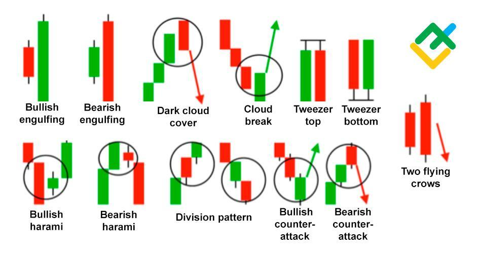

## Table of Contents

## What is a candlestick chart and how does it differ from other types of charts?

A candlestick chart is a type of financial chart used to show how the price of something, like a stock or a currency, changes over time. Each "candlestick" on the chart represents the price movement of the item during a specific time period, like a day or an hour. The candlestick has a wide part, called the "body," which shows the opening and closing prices. If the closing price is higher than the opening price, the body is usually colored white or green. If the closing price is lower than the opening price, the body is usually colored black or red. The thin lines above and below the body, called "wicks" or "shadows," show the highest and lowest prices during that time period.

Candlestick charts are different from other types of charts, like line charts or bar charts, in a few ways. A line chart just connects the closing prices with a line, so it's simpler and shows less detail. It's good for seeing the overall trend but doesn't show the opening, high, and low prices within each time period. A bar chart, on the other hand, uses vertical lines to show the high and low prices, with small ticks to show the opening and closing prices. This gives more information than a line chart but can be harder to read quickly. Candlestick charts combine the best of both, showing all the important price points in a way that's easy to understand at a glance, which is why many traders prefer them.

## What are the basic components of a candlestick, including the body and wicks?

A candlestick has two main parts: the body and the wicks. The body is the wide part of the candlestick. It shows the opening and closing prices of the item being traded during a specific time period. If the closing price is higher than the opening price, the body is usually colored green or white. This means the price went up. If the closing price is lower than the opening price, the body is usually colored red or black. This means the price went down.

The wicks, also called shadows, are the thin lines that stick out from the top and bottom of the body. The top wick shows the highest price the item reached during that time period, while the bottom wick shows the lowest price. The wicks help traders see how much the price moved up and down within the time period. Together, the body and the wicks give a complete picture of the price action during the time period shown by each candlestick.

## How do you identify a bullish candlestick versus a bearish candlestick?

A bullish candlestick is easy to spot because it shows that the price went up during the time period it represents. You can tell it's bullish if the closing price is higher than the opening price. On the chart, this candlestick usually has a green or white body. The bottom of the body is the opening price, and the top of the body is the closing price. Even if there are wicks above and below the body, as long as the closing price is higher than the opening price, it's a bullish candlestick.

A bearish candlestick, on the other hand, shows that the price went down during the time period. You can identify it if the closing price is lower than the opening price. This candlestick is usually colored red or black on the chart. The top of the body is the opening price, and the bottom of the body is the closing price. The wicks can still be there, but if the closing price is lower than the opening price, it's a bearish candlestick.

## What are some common candlestick patterns beginners should know, such as doji, hammer, and shooting star?

A doji is a special candlestick pattern that shows up when the opening and closing prices are very close to each other. It looks like a cross or plus sign on the chart. A doji means that the market is unsure about which way to go, and it can signal a possible change in the trend. If you see a doji after a lot of price movement up or down, it might mean the price could start moving the other way soon.

A hammer is another important pattern to know. It happens at the bottom of a downtrend and looks like a hammer with a long lower wick and a small body at the top. The long lower wick shows that the price dropped a lot during the time period but then came back up to close near the opening price. This can mean that the sellers tried to push the price down, but the buyers fought back and might be ready to push the price up again. A hammer is a sign that the downtrend might be ending.

A shooting star is the opposite of a hammer and shows up at the top of an uptrend. It looks like a star with a small body at the bottom and a long upper wick. The long upper wick means the price went up a lot during the time period but then fell back down to close near the opening price. This can mean that the buyers tried to push the price up, but the sellers fought back and might be ready to push the price down again. A shooting star is a sign that the uptrend might be ending.

## How can candlestick patterns be used to predict potential market reversals?

Candlestick patterns can help traders guess when the market might change direction. For example, if you see a doji after a long time of the price going up or down, it means the market is unsure and might start moving the other way. A doji looks like a cross or plus sign and shows that the opening and closing prices are very close. If you spot a doji, it's a good idea to watch the market closely because a change might be coming soon.

Another pattern to watch for is the hammer, which shows up at the bottom of a downtrend. It looks like a hammer with a long lower wick and a small body at the top. This pattern means that even though the price dropped a lot during the time period, it came back up to close near where it started. This can be a sign that the sellers are losing power and the buyers might take over, pushing the price up. On the other hand, a shooting star at the top of an uptrend can signal that the price might start going down. It looks like a star with a small body at the bottom and a long upper wick, showing that the price went up but then fell back down. Seeing a shooting star can mean the buyers are losing control and the sellers might push the price down.

## What is the significance of the size and color of candlesticks in analysis?

The size and color of candlesticks are important because they tell you a lot about what's happening in the market. The color of a candlestick shows whether the price went up or down during the time period. If it's green or white, the price went up, which means it's a bullish candlestick. If it's red or black, the price went down, making it a bearish candlestick. This helps you see at a glance if the market is feeling positive or negative about the item being traded.

The size of the candlestick's body and wicks also gives you clues. A big body means there was a strong move in the price, either up or down. A small body means the price didn't change much. Long wicks show that the price moved a lot during the time period but came back to close near where it started. This can mean the market is unsure or that there's a fight between buyers and sellers. By looking at the size and color of candlesticks, you can get a better idea of what might happen next in the market.

## How do you combine candlestick analysis with other technical indicators for more accurate predictions?

Combining candlestick analysis with other technical indicators can help you make better guesses about what the market will do next. Candlestick patterns show you what's happening right now and can hint at possible changes in the market's direction. But if you use them with other tools, like moving averages, you can get a fuller picture. Moving averages smooth out price changes over time and help you see the overall trend. When you see a bullish candlestick pattern near a moving average, it might mean the price is likely to keep going up. On the other hand, if you see a bearish pattern near a moving average, it could mean the price might start going down.

Another helpful tool to use with candlesticks is the Relative Strength Index (RSI). The RSI tells you if a stock is overbought or oversold, which means it might be due for a price change. If you spot a bullish candlestick pattern and the RSI is low, it could mean the price is about to go up. But if you see a bearish pattern and the RSI is high, it might mean the price is about to drop. By looking at both candlestick patterns and other indicators like moving averages and RSI, you can make more accurate predictions about where the market might be headed.

## What are advanced candlestick patterns like engulfing patterns and harami, and how are they interpreted?

An engulfing pattern is a two-candle pattern that can show a strong change in the market's direction. It happens when a small candle is followed by a bigger candle that completely covers or "engulfs" the body of the first candle. If you see a small bearish candle followed by a bigger bullish candle, it's called a bullish engulfing pattern. This means the buyers have taken over and the price might start going up. On the other hand, if you see a small bullish candle followed by a bigger bearish candle, it's a bearish engulfing pattern. This means the sellers are now in control and the price might start going down. Engulfing patterns are important because they show a big shift in how the market feels about the item being traded.

A harami pattern is another two-candle pattern that can signal a possible change in the market's direction. It happens when a big candle is followed by a smaller candle that fits inside the body of the first candle. If you see a big bullish candle followed by a smaller bearish candle, it's called a bearish harami pattern. This can mean that the buying power is weakening and the sellers might start pushing the price down. If you see a big bearish candle followed by a smaller bullish candle, it's a bullish harami pattern. This can mean that the selling power is weakening and the buyers might start pushing the price up. Harami patterns are useful because they show that the market might be getting ready to change direction.

## How does the time frame affect the interpretation of candlestick patterns?

The time frame you use to look at candlestick patterns can change how you understand them. If you use a short time frame, like a 1-minute or 5-minute chart, you'll see a lot of small candlesticks. These short-term charts can show you quick changes in the market, but they might also show a lot of noise or small moves that don't mean much for the bigger picture. For example, a doji on a 1-minute chart might not mean the market is unsure about the long-term trend, but it could be a sign of a quick change in the short-term.

On the other hand, if you use a longer time frame, like a daily or weekly chart, the candlesticks will be bigger and show more important moves in the market. Patterns on these longer time frames can give you a better idea of the overall trend and are often more reliable for predicting big changes. For example, a bullish engulfing pattern on a daily chart might be a stronger sign that the price is about to go up than the same pattern on a 1-minute chart. So, it's important to think about the time frame when you're looking at candlestick patterns to understand what they might mean for the market.

## What are the limitations and potential pitfalls of relying solely on candlestick chart analysis?

Relying only on candlestick chart analysis can be tricky because it doesn't give you the whole picture of what's happening in the market. Candlestick patterns can show you what the price did in the past and hint at what might happen next, but they don't tell you why the price moved. There are lots of other things that can affect the market, like news, economic reports, and what other people are doing. If you only look at candlestick patterns, you might miss these important factors and make wrong guesses about where the market is going.

Another problem with using just candlestick charts is that they can be hard to read right. Sometimes, patterns can look like they're saying one thing, but the market does something different. This can happen because candlestick patterns are based on past data, and the future can be hard to predict. Also, if you're looking at a short time frame, like a few minutes, the patterns might not mean much for the bigger picture. It's better to use candlestick charts along with other tools and information to get a fuller understanding of the market and make better decisions.

## How can one backtest candlestick patterns to validate their effectiveness in different market conditions?

Backtesting candlestick patterns means checking how well they worked in the past to see if they might work in the future. You can do this by looking at old price data and seeing what happened after certain patterns showed up. For example, you might find all the times a bullish engulfing pattern appeared on a daily chart and then see if the price went up after that. You can use special computer programs or trading platforms to help you do this. These programs let you go back in time and see how different patterns did in different markets, like stocks or [forex](/wiki/forex-system).

It's important to backtest candlestick patterns in different market conditions because the market can act differently at different times. Sometimes the market goes up a lot, sometimes it goes down, and sometimes it doesn't move much at all. By looking at how patterns worked in these different situations, you can get a better idea of when they might be useful. For example, a doji might be a strong sign of a reversal in a fast-moving market but not as useful in a market that's not moving much. Backtesting helps you see these differences and use candlestick patterns more wisely in your trading.

## What are some strategies for integrating candlestick analysis into a comprehensive trading plan?

Candlestick analysis can be a powerful tool when you include it in your overall trading plan. Start by using candlestick patterns to spot possible changes in the market's direction. For example, if you see a bullish engulfing pattern on a daily chart, it might mean the price is about to go up. But don't just rely on candlesticks alone. Use them with other tools like moving averages and the Relative Strength Index (RSI) to get a fuller picture. If a bullish pattern shows up near a moving average and the RSI is low, it can give you more confidence that the price might rise. This way, you're not just guessing based on one thing but using several signs to make a smarter decision.

It's also important to think about the time frame you're using when you look at candlestick patterns. Patterns on short time frames, like a few minutes, might not mean much for the bigger picture, but patterns on longer time frames, like daily or weekly charts, can be more reliable. Always backtest your candlestick patterns to see how well they worked in the past. This can help you understand if they're likely to work in the future and in different market conditions. By combining candlestick analysis with other tools, considering different time frames, and [backtesting](/wiki/backtesting), you can create a trading plan that's more likely to help you make good choices in the market.

## What lies beyond candlestick charts in technical analysis?

Candlestick charts are fundamental to technical analysis but are even more effective when combined with other analytical tools. Indicators like Moving Averages, Relative Strength Index (RSI), and Moving Average Convergence Divergence (MACD) are integral in augmenting the insights derived from candlestick patterns.

Moving Averages smooth out price data to identify trends by calculating the average of a security's price over a specific number of periods. The formula for a simple moving average (SMA) is:

$$
\text{SMA} = \frac{\sum_{i=1}^{n} P_i}{n}
$$

where $P_i$ is the price of the asset at any given point, and $n$ is the number of periods considered. By evaluating short-term and long-term moving averages, traders can ascertain the momentum and strength of trends. For instance, a crossover where the short-term average rises above a long-term average often signals a potential upward trend.

The RSI is a [momentum](/wiki/momentum) oscillator that measures the speed and change of price movements, oscillating between 0 and 100. Generally, an RSI above 70 indicates that an asset might be overbought, whereas an RSI below 30 suggests it could be oversold. The RSI is calculated as:

$$
\text{RSI} = 100 - \frac{100}{1 + \frac{\text{Average Gain}}{\text{Average Loss}}}
$$

This indicator is crucial for identifying overbought or oversold market conditions, helping traders predict potential reversal points.

MACD is a trend-following momentum indicator calculated by subtracting the 26-period Exponential Moving Average (EMA) from the 12-period EMA. The result is the MACD line. A nine-day EMA of the MACD, called the "signal line," is then plotted on top:

$$
\text{MACD} = \text{EMA}_{12} - \text{EMA}_{26}
$$

$$
\text{Signal Line} = \text{EMA}_{9 \text{ of MACD}}
$$

Traders look for crossovers between the MACD and the signal line, divergence from price trends, and whether the MACD is above or below the zero line to make trading decisions.

These indicators add a quantitative layer of support to the qualitative analysis provided by candlestick charts. Technical analysis leverages these tools to discern trends, pinpoint resistance and support levels, and predict future price movements, offering a comprehensive strategy for traders to make well-informed decisions.

## References & Further Reading

[1]: ["Japanese Candlestick Charting Techniques"](https://www.amazon.com/Japanese-Candlestick-Charting-Techniques-Second/dp/0735201811) by Steve Nison

[2]: Murphy, John J. (1999). ["Technical Analysis of the Financial Markets."](https://www.amazon.com/Technical-Analysis-Financial-Markets-Comprehensive/dp/0735200661) New York Institute of Finance.

[3]: de Prado, M. L. (2018). ["Advances in Financial Machine Learning."](https://www.amazon.com/Advances-Financial-Machine-Learning-Marcos/dp/1119482089) Wiley.

[4]: Chan, E. (2009). ["Quantitative Trading: How to Build Your Own Algorithmic Trading Business."](https://github.com/ftvision/quant_trading_echan_book) Wiley.

[5]: Jansen, S. (2020). ["Machine Learning for Algorithmic Trading."](https://github.com/stefan-jansen/machine-learning-for-trading) Packt Publishing.

[6]: Aronson, D. R. (2006). ["Evidence-Based Technical Analysis: Applying the Scientific Method and Statistical Inference to Trading Signals."](https://www.amazon.com/Evidence-Based-Technical-Analysis-Scientific-Statistical/dp/0470008741) Wiley.

[7]: Engle, R. F., & Russell, J. R. (1998). ["Autoregressive Conditional Duration: A New Model for Irregularly Spaced Transaction Data."](https://www.jstor.org/stable/2999632) Econometrica, 66(5), 1127-1162.