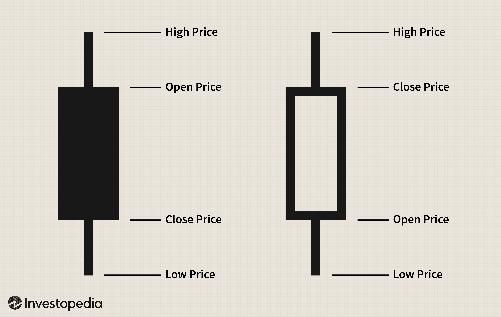

The world of financial markets is vast and intricate, with various tools and techniques that traders and investors use to make sense of complex data. Among these tools, candlestick charts offer a visual representation of price movements, allowing for an insightful interpretation of market trends over time. Originating in Japan, candlestick charts have become a fundamental element of technical analysis, which is a popular method used to predict future price movements based on historical data patterns.

Technical analysis relies heavily on the visual insights provided by these charts to identify trends, reversals, and potential price targets. The primary components, such as the open, high, low, and close prices for a given period, are depicted graphically, making it easier for individuals to assess market sentiment and dynamics. This visual representation is particularly valuable in identifying patterns that may indicate a shift in market direction, such as the formation of a Doji pattern—a potential signal of indecision among traders.



In recent years, the rise of algorithmic trading has further integrated the principles of candlestick charts and technical analysis into automated trading systems. Algorithmic trading involves the use of computer programs to execute trades based on predetermined criteria. These algorithms can process large volumes of market data at speeds unattainable by human traders, allowing for more sophisticated and efficient trading strategies. By incorporating candlestick patterns into algorithmic choices, these systems can optimize decision-making processes, enhancing their predictive potential and execution efficiency.

This article explores the interconnected relationship between candlestick charts, technical analysis, and algorithmic trading and how they collectively influence modern trading practices. Despite their potential, these methods come with inherent risks and challenges that traders need to cautiously navigate. Therefore, understanding how these tools interact within the broader context of financial markets is crucial for making informed and successful trading decisions.

## Table of Contents

## Understanding Candlestick Charts

Candlestick charts, which originated in Japan, are an essential tool in the field of technical analysis and have become a staple for traders worldwide. Each candlestick on the chart captures the open, high, low, and close prices over a specified time frame, which could range from one minute to one month, or longer. 

The body of the candlestick is known as the "real body," and it represents the price range between the opening and closing points. The color of the body is typically used to denote the direction of market movement. A filled or red body indicates a price decline, where the closing price is lower than the opening price. Conversely, a hollow or green body signifies a price rise, with the closing price being higher than the opening price.

Wicks, also referred to as shadows, extend from either end of the body and show the highs and lows within that specific period. The upper wick represents the highest price encountered, while the lower wick denotes the lowest price, indicating [volatility](/wiki/volatility-trading-strategies) and investor sentiment within the trading session.

Candlestick patterns provide traders with insights into market sentiment and potential future price movements. For example, the Doji pattern, which features a small real body, indicates indecision in the market and can signal a potential reversal. The Hammer pattern, characterized by a small body at the top of the trading range and a long lower wick, suggests potential bullish reversals, often appearing at the bottom of downtrends. In contrast, the Engulfing pattern, where a larger body completely covers the previous smaller body, can be bullish or bearish. A Bullish Engulfing pattern occurs at the end of a downtrend and indicates potential upward movement. Conversely, a Bearish Engulfing pattern during an uptrend suggests downward pressure.

By analyzing these formations, traders can infer market sentiment and make informed decisions about their trading strategies. Understanding the nuances of candlestick patterns enhances a trader's ability to predict potential price movements, which is invaluable in the ever-changing financial markets.

## Basic Candlestick Patterns and Their Significance

Candlestick patterns are a vital component of technical analysis, offering traders insights into potential market reversals and continuations. These patterns are typically categorized into bullish and bearish types, each signaling different market sentiment and potential future price movements.

Bullish patterns suggest that the market may be poised for an upward movement. Two common bullish patterns are the Hammer and the Bullish Engulfing pattern. The Hammer pattern occurs when, during a downtrend, the price drops significantly lower than its opening but rallies to close near its opening price. This pattern indicates that buyers are entering the market, potentially reversing the downtrend. The Bullish Engulfing pattern forms when a small bearish candle is followed by a larger bullish candle that completely envelops the bearish candle's body, suggesting that buyers have overtaken the sellers and indicating a possible reversal to an upward trend.

On the other hand, bearish patterns indicate potential downward price movements. An example is the Bearish Engulfing pattern, which occurs when a small bullish candle is followed by a larger bearish candle that engulfs the previous candle's body, signaling a possible reversal from an upward to a downward trend. Another bearish pattern, the Shooting Star, forms when the price opens, rises significantly, but then closes near its opening. This pattern suggests that the uptrend is losing [momentum](/wiki/momentum), potentially leading to a price decline.

For effective trading, understanding these candlestick patterns is crucial. By recognizing and interpreting these patterns, traders can make informed decisions, anticipating changes in market trends. This ability to predict reversals and continuations helps strategize entry and [exit](/wiki/exit-strategy) points in trades, aiming to capitalize on potential price movements.

## Technical Analysis: Beyond Candlestick Charts

Candlestick charts are fundamental to technical analysis but are even more effective when combined with other analytical tools. Indicators like Moving Averages, Relative Strength Index (RSI), and Moving Average Convergence Divergence (MACD) are integral in augmenting the insights derived from candlestick patterns.

Moving Averages smooth out price data to identify trends by calculating the average of a security's price over a specific number of periods. The formula for a simple moving average (SMA) is:

$$
\text{SMA} = \frac{\sum_{i=1}^{n} P_i}{n}
$$

where $P_i$ is the price of the asset at any given point, and $n$ is the number of periods considered. By evaluating short-term and long-term moving averages, traders can ascertain the momentum and strength of trends. For instance, a crossover where the short-term average rises above a long-term average often signals a potential upward trend.

The RSI is a momentum oscillator that measures the speed and change of price movements, oscillating between 0 and 100. Generally, an RSI above 70 indicates that an asset might be overbought, whereas an RSI below 30 suggests it could be oversold. The RSI is calculated as:

$$
\text{RSI} = 100 - \frac{100}{1 + \frac{\text{Average Gain}}{\text{Average Loss}}}
$$

This indicator is crucial for identifying overbought or oversold market conditions, helping traders predict potential reversal points.

MACD is a trend-following momentum indicator calculated by subtracting the 26-period Exponential Moving Average (EMA) from the 12-period EMA. The result is the MACD line. A nine-day EMA of the MACD, called the "signal line," is then plotted on top:

$$
\text{MACD} = \text{EMA}_{12} - \text{EMA}_{26}
$$

$$
\text{Signal Line} = \text{EMA}_{9 \text{ of MACD}}
$$

Traders look for crossovers between the MACD and the signal line, divergence from price trends, and whether the MACD is above or below the zero line to make trading decisions.

These indicators add a quantitative layer of support to the qualitative analysis provided by candlestick charts. Technical analysis leverages these tools to discern trends, pinpoint resistance and support levels, and predict future price movements, offering a comprehensive strategy for traders to make well-informed decisions.

## Algorithmic Trading and Its Integration with Candlestick Patterns

Algorithmic trading has revolutionized the landscape of financial markets by employing automated systems that execute trades based on predefined criteria. This approach leverages the speed and precision of computer algorithms to make trading decisions, often incorporating candlestick patterns and technical indicators to analyze market conditions and execute or exit trades effectively.

Candlestick patterns, long valued for their ability to depict price action with clarity, are integral to the [algorithmic trading](/wiki/algorithmic-trading) process. When combined with technical indicators such as moving averages, Relative Strength Index (RSI), and Moving Average Convergence Divergence (MACD), these patterns can provide a comprehensive framework for developing trading strategies. Algorithms utilize pattern recognition techniques to identify candlestick formations like the Doji, Hammer, or Engulfing patterns, which signal potential market reversals or continuations. For example, an algorithm can be programmed to execute a buy order when a Bullish Engulfing pattern is detected in conjunction with RSI levels indicating an oversold market.

One of the predominant advantages of algorithmic trading is the ability to execute trades at speeds and frequencies that are unachievable for human traders. Algorithms can monitor multiple markets simultaneously and process data in milliseconds to capitalize on short-term opportunities. This capability is particularly beneficial in high-frequency trading ([HFT](/wiki/high-frequency-trading-strategies)), where small price movements are exploited for profit.

Integration of candlestick patterns into algorithmic trading is achieved through sophisticated programming. For example, Python offers libraries like `pandas` and `ta-lib` to analyze historical data and identify patterns. Here is a simple example of how a candlestick pattern might be used in a Python-based trading algorithm:

```python
import pandas as pd
import talib

# Load historical data
data = pd.read_csv('historical_data.csv')

# Calculate candlestick patterns
data['engulfing'] = talib.CDLENGULFING(data['Open'], data['High'], data['Low'], data['Close'])

# Define a simple trading strategy
def trading_strategy(data):
    if data['engulfing'] != 0:
        if data['engulfing'] > 0:
            return "Buy"
        else:
            return "Sell"
    else:
        return "Hold"

# Apply the trading strategy
data['signal'] = data.apply(trading_strategy, axis=1)
```

By utilizing such algorithms, traders can optimize trading strategies to improve performance and adapt to market dynamics swiftly. The integration of real-time market data with pattern recognition allows for adaptive strategies that can be adjusted as market conditions change, thereby maximizing trading efficiency and profitability. However, it is essential for traders to continuously monitor and refine these systems to ensure they adapt to evolving market environments and do not solely rely on historical patterns which may not accurately predict future movements.

## Risks and Challenges in Algo Trading with Candlestick Patterns

Algorithmic trading, commonly referred to as algo trading, harnesses the power of automated systems to execute trades based on specific criteria. Despite its advantages, algo trading is fraught with risks and challenges that can significantly influence its effectiveness.

One of the primary risks is market volatility. In highly volatile markets, price swings can occur rapidly, causing algorithms to react in ways that may not always align with positive trading outcomes. Unexpected events such as geopolitical developments or economic announcements can exacerbate this volatility, leading to significant deviations from anticipated price movements.

Technical glitches represent another significant challenge in algorithmic trading. These can range from software bugs to hardware failures and network issues, all of which can disrupt trading operations. A technical malfunction might lead to unintended trades or missed trading opportunities, impacting overall performance. Ensuring robust and redundant systems can mitigate these risks but does not completely eliminate them.

The reliance on historical data and patterns is a foundational aspect of many trading algorithms, including those using candlestick patterns. However, this reliance can be a double-edged sword. Markets are constantly evolving, and past performance is not always indicative of future results. Algorithms heavily dependent on historical data may falter when confronting new market conditions or unexpected shifts that deviate from established patterns.

To manage these challenges, effective risk management and continuous monitoring are crucial. Risk management strategies may include setting stop-loss levels, diversifying trading strategies, and employing robust [backtesting](/wiki/backtesting) to simulate algorithm performance against various market conditions. Continuous monitoring involves real-time tracking of algorithm outputs to swiftly identify and rectify anomalies or unexpected behaviors. Implementing [machine learning](/wiki/machine-learning) techniques for adaptive algorithm modification can enhance resilience against market variations.

By acknowledging these risks and implementing robust measures, traders can better navigate the complexities of algo trading, optimizing its potential while minimizing adverse impacts.

## Conclusion

Candlestick charts, technical analysis, and algorithmic trading are interconnected elements that significantly impact financial market operations. The synergy among these tools enables a deeper comprehension of market dynamics, allowing for more informed trading decisions. Traders can leverage candlestick patterns to interpret market sentiment, employ technical indicators to forecast price movements, and utilize algorithms to execute trades efficiently.

However, the application of these methodologies is not without challenges. Market conditions are ever-changing, characterized by volatility and occasional unforeseen events that may disrupt trading strategies. The inherent reliance on historical data in technical analysis and algorithmic trading introduces the risk of outdated insights, necessitating traders to remain aware of potential discrepancies between past patterns and future outcomes.

To effectively harness these tools, continuous education and adaptability are essential. As financial markets evolve, so too must the strategies employed by traders. This necessitates a keen awareness of current market conditions, ongoing advancements in trading technology, and a proactive approach to risk management. By staying informed and flexible, traders can mitigate risks and capitalize on the benefits offered by these sophisticated trading tools.

## References & Further Reading

[1]: ["Japanese Candlestick Charting Techniques"](https://www.amazon.com/Japanese-Candlestick-Charting-Techniques-Second/dp/0735201811) by Steve Nison

[2]: Murphy, John J. (1999). ["Technical Analysis of the Financial Markets."](https://www.amazon.com/Technical-Analysis-Financial-Markets-Comprehensive/dp/0735200661) New York Institute of Finance.

[3]: de Prado, M. L. (2018). ["Advances in Financial Machine Learning."](https://www.amazon.com/Advances-Financial-Machine-Learning-Marcos/dp/1119482089) Wiley.

[4]: Chan, E. (2009). ["Quantitative Trading: How to Build Your Own Algorithmic Trading Business."](https://github.com/ftvision/quant_trading_echan_book) Wiley.

[5]: Jansen, S. (2020). ["Machine Learning for Algorithmic Trading."](https://github.com/stefan-jansen/machine-learning-for-trading) Packt Publishing.

[6]: Aronson, D. R. (2006). ["Evidence-Based Technical Analysis: Applying the Scientific Method and Statistical Inference to Trading Signals."](https://www.amazon.com/Evidence-Based-Technical-Analysis-Scientific-Statistical/dp/0470008741) Wiley.

[7]: Engle, R. F., & Russell, J. R. (1998). ["Autoregressive Conditional Duration: A New Model for Irregularly Spaced Transaction Data."](https://www.jstor.org/stable/2999632) Econometrica, 66(5), 1127-1162.