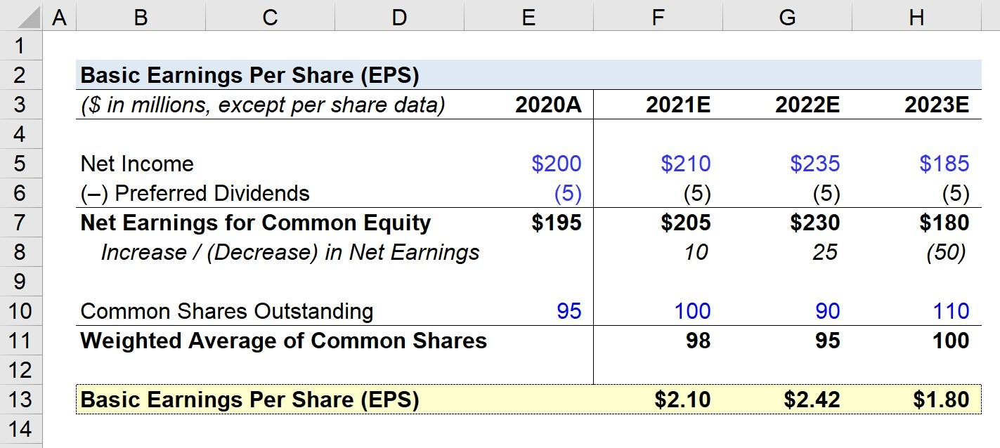

In the ever-evolving world of finance, financial metrics play a crucial role in guiding investment and trading decisions. Earnings Per Share (EPS) is a significant metric that offers valuable insights into a company's profitability on a per-share basis. EPS is calculated by dividing a company's net income by its total number of outstanding shares, providing a standardized measure to compare profitability across different companies and industries. This metric aids investors in assessing a company's financial health and is often correlated with stock value, with a high EPS indicating strong profitability.

Understanding EPS is essential for developing effective trading strategies, as it serves as a vital indicator in both traditional investment analysis and algorithmic trading. With the rise of algorithmic trading, the ability to analyze financial metrics such as EPS has become crucial in creating sophisticated models capable of responding efficiently to market movements.



This article examines the significance of EPS in detail, exploring its calculation and its implications in modern financial markets. It investigates how a thorough comprehension of EPS can lead to the development of robust trading algorithms that adapt to dynamic market conditions. As market environments continue to evolve, leveraging EPS in algorithmic strategies is becoming increasingly important for maintaining a competitive edge. Readers will gain insights into utilizing EPS effectively, helping them create algorithms that align with current market trends and contribute to informed financial decision-making.

## Table of Contents

## What is Earnings Per Share (EPS)?

Earnings Per Share (EPS) is a fundamental financial metric that quantifies a company's profitability on a per-share basis. This metric is calculated using the formula:

$$
\text{EPS} = \frac{\text{Net Income}}{\text{Total Outstanding Shares}}
$$

where "Net Income" refers to the company's profit after all expenses, taxes, and costs have been deducted, and "Total Outstanding Shares" indicates the number of common shares currently held by shareholders.

EPS serves as a standardized tool to assess and compare the profitability of companies across different industries. By providing a per-share profitability measure, EPS enables investors to evaluate the financial health and performance of a company more accurately. A higher EPS value typically signals robust profitability, often leading to an increase in the stock's market value, as it suggests that the company is generating more earnings per share of stock held by investors.

Investors often rely on EPS when making informed decisions about buying, holding, or selling stocks. It helps them gauge whether a company is performing well relative to its peers and industry benchmarks. Furthermore, by examining EPS trends over time, investors can discern potential growth patterns or identify warning signs of declining profitability. 

Overall, understanding EPS is crucial for investors aiming to evaluate company performance comprehensively and make strategic investment choices. This metric, by encapsulating a company's profitability in a single figure, offers valuable insights into potential investment opportunities and risks.

## Understanding Primary EPS

Primary Earnings Per Share (EPS) is a crucial financial metric that serves to evaluate a company's profitability specific to its shareholders without considering elements that could dilute earnings. This metric is computed by taking the net income available to common shareholders and dividing it by the number of outstanding common shares. The formula can be summarized as:

$$
\text{Primary EPS} = \frac{\text{Net Income} - \text{Preferred Dividends}}{\text{Weighted Average of Common Shares Outstanding}}
$$

Unlike diluted EPS, which considers securities such as options, warrants, and convertible bonds that could potentially increase the number of shares and thus lower the EPS, primary EPS focuses solely on current common shares. This provides a straightforward representation of current profitability attributable to common shareholders. By avoiding speculative considerations of potential dilution, primary EPS offers a clear snapshot of earnings that can be easily interpreted.

This unembellished approach makes primary EPS particularly appealing to investors seeking an uncomplicated understanding of a company's profitability. It serves as a fundamental measure, excluding any future or theoretical adjustments based on securities that might alter the share count. As a result, primary EPS is often viewed as a more conservative and purer indicator of earnings performance compared to its diluted counterpart.

In [algorithmic trading](/wiki/algorithmic-trading), the simplicity and direct nature of primary EPS make it a valuable input for evaluating corporate financial health and profitability. Algorithmic systems often incorporate primary EPS to establish baseline trading algorithms. By leveraging reliable data, these algorithms can make informed decisions based on the core profitability of a company. 

In summary, primary EPS is a significant metric in financial analysis, offering straightforward insights into a company's shareholder profitability sans speculative assumptions. It remains an essential tool for investors and traders looking to develop data-driven investment strategies.

## The Role of EPS in Algorithmic Trading

Earnings Per Share (EPS) plays a significant role in algorithmic trading by offering a quantifiable measure of a company's profitability, which can be leveraged to evaluate stock valuation and inform trading decisions. Trading algorithms prioritize EPS data due to its direct correlation with company performance, enabling the development of robust strategies that are responsive to market fluctuations.

Algorithms utilize EPS data to facilitate buy or sell decisions, reacting promptly to shifts in market conditions. When key EPS components, such as earnings surprises and growth trends, are identified, they are incorporated into trading models to enhance the decision-making process. For instance, an earnings surprise, which occurs when a company's reported EPS deviates significantly from analysts' expectations, often leads to rapid stock price adjustments. Trading algorithms that integrate such elements can capitalize on these market inefficiencies to maximize returns.

Analyzing changes in EPS allows algorithms to predict future price movements, further refining trading strategies. By monitoring EPS trends, algorithms can detect patterns indicative of a company's financial trajectory, subsequently adjusting trading actions to optimize performance. The capacity to forecast price movements based on EPS data exemplifies the value of integrating sophisticated financial analysis into algorithmic trading.

Incorporating EPS within trading algorithms exemplifies the merging of [fundamental analysis](/wiki/fundamental-analysis) and technology-driven decision-making. This synergy not only improves the accuracy of trading strategies but also enhances the overall effectiveness of financial operations. Such integration aligns with the dynamic nature of modern markets, where rapid adaptation to new data is crucial for maintaining a competitive standing. By continuously leveraging EPS information, algorithmic traders are better equipped to navigate the complexities of financial markets, ultimately driving more informed and strategic trading decisions.

## Building Trading Algorithms with EPS Data

Creating robust trading algorithms involving Earnings Per Share (EPS) data requires a systematic approach, beginning with the accurate collection of EPS data from trustworthy sources. Reliable financial databases, financial reports, and well-established financial news platforms offer essential access to historical and forward EPS data, which are the foundation for informed algorithmic trading decisions.

**Incorporating Historical and Forward EPS Trends**

A thorough analysis of both historical and forward-looking EPS trends is a critical step in predicting future market conditions. Historical EPS data provide insights into a company's past performance, while forward EPS projections offer expectations about future profitability. By integrating these datasets, traders can identify patterns and infer potential price movements.

To incorporate EPS trends, traders should program models with conditions that trigger buy or sell signals based on observed EPS growth or declines. For instance, an algorithm might include a simple conditional statement like:

```python
if current_eps > historical_eps_average:
    execute_trade_buy()
elif current_eps < historical_eps_average:
    execute_trade_sell()
```

**Programmatic Strategy Development**

Effective strategies are developed by establishing decision criteria based not only on EPS but also by integrating other financial indicators, such as revenue growth, profit margins, and industry benchmarks. These comprehensive strategies allow for more nuanced trade execution decisions.

In Python, this approach may be expressed with more complex conditions and additional data inputs:

```python
def evaluate_trading_strategy(eps_current, eps_historical, revenue_growth):
    if eps_current > eps_historical and revenue_growth > 0:
        return "BUY"
    elif eps_current < eps_historical and revenue_growth < 0:
        return "SELL"
    else:
        return "HOLD"
```

**Backtesting for Robustness**

Backtesting, a critical phase in algorithm development, involves running the algorithm against historical market data to assess its performance. This process allows traders to validate the algorithm's reliability across various market scenarios and refine it before applying it in live trading environments. It ensures that strategies perform as expected and are not the result of overfitting to specific data sets.

**Ongoing Monitoring and Updates**

Continuous monitoring of algorithm performance and market conditions is essential to adapt strategies and maintain competitiveness. Algorithmic frameworks must account for incoming EPS data and other relevant market variables, necessitating periodic updates to ensure alignment with current trends. Implementing [machine learning](/wiki/machine-learning) techniques enhances this adaptability, allowing algorithms to modify decision parameters based on new data patterns.

In practice, this monitoring can be facilitated by:

```python
def update_algorithm_with_new_data(eps_data, market_data):
    # Reassess strategy with updated data
    new_strategy = evaluate_trading_strategy(eps_data.current, eps_data.historical, market_data.revenue_growth)
    # Implement adjustments to trading algorithm
    adjust_trading_parameters(new_strategy)
```

Through such comprehensive and dynamic approaches, traders can effectively leverage EPS data to develop algorithms that respond adeptly to the ever-fluctuating financial markets.

## Challenges and Considerations

Relying solely on Earnings Per Share (EPS) for investment or algorithmic trading decisions may lead to misconceptions due to several factors. One significant concern is the manipulation of EPS through accounting practices such as adjusting depreciation schedules or capitalizing expenses, which can artificially enhance profitability figures without reflecting true economic performance. Moreover, share buybacks can inflate EPS by reducing the number of outstanding shares, thereby increasing the EPS value without an actual increase in net income.

EPS also overlooks broader market conditions and macroeconomic factors that might influence a company's profitability beyond internal operations. For instance, shifts in consumer demand, regulatory changes, or economic downturns can significantly impact a company's performance but remain unaccounted for solely through the EPS metric. Thus, solely focusing on EPS may present an incomplete picture of a company’s financial health and market position.

Ensuring the accuracy of EPS data is crucial for crafting effective trading strategies. This includes validating the data source reliability and cross-referencing financial statements to account for any discrepancies. Additionally, addressing algorithmic overfitting is essential. Overfitting occurs when a model is excessively complex and performs well on historical data but poorly predicts future outcomes. Algorithms must be designed with generalization in mind, balancing complexity with predictive accuracy. Regular [backtesting](/wiki/backtesting) and validation against out-of-sample data can mitigate the risks of overfitting.

In this context, the integration of multiple financial metrics alongside EPS, such as price-to-earnings (P/E) ratios, return on equity (ROE), or cash flow analyses, can substantially improve the robustness of trading strategies. By considering a range of financial indicators, traders can gain a more comprehensive understanding of a company's financial dynamics and potential vulnerabilities.

Furthermore, adaptable algorithms that incorporate machine learning techniques can enhance responsiveness to dynamic market environments. Machine learning models can identify complex patterns and predict responses to varying market conditions, providing a strategic advantage. For instance, incorporating unsupervised learning techniques like clustering can help identify emerging trends or anomalies that traditional analysis might overlook.

In Python, implementing a machine learning model might look like this:

```python
from sklearn.model_selection import train_test_split
from sklearn.ensemble import RandomForestRegressor

# Assume `financial_data` is a DataFrame with relevant metrics
X = financial_data.drop('target', axis=1)
y = financial_data['target']

X_train, X_test, y_train, y_test = train_test_split(X, y, test_size=0.2, random_state=42)

model = RandomForestRegressor(n_estimators=100, random_state=42)
model.fit(X_train, y_train)

# Make predictions and assess model performance
predictions = model.predict(X_test)
```

By employing such techniques, traders can build more adaptive and resilient models capable of navigating the complexities of modern financial markets.

## Conclusion

Earnings Per Share (EPS) is an essential component of both fundamental analysis and algorithmic trading. It serves as a bridge between traditional financial metrics and advanced trading technologies, providing a powerful tool for informed decision-making. By integrating EPS with other financial metrics, investors and algorithmic traders can gain a comprehensive view of a company's financial standing and market potential. This holistic approach enables more accurate evaluations of stock performance, aiding in the development of robust trading strategies.

As market dynamics continue to evolve, it is crucial to master the use of EPS in trading strategies to maintain a competitive edge. Understanding and utilizing EPS effectively allows traders to adapt to changing market conditions, thus maximizing potential returns. Furthermore, the ongoing synergy of EPS with algorithmic models highlights the increasing sophistication of modern trading approaches. By incorporating EPS data into algorithms, traders can create more dynamic and responsive strategies, ultimately contributing to the advancements in algorithmic trading.

As such, mastering the nuances of EPS within the framework of algorithmic trading not only enhances trading efficiency but also places traders at the forefront of financial innovation, ensuring resilience and competitiveness in today's fast-paced markets.

## References & Further Reading

Investopedia provides a comprehensive guide on the basics of Earnings Per Share (EPS), covering its definition, formula, and practical examples. This resource is invaluable for understanding how EPS functions as a fundamental financial metric and serves as a starting point for deeper financial analysis.

Barry Johnson’s work, "Algorithmic Trading and DMA: An Introduction to Direct Access Trading Strategies," offers insight into the implementation of direct access trading strategies and their relationship with metrics like EPS. This book is useful for those looking to integrate financial indicators into algorithmic trading frameworks.

For a more advanced exploration of the intersection between financial metrics and machine learning, "Advances in Financial Machine Learning" by Marcos Lopez de Prado is highly recommended. This text investigates into the application of machine learning techniques to financial datasets, including the use of EPS data, to enhance predictive modeling and trading strategies.

McKinsey & Company’s publication, "Valuation: Measuring and Managing the Value of Companies," provides a broader perspective on evaluating company performance. This resource discusses how EPS contributes to overall company valuation and decision-making processes, which are crucial for both investors and trading algorithms.

Finally, Irene Aldridge’s "High-Frequency Trading: A Practical Guide to Algorithmic Strategies and Trading Systems" is a key resource for understanding the mechanics of high-frequency trading ([HFT](/wiki/high-frequency-trading-strategies)) systems. It covers how financial metrics, including EPS, are utilized within sophisticated trading models to execute strategies at high speeds, challenging the reader to understand the technical underpinnings of modern trading environments.